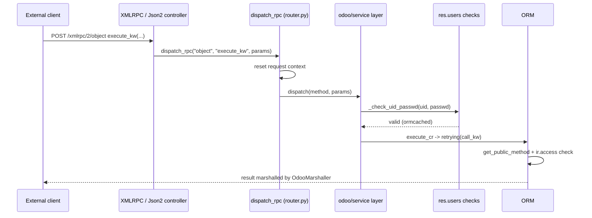

# External RPC
Active contributors: Julien, Krzysztof, Thle

## Purpose

External programs reach Odoo through the same HTTP application as the web client, but through different routes. The `rpc` addon ships them: `/xmlrpc/<service>`, `/xmlrpc/2/<service>` and `/jsonrpc` are the historical entry points, deprecated since Odoo 19 and scheduled for removal in Odoo 22, and `POST /json/2/<model>/<method>` is the endpoint the codebase points new clients at. `addons/web/controllers/json.py` adds a separate read-only JSON view route under `/json/1`. This page documents what exists in this repository, the authentication flows, what method visibility and access rules apply to a remote call, and the generated documentation in `addons/api_doc/`.

## Directory layout

```text
addons/rpc/
├── __manifest__.py           # auto_install, depends: ["base"]
├── controllers/
│   ├── __init__.py           # RPC controller (/web/version, /json/version), deprecation notice
│   ├── xmlrpc.py             # /xmlrpc/<service>, /xmlrpc/2/<service>, OdooMarshaller
│   ├── jsonrpc.py            # /jsonrpc
│   └── json2.py              # /json/2/<model>/<method>
└── tests/test_xmlrpc.py      # TestExternalAPI, TestXMLRPC (HttpCase)
addons/api_doc/               # /doc: dynamic API documentation (auto_install)
odoo/service/
├── common.py                 # login / authenticate / version, exp_* functions
└── model.py                  # dispatch(), execute_cr(), call_kw()
odoo/orm/models.py            # get_public_method(), the method visibility rule
odoo/addons/base/models/res_users.py   # res.users.apikeys, _check_uid_passwd
addons/web/controllers/json.py         # /json and /json/1/<subpath>, read-only view JSON
```

## Key abstractions

| Name | File | Description |
| --- | --- | --- |
| `XMLRPC` | `addons/rpc/controllers/xmlrpc.py` | Controller with the two `/xmlrpc` services; marshals return values. |
| `JSONRPC` | `addons/rpc/controllers/jsonrpc.py` | `/jsonrpc`, same JSON-RPC dispatcher as the browser. |
| `WebJson2Controller` | `addons/rpc/controllers/json2.py` | `/json/2/<model>/<method>`, bearer-authenticated model calls. |
| `dispatch_rpc()` | `odoo/http/router.py` | Maps a service name to the `common` or `object` dispatch. |
| `call_kw()` | `odoo/service/model.py` | Invokes one public model method with `args` and `kwargs`. |
| `get_public_method()` | `odoo/orm/models.py` | Rejects private, unsafe and `@api.private` method names. |
| `res.users.apikeys` | `odoo/addons/base/models/res_users.py` | Hashed API keys with scope and expiration; backs bearer auth. |
| `_check_uid_passwd()` | `odoo/addons/base/models/res_users.py` | Validates the `(uid, password)` pair sent by `execute_kw`. |
| `_auth_method_bearer()` | `odoo/addons/base/models/ir_http.py` | Bearer header parsing, session fallback with `Sec-Fetch-*` checks. |

## How it works

`addons/rpc/controllers/xmlrpc.py` declares `/xmlrpc/<service>` (fault codes returned as strings) and `/xmlrpc/2/<service>` (fault codes as integers), both `auth="none"`, `methods=["POST"]`, `csrf=False`, `save_session=False`. Each handler parses the XML body with `xmlrpc.client.loads(..., use_datetime=True)`, calls `dispatch_rpc(service, method, params)` and marshals the result through `OdooMarshaller`. Because `auth='none'` defaults the route to a read-only cursor, `_check_request()` in `addons/rpc/controllers/__init__.py` closes that cursor first; the service layer opens its own.

`dispatch_rpc()` in `odoo/http/router.py` accepts only `common` and `object`; anything else raises `ValueError` even though the docstring still mentions a `db` service. It also resets the current `request` context before dispatching, so the call behaves like a background job rather than an HTTP request. The `common` service maps `login`, `authenticate` and `version` to the `exp_*` functions in `odoo/service/common.py`: `authenticate(db, login, password, user_agent_env)` returns the uid or `False`, and marks the attempt `interactive: False`, which is what lets an API key be passed where a password is expected. The `object` service maps to `dispatch()` in `odoo/service/model.py`, which takes `(db, uid, passwd, model, method, *args)` for `execute` and an `(args, kwargs)` pair for `execute_kw`, opens a cursor with `Registry(db).cursor()`, validates the pair with `res.users._check_uid_passwd()` (ormcached on `uid` and `passwd`), and calls `execute_cr()` with an `Environment(cr, uid, {})` built from the validated uid, never from the arguments.

`call_kw()` resolves the method with `get_public_method()` from `odoo/orm/models.py`. Names starting with `_`, names in `_UNSAFE_ATTRIBUTES`, non-callables, class and static methods, and methods decorated `@api.private` raise `AccessError` or `AttributeError`, so `execute_kw` can only reach the public API. For `@api.model` methods the whole model is passed; otherwise `args[0]` is the id list and is browsed. A `context` key in `kwargs` replaces the environment context. The return value is adapted: `create` returns a single id when its argument was a mapping, other recordsets are returned as id lists, and lazy values are forced before the cursor closes. `execute_cr()` runs the call inside `retrying()`.

### Deprecation state

`RPC_DEPRECATION_NOTICE` in `addons/rpc/controllers/__init__.py` states that `/xmlrpc`, `/xmlrpc/2` and `/jsonrpc` are deprecated as of Odoo 19 and scheduled for removal in Odoo 22. Every request to those endpoints logs a warning that suggests muting it with `--log-handler odoo.addons.rpc.controllers.xmlrpc:ERROR`. `addons/rpc/tests/test_xmlrpc.py` still exercises them, so they work in this revision, but new integrations should use the JSON API.

### The current JSON API

`addons/rpc/controllers/json2.py` publishes `POST /json/2/<__model__>/<__method__>`, with `type='json2'`, `auth='bearer'`, `bearer_scope='rpc'`, `save_session=False`, and `readonly` as a callable that inspects the target method's `_readonly` attribute so a read-only method can run on the replica cursor. The `Json2Dispatcher` merges the JSON body with the path parameters, so a call sends `ids`, an optional `context`, and the method's keyword arguments:

```bash
curl -X POST "https://odoo.example/json/2/crm.lead/search_read" \
  -H "Authorization: bearer $ODOO_API_KEY" \
  -H "Content-Type: application/json" \
  -d '{"domain": [["type", "=", "opportunity"]], "fields": ["name"], "limit": 5}'
```

The method must be public (`get_public_method()` again), its signature is bound with `inspect.signature().bind(records, **kwargs)` and a mismatch returns `UnprocessableEntity`, an `@api.model` method called with ids returns `UnprocessableEntity`, a model name that does not exist returns `NotFound`, and a returned recordset is reduced to its ids. A catch-all on `/json/2` answers 404 with "Did you mean POST /json/2/<model>/<method>?". `addons/web/controllers/json.py` adds the separate read-only route `/json/1/<subpath>`, which returns the JSON a view would show; it uses bearer scope `rpc`, requires `base.group_allow_export`, and is disabled unless the database is in demo mode or the `web.json.enabled` parameter is set.

The historical XML-RPC flow, for a client that still uses it:

```python
import xmlrpc.client

url = "https://odoo.example"
db = "crm_offline"
key = "<API key>"  # created in the user's Preferences, never a password

common = xmlrpc.client.ServerProxy(f"{url}/xmlrpc/2/common")
uid = common.authenticate(db, "admin", key, {})
models = xmlrpc.client.ServerProxy(f"{url}/xmlrpc/2/object")
leads = models.execute_kw(
    db, uid, key,
    "crm.lead", "search_read",
    [[["type", "=", "opportunity"]]],
    {"fields": ["name"], "limit": 5},
)
```

The `args` list carries the method's positional arguments (here the domain), and the trailing dict carries its keyword arguments, exactly as `dispatch()` splits them.

### Authentication with API keys

API keys are rows of `res.users.apikeys` (`odoo/addons/base/models/res_users.py`): the key itself is stored hashed with a `pbkdf2_sha512` context deliberately cheaper than passwords (random keys are not worth attacking by dictionary), alongside an 8-hex-character index for lookup, a scope, and an expiration date that non-system users must set within the duration allowed by their groups. The model sets `_allow_sudo_commands = False`, removal requires an identity check (`@check_identity`), and generating keys programmatically is gated by `base.enable_programmatic_api_keys` unless the caller is a system user.

Bearer authentication is implemented by `_auth_method_bearer()` in `odoo/addons/base/models/ir_http.py`. It reads the token from an `Authorization: bearer <key>` header and validates it with `res.users.apikeys._check_credentials(scope='rpc', key=token)`; an unknown or expired key raises `Unauthorized` with a `WWW-Authenticate: bearer` header. If a session exists and its uid differs from the key's user, the request is rejected with `AccessDenied`. Without a key, an existing interactive session is accepted only when the browser-style `Sec-Fetch-*` headers prove a real navigation. The same key store backs non-interactive XML-RPC: `_check_credentials(credential, {'interactive': False})` falls back to `res.users.apikeys._check_credentials(scope='rpc', key=password)`, and `auth_totp` blocks password-based RPC entirely for 2FA users through `_rpc_api_keys_only()`.

### Serialization and rate constraints

`OdooMarshaller` in `addons/rpc/controllers/xmlrpc.py` decides what an XML-RPC client can receive: `datetime` and `date` are marshalled as ISO strings, `bytes` as decoded strings, `markupsafe.Markup` as `str`, `Command` as `int`, `Domain` as `list`, and characters illegal in XML (0-31 except tab, newline and carriage return) are stripped. The marshaller is created with `allow_none=False`, so a method returning `None` cannot be serialized; `execute_cr()` logs a warning for that case. Every request body is capped at 128 MiB by default (`DEFAULT_MAX_CONTENT_LENGTH` in `odoo/http/_facade.py`), adjustable database-wide with the `web.max_file_upload_size` parameter and per route with the `max_content_length` option. There is no request rate limiter in the codebase; the throttles that exist are the per-worker login cooldown (`base.login_cooldown_after` failures, `base.login_cooldown_duration` seconds, defaults 10 and 60) and the TOTP code-check limit in `auth_totp`.

### The `api_doc` module

`addons/api_doc/` is auto-installed (`auto_install: True`, `depends: ['web']`) and serves the dynamic documentation at `/doc`: a single-page, OpenAPI-like client generated from the registry's models, fields and methods. `DocController` in `addons/api_doc/controllers/api_doc.py` gates the page and its JSON documents behind `api_doc.group_allow_doc`, exposes `type='json2'` index and per-model JSON routes both with session auth (`/doc/index.json`, `/doc/<model_name>.json`) and with bearer auth (`/doc-bearer/index.json`, `/doc-bearer/<model_name>.json`, scope `rpc`), and includes a playground to run methods over HTTP with examples in several languages.

### `sudo()` and `with_user()` implications

None of these paths elevate privileges. `dispatch()` builds its environment from the `(cr, uid)` pair it just validated; `call_kw()` never calls `sudo()`, and `/json/2` uses `request.env[__model__]`, the environment of the key's user. Access rules therefore apply in full to a remote caller. A method that needs elevation must call `sudo()` itself, and models such as `ir.access`, `ir.config_parameter` and `res.users.apikeys` set `_allow_sudo_commands = False` so even a sudoed caller cannot write them without an explicit choice. The practical consequence for integrations is that a public method exposed remotely is exactly as powerful as the user behind the API key.



## Integration points

- `odoo/service/model.py:call_kw()` is also what `/web/dataset/call_kw` calls, which is why the web client and external clients hit the same visibility rule; see [Web controllers](web-controllers.md).
- `_auth_method_bearer()` is shared by `/json/2`, `/json/1` and the `api_doc` bearer routes, so one key store serves every programmatic surface. The trust boundaries are described in [Security](../security.md).
- `addons/rpc/__manifest__.py` sets `auto_install: True` with `depends: ["base"]`, so the routes exist in every database without an explicit install; `addons/api_doc/__manifest__.py` is auto-installed on top of `web`.
- The tests that pin this behavior are `addons/rpc/tests/test_xmlrpc.py` (`TestExternalAPI`, `TestXMLRPC`).

## Entry points for modification

Read `addons/rpc/controllers/json2.py` first: it is the smallest complete example of a model-call endpoint, and the pattern to copy when a fork needs a new programmatic route. For XML-RPC behavior changes, the marshalling lives in `OdooMarshaller` in `addons/rpc/controllers/xmlrpc.py`, and the service semantics in `odoo/service/`. Keep new endpoints in `addons/crm/` as required by this fork's scope rules.

## Key source files

| File | Purpose |
| --- | --- |
| `addons/rpc/controllers/__init__.py` | `RPC` controller, `/web/version`, `RPC_DEPRECATION_NOTICE`, `_check_request()`. |
| `addons/rpc/controllers/xmlrpc.py` | XML-RPC endpoints, fault codes, `OdooMarshaller`. |
| `addons/rpc/controllers/jsonrpc.py` | `/jsonrpc`. |
| `addons/rpc/controllers/json2.py` | `/json/2/<model>/<method>` and its readonly resolver. |
| `addons/rpc/__manifest__.py` | Auto-installed `rpc` addon. |
| `addons/rpc/tests/test_xmlrpc.py` | `TestExternalAPI`, `TestXMLRPC`. |
| `addons/api_doc/controllers/api_doc.py` | `/doc` page and its JSON document routes. |
| `addons/api_doc/__manifest__.py` | Auto-installed documentation addon. |
| `odoo/http/router.py` | `dispatch_rpc()` service selection and request-context reset. |
| `odoo/service/common.py` | `login`, `authenticate`, `version` services. |
| `odoo/service/model.py` | `dispatch()`, `execute_cr()`, `call_kw()`. |
| `odoo/orm/models.py` | `get_public_method()`, `_UNSAFE_ATTRIBUTES`. |
| `odoo/addons/base/models/res_users.py` | `res.users.apikeys`, `_check_uid_passwd()`, `_check_credentials()`. |
| `odoo/addons/base/models/ir_http.py` | `_auth_method_bearer()`. |
| `addons/web/controllers/json.py` | `/json` and `/json/1/<subpath>` read-only view JSON. |

## Related pages

- [API](index.md)
- [Web controllers](web-controllers.md)
- [Security](../security.md)
- [Users, groups and access](../primitives/users-groups-and-access.md)
- [ORM](../systems/orm.md)
- [HTTP server](../systems/http-server.md)
- [Configuration reference](../reference/configuration.md)
