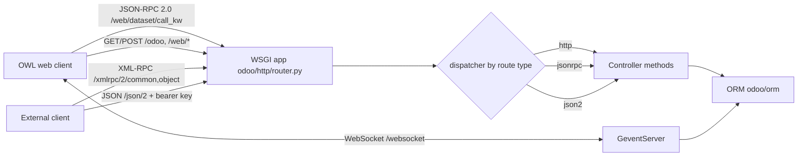

# API
Active contributors: Christophe, Xavier, Fabien

## Purpose

Every client reaches Odoo through the same WSGI application (`root` in `odoo/http/router.py`) and ends in the same ORM. Four interfaces sit on top of that application:

- the browser's JSON-RPC ORM endpoint, `/web/dataset/call_kw`, the path every ORM call from the OWL web client and every offline-queue replay takes;
- plain HTTP controllers under `/odoo` and `/web/*`, which render pages, serve files, and expose the PWA manifest and service worker;
- the programmatic endpoints in `addons/rpc/controllers/`, `/xmlrpc/2/<service>`, `/jsonrpc`, and the current `/json/2/<model>/<method>`;
- a WebSocket at `/websocket` for bus notifications.

This page maps the four and links to the two pages that cover them in depth: [Web controllers](web-controllers.md) for the controller layer, and [External RPC](external-rpc.md) for the machine-to-machine endpoints. The dispatch machinery under all of them is described in [HTTP server](../systems/http-server.md).

## Directory layout

```text
odoo/http/                    # HTTP framework shared by all interfaces
├── router.py                 # WSGI Application (root), serve_db, dispatch_rpc()
├── routing_map.py            # Controller base class, @route, route merging
├── dispatcher.py             # HttpDispatcher, JsonRPCDispatcher, Json2Dispatcher
└── session.py                # Session, SessionStore, authenticate()
odoo/service/
├── common.py                 # login / authenticate / version services
└── model.py                  # dispatch(), call_kw(), execute_cr()
addons/rpc/controllers/       # external endpoints: /xmlrpc, /xmlrpc/2, /jsonrpc, /json/2
addons/web/controllers/       # browser endpoints: /odoo, /web/*, /json and /json/1
addons/bus/controllers/       # /websocket and its helpers
addons/api_doc/controllers/   # /doc, the generated API documentation
addons/crm/controllers/       # /lead/* email-link routes and the share-target manifest override
```

## Key routes

| Interface | Endpoints | Declared in | `auth` | Consumed by |
| --- | --- | --- | --- | --- |
| Browser JSON-RPC | `/web/dataset/call_kw`, `/web/dataset/call_kw/<path:path>`, `/web/dataset/call_button` | `addons/web/controllers/dataset.py` | `user` | OWL web client, offline sync queue |
| HTTP controllers | `/`, `/web`, `/odoo`, `/web/login`, `/web/session/*`, `/web/content`, `/web/image`, `/web/manifest.webmanifest`, `/web/service-worker.js`, `/odoo/offline` | `addons/web/controllers/home.py`, `.../session.py`, `.../binary.py`, `.../webmanifest.py` | `public`, `user`, `none` | browsers, PWA service worker |
| External RPC | `/xmlrpc/<service>`, `/xmlrpc/2/<service>`, `/jsonrpc`, `/json/2/<__model__>/<__method__>`, `/json/1/<path:subpath>` | `addons/rpc/controllers/xmlrpc.py`, `.../jsonrpc.py`, `.../json2.py`, `addons/web/controllers/json.py` | `none`, `bearer` | scripts, other systems |
| WebSocket bus | `/websocket`, `/websocket/peek_notifications` | `addons/bus/controllers/websocket.py` | `public` | web client notifications |

## How it works

The routing map decides which controller method handles a path, the dispatcher decides how the request body is parsed and how the result is serialized, and `ir.http._authenticate()` decides who the caller is. All four interfaces share those three steps; they differ only in which dispatcher they use and how the caller proves its identity.

The browser ORM endpoint deserves its own note because everything the fork added runs through it. `DataSet.call_kw` in `addons/web/controllers/dataset.py` is declared `type='jsonrpc', auth="user"` with a dynamic `readonly` callable that inspects the target method's `_readonly` flag, and its body is a single call to `call_kw()` from `odoo/service/model.py`. The offline sync queue replays queued writes through exactly this endpoint with `orm.silent.call(model, method, args, kwargs)`; see [sync queue](../features/offline-and-pwa/sync-queue.md).



External callers do not bypass the web stack: the XML-RPC controller calls `dispatch_rpc()` in `odoo/http/router.py`, which routes the service name to `odoo/service/common.py` or `odoo/service/model.py` after stripping the current request context, so the call behaves as if it came from a background job. The details, including the deprecation of `/xmlrpc` and `/jsonrpc`, are in [External RPC](external-rpc.md).

## Integration points

- The fork consumes the controller layer; it does not extend the core. `addons/crm/controllers/webmanifest.py` subclasses web's `WebManifest` and returns `True` from `_has_share_target()`, which adds the PWA share target to the CRM manifest, and extends `_get_shortcuts()` with CRM app shortcuts gated on menu visibility.
- `addons/crm/controllers/main.py` adds three `type='http'` routes under `/lead/` used by email action links, each guarded by an HMAC token computed from `database.secret`.
- Session authentication is shared by all four interfaces: `/web/session/authenticate` for browsers, `common.authenticate` for XML-RPC, and a bearer API key for the JSON routes. The trust boundaries are described in [Security](../security.md).

## Entry points for modification

Adding an endpoint means a new `Controller` subclass in an addon's `controllers/` package, imported from that package's `__init__.py`. For this fork, keep new controllers in `addons/crm/`, and prefer subclassing an existing controller and re-decorating only the options that change; the rules are in [Web controllers](web-controllers.md).

## Key source files

| File | Purpose |
| --- | --- |
| `odoo/http/router.py` | WSGI `Application` (`root`), db resolution, `dispatch_rpc()`. |
| `odoo/http/routing_map.py` | `Controller`, `route()`, option merging across inheritance. |
| `odoo/http/dispatcher.py` | The three dispatchers, CSRF enforcement, error serialization. |
| `odoo/http/session.py` | `Session`, `SessionStore`, `authenticate()`, rotation. |
| `odoo/service/model.py` | `dispatch()`, `call_kw()`, `execute_cr()`. |
| `odoo/service/common.py` | The `login`, `authenticate`, `version` XML-RPC services. |
| `addons/web/controllers/dataset.py` | `/web/dataset/call_kw` and `/web/dataset/call_button`. |
| `addons/web/controllers/session.py` | `/web/session/*`, including `authenticate` and `get_session_info`. |
| `addons/web/controllers/webmanifest.py` | Manifest, service worker, offline page, scoped app routes. |
| `addons/rpc/controllers/xmlrpc.py` | `/xmlrpc/<service>` and `/xmlrpc/2/<service>`. |
| `addons/rpc/controllers/jsonrpc.py` | `/jsonrpc`. |
| `addons/rpc/controllers/json2.py` | `/json/2/<model>/<method>`, the current external API. |
| `addons/api_doc/controllers/api_doc.py` | `/doc` and its JSON document routes. |
| `addons/bus/controllers/websocket.py` | `/websocket`, longpoll fallback, health check. |
| `addons/crm/controllers/main.py` | `/lead/case_mark_won`, `/lead/case_mark_lost`, `/lead/convert`. |
| `addons/crm/controllers/webmanifest.py` | Share target and CRM shortcuts for the installed PWA. |

## Related pages

- [Web controllers](web-controllers.md)
- [External RPC](external-rpc.md)
- [HTTP server](../systems/http-server.md)
- [ORM](../systems/orm.md)
- [Security](../security.md)
- [Sync queue](../features/offline-and-pwa/sync-queue.md)
- [CRM app](../apps/crm/index.md)
