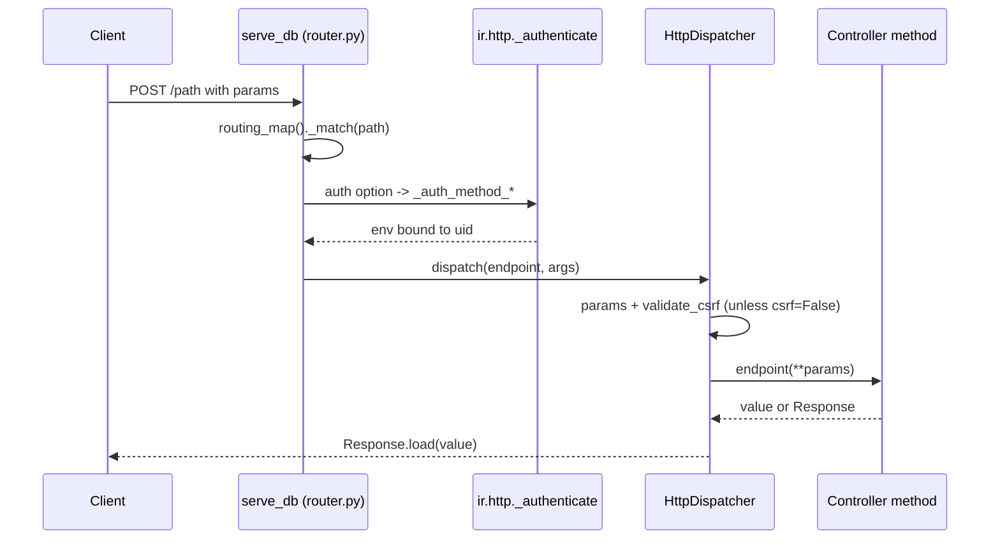

# Web controllers
Active contributors: Christophe, Xavier, Fabien

## Purpose

A controller is a Python method bound to a URL by the `@route` decorator. It is the only supported way to add an endpoint: the routing map is rebuilt from the installed modules, so a method that is never decorated is never reachable. This page covers the decorator's options, the main `/web/*` routes in `addons/web/controllers/`, how route declarations are merged across module inheritance, what happens between authentication and the method call (CSRF, read-only cursors, retries), and two worked examples from this fork. The dispatch machinery underneath is described in [HTTP server](../systems/http-server.md).

## Directory layout

```text
odoo/http/
├── routing_map.py      # Controller, route(), _generate_routing_rules(), ROUTING_KEYS
├── dispatcher.py        # HttpDispatcher.dispatch(): params + CSRF; error handling
├── router.py           # serve_db(): read-only cursor, readonly retry, _match()
├── requestlib.py        # Request.params, csrf_token(), validate_csrf()
└── response.py          # Response.load() for what a type='http' method may return
odoo/addons/base/models/ir_http.py   # _authenticate, _pre_dispatch, _dispatch
addons/web/controllers/              # home, session, dataset, binary, webmanifest, ...
addons/crm/controllers/              # main.py (/lead/*), webmanifest.py (share target)
```

## Key routes

| Route | File | Options | Purpose |
| --- | --- | --- | --- |
| `/`, `/web`, `/odoo`, `/odoo/<path:subpath>` | `addons/web/controllers/home.py` | `auth="none"`, `readonly=_web_client_readonly` | The web client bootstrap page; injects `browser_cache_secret` into the session info. |
| `/web/login` | `addons/web/controllers/home.py` | `auth='none'`, `readonly=False` | Login form and credential check, with optional captcha. |
| `/web/webclient/load_menus` | `addons/web/controllers/home.py` | `auth='user'`, `methods=['GET']`, `check_identity=False` | Menu tree for the web client. |
| `/web/session/get_session_info` | `addons/web/controllers/session.py` | `auth='user'`, `readonly=True` | The session info the web client boots from. |
| `/web/session/authenticate` | `addons/web/controllers/session.py` | `auth="none"`, `readonly=False` | JSON-RPC login; can switch database mid-session. |
| `/web/session/logout` | `addons/web/controllers/session.py` | `auth='none'`, `methods=['POST']`, `readonly=True` | Ends the session, redirects to `/odoo`. |
| `/web/session/identity`, `/web/session/identity/check` | `addons/web/controllers/session.py` | `auth='user'`, `check_identity=False` | Identity confirmation after a `CheckIdentityException`. |
| `/web/dataset/call_kw`, `/web/dataset/call_kw/<path:path>` | `addons/web/controllers/dataset.py` | `type='jsonrpc'`, `auth="user"`, `readonly=_call_kw_readonly` | The ORM endpoint the web client and the offline queue use. |
| `/web/dataset/call_button` | `addons/web/controllers/dataset.py` | `type='jsonrpc'`, `auth="user"`, `readonly=_call_kw_readonly` | Button methods, returned as a cleaned action or `False`. |
| `/web/webclient/version_info` | `addons/web/controllers/webclient.py` | `type='jsonrpc'`, `auth="none"` | Server version; the offline plugin pings it to detect reconnection. |
| `/web/webclient/translations`, `/web/bundle/<string:bundle_name>` | `addons/web/controllers/webclient.py` | `auth='public'`, `readonly=True` | Translation payloads and asset bundle definitions. |
| `/web/content`, `/web/image` | `addons/web/controllers/binary.py` | `auth='public'`, `readonly=True` | Attachment and image streams through `ir.binary`. |
| `/web/binary/upload_attachment` | `addons/web/controllers/binary.py` | `auth="user"` | File upload into `ir.attachment`. |
| `/web/export/csv`, `/web/export/xlsx` | `addons/web/controllers/export.py` | `auth='user'` | Export downloads. |
| `/web/action/load`, `/web/action/run` | `addons/web/controllers/action.py` | `auth='user'` | Action loading and execution. |
| `/web/database/create`, `/web/database/duplicate`, `/web/database/drop`, ... | `addons/web/controllers/database.py` | `auth="none"`, `csrf=False` | Database manager, guarded by the server `admin_passwd`. |
| `/web/manifest.webmanifest`, `/web/service-worker.js`, `/odoo/offline` | `addons/web/controllers/webmanifest.py` | `auth='public'`, `methods=['GET']`, `readonly=True` | PWA manifest, shared service worker, offline fallback page. |
| `/scoped_app`, `/scoped_app_icon_png`, `/web/manifest.scoped_app_manifest` | `addons/web/controllers/webmanifest.py` | `auth='public'`, `methods=['GET']` | Per-app scoped installs. |
| `/json/1/<path:subpath>` | `addons/web/controllers/json.py` | `auth='bearer'`, `bearer_scope='rpc'`, `readonly=True` | Read-only JSON rendering of any view. |
| `/lead/case_mark_won`, `/lead/case_mark_lost`, `/lead/convert` | `addons/crm/controllers/main.py` | `type='http'`, `auth='user'`, `methods=['GET']` | Email action links, token-guarded. |

## Key abstractions

| Name | File | Description |
| --- | --- | --- |
| `Controller` | `odoo/http/routing_map.py` | Mixin whose subclasses are collected per module in `Controller.children_classes`. |
| `route()` | `odoo/http/routing_map.py` | Decorator storing `original_routing` and `original_endpoint` on the method. |
| `RoutingOpts` | `odoo/http/routing_map.py` | TypedDict of the core options: `routes`, `methods`, `type`, `auth`, `cors`, `csrf`, `readonly`, `handle_params_access_error`, `captcha`, `save_session`. |
| `ROUTING_KEYS` | `odoo/http/routing_map.py` | Options forwarded verbatim to the werkzeug rule (`methods`, `host`, `websocket`, ...). |
| `Endpoint` | `odoo/http/routing_map.py` | The merged, per-URL callable with its final `routing` dict. |
| `ir.http._authenticate` | `odoo/addons/base/models/ir_http.py` | Turns `auth=` into `_auth_method_user/public/none/bearer`. |
| `Response.load()` | `odoo/http/response.py` | Coerces a `type='http'` return value into a `Response`. |

## How it works

`@route('/path', **options)` records the options on the function and returns a wrapper. `type` selects the dispatcher and must be `'http'`, `'jsonrpc'` or `'json2'`; `type='json'` is a deprecated alias for `'jsonrpc'` that logs a `DeprecationWarning` and is rewritten since 19.0. `auth` defaults to `'user'` and accepts `'user'`, `'public'`, `'none'` and `'bearer'` (which requires `bearer_scope` and implies `save_session=False`). `csrf` is enabled by default for `type='http'` and disabled for JSON routes. Beyond the `RoutingOpts` core, the tree uses options that other layers consume: `check_identity` and `max_content_length` are enforced by `ir.http` and the dispatcher, `sitemap` and `website` come from the routing addons, and `websocket` is one of the `ROUTING_KEYS` forwarded to the werkzeug rule.

Routes are resolved per database, not per process. `ir.http.routing_map()` is cached with `@api.ormcache` and calls `_generate_routing_rules()` in `odoo/http/routing_map.py`, which rebuilds the controller inheritance tree from the installed modules, takes the leaf classes of each base controller, and merges the `@route` dictionaries from the top of the MRO down (`merged_routing.update(submethod.original_routing)`), so a subclass that re-declares `@route(auth='user')` keeps the parent's paths and type and overrides only `auth`. An overriding method must be re-decorated; one that is not is decorated automatically with a warning, and a method with no route anywhere in the hierarchy is skipped with a warning. `_check_and_complete_route_definition()` refuses a type change (keeping the original with a warning) and forces a route read/write when a child flips `readonly` against its parent.

`readonly` decides which cursor the request uses. Its default is `auth == 'none'`, and it may also be a callable `(controller, rule, args) -> bool`, which is how `/web/dataset/call_kw` and `/json/2/...` decide from the target method's `_readonly` attribute. `serve_db()` in `odoo/http/router.py` opens `registry.cursor(readonly=True)` first; a readonly route runs under that cursor, and a `ReadOnlySqlTransaction` error is caught and retried with a fresh read/write cursor. Read/write routes close the read-only cursor before dispatching.

CSRF is enforced by `HttpDispatcher.dispatch()` in `odoo/http/dispatcher.py` for every method outside `SAFE_HTTP_METHODS` (`GET`, `HEAD`, `OPTIONS`, `TRACE`) unless the route passes `csrf=False`. The token is popped from the merged params and checked with `request.validate_csrf()`, which recomputes an HMAC-SHA1 over the first 42 characters of the session id plus an expiry timestamp using the `database.secret` parameter; a missing token and an invalid token are logged differently, and both raise `BadRequest("Session expired (invalid CSRF token)")`. With no database resolved, the dispatcher redirects to `/web/database/selector` instead. A `type='http'` method may return a `Response`, a werkzeug response, `str`, `bytes` or `None`; anything else raises `TypeError` from `Response.load()`.

### Example: stateless routes in the web manifest controller

`addons/web/controllers/webmanifest.py` shows the minimal pattern. `/web/manifest.webmanifest`, `/web/service-worker.js` and `/odoo/offline` are declared `auth='public', methods=['GET'], readonly=True`, return raw bodies (`request.make_json_response()` with an explicit `application/manifest+json` content type, `request.make_response()` with a `Service-Worker-Allowed: /odoo` header, or `request.render('web.webclient_offline', ...)`), and touch no session state. `/scoped_app`, `/scoped_app_icon_png` and `/web/manifest.scoped_app_manifest` deliberately omit `readonly`, so they run on a read/write cursor. The class is also the extension point the fork uses: `addons/crm/controllers/webmanifest.py` subclasses `WebManifest`, returns `True` from `_has_share_target()` so the manifest advertises the share target the CRM PWA handles, and adds CRM shortcuts in `_get_shortcuts()` gated on the same menu visibility the parent's own module shortcuts use.

### Example: token routes in the CRM controller

`addons/crm/controllers/main.py` declares three `type='http', auth='user', methods=['GET']` routes, `/lead/case_mark_won`, `/lead/case_mark_lost` and `/lead/convert`, each taking `res_id` and `token`. They delegate to `MailController._check_token_and_record_or_redirect()` in `addons/mail/controllers/mail.py`. `_check_token()` rebuilds the expected token with `mail.thread._encode_link()` (`addons/mail/models/mail_thread.py`): HMAC-SHA1 over the path plus its `key=value` pairs sorted, with the `token` parameter removed, keyed on the `database.secret` parameter. The comparison uses `odoo.tools.consteq()`. A failed comparison logs a warning and redirects to a generic fallback, never to the record, and before any redirect the controller checks `RecordModel.with_user(uid).has_access('read')` and `check_access('read')` on the record, so `ir.access` still applies to the requesting user. Because these are GET routes, CSRF never runs here; the token is the whole protection, which is what makes the links usable from a mail client while remaining unguessable.



## Integration points

- `addons/web/controllers/dataset.py` is the bridge to the ORM for the web client: it calls `call_kw()` from `odoo/service/model.py` and marks read-only methods through a `readonly` callable. The same `call_kw()` backs the external API, so both surfaces share one method-visibility rule; see [External RPC](external-rpc.md).
- The offline stack rides on these routes: the plugin pings `/web/webclient/version_info` to detect reconnection, and the queue replays through `/web/dataset/call_kw`; see [sync queue](../features/offline-and-pwa/sync-queue.md). The PWA routes feed the service worker described in [service worker and install](../features/offline-and-pwa/service-worker-and-install.md).
- The decorator interacts with `ir.http` hooks, not the other way round: `_pre_dispatch` applies `web.max_file_upload_size` and checks access on record-typed URL parameters, `_dispatch` verifies `captcha` routes, `_handle_error` delegates to the dispatcher. Modules override those hooks by inheriting `ir.http`.
- Route option `check_identity=False` is used by the session routes in `addons/web/controllers/session.py` so the user can confirm their identity before it is enforced again.
- The database manager routes in `addons/web/controllers/database.py` are the one group with `csrf=False` and `auth="none"`; they are guarded instead by `verify_access(master_pwd)`, which checks the server `admin_passwd` option. See [Security](../security.md).
- Every controller file must be imported from its package `__init__.py`; `addons/crm/controllers/__init__.py` imports `main` and `webmanifest`.

## Entry points for modification

Start from `addons/web/controllers/` to see the conventions the core uses, then `addons/crm/controllers/main.py` for the smallest complete example in this fork. When overriding an upstream route, subclass its controller and re-decorate the method with only the options that change; when adding a new endpoint, decide `auth`, `readonly` and `csrf` explicitly rather than relying on the defaults, and keep new files in `addons/crm/` per this fork's scope rules.

## Key source files

| File | Purpose |
| --- | --- |
| `odoo/http/routing_map.py` | `Controller`, `route()`, `RoutingOpts`, route merging, `readonly` resolution. |
| `odoo/http/dispatcher.py` | Param merging, CSRF enforcement, `SAFE_HTTP_METHODS`, error handling. |
| `odoo/http/router.py` | `serve_db()`, read-only cursor and `ReadOnlySqlTransaction` retry. |
| `odoo/http/requestlib.py` | `csrf_token()`, `validate_csrf()`, `make_response`, `make_json_response`. |
| `odoo/http/response.py` | `Response.load()`, QWeb lazy rendering. |
| `odoo/addons/base/models/ir_http.py` | `routing_map()`, `_authenticate*`, `_pre_dispatch`, `_dispatch`. |
| `addons/web/controllers/home.py` | `/odoo` bootstrap, `/web/login`, `browser_cache_secret` injection. |
| `addons/web/controllers/session.py` | `/web/session/*`, including `authenticate`, `logout`, identity confirmation. |
| `addons/web/controllers/dataset.py` | `/web/dataset/call_kw`, `/web/dataset/call_button`. |
| `addons/web/controllers/binary.py` | `/web/content`, `/web/image`, uploads, company logo. |
| `addons/web/controllers/webmanifest.py` | Manifest, service worker, offline page, scoped apps. |
| `addons/web/controllers/database.py` | Database manager routes behind `admin_passwd`. |
| `addons/crm/controllers/main.py` | `/lead/*` token routes. |
| `addons/crm/controllers/webmanifest.py` | Share target and CRM shortcuts for the installed PWA. |
| `addons/mail/controllers/mail.py` | `_check_token`, `_check_token_and_record_or_redirect`. |
| `addons/mail/models/mail_thread.py` | `_encode_link()`, the HMAC used by those tokens. |

## Related pages

- [API](index.md)
- [External RPC](external-rpc.md)
- [HTTP server](../systems/http-server.md)
- [Security](../security.md)
- [Sync queue](../features/offline-and-pwa/sync-queue.md)
- [Service worker and install](../features/offline-and-pwa/service-worker-and-install.md)
- [CRM app](../apps/crm/index.md)
