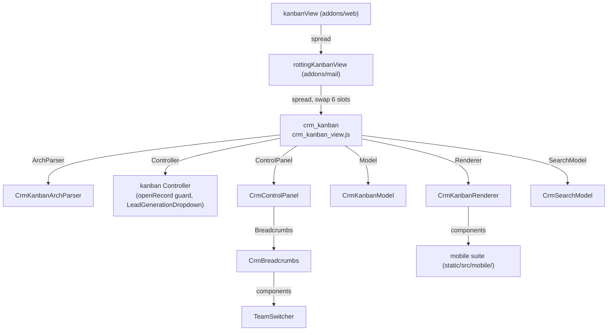

# CRM views

Active contributors: bobbyabbott421-glitch (fork), Odoo SA (upstream)

## Purpose

Every CRM lead arch binds a `js_class` attribute — `crm_form`, `crm_list`, `crm_kanban`, `crm_calendar`, `crm_activity`, `crm_graph`, `crm_pivot`, and the four `forecast_*` variants. Each string selects a view object from the client's view registry, and each of those objects is a spread of the stock web (or mail) view with crm components swapped in: a model, a renderer, a controller, an arch parser, a control panel, and a search model. This page maps every `js_class` to the files that implement it, and explains the registry pattern that ties them together. The offline behavior of the same files is covered in [Offline CRM](offline-crm.md); the mobile branch of the kanban renderer in [Mobile CRM](mobile-crm.md).

## Directory layout

```text
addons/crm/static/src/views/
├── check_rainbowman_message.js         # post-save rainbowman lookup (offline-skipped)
├── crm_control_panel.js                 # ControlPanel spread: swaps in CrmBreadcrumbs
├── crm_search_model.js                 # CrmSearchModel: team switcher + offline search state
├── fill_temporal_service.js             # client-only date math for forecast fill_temporal
├── forecast_search_model.js            # ForecastSearchModel: forecast_start domain
├── crm_activity/                        # crm_activity: controller, model, cell patch, template
├── crm_calendar/                        # crm_calendar: controller, renderer patch
├── crm_form/                            # crm_form: model/record/controller, PLS tooltip,
│                                        #   offline activity panel (js + xml + scss)
├── crm_kanban/                          # crm_kanban: view, model, renderer, arch parser,
│                                        #   column progress (+ xml, scss, button template)
├── crm_list/                            # crm_list: list view + uncached-lead template
├── crm_graph/, crm_pivot/               # crm_graph, crm_pivot (lazy bundles)
├── forecast_kanban/                      # forecast_kanban: model, renderer, controller,
│                                        #   column quick create (+ xml)
├── forecast_list/, forecast_graph/, forecast_pivot/   # forecast_* spreads (lazy bundles)
└── view_components/                      # offline guard patches shared by the view family
```

`addons/crm/views/crm_lead_views.xml` holds the archs; `addons/crm/views/crm_stage_views.xml`, `crm_team_views.xml`, `crm_lost_reason_views.xml`, `crm_recurring_plan_views.xml`, `utm_campaign_views.xml`, and `report/*.xml` hold the rest. The components the views pull in live under `addons/crm/static/src/components/`: `breadcrumbs/` (with the team switcher), `team_switcher/`, `lead_generation_dropdown/`, `promote_mail_plugins_dialog/`.

## Key abstractions

| Name | File | Description |
| --- | --- | --- |
| `crmKanbanView` | `addons/crm/static/src/views/crm_kanban/crm_kanban_view.js` | The `crm_kanban` view object: spread of mail's `rottingKanbanView` with swapped ArchParser, Controller, ControlPanel, Model, Renderer, SearchModel. |
| `CrmKanbanModel` + `CrmKanbanDynamicGroupList` | `addons/crm/static/src/views/crm_kanban/crm_kanban_model.js` | `RelationalModel` subclass whose `DynamicGroupList.moveRecords()` triggers the rainbowman check after a stage move. |
| `CrmKanbanRenderer` | `addons/crm/static/src/views/crm_kanban/crm_kanban_renderer.js` | Renderer with the `CrmKanbanHeader` subclass, the offline guards on hover/filter controls, and the small-screen mobile pipeline branch. |
| `CrmKanbanArchParser` | `addons/crm/static/src/views/crm_kanban/crm_kanban_arch_parser.js` | Adds `recurring_revenue_sum_field` to the parsed progress bar. |
| `CrmColumnProgress` | `addons/crm/static/src/views/crm_kanban/crm_column_progress.js` | Extends mail's `RottingColumnProgress`; MRR aggregate line gated on `crm.group_use_recurring_revenues`. |
| `CrmFormModel`, `CrmFormRecord`, `CrmFormController` | `addons/crm/static/src/views/crm_form/crm_form.js` | Form family: email/phone force-save in `CrmFormRecord._save()`, offline Won/Restore/AI-switch handling in the controller. |
| `CrmLeadActivityPanel` | `addons/crm/static/src/views/crm_form/crm_lead_activity_panel.js` | The `<widget name="crm_lead_activity_panel"/>` in the lead form: offline schedule, done, log a call. |
| `CrmPlsTooltipButton` | `addons/crm/static/src/views/crm_form/crm_pls_tooltip_button.js` | PLS tooltip; opens as a bottom sheet on small screens. |
| `crmListView` | `addons/crm/static/src/views/crm_list/crm_list_view.js` | The `crm_list` view object: `listView` spread with `CrmControlPanel`, `CrmSearchModel`, and the uncached-lead template branch. |
| `ForecastSearchModel` | `addons/crm/static/src/views/forecast_search_model.js` | Extends `CrmSearchModel` with the `forecast_start` domain for forecast filters, exported/imported with the view state. |
| `forecastKanbanView` | `addons/crm/static/src/views/forecast_kanban/forecast_kanban_view.js` | The `forecast_kanban` view object: `kanbanView` spread with `CrmKanbanArchParser`, `ForecastKanbanModel`, `ForecastKanbanController`, `ForecastKanbanRenderer`, `ForecastSearchModel`. |
| `ForecastKanbanModel` | `addons/crm/static/src/views/forecast_kanban/forecast_kanban_model.js` | Overrides `_webReadGroup`/`_loadGroupedList` to inject the `fill_temporal` context and domain. |
| `crmCalendarView` | `addons/crm/static/src/views/crm_calendar/crm_calendar_view.js` | The `crm_calendar` view object: `calendarView` spread with `CrmCalendarController`, `CrmControlPanel`, `CrmSearchModel`. |
| `crmActivityView` | `addons/crm/static/src/views/crm_activity/crm_activity_view.js` | The `crm_activity` view object: mail's `activityView` spread with `CrmActivityController`, `CrmActivityModel`, `CrmControlPanel`, `CrmSearchModel`. |
| `CrmControlPanel` | `addons/crm/static/src/views/crm_control_panel.js` | `ControlPanel` subclass swapping in `CrmBreadcrumbs`. |
| `CrmBreadcrumbs` | `addons/crm/static/src/components/breadcrumbs/crm_breadcrumbs.js` | `Breadcrumbs` subclass that renders the `TeamSwitcher` next to the breadcrumbs. |
| `TeamSwitcher` | `addons/crm/static/src/components/team_switcher/team_switcher.js` | The team dropdown in the breadcrumbs; offline it is blocked and its manager probe is hardened. |
| `LeadGenerationDropdown` | `addons/crm/static/src/components/lead_generation_dropdown/lead_generation_dropdown.js` | The "Generate Leads" split button on the kanban/list button rows. |

## How it works

### The registry pattern

The web client resolves an arch's view type to a view object in `registry.category("views")` (see [Views framework](../web/views-framework.md)). The arch's root tag gives the type (`form`, `list`, `kanban`, ...), and a `js_class` attribute on the same tag overrides the registry key: `js_class="crm_kanban"` selects the entry added under `"crm_kanban"` instead of the generic `"kanban"`. CRM registers every entry at module load, at the bottom of each `*_view.js` file, and each entry spreads a base view and swaps only the parts it needs:



The same three moves — spread the base, swap slots, register under the `js_class` name — build every crm view. `crm_list` spreads `listView`; `crm_form` spreads `formView`; `crm_calendar` spreads `calendarView`; `crm_activity` spreads mail's `activityView`; `crm_graph`/`crm_pivot` and `forecast_graph`/`forecast_pivot` spread `graphView`/`pivotView` with only `ControlPanel` and `SearchModel` swapped. `forecast_kanban` spreads the plain `kanbanView` (not the rotting one) because its columns are `date_deadline` buckets, not rotting stages.

### The `js_class` bindings in `crm_lead_views.xml`

| Arch (record id) | Root tag | `js_class` | View object file |
| --- | --- | --- | --- |
| `crm_lead_view_form` (the lead form, line 7) | `form` | `crm_form` | `addons/crm/static/src/views/crm_form/crm_form.js` |
| `crm_case_tree_view_leads` (Leads list, line 359) | `list` | `crm_list` | `addons/crm/static/src/views/crm_list/crm_list_view.js` |
| `view_crm_lead_kanban` (mobile Leads kanban, line 403) | `kanban class="o_kanban_mobile"` | `crm_kanban` | `addons/crm/static/src/views/crm_kanban/crm_kanban_view.js` |
| `crm_lead_view_calendar` (line 428) | `calendar` | `crm_calendar` | `addons/crm/static/src/views/crm_calendar/crm_calendar_view.js` |
| `crm_lead_view_activity` (line 512) | `activity` | `crm_activity` | `addons/crm/static/src/views/crm_activity/crm_activity_view.js` |
| `crm_case_kanban_view_leads` (pipeline kanban, line 542) | `kanban on_create="quick_create" default_group_by="stage_id"` | `crm_kanban` | `addons/crm/static/src/views/crm_kanban/crm_kanban_view.js` |
| `crm_lead_view_kanban_forecast` (line 604, inherits the pipeline kanban) | `kanban` | `forecast_kanban` (set by `<attribute name="js_class">`) | `addons/crm/static/src/views/forecast_kanban/forecast_kanban_view.js` |
| `crm_case_tree_view_oppor` (Opportunities list, line 746) | `list` | `crm_list` | `addons/crm/static/src/views/crm_list/crm_list_view.js` |
| `crm_lead_view_tree_forecast` (line 812) | `list` | `forecast_list` | `addons/crm/static/src/views/forecast_list/forecast_list_view.js` |
| `crm_lead_view_graph` (line 876) | `graph` | `crm_graph` | `addons/crm/static/src/views/crm_graph/crm_graph_view.js` |
| `crm_lead_view_graph_forecast` (line 895) | `graph` | `forecast_graph` | `addons/crm/static/src/views/forecast_graph/forecast_graph_view.js` |
| `crm_lead_view_pivot` (line 916) | `pivot` | `crm_pivot` | `addons/crm/static/src/views/crm_pivot/crm_pivot_view.js` |
| `crm_lead_view_pivot_forecast` (line 937) | `pivot` | `forecast_pivot` | `addons/crm/static/src/views/forecast_pivot/forecast_pivot_view.js` |

The actions bind the two kanbans apart: the Pipeline action (`crm_lead_opportunities`) uses `crm_case_kanban_view_leads` (line 1156), while the Leads action (`crm_lead_all_leads`) uses `view_crm_lead_kanban` (line 1089) — the `o_kanban_mobile` arch. Both share the same `crm_kanban` view object, so the mobile pipeline branch and all offline behavior apply to both; the difference between the two archs is only markup and options ([Mobile CRM](mobile-crm.md)).

### `crm_kanban`: the pipeline kanban

`crmKanbanView` spreads mail's `rottingKanbanView`, which itself spreads web's `kanbanView`. The swaps:

- **Model.** `CrmKanbanModel` adds the `effect` service; its `CrmKanbanDynamicGroupList.moveRecords()` override is the rainbowman hook: after a drag between `stage_id` columns it calls `checkRainbowmanMessage()` for the first moved lead. The base `moveRecords` is what produces the per-record `web_save({stage_id})` write — online directly, offline through the framework's queue.
- **Renderer.** `CrmKanbanRenderer` swaps the header for `CrmKanbanHeader` (which swaps `ColumnProgress` for `CrmColumnProgress`), owns the small-screen pipeline branch, and overrides `canCreateGroup()` and `canResequenceGroups()` with offline guards. `CrmKanbanHeader` itself guards the hover tooltip, the rotting badge, and the progress-bar segment clicks offline. Its template (`addons/crm/static/src/views/crm_kanban/crm_kanban_renderer.xml`) primary-inherits `web.KanbanRenderer` purely to splice in the mobile pipeline branch.
- **ArchParser.** `CrmKanbanArchParser.parseProgressBar()` extracts `recurring_revenue_sum_field`, the MRR aggregate the column progress line shows.
- **Controller.** The inline `Controller` class adds `LeadGenerationDropdown` to the button row (`addons/crm/static/src/views/crm_kanban/crm_kanban_view.xml`, template `crm.Kanban.Buttons`), widens `progressBarAggregateFields` with the MRR sum field, and overrides `openRecord`: opening a lead whose form was never visited while offline sets `offlineUncachedClick` so the template (`crm.KanbanView`, a primary inheritance of `web.KanbanView`) shows `OfflineActionHelper` instead of the grid.
- **SearchModel.** `CrmSearchModel` — the team switcher model, shared with every other crm view (below).
- **Column progress.** `CrmColumnProgress` extends mail's `RottingColumnProgress`: an `onWillStart` probe of `crm.group_use_recurring_revenues` (skipped while offline) gates the MRR line, and `getRecurringRevenueGroupAggregate()` re-checks `isOffline()` on every read so the aggregate disappears the moment the connection drops.

### `crm_form`: the lead form

`crm_form.js` registers `{ ...formView, Model: CrmFormModel, Controller: CrmFormController }` under `"crm_form"`. Three classes:

- `CrmFormRecord._save()` — the record-level override. It force-stages `email_from`/`phone` for synchronization with the partner when `partner_email_update`/`partner_phone_update` are set, then calls `super._save()`, and after a stage-changing save runs the rainbowman check (skipped offline).
- `CrmFormModel` — sets `Record = CrmFormRecord` and adds the `effect` service.
- `CrmFormController` — owns the offline handling of the header buttons: `beforeExecuteActionButton()` intercepts Won, Restore, and the AI-probability switch while offline (queueing `action_set_won`/`action_restore` through `useCrmOffline()`, blocking the rest, all detailed in [Offline CRM](offline-crm.md)); `setup()` tags the stage statusbar's buttons with `data-available-offline` so the framework's disable pass leaves stage moves clickable offline; and an `effect()` keeps the AI-switch `<a>`s visually disabled offline.

The form arch pulls in two crm widgets: `<widget name="pls_tooltip_button"/>` (the PLS tooltip, twice — desktop and touch layouts, lines 101 and 133) and `<widget name="crm_lead_activity_panel"/>` (line 339), both registered in the `view_widgets` registry. `CrmPlsTooltipButton` calls `prepare_pls_tooltip_data()` and reloads the record; on small screens the popover opens as a bottom sheet (`usePopover(CrmPlsTooltip, { useBottomSheet: this.ui.isSmall })`). `CrmLeadActivityPanel` renders only while offline (`t-if="this.crmOffline.isOffline()"` in `addons/crm/static/src/views/crm_form/crm_lead_activity_panel.xml`) and offers schedule, done, and log a call.

### `crm_list` and the forecast variants

`crmListView` spreads `listView` and swaps the same three things as the kanban controller: `CrmControlPanel`, `CrmSearchModel`, and an inline `Controller` whose `openRecord` override plus template (`addons/crm/static/src/views/crm_list/crm_list_view.xml`, primary-inheriting `web.ListView`) show `OfflineActionHelper` for an uncached lead opened offline. The Leads and Opportunities lists are `multi_edit="1"` with no `editable` attribute; offline, cell editing on them is disabled ([Offline CRM](offline-crm.md)).

The forecast family reuses the same pieces with a date-grouped model:

- `forecast_kanban` keeps `CrmKanbanArchParser` and adds `ForecastKanbanModel` (wraps `web_read_group` with the `fill_temporal` context and domain, generating the future-period columns), `ForecastKanbanRenderer` (`isMovableField()` allows dragging a card on `date_deadline` as well as `stage_id`), and `ForecastKanbanController` (`isQuickCreateField()` adds `date_deadline` so a date column offers quick create). `forecast_kanban_column_quick_create.js` is the column-level quick-create control for the "add next period" row.
- `forecast_list`, `forecast_graph`, `forecast_pivot` are thinner: they spread the base view and swap only `ControlPanel: CrmControlPanel` and `SearchModel: ForecastSearchModel`.
- `ForecastSearchModel` extends `CrmSearchModel`: a `forecast_filter` search item adds a `["|", [field, "=", false], [field, ">=", forecast_start]]` domain, with the start computed from the forecast field's type and the active group-by granularity; `forecastStart` travels with `exportState()`/`_importState()` so switching views inside the action keeps it.
- `fill_temporal_service.js` (registered as the `"fillTemporalService"` service) is pure client-side date arithmetic — the bucket boundaries the model sends to the server's `fill_temporal` grouping.

`crm_graph` and `crm_pivot` spread `graphView`/`pivotView` with `CrmControlPanel` and `CrmSearchModel`. All five `crm_activity`, `crm_graph`, `crm_pivot`, `forecast_graph`, `forecast_pivot` directories are excluded from `web.assets_backend` and loaded lazily through `web.assets_backend_lazy` (`addons/crm/__manifest__.py`).

### `crm_calendar` and `crm_activity`

- `crm_calendar` spreads `calendarView` with `CrmCalendarController`: its `editRecord()` override checks offline availability before opening an event and, offline, routes the open through `switchView("form", ...)` so the form reuses the calendar action's cache identity instead of an ad hoc action that would miss every offline cache. `calendar_common_renderer_patch.js` routes a single click offline through the same guarded `editRecord` instead of the unguarded popover read.
- `crm_activity` spreads mail's `activityView` with `CrmActivityController` (blocks schedule, template send, and form dialogs offline, and shows `OfflineActionHelper` via its own `crm.ActivityView` template when nothing could load), `CrmActivityModel` (swallows a `ConnectionLostError` from `get_activity_data` so an offline cold start renders the helper instead of failing the mount), and `activity_cell_offline_patch.js` (blocks the activity-cell popover for `crm.lead` offline).

### Control panel, breadcrumbs, team switcher

`CrmControlPanel` is the one-line swap every crm view shares: `ControlPanel` with `Breadcrumbs: CrmBreadcrumbs`. `CrmBreadcrumbs` renders the `TeamSwitcher` when the search model reports it visible. `TeamSwitcher` reads `env.searchModel.state` (`switcherTeams`, `switcherTeamId`) and calls `_updateSwitcherSelection()`, which updates the domain, the `default_team_id` context, and localStorage. The manager probe (`user.hasGroup("sales_team.group_sale_manager")`) toggles the "Manage Teams" item; offline it is skipped, and once `user.hasGroup`'s cache has been poisoned by a rejected probe, a bypass RPC (`res.users.has_group` through `orm.silent.call`) recovers it on the next online flip.

`CrmSearchModel` (in `addons/crm/static/src/views/crm_search_model.js`) is the model behind all of this: it loads the switcher data through `crm.team.get_team_switcher_data()` via the RPC disk cache (degrading to "All Teams" on a true cache miss, flagged `switcherOfflineFallback` so the switcher stays visible), folds the selected team's `switcher_domain` into `_getDomain()`, feeds `default_team_id`/`default_team_ids` into `_getContext()`, and exports/imports the whole switcher state with the view state. Offline it also exports the selected team as a search facet and restores it in `applySearch()`, because the dropdown itself is blocked offline.

### Lead generation dropdown

`LeadGenerationDropdown` is the "Generate Leads" split button on the kanban and list button rows (`show_lead_gen_button` in the search context gates it). It checks installed `ir.module.module` rows, then either links to odoo.com's lead-generation services, triggers a CSV/Excel import client action, installs a module (`button_immediate_install`), or opens the `base.module.install.request` access wizard. Every one of those paths needs the server, so the whole dropdown is offline-DISABLE by the framework (its Generate button has no `data-available-offline`), which is also why its promotional dialog is unreachable offline.

### The offline guard patches

`addons/crm/static/src/views/view_components/` holds the twelve `patch()` files that enforce the offline classification on web's own components — kanban controller/record, list controller/renderer, action menus, group config menu, kanban action button, many2one, many2x autocomplete, many2many tags, priority field — each scoped to crm's models so every other addon is untouched. What each guard blocks and why is the subject of [Offline CRM](offline-crm.md); the classification itself is [Offline surface inventory](offline-surface-inventory.md).

## Integration points

- View registry: `registry.category("views")` entries `crm_form`, `crm_list`, `crm_kanban`, `crm_calendar`, `crm_activity`, `crm_graph`, `crm_pivot`, `forecast_kanban`, `forecast_list`, `forecast_graph`, `forecast_pivot` (see [Views framework](../web/views-framework.md)).
- Widget registry: `registry.category("view_widgets")` entries `pls_tooltip_button` and `crm_lead_activity_panel` (`addons/crm/static/src/views/crm_form/crm_pls_tooltip_button.js`, `addons/crm/static/src/views/crm_form/crm_lead_activity_panel.js`).
- Mail: `rottingKanbanView`, `RottingColumnProgress`, `RottingKanbanRenderer`/`RottingKanbanHeader`, `activityView`, `ActivityController`/`ActivityModel`/`ActivityCell` (see [Mail](../mail.md)).
- Web: `kanbanView`, `listView`, `formView`, `calendarView`, `graphView`, `pivotView`, `ControlPanel`, `Breadcrumbs`, `SearchModel`, `RelationalModel` (see [Views framework](../web/views-framework.md), [Relational model](../web/relational-model.md)).
- `CrmSearchModel`/`ForecastSearchModel` are consumed by web's `OfflineSearchBar` through the `getCurrentSearch()`/`applySearch()` contract, and by `CrmBreadcrumbs`/`TeamSwitcher` through `searchModel.state`.
- Asset bundles: `addons/crm/__manifest__.py` ships `crm/static/src/**` in `web.assets_backend` and moves the five lazy directories to `web.assets_backend_lazy`.

## Entry points for modification

A new lead view means three wired pieces: the arch in `addons/crm/views/crm_lead_views.xml` with a `js_class`, the view object registered in `registry.category("views")` under that exact name, and — if it introduces new source files — nothing else, because the manifest's `web.assets_backend` glob already ships `crm/static/src/**`. A new control inside an existing view usually starts in the component directory named after it (one directory per component, files named after the directory). Offline-aware changes start from `useCrmOffline()` and the inventory, never from a direct `usePlugin(OfflinePlugin)` call or a new queue; a control that must stay clickable offline needs `data-available-offline` on the interactive element itself. Remember the fork's rule that desktop behavior must not change: every mobile branch is gated on `UIPlugin.isSmall()`.

## Key source files

| File | Purpose |
| --- | --- |
| `addons/crm/views/crm_lead_views.xml` | Every lead arch, its `js_class` bindings, and the action-to-view wiring. |
| `addons/crm/static/src/views/crm_kanban/crm_kanban_view.js` | The `crm_kanban` view object and its registration. |
| `addons/crm/static/src/views/crm_kanban/crm_kanban_model.js` | `CrmKanbanModel` and the rainbowman `moveRecords()` hook. |
| `addons/crm/static/src/views/crm_kanban/crm_kanban_renderer.js` | Renderer: header guards, mobile pipeline branch, group controls. |
| `addons/crm/static/src/views/crm_kanban/crm_kanban_arch_parser.js` | `recurring_revenue_sum_field` parsing. |
| `addons/crm/static/src/views/crm_kanban/crm_column_progress.js` | MRR column progress line. |
| `addons/crm/static/src/views/crm_form/crm_form.js` | The `crm_form` family: record save, offline button handling. |
| `addons/crm/static/src/views/crm_form/crm_lead_activity_panel.js` | Offline activities widget. |
| `addons/crm/static/src/views/crm_form/crm_pls_tooltip_button.js` | PLS tooltip with the bottom-sheet option. |
| `addons/crm/static/src/views/crm_list/crm_list_view.js` | The `crm_list` view object. |
| `addons/crm/static/src/views/forecast_kanban/forecast_kanban_view.js` | The `forecast_kanban` view object. |
| `addons/crm/static/src/views/forecast_kanban/forecast_kanban_model.js` | `fill_temporal` read-group override. |
| `addons/crm/static/src/views/forecast_search_model.js` | `ForecastSearchModel` and the forecast domain. |
| `addons/crm/static/src/views/fill_temporal_service.js` | Client-side date buckets for forecasts. |
| `addons/crm/static/src/views/crm_calendar/crm_calendar_view.js` | The `crm_calendar` view object. |
| `addons/crm/static/src/views/crm_activity/crm_activity_view.js` | The `crm_activity` view object. |
| `addons/crm/static/src/views/crm_control_panel.js` | The control panel spread shared by all crm views. |
| `addons/crm/static/src/components/breadcrumbs/crm_breadcrumbs.js` | Breadcrumbs with the team switcher. |
| `addons/crm/static/src/components/team_switcher/team_switcher.js` | The team switcher component. |
| `addons/crm/static/src/views/crm_search_model.js` | `CrmSearchModel`: team switcher state, offline search. |
| `addons/crm/static/src/components/lead_generation_dropdown/lead_generation_dropdown.js` | The Generate Leads dropdown. |
| `addons/crm/static/src/views/check_rainbowman_message.js` | The rainbowman lookup shared by form and kanban. |
| `addons/crm/static/src/views/view_components/` | The twelve offline guard patches (one file per guarded component). |

## Related pages

- [CRM](index.md): the models and lifecycle these views render.
- [Offline CRM](offline-crm.md): what each of these views does without a network.
- [Mobile CRM](mobile-crm.md): the small-screen branch of the kanban renderer.
- [Offline surface inventory](offline-surface-inventory.md): why each control is queued, skipped, or disabled.
- [Views framework](../web/views-framework.md): how `js_class` resolves through the view registry.
- [Relational model](../web/relational-model.md): the model layer under `CrmKanbanModel` and `CrmFormModel`.
- [Offline and PWA](../../features/offline-and-pwa/index.md): the queue, store, and gating these views consume.
- [Mail](../mail.md): the rotting and activity components crm's views extend.
- [Mobile web](../../features/mobile-web.md): the small-screen signal and the bottom-sheet option.
