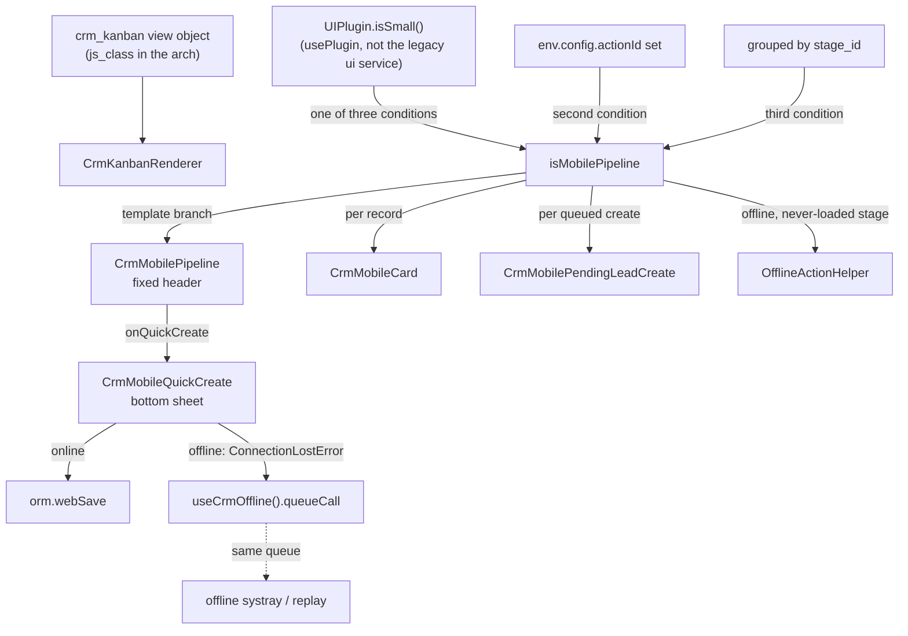

# Mobile CRM

Active contributors: bobbyabbott421-glitch (fork)

## Purpose

The mobile suite is `addons/crm/static/src/mobile/`: the `useCrmOffline()` hooks module every piece of crm front-end code shares, and the small-screen UI built on it — a one-stage-at-a-time pipeline inside the `crm_kanban` renderer, a fixed mobile lead card, a bottom-sheet quick create, and presentational pending-sync cards for queued creates. Every piece is gated on the framework's small-screen signal (`UIPlugin.isSmall()` from `addons/web/static/src/core/ui/ui_plugin.js`); desktop rendering is unchanged. The offline data behavior behind it (what queues, what is disabled) is [Offline CRM](offline-crm.md); the gating signal and the bottom-sheet mechanism are framework features ([Mobile web](../../features/mobile-web.md)). "Native mobile" here means the installable PWA — there is no native app project in this fork.

## Directory layout

```text
addons/crm/static/src/mobile/
├── README.md                           # developer notes: behavior, limits, test commands
├── offline_inventory.md                # the 150-row QUEUE/SKIP/DISABLE classification
├── offline_hooks/
│   └── offline_hooks.js                # useCrmOffline(): the shared API
├── crm_mobile_pipeline/
│   ├── crm_mobile_pipeline.js          # fixed stage header component
│   └── crm_mobile_pipeline.xml         # header markup (prev/next/+/count/revenue)
├── crm_mobile_card/
│   ├── crm_mobile_card.js              # the mobile lead card
│   ├── crm_mobile_card.xml             # card markup (44px targets, priority stars)
│   └── crm_mobile_card.scss            # touch-target styling
├── crm_mobile_quick_create/
│   ├── crm_mobile_quick_create.js      # the six-field bottom sheet
│   ├── crm_mobile_quick_create.xml
│   └── crm_mobile_quick_create.scss
└── crm_mobile_pending_lead_create/
    ├── crm_mobile_pending_lead_create.js   # presentational queued-create card
    └── crm_mobile_pending_lead_create.xml
```

The branch that renders it lives outside this directory: `addons/crm/static/src/views/crm_kanban/crm_kanban_renderer.js` (the `isMobilePipeline` getters and the sync-refresh effect), `addons/crm/static/src/views/crm_kanban/crm_kanban_renderer.xml` (the template splice), and `addons/crm/static/src/views/crm_kanban/crm_kanban_renderer.scss` (the column layout).

## Key abstractions

| Name | File | Description |
| --- | --- | --- |
| `useCrmOffline()` | `addons/crm/static/src/mobile/offline_hooks/offline_hooks.js` | The single hook wrapping `usePlugin(OfflinePlugin)`; keeps no state of its own. Full API below. |
| `isMobilePipeline` | `addons/crm/static/src/views/crm_kanban/crm_kanban_renderer.js` | The gate: `ui.isSmall()` plus a real window action plus grouped by `stage_id`. |
| `CrmMobilePipeline` | `addons/crm/static/src/mobile/crm_mobile_pipeline/crm_mobile_pipeline.js` | Fixed stage header: name, lead count, revenue total, prev/next, "+", pending-create badge. |
| `CrmMobileCard` | `addons/crm/static/src/mobile/crm_mobile_card/crm_mobile_card.js` | The per-record card: name, partner, revenue, pending-sync badge, priority stars. |
| `CrmMobileQuickCreate` | `addons/crm/static/src/mobile/crm_mobile_quick_create/crm_mobile_quick_create.js` | The six-field bottom-sheet quick create; one `web_save` either way. |
| `CrmMobilePendingLeadCreate` | `addons/crm/static/src/mobile/crm_mobile_pending_lead_create/crm_mobile_pending_lead_create.js` | Presentational card for a queued lead create; never clickable. |
| `_loadedLists` | `addons/crm/static/src/views/crm_kanban/crm_kanban_renderer.js` | Fetched-state tracker: a `WeakSet` of loaded list objects, keyed on list identity. |
| The sync-refresh effect | `addons/crm/static/src/views/crm_kanban/crm_kanban_renderer.js` | Reloads only the stage whose queued creates just drained while online. |
| `view_crm_lead_kanban` arch | `addons/crm/views/crm_lead_views.xml` | The `o_kanban_mobile` kanban arch of the Leads action — distinct from the pipeline branch. |

## The `useCrmOffline()` API

`useCrmOffline()` (`addons/crm/static/src/mobile/offline_hooks/offline_hooks.js`) wraps `usePlugin(OfflinePlugin)` and re-reads the plugin live on every call, so it can never drift from the framework. Every value below is the whole API — crm code never calls `usePlugin(OfflinePlugin)` directly:

| Member | What it does |
| --- | --- |
| `isOffline()` | Whether the client currently has no connection. |
| `isLeadAvailableOffline(actionId, resId)` | Whether a lead's form is safe to open offline: online always true, otherwise `OfflinePlugin.isAvailableOffline(actionId, "form", resId)`. |
| `queueCall(model, method, args, kwargs?, extras?)` | Schedules a verbatim ORM call through `scheduleORM`, always stamping `extras.timeStamp` (mandatory: it orders the replay and sorts the systray). Returns the queue key. |
| `pendingForLead(leadId)` | Every queued entry targeting one existing lead — any `crm.lead` call with the id in `args[0]`, or a queued `mail.activity` create whose vals name the lead. |
| `pendingLeadCreates(stageId?)` | Queued `crm.lead` `web_save` creates (`args[0] = []`), optionally narrowed to one stage's `vals.stage_id`. |
| `pendingActivities(leadId, activityIds?)` | Queued activity calls for one lead as `{key, kind, value}` entries, `kind` one of `create`, `log_call`, `done` — `action_done` carries only the activity id, so the caller passes the lead's known activity ids. |
| `cachedMany2XRecords(resModel)` | Every row the framework's many2x cache holds for `resModel`; a pure IndexedDB read, never an RPC. |

## How it works

### Gating, and what stays desktop



`isMobilePipeline` is true only when all three hold: the small-screen signal is true, the renderer was reached through a real window action (so unit-test `mountView()` calls keep the desktop layout), and the list is grouped by `stage_id`. Any other group-by (forecast's `date_deadline`, team, ...) falls through to the same multi-column layout as today, just narrower. Desktop is provably unchanged: every xpath in `addons/crm/static/src/views/crm_kanban/crm_kanban_renderer.xml` is itself gated on `isMobilePipeline`, `getGroupClasses()` returns the base classes untouched when it is false, and `ForecastKanbanRenderer` — a subclass — declares its own template inheriting `web.KanbanRenderer` directly, so it never picks up the branch.

### The one-stage-at-a-time pipeline

The branch hides every non-active stage column with the same `d-none` bootstrap utility the framework's offline disable pass uses elsewhere; the one remaining column keeps its `flex` sizing and grows to full width, so no new width CSS is needed. A local `mobilePipelineIndex` signal tracks which stage is shown, clamped to the group list; `CrmMobilePipeline` renders the fixed, sticky header over it: the stage name, the lead count, the server-computed `expected_revenue` total (an `AnimatedNumber` fed from `ProgressBarState.getAggregateValue`, falling back to the group's disk-cached aggregate when the progress-bar state is not ready), prev/next buttons, a "+" quick-create button, and a "N pending" badge counting this stage's queued creates. The header buttons carry `data-available-offline` because stepping between stages never needs a round trip — the name, count, and revenue all came from the one `web_read_group` that loaded the board, folded stages included.

### The fetched-state tracker

"Cached" for a stage means its list has actually been loaded, which is not the same as "unfolded": a folded group's records come from their own separately cached `list.load()`, and folding never clears already-loaded records. The tracker is `_loadedLists`, a `WeakSet` of list objects keyed on list identity rather than stage id — because `RelationalModel.load()` rebuilds every group and every `group.list` from scratch on a search/filter reload, so a stage-id key would survive a reload and wrongly mark a fresh, empty list as loaded (an offline dead end: no cards, no helper). Keying on the object makes a reload's fresh list read as uncached again exactly like a stage never visited, and the `WeakSet` lets a discarded list go without manual eviction. Entries are added when a stage is unfolded online, when the sync-refresh reload finishes, and whenever the effect observes a currently-unfolded group. `mobilePipelineIsUncached(group)` is then `group.isFolded && !_loadedLists.has(group.list)`: offline, a never-loaded stage shows `OfflineActionHelper` instead of a dead "Load more", while a folded stage with loaded records keeps its cards.

### The sync refresh

The renderer keeps a plain `Set` of stage ids with queued creates (a set, not counts — the earlier count-based tracker mis-credited a systray discard as a sync and lost creates that replayed separately). A `useEffect` reads the queue through `pendingLeadCreates(stageId)` — the queue signal is the reconnection trigger, no polling and no online/offline listener of its own. When one stage's queued creates drain while online, that stage's own list — and only it — is reloaded (`group.list.load()`), its exact count taken from the server (`fetchCount()` if the reload hit the pager cap), and the revenue aggregate refreshed (`progressBarState.updateCounts(group)`), so the real card replaces the pending card with no page reload and no duplicate. A drain while offline is a systray discard, not a replay: nothing is reloaded, and nothing is carried forward to a later reconnect.

### The mobile card

`CrmMobileCard` replaces the base `KanbanRecord` in the mobile pipeline branch. Its fields are a fixed set — name, partner display name, expected revenue, a pending-sync badge, and priority stars — not configurable through the arch. The whole card is the touch target that opens the lead (`min-height`/`min-width: 44px` set inline, `o_kanban_record` kept on the root so the framework's card styling and keyboard navigation still find it). The pending-sync badge shows when any queued call names this lead (`pendingForLead`) or a queued `action_done` targets one of its activities (`pendingActivities`). The priority control is one star per option above "Low", each its own ≥44px button with `data-available-offline` and `t-on-click.stop`, so tapping a star updates the priority instead of opening the form; `onPriorityClick` goes through `record.update()`, whose auto-save on a non-editing kanban record reaches the framework's normal save path — `web_save` online, the same call queued offline — with no second queue anywhere. It renders only when `priority` is in the record's `activeFields` (the field is group-gated in the arch).

### The quick-create bottom sheet

The "+" control opens `CrmMobileQuickCreate` through `usePopover(CrmMobileQuickCreate, { useBottomSheet: true })` — literally always a bottom sheet, because the control only exists inside the mobile pipeline branch (unlike the PLS tooltip, which opens on desktop too and picks popover-vs-sheet from the current screen size). The sheet has exactly six fixed field controls: name, contact name, phone, email, expected revenue, and a stage `<select>` over the stages the board's `web_read_group` already knows — a plain select, never a many2one autocomplete, which would need a fresh `web_name_search`. Saving issues exactly one `crm.lead` `web_save` either way: online it goes straight to the server through `orm.webSave`; offline the same RPC rejects with `ConnectionLostError` and the catch queues the identical call through `queueCall`, with the extras the systray needs — the renderer's `actionId`/`actionName`/`viewType` (the sheet cannot reach `env.config` itself), the display name, `changes` with `stage_id` as `{id, display_name}`, and `originalValues: {}`. Online, the `onCreated` callback adds the new record to its stage (`addExistingRecord`) and refreshes the header's aggregate; offline it is still called with a null id, and the pending card renders from the queue reactively instead.

### Pending lead create cards

A queued create has no id (the producer's `args[0] = []` shape), so it cannot be one of the stage's records and cannot be a `CrmMobileCard`. `CrmMobilePendingLeadCreate` is its presentational counterpart: it looks its own queued entry up by key through `pendingLeadCreates()`, shows the name from the queued vals and a "Pending sync" badge, and is never clickable — there is no record to open until the create replays. It renders even for a folded stage (the stage picker can target any stage, folded or not), and it stops rendering the moment the queue entry is gone — replayed or discarded.

### Two different "mobile kanbans"

There are two mobile-flavored kanbans, and only one is the pipeline:

- `view_crm_lead_kanban` (`addons/crm/views/crm_lead_views.xml`, line 403) is the arch of the **Leads** action's kanban: `<kanban class="o_kanban_mobile" archivable="false" js_class="crm_kanban" sample="1">` with the card markup in its own arch templates. `o_kanban_mobile` selects web's small-screen card layout for that action's kanban. It is not the pipeline.
- The **mobile pipeline** is the small-screen branch of the `crm_kanban` renderer described above, reached through the Pipeline action's `crm_case_kanban_view_leads` arch (same `js_class`). No arch chooses it — `isMobilePipeline` does, at render time.

Both share the `crm_kanban` view object, so all offline behavior applies to both; the difference is markup and options, and it is why the known-limits list distinguishes them.

## Integration points

- `UIPlugin` (`addons/web/static/src/core/ui/ui_plugin.js`): the small-screen signal every gate reads through `usePlugin(UIPlugin)` — the plugin API, not the legacy `"ui"` service (though the inherited base template's one pre-existing `t-elif="this.uiService.isSmall"` keeps working).
- The bottom-sheet option (`addons/web/static/src/core/bottom_sheet/`), used through `usePopover(component, { useBottomSheet: true })`.
- `OfflinePlugin` through `useCrmOffline()` for every queue read and write; `OfflineActionHelper` for uncached stages.
- The `crm_kanban` view object (`addons/crm/static/src/views/crm_kanban/crm_kanban_view.js`) and its renderer template/SCSS; `CrmKanbanController.openRecord`'s uncached-lead guard applies to the card's open path.
- `ProgressBarState` (`addons/web`) for the header's revenue aggregate; the `effect` service is not used here — the sync refresh rides the queue's own signal.
- Asset bundles: `addons/crm/__manifest__.py` ships `crm/static/src/**` in `web.assets_backend`, so the mobile suite needs no manifest entry.

## Entry points for modification

A new mobile behavior starts from three rules in `AGENTS.md`: gate it on the small-screen signal so desktop behavior does not change; read offline state only through `useCrmOffline()`; and prove both with a JS test that passes under the desktop and the mobile preset (`./scripts/dev/test-js.sh desktop` and `mobile`, 375x667 touch). One directory per component, files named after the directory, and the manifest's existing globs already cover new files. A new mobile-only control that must stay clickable offline carries `data-available-offline` on the interactive element itself. Rebuild assets (`./scripts/dev/rebuild-assets.sh`) before testing any front-end change — a stale bundle is not a real result.

## Key source files

| File | Purpose |
| --- | --- |
| `addons/crm/static/src/mobile/offline_hooks/offline_hooks.js` | `useCrmOffline()`: the shared offline API. |
| `addons/crm/static/src/views/crm_kanban/crm_kanban_renderer.js` | The gate, the fetched-state tracker, the sync refresh, the group-class and control guards. |
| `addons/crm/static/src/views/crm_kanban/crm_kanban_renderer.xml` | The template splice: header, card, pending cards, offline helper. |
| `addons/crm/static/src/views/crm_kanban/crm_kanban_renderer.scss` | The one-stage column layout. |
| `addons/crm/static/src/mobile/crm_mobile_pipeline/crm_mobile_pipeline.js` | The fixed stage header component. |
| `addons/crm/static/src/mobile/crm_mobile_card/crm_mobile_card.js` | The mobile lead card and its pending-sync/priority logic. |
| `addons/crm/static/src/mobile/crm_mobile_card/crm_mobile_card.xml` | The card markup with the 44px touch targets. |
| `addons/crm/static/src/mobile/crm_mobile_quick_create/crm_mobile_quick_create.js` | The six-field quick create and its one `web_save`. |
| `addons/crm/static/src/mobile/crm_mobile_pending_lead_create/crm_mobile_pending_lead_create.js` | The queued-create card. |
| `addons/crm/static/src/mobile/README.md` | Developer notes: behavior, limits, commands. |
| `addons/crm/static/tests/crm_offline_mobile_*.test.js` | The mobile suite's tests (pipeline, card, quick create, sync refresh, scrutiny rounds 1-4). |
| `addons/crm/static/tests/tours/crm_offline_e2e_tour.js` | The end-to-end offline tour, run at the mobile viewport. |
| `addons/web/static/src/core/ui/ui_plugin.js` | The small-screen signal (cross-read). |
| `addons/web/static/src/core/bottom_sheet/` | The bottom-sheet mechanism (cross-read). |

## Related pages

- [Offline CRM](offline-crm.md): the queued writes and guards behind everything the suite renders.
- [Offline surface inventory](offline-surface-inventory.md): the classification that decided what the suite can do.
- [CRM views](crm-views.md): the `crm_kanban` view family the branch lives in.
- [CRM](index.md): the module around it.
- [Mobile web](../../features/mobile-web.md): the small-screen signal and the bottom-sheet option.
- [Offline and PWA](../../features/offline-and-pwa/index.md): the framework underneath.
- [Testing](../../how-to-contribute/testing.md): the both-preset rule and the offline suites.
