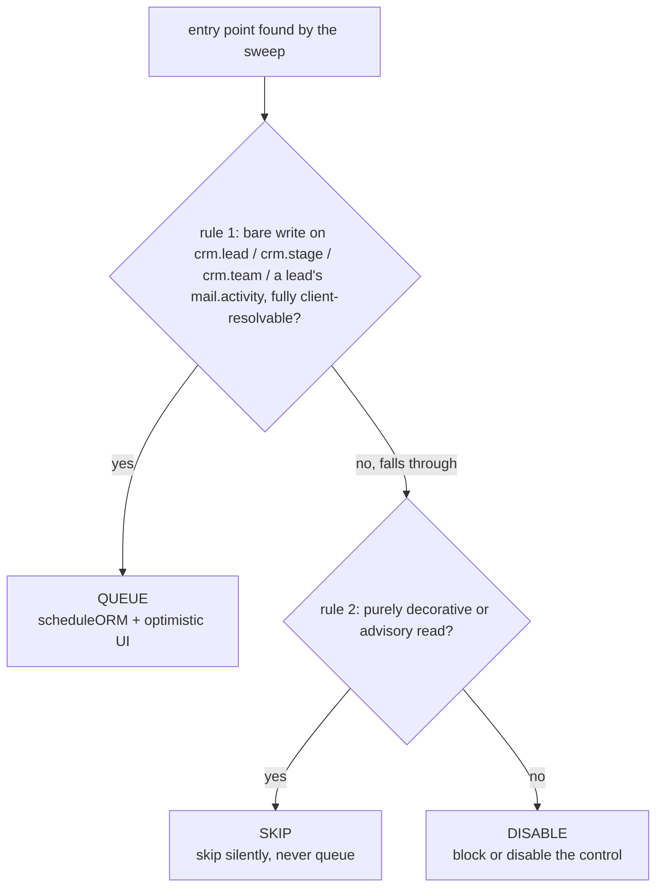
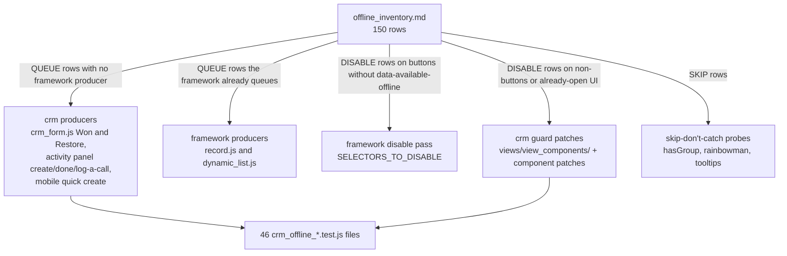

# Offline surface inventory

Active contributors: bobbyabbott421-glitch (fork)

## Purpose

`addons/crm/static/src/mobile/offline_inventory.md` is the classification behind every offline guard in this fork's CRM: a sweep of `addons/crm/` for every entry point that needs a live server — every ORM call in JS, every button and control in the view/wizard/report XML, every public model method reachable from a button, every relational field that can create or edit a record on another model — with exactly one of three dispositions per row: **QUEUE**, **SKIP**, or **DISABLE**. It was the fork's milestone-1 deliverable (inventory only, no code changes), and every later milestone implemented it: QUEUE rows without a framework producer got crm-side `scheduleORM` calls, DISABLE rows got guards, SKIP rows got silent-skip probes. This page documents the methodology, the multi-round verification history, and the totals; the row-by-row table lives in the file itself.

## The three dispositions

The rules, applied in this exact order (verbatim from the kickoff):

1. **QUEUE** — a write on `crm.lead`, `crm.stage`, `crm.team`, or a lead's `mail.activity`, whose full argument list is resolvable on the client. Offline it queues, and the UI updates optimistically.
2. **SKIP** — a read that is only decorative or advisory: a tooltip, a visual effect, a promotional hint, a group probe that only toggles display. Skipped silently offline, never queued.
3. **DISABLE** — everything else: transient wizards, module installs, paid external lookups, server-computed reports, access probes gating destructive UI, navigation to anything unavailable offline. Anything needing a server onchange, a transient-model wizard, or an id produced by another call is DISABLE, never QUEUE.

The order is the load-bearing part: each row gets exactly one token, and if a call could be read as either QUEUE and DISABLE, rule 1 is tried first — it is QUEUE only if it is truly a bare, client-resolvable write; otherwise it falls through. The queue replays `model, method, args, kwargs` verbatim with no id remapping, so the chained-id test inside rule 3 is what keeps wizards, onchange-dependent forms, and create-then-use flows out of the queue (see [Sync queue](../../features/offline-and-pwa/sync-queue.md)).

## Sweep method

Four sections, each with a reproducible grep and a documented exclusion list:

- **Section A — JS/XML ORM, rpc, action-service and group/access-probe calls** (`addons/crm/static/src/**`). Two `rg` passes: one for `orm\.`, `rpc(`, `doAction`/`loadAction`/`actionService`, `hasGroup`, `checkAccessRight`, `fetch(`, `.call(`; a second for the ORM method names the first pass does not spell out (`webSearchRead`, `searchRead`, `readGroup`, `formattedReadGroup`, `webSave`, `name_search`, `save()`, `list.load()`, ...). Every matched line was opened in context and either turned into a row or excluded with a documented reason. All 47 JS/XML files under `static/src/` were then listed and cross-checked file by file, so files with zero hits are confirmed empty rather than skipped. Excluded with reasons: `user.isAdmin` (a synchronous session property, no RPC), `useService("fillTemporalService")` (local date math), the promotional dialog's external links (no Odoo backend call), and — after the user-testing round — bare `useService("orm")`/`useService("action")` handle acquisitions with no call on that line (acquiring a handle issues no server call; only the later calls through it do, and each of those has its own row).
- **Section B — view, wizard and report buttons and controls with a server side effect.** An `rg` pass over `addons/crm/views/*.xml`, `addons/crm/wizard/*.xml`, `addons/crm/report/*.xml` for `<button`, `type="object"`, `type="action"`, `<a`, `statusbar`, `<chatter`, `quick_create`, `kanban_color_picker`, `kanban_activity`, `widget="priority"`, `type="delete"`, `type="open"`, `reschedule_dropdown`. Every `ir.ui.view`/wizard/report record with an arch was read fully (all 18 view files, 4 wizard arch files, 2 report arch files); records without an arch (menus, plain act_window records) are excluded unless reached from an in-scope view.
- **Section C — public `crm.lead` / `crm.stage` / `crm.team` methods reachable from a button.** `grep "^    def "` over the three model files, then each method checked against every Section A/B row (button `name=`, `<a name=>`, or a JS `orm.call`/`scheduleORM` target) and against `grep` across `addons/crm/{views,wizard,report,static}`. Methods not referenced anywhere are listed as excluded with the one caller that nearly reaches them — never silently dropped.
- **Section B-REL — relational-field create/edit controls** (added in round 3). Every `many2one`/`many2many`/`many2many_tags`/`one2many` field occurrence in an editable context that can create or edit a record on a *different* model than the view's own, through a mechanism distinct from the host record's own Save. Selecting an existing related record is deliberately not a row: it only stages a value that the host record's save then writes, and that save is already a Section A/B/C row. The section's header records the one blanket mechanism: web's `Many2XAutocomplete.suggest()` (`addons/web/static/src/views/fields/relational_utils.js`) only pushes its "Create"/"Create and edit"/search-more suggestions `if (!this.offlinePlugin.isOffline())`, so the typed-name quick-create path is already hidden offline for *every* many2one and many2many_tags field in the addon, regardless of per-field options. B-REL rows exist only for mechanisms that blanket rule cannot reach: the many2many_tags color-edit popover, one2many widgets, and a many2one's own open/edit navigation.

Rounds 2–4 added targeted gap-closing sweeps on top (the categories the original patterns miss): `editable=`, `widget="handle"`, `group_create`/`group_delete`/`group_edit`/`archivable=`, `many2many_tags`, `on_tag_click`, `kanban_color_picker`, and the JS handlers (`onSelect`, `_updateSwitcherSelection`, `_notify`, `switchView`, `searchModel.`) — because a `<kanban>` tag with no `group_delete` attribute still enables column delete by default, and an `<a name=...>` with no `orm.` token on its handler line still reaches the server.

## Verification history

Every citation in the file was re-read against the repository at each round's HEAD, and no row number was ever reassigned — new rows are appended to the end of each section's table, so cross-references in the notes keep pointing at the same rows. The rounds:

| Round | Base | What it changed |
| --- | --- | --- |
| Original sweep | HEAD `8916e416`, committed `a6a1ceef` | The first full A/B/C classification. |
| Round-1 fix (scrutiny) | still `a6a1ceef` | Closed 7 blocking gaps: missing stage-column create/delete/resequence rows, two missing editable lists, a missing team-switcher selection row, a missing reachable `crm.team` method, a missing tag-color-editor row, and a false claim about the team-switcher cache-miss fallback. 9 rows added (A26, B55–B61, C21). |
| Round-2 fix (scrutiny) | `6e6de2b8` | Closed 4 findings: the pipeline kanban's default-enabled column "Edit" menu and the lead form's tag quick-create (both missed in `crm_lead_views.xml`), plus two inaccurate producer recipes for the stage resequence/delete rows — the recipes spelled out `scheduleORM`/`webResequence` argument lists that were incomplete or wrong, so they were replaced with a method-level statement of what a future producer must queue. 2 rows added (B62, B63). |
| Round-3 fix (scrutiny) | `cf127d42` | Closed 3 findings in the same category (relational-field create/edit), by adding the exhaustive Section B-REL instead of patching three rows in place; the pass found 2 more occurrences beyond the findings. 8 rows added (BR1–BR8). |
| Round-4 fix (scrutiny) | later HEAD | 32 rows added (A27, B64–B88, BR9–BR12, C22–C23), including corrections of three false Section A/C exclusions: `forecast_kanban_model.js`'s "only calls super" (the super is a real `web_read_group`), `action_unarchive` (reachable from the action menu's Unarchive), and `copy_data` (reachable from the action menu's Duplicate — a chained-id DISABLE). |
| Round-5 correction | later HEAD | B80's justification only: the stage-column hover tooltip does issue a debounced `orm.silent.read` through a memoized `loadTooltip()`; SKIP was kept because nothing surfaces the failure. |
| User-testing fix (VAL-INV-005/007) | landed `01ccefaa` | Removed 4 rows (A3, A8, A17, A18 — bare service-handle acquisitions with no server call) and added B89, extending B72/B73 to the activity report's grouped-list controls. Totals at that point: 147 rows (39 QUEUE / 9 SKIP / 99 DISABLE). |
| Milestone-2 user review (VAL-INV-011) | later HEAD | Reclassified 11 rows QUEUE → DISABLE (B8, B11, B19, B20, B57, B58, B59, B71, B76, B89, and C7), added B90 and B91, and narrowed B74. Net QUEUE −11, DISABLE +13 → 149 rows (28 / 9 / 112). |
| Milestone-2 list-cell-edit fix | final HEAD | Reclassified B40, B74, B88 QUEUE → DISABLE (list cell edits go through `DynamicList._multiSave`, which the framework does not queue), and split the stage form's own save out of B40 into a new QUEUE row, B92. Final totals: **150 rows (26 QUEUE / 9 SKIP / 115 DISABLE)**. |

## Totals

| Classification | Count |
| --- | --- |
| QUEUE | 26 |
| SKIP | 9 |
| DISABLE | 115 |
| **Total** | **150** |

| Section | Rows | QUEUE | SKIP | DISABLE |
| --- | --- | --- | --- | --- |
| A — JS/XML calls (`static/src/**`) | 23 | 3 (A9, A13, A15) | 6 (A4, A6, A7, A12, A14, A16) | 14 |
| B — view/wizard/report buttons and controls | 92 | 14 (B1, B3, B5, B21, B22, B24, B53, B54, B64, B65, B67, B69, B75, B92) | 1 (B80) | 77 |
| B-REL — relational-field create/edit controls | 12 | 0 | 0 | 12 (BR1–BR12) |
| C — public model methods reachable from a button | 23 | 9 (C1, C2, C3, C4, C6, C14, C15, C16, C22) | 2 (C9, C20) | 12 |

QUEUE highlights: form saves and the statusbar stage click (B5/A13), the kanban drag between stage columns (B21/A15), priority stars in kanban and list (B22, B53, B54), quick create on the pipeline and forecast kanbans (B24, B65), Won and Restore (B1, B3 — queued by crm's own producer, not the framework), the forecast kanban's `date_deadline` drag (B64), action-menu Delete and Archive/Unarchive on `crm.lead`/`crm.stage`/`crm.team` from list and form menus (B67, B69), the team form's save (B75), the stage form's save (B92), and the model methods behind them (C1, C2, C3, C4, C6, C14, C15, C16, C22).

SKIP highlights: the post-save rainbowman lookups (A12, A14, A16, C9), the team-switcher and MRR `user.hasGroup` probes (A4, A7), the team-switcher data fetch (A6, C20), and the stage-column hover tooltip (B80).

DISABLE highlights: every transient wizard (lost, convert, merge, mass mail, PLS update, blacklist), module installs and the lead-generation flows (A19–A23), the PLS tooltip and AI switch (A10, B8, B11, C7), server-computed report and forecast reads (A24, A27, B37–B39, B48), all stage/team group create, edit, delete, and resequence controls (B56–B59, B62, B71, B73, B89, B90), and every relational-field create/edit row in B-REL.

## Why stage column delete and resequence are DISABLE

Rows B57 (column delete), B58 (kanban column drag), and B59 (the stage list's `widget="handle"` resequence) were QUEUE in the early revisions, each with a spelled-out `scheduleORM`/`webResequence` producer recipe. The milestone-2 user review (VAL-INV-011) reclassified all three to DISABLE, and the reasoning is the project's central rule rather than a per-row judgment: the framework's own producers only ever queue `web_save`, `web_unlink`, `action_archive`, and `action_unarchive` (`addons/web/static/src/model/relational_model/record.js`, `.../dynamic_list.js`) — there is no queue producer for group-level `orm.unlink` or `orm.webResequence`, and the fork must not build a second offline engine to add one. The same decision covers the grouped activity report's delete/resequence (B89) and the team list's handle drag (B90): the controls are disabled offline instead, and the gap is listed as a known limit. The implementation follows directly: `CrmKanbanRenderer.canResequenceGroups()` and `canCreateGroup()` (`addons/crm/static/src/views/crm_kanban/crm_kanban_renderer.js`), `ListRenderer.canResequenceRows()` (`addons/crm/static/src/views/view_components/list_renderer_offline_patch.js`), and the group config menu's edit/delete guards (`addons/crm/static/src/views/view_components/group_config_menu_patch.js`).

## How the inventory drives the guards

- **QUEUE beyond the framework.** Notes #1 of the inventory lists every QUEUE row the framework does not already queue: Won (which must call `action_set_won`, not the arch-bound `action_set_won_rainbowman` wrapper, because the wrapper runs a heavy SQL read and returns an effect action), Restore, and the activity schedule/done/log-a-call trio from milestone 3. Each became an explicit `offline.scheduleORM(...)` call through `useCrmOffline()` (`addons/crm/static/src/views/crm_form/crm_form.js`, `addons/crm/static/src/views/crm_form/crm_lead_activity_panel.js`).
- **DISABLE on plain buttons** needs no crm code at all: the framework's disable pass turns off every `<button>` lacking `data-available-offline` (see [Offline UI](../../features/offline-and-pwa/offline-ui.md)).
- **DISABLE on anything else** is where the guard patches come from: `<a>` elements (the AI switch, card menu items, dashboard links), `
`s (the rotting badge, progress-bar segments, activity cells), `` menu items of an already-open dropdown, an `<input>` checkbox in the tag color popover, a confirmation dialog whose confirm closure was bound while online. Those are the twelve files in `addons/crm/static/src/views/view_components/` plus the patches in `addons/crm/static/src/chatter/web_portal_project/chatter_patch.js`, `addons/crm/static/src/views/crm_activity/activity_cell_offline_patch.js`, and `addons/crm/static/src/views/crm_calendar/calendar_common_renderer_patch.js`.
- **SKIP** is implemented as "skip, don't catch": the probe is not issued at all while offline, because `user.hasGroup`'s cache never evicts a rejected promise and a memoized tooltip read would stay broken even after reconnecting — the exact failure modes documented on rows A4, A6, A7, and B80.

Every guard and producer is proven by a test in `addons/crm/static/tests/crm_offline_*.test.js` (46 files), and the classification's reasoning is cross-referenced from each guard's doc comment by row id (B19, B57, B91, ...) and scrutiny-finding id (VAL-DIS-015, VAL-QUEUE-005, ...).

## Entry points for modification

The inventory is the first stop before touching any offline behavior: check whether the entry point already has a row, and follow that row's disposition instead of re-deciding. New entry points get new rows appended (never a renumbered row) with the same decision order, and a QUEUE disposition is only legitimate if the framework already queues the call or a crm-side `scheduleORM` producer is added with optimistic UI and a test. The file lives at `addons/crm/static/src/mobile/offline_inventory.md`, next to the mobile suite that consumes most of it.

## Key source files

| File | Purpose |
| --- | --- |
| `addons/crm/static/src/mobile/offline_inventory.md` | The 150-row classification itself: rules, sweep method, all rows, counts, and ten notes sections. |
| `addons/crm/static/src/mobile/README.md` | The fork's developer notes: dispositions in short, known limits, test commands. |
| `addons/crm/static/src/mobile/offline_hooks/offline_hooks.js` | `useCrmOffline()`, the hook every producer and guard reads. |
| `addons/crm/static/src/views/crm_form/crm_form.js` | The Won/Restore producers (QUEUE rows B1/B3, C6/C4). |
| `addons/crm/static/src/views/crm_form/crm_lead_activity_panel.js` | The activity create/done/log-a-call producers. |
| `addons/crm/static/src/views/view_components/` | The twelve guard patches implementing the DISABLE rows. |
| `addons/crm/static/src/views/crm_kanban/crm_kanban_renderer.js` | Column create/resequence and filter-control guards (B56–B58, B79, B91). |
| `addons/crm/models/crm_lead.py` | `action_log_call()` and the won/lost methods behind QUEUE rows C4/C6. |
| `addons/crm/models/mail_activity.py` | The `res_model_id` derivation that makes a queued activity create replayable. |
| `addons/crm/static/tests/` | The 46 `crm_offline_*.test.js` files proving the dispositions. |

## Related pages

- [Offline CRM](offline-crm.md): what the QUEUE/SKIP/DISABLE decisions add up to in behavior.
- [Mobile CRM](mobile-crm.md): the mobile suite the inventory lives next to.
- [CRM](index.md): the module the sweep covers.
- [CRM views](crm-views.md): the view family whose controls the rows classify.
- [Sync queue](../../features/offline-and-pwa/sync-queue.md): the replay semantics behind the QUEUE rule.
- [Offline UI](../../features/offline-and-pwa/offline-ui.md): the framework disable pass behind the button DISABLE rows.
- [Testing](../../how-to-contribute/testing.md): running the offline test suites.
