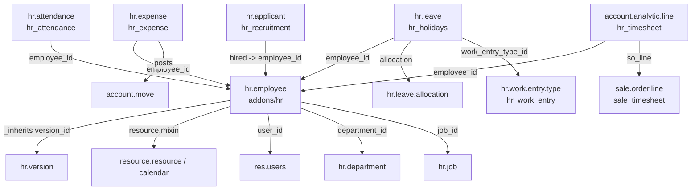

# HR suite

Active contributors: Christophe, Martin, Fabien (top authors of `addons/hr` on `origin/20.0`, bots and translation imports excluded)

## Purpose

The HR family is the 24 addons under `addons/` whose names start with `hr`. `addons/hr` owns the employee registry: employees, their dated employment records, departments, job positions, work locations, employee types and categories, and the public/private projection of employee data. Every other member of the family adds its own records that point back at an employee: time off, expenses, recruitment, attendance, skills, work entries, presence, timesheets. At 24 directories it is one of the larger app families in the tree, and `hr.employee` is one of the most-inherited models in the codebase.

## Family contents

Real directories in `addons/`:

```text
hr/                        Employees: hr.employee, hr.version, hr.department, hr.job
hr_work_entry/             Work entry types and time rules (no payroll engine)
hr_holidays/               Time Off: hr.leave, allocations, accrual plans
hr_holidays_attendance/    Auto-installed bridge: attendance -> leave
hr_attendance/             Check in/out, kiosk, badge scanning
hr_timesheet/              Timesheets on account.analytic.line (depends on project)
hr_timesheet_attendance/   Auto-installed bridge: timesheets <-> attendance
hr_expense/                Expenses, posted into account.move
hr_recruitment/            Applicants, stages, talent pools, sources
hr_recruitment_skills/     Auto-installed bridge: skills on applicants
hr_recruitment_sms/        Auto-installed bridge: SMS to applicants
hr_recruitment_survey/     Interview forms via survey
hr_skills/                 Skills, levels, resume lines
hr_skills_event/           Auto-installed bridge: skills from events
hr_skills_slides/          Auto-installed bridge: skills from e-learning
hr_skills_survey/          Auto-installed bridge: skills from surveys
hr_presence/               Presence heuristics from logs, IP, attendance
hr_calendar/               Auto-installed bridge: working hours in calendar
hr_calendar_google/        Bridge: HR calendar <-> google_calendar
hr_address_extended/       Bridge: structured addresses on employees
hr_fleet/                  Auto-installed bridge: fleet vehicles on employees
hr_maintenance/            Auto-installed bridge: equipment on employees
hr_gamification/           Auto-installed bridge: badges on employees
hr_livechat/               Views only: HR operator channel filters
```

Fifteen manifests list `hr` as a direct dependency, thirteen of them inside the family plus `mail_bot_hr` and `pos_hr`. Fourteen family modules set `auto_install: True`: they install themselves as soon as both sides are present.

## Key models

| Model | Defined in | Role |
| --- | --- | --- |
| `hr.employee` | `addons/hr/models/hr_employee.py` | The employee record; delegates to `hr.version`, mixes in mail thread/phone/activity, `resource.mixin`, `avatar.mixin` |
| `hr.version` | `addons/hr/models/hr_version.py` | A dated snapshot of employment terms (department, job, schedule, wage, structure type) |
| `hr.employee.public` | `addons/hr/models/hr_employee_public.py` | Read-only projection for users outside `hr.group_hr_user` |
| `hr.department` | `addons/hr/models/hr_department.py` | Hierarchical departments with a manager and member list |
| `hr.job` | `addons/hr/models/hr_job.py` | Job positions with headcount targets; recruitment extends it |
| `hr.work.location` | `addons/hr/models/hr_work_location.py` | Office, home, and other work sites used by presence and location rules |
| `hr.employee.type` | `addons/hr/models/hr_employee_type.py` | Employment categories shipped as data: Employee, Student, Intern, Interim, Apprenticeship, and more |
| `hr.employee.category` | `addons/hr/models/hr_employee_category.py` | Free tags on employees |
| `hr.employee.departure` | `addons/hr/models/hr_employee_departure.py` | Offboarding record with a departure reason |
| `hr.employee.location` | `addons/hr/models/hr_employee_location.py` | Per-day location rows behind the location fields on the employee form |
| `hr.payroll.structure.type` | `addons/hr/models/hr_payroll_structure_type.py` | Salary structure type; the payroll hook that stays in community |
| `hr.leave` / `hr.leave.allocation` | `addons/hr_holidays/models/hr_leave.py`, `.../hr_leave_allocation.py` | Time off requests and the balances they draw from |
| `hr.leave.accrual.plan` / `hr.leave.accrual.level` | `addons/hr_holidays/models/hr_leave_accrual_plan.py`, `.../hr_leave_accrual_plan_level.py` | Accrual rules that grow allocations |
| `hr.expense` | `addons/hr_expense/models/hr_expense.py` | An expense line with its own state machine, posted into accounting |
| `hr.applicant` | `addons/hr_recruitment/models/hr_applicant.py` | Recruitment pipeline record; one stage set per `hr.job` |
| `hr.attendance` | `addons/hr_attendance/models/hr_attendance.py` | A check-in/check-out pair with computed `worked_hours` |
| `hr.skill` / `hr.employee.skill` / `hr.resume.line` | `addons/hr_skills/models/` | Skills, skill levels, and CV lines |
| `hr.work.entry.type` / `hr.time.rule` | `addons/hr_work_entry/models/hr_work_entry_type.py`, `.../hr_time_rule.py` | Classification of worked and non-worked time, consumed by payroll |

## How it works

`hr.employee` delegates to a second table. It declares `_inherits = {'hr.version': 'version_id'}` with `_check_inherits_access = False` (`addons/hr/models/hr_employee.py:51`), and `version_id` is a computed, non-stored many2one resolved through `compute_sql='_compute_sql_version_id'`. Reading `employee.wage` or `employee.job_id` therefore reads it off whichever `hr.version` is current, and each dated change to employment terms creates a new version row instead of overwriting history. `current_version_id` is a stored, indexed pointer at the live version, and `version_ids` exposes the whole history. There is no `hr.contract` model in 20.0: the contract form is a dedicated view over `hr.version` (`hr.hr_contract_template_form_view`, `addons/hr/views/hr_contract_template_views.xml`), and `hr.employee.contract_template_id` copies template values onto a new version.

Field-level confidentiality is enforced by group, not by a separate model. The class docstring in `addons/hr/models/hr_employee.py` requires every field that exists only on `hr.employee` (and not on `hr.employee.public`) to carry `groups="hr.group_hr_user"`, so the ORM prefetch never loads private data for users who only have the two groups defined in `addons/hr/security/hr_security.xml`, `group_hr_user` and `group_hr_manager`. `hr.employee.public` is a read-only projection of the non-confidential fields for everyone else.

The sub-apps follow a consistent shape: depend on `hr`, add a model with an `employee_id` many2one, and inherit `mail.thread`/`mail.activity.mixin` where approval is involved.

- Time off (`addons/hr_holidays`) validates requests against the employee's `resource.calendar`, draws days from `hr.leave.allocation`, grows balances through accrual plans, and maps approved leave onto `hr.work.entry.type` rows so downstream payroll can classify the absence. `hr.leave` has its own state machine: `confirm`, `refuse`, `validate1` (second approval), `validate`, `cancel`.
- Expenses (`addons/hr_expense`) has no separate report model in 20.0. `hr.expense` alone carries a computed `state` (`draft`, `submitted`, `approved`, `posted`, `in_payment`, `paid`, `refused`) plus an `approval_state`, and posting produces `account.move` records through `addons/hr_expense/models/account_move.py`.
- Recruitment (`addons/hr_recruitment`) is a pipeline of `hr.applicant` rows on `hr.recruitment.stage`, per job position, with `hr.talent.pool` for sourcing and `hr.recruitment.source` for UTM-tagged sources. A hired applicant links to `hr.employee` through `employee_id`.
- Attendance (`addons/hr_attendance`) records check-in/check-out pairs and computes `worked_hours`. It ships a second front end: `addons/hr_attendance/static/src/public_kiosk/public_kiosk_app.js` is a standalone OWL app served through public routes in `addons/hr_attendance/controllers/main.py` (`/hr_attendance/<token>`, badge scanning, manual selection), so a shared tablet can check people in without a logged-in session.
- Timesheets do not add a model at all. `addons/hr_timesheet` extends `account.analytic.line` with `employee_id`, `task_id`, `project_id` and `job_title`, which is why timesheet reporting is analytic reporting. It depends on `project`, so it is also a bridge into the project family.
- Skills (`addons/hr_skills`) adds `hr.skill`, `hr.skill.type`, `hr.skill.level`, `hr.employee.skill` and `hr.resume.line`.
- Work entries (`addons/hr_work_entry`) defines the classification types and time rules but no stored work entry records, because the generator lives in the payroll modules.



## Payroll is not in this repository

There is no `hr_payroll` addon here. What exists are hook points: the `hr.payroll.structure.type` model (`addons/hr/models/hr_payroll_structure_type.py`), the `structure_type_id` and `wage` fields on `hr.version`, and methods documented as overridden by payroll. Country payroll packs (`l10n_be_hr_payroll*`, `l10n_au_hr_payroll_api`, referenced from comments in `addons/fleet/models/fleet_vehicle.py`) are absent too. The localization modules that are present only tune time off, for example `addons/l10n_fr_hr_holidays` (part-time workers in France) and `addons/l10n_in_hr_holidays`.

## Integration points

- Accounting: `hr_expense` requires `account` and posts moves; see [Accounting](accounting.md).
- Sales and services: `sale_expense`, `sale_timesheet`, `sale_timesheet_margin`, `project_timesheet_holidays` and `project_hr_expense` bridge into [Sales suite](sales-suite.md) and [Project and services](project-and-services.md).
- Point of sale: `pos_hr` lists `hr` as a direct dependency; see [Point of sale](point-of-sale.md).
- Mail: every major HR model inherits `mail.thread` and `mail.activity.mixin`; recruitment and expenses also use mail aliases for inbound email. See [Mail](mail.md).
- UTM: recruitment tags sources with `utm.source`, the same taxonomy CRM uses; see [Marketing suite](marketing-suite.md).
- Auto-installed bridges (`hr_holidays_attendance`, `hr_recruitment_skills`, `hr_calendar`, `hr_fleet`, `hr_maintenance`, `hr_gamification`, `hr_presence`) activate themselves as soon as both sides are installed.

## Entry points for modification

Start at `addons/hr/models/hr_employee.py` and `addons/hr/models/hr_version.py`. The `_inherits` delegation decides whether a new field belongs on the employee (stable identity) or the version (dated employment terms), and the `groups="hr.group_hr_user"` rule in the class docstring decides whether it is visible to colleagues. To add behavior to an existing HR flow, extend the owning model with `_inherit` from your own addon rather than editing these files; a per-day or per-version attribute almost always belongs on `hr.version`, not `hr.employee`. For a new HR-adjacent app, copy the shape of `addons/hr_skills`: depend on `hr`, add one model with an `employee_id` many2one, and add an `auto_install` bridge module for each other app you need to glue to. In this fork, HR code is only reached from `addons/crm` through extension points, following [Patterns and conventions](../how-to-contribute/patterns-and-conventions.md).

## Key source files

| File | Purpose |
| --- | --- |
| `addons/hr/__manifest__.py` | Employees manifest: dependency list and data-file order |
| `addons/hr/models/hr_employee.py` | `hr.employee`, the central model (2,577 lines) |
| `addons/hr/models/hr_version.py` | Dated employment record delegated to by `hr.employee` |
| `addons/hr/models/hr_employee_public.py` | Public projection of employee data |
| `addons/hr/models/hr_department.py` | Hierarchical departments |
| `addons/hr/models/hr_work_location.py` | Office/home work locations |
| `addons/hr/models/hr_payroll_structure_type.py` | Salary structure type, the payroll hook that stays in community |
| `addons/hr/security/hr_security.xml` | `group_hr_user`, `group_hr_manager` |
| `addons/hr_holidays/models/hr_leave.py` | Time off requests and validation (2,726 lines) |
| `addons/hr_holidays/models/hr_leave_allocation.py` | Balances and allocation requests |
| `addons/hr_holidays/models/hr_leave_accrual_plan_level.py` | Accrual rules that grow allocations |
| `addons/hr_expense/models/hr_expense.py` | Expense state machine and duplicate detection (2,309 lines) |
| `addons/hr_expense/models/account_move.py` | Posting expenses into accounting |
| `addons/hr_recruitment/models/hr_applicant.py` | Recruitment pipeline record (1,124 lines) |
| `addons/hr_attendance/models/hr_attendance.py` | Check-in/check-out records |
| `addons/hr_attendance/controllers/main.py` | Public kiosk and badge routes |
| `addons/hr_attendance/static/src/public_kiosk/public_kiosk_app.js` | Standalone kiosk OWL app |
| `addons/hr_timesheet/models/account_analytic_line.py` | Timesheet fields on analytic lines |
| `addons/hr_skills/models/hr_employee_skill.py` | Employee skills and levels |
| `addons/hr_work_entry/models/hr_work_entry_type.py` | Work entry classification consumed by payroll |
| `addons/hr_presence/models/hr_employee.py` | Presence heuristics from logs and attendance |

## Related pages

- [Apps](index.md)
- [Accounting](accounting.md)
- [Sales suite](sales-suite.md)
- [Project and services](project-and-services.md)
- [Point of sale](point-of-sale.md)
- [Mail](mail.md)
- [Marketing suite](marketing-suite.md)
- [Patterns and conventions](../how-to-contribute/patterns-and-conventions.md)
