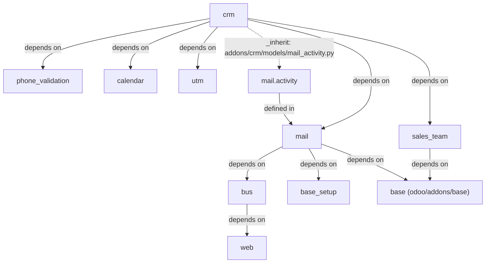

# Apps

Active contributors: Thibault Delavallée, Fabien Pinckaers, Christophe Simonis (upstream, by commit count on `addons/`); bobbyabbott421-glitch (fork, `addons/crm/`)

## Purpose

Odoo is one Python server plus 642 addon modules under `addons/`, and one more module, `base`, that ships inside the core package at `odoo/addons/base/`. Each addon is a directory that declares its dependencies, records, views, and assets in a single manifest, and the module loader merges it into the per-database registry. This page covers addon anatomy, the composition mechanisms, the inventory grouped by family, and the line between upstream Odoo and this fork.

## Directory layout

```text
addons/                     # 642 business addon modules
├── crm/                    # CRM app, the fork's active development target
│   ├── __init__.py         # imports models/, wizard/, controllers/, report/
│   ├── __manifest__.py     # name, version, depends, data, assets
│   ├── models/             # ORM classes, one file per model
│   ├── wizard/             # TransientModel dialogs (lost, merge, mass convert)
│   ├── controllers/        # @route endpoints
│   ├── views/              # XML: actions, view archs, menus
│   ├── security/           # crm_security.xml + ir.access.csv
│   ├── data/               # records loaded at install (XML)
│   ├── report/             # report models and print layouts
│   ├── i18n/               # 62 .po translation files
│   ├── static/             # src/ (JS, SCSS), tests/, tours/
│   └── tests/              # Python tests, imported in tests/__init__.py
├── mail/                   # messaging backbone
├── web/                    # OWL web client + the offline/PWA stack
└── ...
odoo/addons/base/           # the base module, inside the core package
```

An addon does not need every directory. `addons/web` has no `wizard/` or `report/`; the bridge addon `addons/sale_crm` is a handful of models, views, and data files; `addons/bus` is a few models plus a websocket controller. The manifest is the only required file.

## Addon anatomy

| Path | What lives there |
| --- | --- |
| `__manifest__.py` | Python dict: `name`, `version`, `depends`, `data`, `demo`, `assets`, hooks. See `addons/crm/__manifest__.py`. |
| `models/` | `models.Model`, `TransientModel`, and `AbstractModel` classes, one file per model, all imported in `models/__init__.py` (`addons/crm/models/__init__.py`). |
| `wizard/` | `TransientModel` wizards that drive a multi-step action, e.g. `addons/crm/wizard/crm_lead_lost.py`. |
| `controllers/` | `Controller` subclasses with `@route()` endpoints, e.g. `addons/crm/controllers/webmanifest.py`. |
| `views/` | XML data: window actions, view archs, menus, QWeb templates, e.g. `addons/crm/views/crm_lead_views.xml`. |
| `security/` | Group records plus access rows: `addons/crm/security/crm_security.xml` and `addons/crm/security/ir.access.csv`. |
| `data/` | Records loaded at install in manifest order; records marked `noupdate="1"` survive later upgrades. |
| `report/` | Report models and print layouts, e.g. `addons/crm/report/crm_activity_report.py`. |
| `i18n/` | One `.po` file per translated language. |
| `static/` | `src/` (JS/SCSS source), `lib/` (vendored code), `description/` (icon, marketing page), `tests/`. |
| `tests/` | Python tests; a module is collected only if imported in `tests/__init__.py`. |

The manifest keys that drive composition:

- `depends` lists module names; the loader derives the install and update order from this graph (`ModuleGraph` in `odoo/modules/module_graph.py`).
- `data` is the ordered list of XML/CSV files loaded at install and upgrade; `demo` is the same for databases created with demo data.
- `assets` maps bundle names to glob lists, e.g. the `web.assets_backend` entry in `addons/crm/__manifest__.py`.
- `auto_install` installs the module once all its dependencies are present (`addons/bus/__manifest__.py` uses it).

## How addons compose

Three mechanisms, all already wired; none require touching another module's code.

1. **The depends graph.** `load_modules()` in `odoo/modules/loading.py` orders modules topologically and rebuilds the per-database registry; see [module system](../systems/module-system.md).
2. **Model inheritance.** `_inherit` extends a model in place from another module, `_inherits` delegates to a parent record, and `_name` with `_inherit` copies a model under a new name. The fork's reference example is `addons/crm/models/mail_activity.py`. ORM details in [ORM](../systems/orm.md).
3. **View and template inheritance.** Archs extend an existing arch through `inherit_id` and xpath; `addons/crm/views/crm_lead_views.xml` reuses one lead form for the forecast variants by overriding `js_class`. Covered in [actions, views and menus](../primitives/actions-views-menus.md).

The graph around `crm` shows how thin bridge modules and heavy frameworks stack:



## The 642-module inventory

Each row is a family with its own page. The count is the number of directories whose name matches the listed prefixes, so it is reproducible with `ls -d addons/<prefix>*`; a bridge addon such as `website_crm` falls in one row only (the website one), and the last row collects the singletons. Counts were verified against `ls addons/` on this tree.

| Family | Directories | Prefixes | What they add |
| --- | --- | --- | --- |
| [Web client](web/index.md) | 4 | `web`, `web_hierarchy`, `web_tour`, `web_unsplash` | The OWL client, the views framework, and the offline/PWA stack the fork's CRM work consumes. |
| [Base and core system addons](base.md) | 10 (+ `base` in the core package) | `base_*` | Core extensions: import, automation, geolocalize, report engines, sparse fields, tours. |
| [Mail and messaging](mail.md) | 8 (+ `bus`, `portal*`, `digest`, `im_livechat`) | `mail*` | Discuss core, bots, tracking, plugins: the chatter and activity layer every business app uses. |
| [CRM](crm/index.md) | 7 | `crm*` | The pipeline (`crm`), iap enrich/mine, livechat, mail plugin, sms, sale project, plus the fork's offline and mobile additions ([offline CRM](crm/offline-crm.md), [mobile CRM](crm/mobile-crm.md)). |
| [Accounting](accounting.md) | 41 | `account*` (16), `analytic`, `payment*` (24) | Journals, moves, reconciliation, taxes, EDI, Peppol, payment providers. |
| [Sales suite](sales-suite.md) | 30 | `sale*` (29), `sales_team` | Quotations and orders, plus bridges into stock, mrp, project, timesheets. |
| [Inventory and manufacturing](inventory-and-manufacturing.md) | 35 | `stock*` (8), `mrp*` (12), `purchase*` (11), `delivery`, `barcodes*` (2), `repair` | Warehouse moves, BOMs, purchasing, valuation, shipping. |
| [Website suite](website-suite.md) | 52 (+ `html_editor`, `html_builder`, `theme_default`) | `website*` | Website builder, ecommerce, blog, forum, slides, livechat, and bridges into CRM and events. |
| [HR suite](hr-suite.md) | 24 | `hr*` | Employees, holidays, expenses, recruitment, attendance, skills, timesheets. |
| [Point of sale](point-of-sale.md) | 46 | `point_of_sale`, `pos*` (45) | The cashier terminal, restaurant, self-order, payment terminals, loyalty. |
| [Marketing suite](marketing-suite.md) | 20 | `mass_mailing*` (12), `event*` (8) | Email and SMS campaigns, events and booths; `utm`, `survey*`, `snailmail*` and `social_media` live in the [other business apps](other-business-apps.md) roundup. |
| [Project and services](project-and-services.md) | 18 | `project*` | Tasks, the `project_todo` app, and bridges to timesheets and stock. |
| [Spreadsheet and dashboards](spreadsheet-and-dashboards.md) | 16 | `spreadsheet*` (15), `board` | Spreadsheet engine, one dashboard module per app, and `board`, the per-user My Dashboard. |
| [Localizations and integrations](localizations-and-integrations.md) | 258 | `l10n*` (229), `auth*` (12), `google*` (5), `microsoft*` (3), `cloud_storage*` (4), `iap*` (3), `iot*` (2) | Country charts and e-invoicing formats, login providers, external APIs, Odoo's own paid services. |
| [Other business apps](other-business-apps.md) | 73 | the remainder: `product*`, `portal*`, `bus`, `digest`, `calendar*`, `resource*`, `uom`, `fleet*`, `lunch`, `loyalty`, `survey*`, `sms*`, `snailmail`, `utm`, `test_*` (20), ... | Shared infrastructure and single-app addons: 20 `test_*` framework modules, the realtime bus, the portal, UTM tracking, test-population tooling. |

The 20 `test_*` modules under `addons/` exist to exercise the framework (`test_mail`, `test_website`, `test_populate`, ...) and are listed in the [other business apps](other-business-apps.md) page. The core package holds test-support modules of its own: `odoo/addons/` contains `base` plus 15 `test_*` modules that exercise inheritance, linting, translation, HTTP dispatch, and uninstall behavior.

## Upstream Odoo and this fork

Everything under `addons/` is upstream Odoo 20.0 code, and upstream history is intact: `origin/20.0` carries 211,574 commits, its tip is `ee8c13eaa57` ("[FIX] mail: duplicate notifications", 2026-08-13). The fork branch `eval/factory-crm-offline` branches off that tip and adds 76 commits of its own, 74 of which touch `addons/crm/`; the rest of its changes are tooling and documentation, never another addon: `scripts/dev/` (the dev environment), `AGENTS.md`, `.gitignore`, the `.factory/skills/odoo-offline-qa/` skill, and this wiki. No addon outside `addons/crm/` differs from upstream on this branch, so per-file history remains usable for attribution.

The offline/PWA framework itself is upstream 20.0 code: `addons/web/static/src/core/offline/`, `addons/web/static/src/core/pwa/` and `addons/web/static/src/service_worker.js` all exist on `origin/20.0`. The fork consumes that stack from `addons/crm`; it does not ship it.

The fork's active target is `addons/crm`: the rules in `AGENTS.md` restrict changes to that directory so the fork stays rebasable onto upstream 20.0. Behavior owned by another addon is extended from inside `addons/crm/` with Python `_inherit`, controller subclassing, JS `patch()`, or XML view inheritance; the manifest globs (`crm/static/src/**`) already cover new files. Conventions are detailed in [patterns and conventions](../how-to-contribute/patterns-and-conventions.md).

## Entry points for modification

Start from the manifest of the module and the model file that owns the behavior. For `crm` itself, edit under `addons/crm/` and add the test to `addons/crm/tests/` (imported in `tests/__init__.py`). For behavior owned by another module, extend it from `addons/crm/` as above, never by editing that module in place.

## Key source files

| File | Purpose |
| --- | --- |
| `addons/crm/__manifest__.py` | Full-featured manifest: depends, ordered data list, asset globs. |
| `addons/web/__manifest__.py` | The largest asset bundle declarations, including the offline bundles. |
| `addons/mail/__manifest__.py` | Documents mail's per-bundle asset folder layout in its comments. |
| `odoo/addons/base/__manifest__.py` | The kernel module manifest, `auto_install: True`. |
| `odoo/modules/module_graph.py` | `ModuleGraph`, the topological order of modules. |
| `odoo/modules/loading.py` | `load_modules()`, installs and upgrades, runs hooks. |
| `odoo/addons/base/models/ir_module.py` | `ir.module.module`, the installed-module record per database. |
| `odoo/addons/base/models/ir_model.py` | `ir.model` and `ir.model.fields` introspection tables. |
| `addons/crm/models/mail_activity.py` | Reference `_inherit` extension of another module's model. |
| `addons/crm/views/crm_lead_views.xml` | View arch inheritance and `js_class` binding in one file. |

## Related pages

- [Base and core system addons](base.md)
- [Mail and messaging](mail.md)
- [CRM](crm/index.md)
- [Web client](web/index.md)
- [Module system](../systems/module-system.md)
- [ORM](../systems/orm.md)
- [Actions, views and menus](../primitives/actions-views-menus.md)
- [Users, groups and access](../primitives/users-groups-and-access.md)
- [Patterns and conventions](../how-to-contribute/patterns-and-conventions.md)
