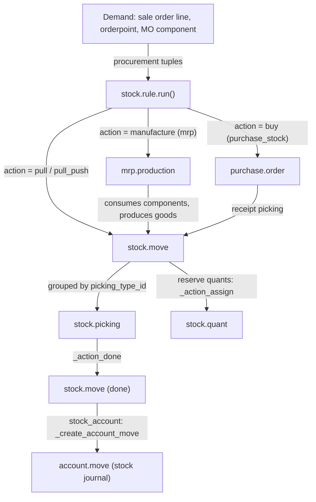

# Inventory and manufacturing

Active contributors: Christophe, Josse, Quentin (upstream)

## Purpose

The supply-chain addons move physical goods and turn those movements into accounting entries. `addons/stock` owns the warehouse model: locations, quants, moves, transfers, lots, routes and replenishment. `addons/mrp` builds products from bills of material, `addons/purchase` buys them, `addons/delivery` ships them, and the `stock_account` bridge posts the valuation entries. Together the family counts 36 addons: 8 named `stock*`, 12 `mrp*`, 11 `purchase*`, plus `delivery`, `barcodes`, `barcodes_gs1_nomenclature`, `maintenance` and `repair`. This fork touches none of them; they are upstream 20.0 code that the CRM app never depends on.

## Family contents

Verified with `ls -d addons/stock* addons/mrp* addons/purchase* addons/delivery* addons/barcodes* addons/maintenance addons/repair`:

```text
addons/stock/                        # Inventory app: warehouses, moves, pickings, quants, lots, routes
addons/stock_account/                # auto_install: move valuation -> journal entries
addons/stock_delivery/               # carrier labels and tracking (auto_install: sale_stock + delivery)
addons/stock_dropshipping/            # dropship route (depends on sale_purchase_stock)
addons/stock_landed_costs/            # landed cost allocation on receipts
addons/stock_maintenance/             # lots used in maintenance equipment
addons/stock_sms/                    # SMS when final stock moves are done
addons/stock_fleet/                   # transport management
addons/mrp/                           # Manufacturing: BOMs, manufacturing orders, work orders
addons/mrp_account/                   # analytic entries for productions
addons/mrp_delivery/                  # kits shipped by carrier
addons/mrp_landed_costs/              # landed costs on manufacturing orders
addons/mrp_product_expiry/             # expiry dates in production
addons/mrp_repair/                    # link repair orders to manufacturing
addons/mrp_subcontracting/             # subcontracted production (BoM type 'subcontract')
addons/mrp_subcontracting_account/  addons/mrp_subcontracting_dropshipping/
addons/mrp_subcontracting_landed_costs/  addons/mrp_subcontracting_purchase/
addons/mrp_subcontracting_repair/     # subcontracting bridges
addons/purchase/                      # Purchase app: RFQs, orders, vendor bills
addons/purchase_stock/                # receipts; adds the 'buy' rule action
addons/purchase_mrp/                  # productions from purchase orders
addons/purchase_requisition/          # blanket orders and purchase templates
addons/purchase_requisition_stock/
addons/purchase_repair/  addons/purchase_alternative/  addons/purchase_alternative_sale/
addons/purchase_alternative_stock/  addons/purchase_edi_ubl_bis3/  addons/purchase_product_matrix/
addons/delivery/                      # carriers; rate_shipment pricing API
addons/barcodes/                      # scan and parse framework
addons/barcodes_gs1_nomenclature/     # GS1-128 parsing (hard dependency of stock)
addons/maintenance/                    # equipment and maintenance requests
addons/repair/                         # repair.order
```

There is no `quality*` module in this tree (`ls -d addons/quality*` matches nothing); the quality-control step of a three-step reception is an ordinary stock location inside `addons/stock`.

## Key models

| Model | File | What it covers |
| --- | --- | --- |
| `stock.move` | `addons/stock/models/stock_move.py` | One product quantity moving between locations. `state` (line 107) is `draft`, `waiting`, `confirmed`, `partially_available`, `assigned`, `done`, `cancel`. |
| `stock.move.line` | `addons/stock/models/stock_move_line.py` | The handled detail: lot, package, quantity done. |
| `stock.picking` | `addons/stock/models/stock_picking.py` | Transfer document grouping moves; its state is computed from the moves. |
| `stock.picking.type` | `addons/stock/models/stock_picking_type.py` | Operation type; `code` (line 73) is `incoming`, `outgoing` or `internal`. |
| `stock.quant` | `addons/stock/models/stock_quant.py` | Reconciled on-hand quantity per product/location/lot (line 21). |
| `stock.location` / `stock.route` | `addons/stock/models/stock_location.py` | Location tree; `stock.route` at line 514. |
| `stock.rule` | `addons/stock/models/stock_rule.py` | `action` is `pull`, `push` or `pull_push`; `procure_method` is `make_to_stock`, `make_to_order` or `mts_else_mto`. |
| `stock.warehouse` | `addons/stock/models/stock_warehouse.py` | `reception_steps` one/two/three steps (line 56), `delivery_steps` `ship_only`/`pick_ship`/`pick_pack_ship` (62). |
| `stock.warehouse.orderpoint` | `addons/stock/models/stock_orderpoint.py` | Reordering rule (line 24). |
| `stock.lot` | `addons/stock/models/stock_lot.py` | Lot and serial numbers (line 25). |
| `product.removal` / `stock.putaway.rule` | `addons/stock/models/product_strategy.py` | Removal strategies and putaway rules (lines 9, 17). |
| `mrp.bom` | `addons/mrp/models/mrp_bom.py` | `type` is `normal` or `phantom` kit (line 15). `mrp_subcontracting` adds `subcontract` with `subcontractor_ids` (`addons/mrp_subcontracting/models/mrp_bom.py:12-14`). |
| `mrp.production` | `addons/mrp/models/mrp_production.py` | Manufacturing order; states `draft`, `confirmed`, `progress`, `to_close`, `done`, `cancel`, computed. |
| `mrp.workorder` / `mrp.workcenter` | `addons/mrp/models/mrp_workorder.py`, `addons/mrp/models/mrp_workcenter.py` | Operations on workcenters and their capacity/time model (lines 16, 22). |
| `purchase.order` | `addons/purchase/models/purchase_order.py` | RFQ to purchase order; states `draft`, `sent`, `to approve`, `purchase`, `cancel`. |
| `purchase.requisition` | `addons/purchase_requisition/models/purchase_requisition.py` | Purchase agreement; `requisition_type` is `blanket_order` or `purchase_template`. |
| `delivery.carrier` | `addons/delivery/models/delivery_carrier.py` | Carrier; `delivery_type` is `fixed` or `base_on_rule` (line 39); `rate_shipment` (398) is the API carrier modules extend. |
| `barcode.nomenclature` / `barcode.rule` | `addons/barcodes/models/barcode_nomenclature.py`, `addons/barcodes/models/barcode_rule.py` | A nomenclature (line 17) whose `parse_barcode` (86) classifies a scan against its rules (8). |
| `maintenance.equipment` / `maintenance.request` | `addons/maintenance/models/maintenance.py` | Equipment (line 114) and requests (241); stages, categories and teams live in the same file. |
| `repair.order` | `addons/repair/models/repair.py` | Repair orders consuming parts through stock moves (line 21). |

## How it works

Demand is expressed as procurement tuples (`ProcurementGroup.Procurement`, `addons/stock/models/stock_rule.py`). `stock.rule.run(procurements)` (line 426) matches each procurement to a rule and dispatches by the rule's `action`. `_run_pull` (262) creates the `stock.move`; the engine is widened, not replaced: `addons/mrp/models/stock_rule.py:15` adds the `manufacture` action, `addons/purchase_stock/models/stock_rule.py:19` adds `buy`. Moves are grouped into pickings by `picking_type_id`, reserved against quants by `_action_assign` (`addons/stock/models/stock_move.py:2135`) after `_action_confirm` (1770), and validated by `_action_done` (2350). `stock.warehouse` generates each site's operation types and routes from `reception_steps` and `delivery_steps`; reordering rules replenish on schedule through `run_scheduler` (`addons/stock/models/stock_rule.py:722`).

Valuation lives in the `stock_account` auto_install bridge. `_should_create_account_move` (`addons/stock_account/models/stock_move.py:755`) gates it on a storable product, valuation accounts on the locations and real-time valuation; `_create_account_move` (260) then posts one `account.move` per batch of valued moves, with `_get_account_move_line_vals` (296) building the lines. The journal-entry side is covered in [accounting](accounting.md).

Barcode scanning is a generic layer: `addons/barcodes` ships the capture and dispatch code (`addons/barcodes/static/src/barcode_plugin.js`, `addons/barcodes/static/src/barcode_handlers.js`, `addons/barcodes/static/src/js/barcode_parser.js`) and the nomenclature models; `addons/stock/models/barcode.py` adds the stock rule types `weight`, `location`, `lot` and `package` (lines 11-14); `addons/barcodes_gs1_nomenclature` adds GS1-128 parsing and is a hard dependency of `stock`.



## Integration points

- `addons/stock` depends on `product`, `barcodes_gs1_nomenclature` and `digest`; `addons/mrp` on `product`, `stock` and `resource`; `addons/purchase` on `account` alone, with warehouse behaviour added by `purchase_stock`.
- Cross-app wiring follows the pairwise-bridge convention: `purchase_mrp`, `purchase_requisition_stock`, `mrp_subcontracting_purchase`, `stock_dropshipping` (depends on `sale_purchase_stock`), `stock_landed_costs`, `mrp_account`.
- `addons/sale_stock` is the demand source from confirmed sales orders; see [sales suite](sales-suite.md). `addons/website_sale_stock` extends the shop front ([website suite](website-suite.md)).
- `addons/delivery` depends on `sale` and `payment_custom`, and carriers double as payment methods for cash on delivery (`addons/delivery/models/payment_method.py`). `addons/stock_delivery/models/delivery_carrier.py` adds `send_shipping` (35), `get_tracking_link` (73) and `cancel_shipment` (85).
- `addons/repair` depends on `sale_stock` and `sale_management` and reuses stock moves for parts consumption; `mrp_repair`, `purchase_repair` and `mrp_subcontracting_repair` are its bridges.
- `mrp_subcontracting` makes an outsourced operation a manufacturing order: a `subcontract` BoM names its `subcontractor_ids`.
- Front-end pieces here are ordinary backend web-client extensions (dashboards, traceability report); none of them participate in the fork's offline stack, which only `addons/crm` consumes ([web client](web/index.md)).

## Entry points for modification

To change how goods flow, start at `stock.rule.run` in `addons/stock/models/stock_rule.py` and follow `_run_pull` into `stock.move._action_confirm` / `_action_assign` / `_action_done` in `addons/stock/models/stock_move.py`. To change what a validated move posts, override `_get_account_move_line_vals` or `_should_create_account_move` in `addons/stock_account/models/stock_move.py`. Manufacturing behaviour hooks into `mrp.production._compute_state` or the `mrp.bom` explosion in `addons/mrp/models/mrp_bom.py`. Follow the `_inherit` and glue-module conventions in [patterns and conventions](../how-to-contribute/patterns-and-conventions.md) rather than editing these addons in place: this fork restricts changes to `addons/crm/` so it stays rebasable onto upstream 20.0.

## Key source files

| File | Purpose |
| --- | --- |
| `addons/stock/__manifest__.py` | Inventory manifest: depends `product`, `barcodes_gs1_nomenclature`, `digest`. |
| `addons/stock/models/stock_move.py` | Move lifecycle: `_action_confirm`, `_action_assign`, `_action_done`. |
| `addons/stock/models/stock_move_line.py` | Lot, package and quantity-done detail lines. |
| `addons/stock/models/stock_picking.py` | Transfer document and backorders. |
| `addons/stock/models/stock_quant.py` | On-hand quantities and inventory adjustments. |
| `addons/stock/models/stock_rule.py` | Procurement engine: `run`, `_run_pull`, `run_scheduler`. |
| `addons/stock/models/stock_warehouse.py` | Warehouse setup and reception/delivery step routes. |
| `addons/stock/models/stock_orderpoint.py` | Reordering rules. |
| `addons/stock/models/stock_lot.py` | Lot and serial tracking. |
| `addons/stock/models/product_strategy.py` | `product.removal`, `stock.putaway.rule`. |
| `addons/stock/models/barcode.py` | Stock barcode rule types. |
| `addons/stock_account/models/stock_move.py` | Valuation and `account.move` creation. |
| `addons/mrp/models/mrp_production.py` | Manufacturing order state machine and component moves. |
| `addons/mrp/models/mrp_bom.py` | Bills of material, kits, operations. |
| `addons/mrp/models/mrp_workorder.py` | Work orders. |
| `addons/mrp/models/mrp_workcenter.py` | Workcenters, capacity, losses. |
| `addons/mrp_subcontracting/models/mrp_bom.py` | `subcontract` BoM type and `subcontractor_ids`. |
| `addons/purchase/models/purchase_order.py` | RFQ/PO workflow and bill creation. |
| `addons/purchase_stock/models/stock_rule.py` | The `buy` rule action. |
| `addons/purchase_requisition/models/purchase_requisition.py` | Blanket orders and purchase templates. |
| `addons/delivery/models/delivery_carrier.py` | Carrier rating API. |
| `addons/stock_delivery/models/delivery_carrier.py` | Labels, tracking links, shipment cancellation. |
| `addons/barcodes/models/barcode_nomenclature.py` | `parse_barcode` and rule matching. |
| `addons/maintenance/models/maintenance.py` | Equipment, requests, stages, teams. |
| `addons/repair/models/repair.py` | `repair.order`. |

## Related pages

- [Apps](index.md)
- [Sales suite](sales-suite.md)
- [Website suite](website-suite.md)
- [Accounting](accounting.md)
- [CRM](crm/index.md)
- [Web client](web/index.md)
- [Multi-company](../primitives/companies-and-multi-company.md)
- [Data models](../reference/data-models.md)
