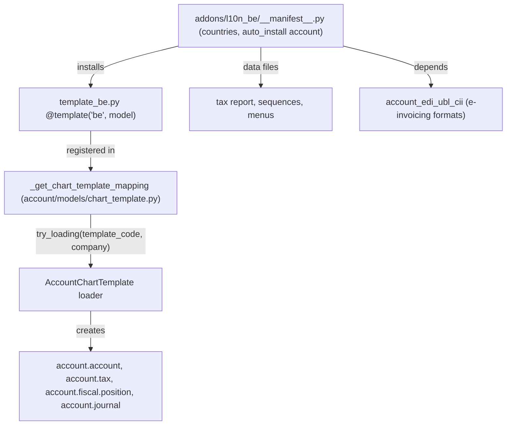

# Localizations and integrations

Active contributors: Christophe, Olivier, Fabien

## Purpose

Two large families of addons exist mainly to connect Odoo to something outside itself: the 229 `l10n_*` modules that adapt accounting to a country's legal requirements, and the connector modules that speak to payment providers, identity providers, Google and Microsoft APIs, and Odoo's own paid services. Both families are deliberately thin, most of their content is data rather than logic, and both extend core models instead of defining new ones.

## Localizations

229 modules start with `l10n_`. By manifest category: 127 are `Accounting/Localizations/Account Charts`, 34 are `Accounting/Localizations/EDI`, 27 are plain `Accounting/Localizations`, 15 target point of sale, and the remainder cover sale, website, reporting and time-off specifics. Country coverage is uneven by design, India (`l10n_in*`, 12 modules), Spain (9) and France (8) have the deepest stacks.

A localization is data-first. `addons/l10n_be/__manifest__.py` is representative: `countries: ['be']`, `auto_install: ['account']`, a dependency on `account` and `account_edi_ubl_cii`, and three XML data files (tax report, sequences, menu items). The chart of accounts itself is not XML. It lives in `addons/l10n_be/models/template_be.py`, an `AbstractModel` with `_inherit = 'account.chart.template'` whose methods are decorated with `@template('be')` and `@template('be', 'res.company')` and simply return dictionaries of records keyed by XML id.

The `template()` decorator is defined at `addons/account/models/chart_template.py:53`; `_get_chart_template_mapping` (same file, line 108) discovers every decorated method across installed modules and builds the list of selectable charts, and the loader instantiates accounts, taxes, fiscal positions and journals for one company. Country variants live side by side, `l10n_be` ships `template_be.py`, `template_be_asso.py` (non-profits) and `template_be_comp.py` (companies). Country-specific behavior that cannot be expressed as data goes in small `_inherit` files next to the templates (`account_move.py`, `account_tax.py`, `account_journal.py`, `res_company.py`).

Bank and tax EDI is layered on top: 39 modules match `l10n_*edi*` (for example `l10n_it_edi`, `l10n_es_edi_sii`, `l10n_in_edi`, `l10n_hu_edi`), and they build on three core modules, `addons/account_edi`, `addons/account_edi_ubl_cii` (UBL and Factur-X/CII document formats) and `addons/account_edi_proxy_client` (the client for Odoo's proxy to government endpoints), with `addons/account_peppol` riding on the formats and the proxy to send and receive invoices over the Peppol network. See [accounting](accounting.md) for the `account` models they extend.

## Payment providers

24 modules start with `payment`: one core, `addons/payment`, and 23 provider adapters (adyen, aps, asiapay, authorize, buckaroo, custom, demo, dpo, ecpay, flutterwave, iyzico, mercado_pago, mollie, nuvei, paymob, paypal, payu, razorpay, redsys, stripe, toss_payments, worldline, xendit). The core owns the model layer: `addons/payment/models/payment_provider.py`, `payment_method.py`, `payment_token.py` and `payment_transaction.py`, plus the portal payment flow in `addons/payment/controllers/portal.py` and `payment_status.py`.

A provider module is a thin adapter with a predictable shape, visible in `addons/payment_stripe/`: `const.py` for API constants, `models/payment_provider.py`, `payment_token.py` and `payment_transaction.py` extending the core models with the provider's API calls and webhook parsing, `controllers/main.py` for redirect and webhook routes, `data/payment_provider_data.xml` and `data/payment_method_data.xml` for the records, `data/neutralize.sql` so a restored database cannot charge real cards, frontend assets for the provider SDK, and a `tests/` package. Nothing in a provider module defines a new model.

## Login providers, connectors and services

- **Authentication.** 12 `auth_*` modules add login mechanisms to `res.users`: `auth_ldap`, `auth_oauth` (which also pulls in `auth_signup`), `auth_signup` (self-registration and invitation), `auth_passkey` (+ `auth_passkey_portal`), `auth_totp` (+ `auth_totp_mail`, `auth_totp_portal`), `auth_password_policy` (+ `_portal`, `_signup`) and `auth_timeout`. Several are `auto_install`, so they are present in most databases.
- **Google and Microsoft.** `addons/google_account` and `addons/microsoft_account` hold the shared OAuth token plumbing; `google_calendar` and `microsoft_calendar` synchronise `calendar.event` both ways; `google_gmail` and `microsoft_outlook` provide OAuth for outgoing and incoming mail servers; `google_recaptcha` protects public forms and `google_address_autocomplete` fills addresses. There is no Drive connector in this repository, and no `fetchmail`, `link_preview`, `web_gantt` or `web_map` module; the `web_*` companions that do exist (`web_hierarchy`, `web_tour`, `web_unsplash`) are listed in [other business apps](other-business-apps.md).
- **In-app purchase.** `addons/iap` (`auto_install`, depends on `web` and `base_setup`) holds the credit-account model and the RPC helper that calls Odoo's IAP endpoints. `iap_mail` and `iap_crm` are the per-domain glue, and the consumers are feature modules: `partner_autocomplete` (company data lookup, `auto_install` on `iap_mail`), `crm_iap_enrich` (enrich a lead from its email domain, `auto_install`) and `crm_iap_mine` / `website_crm_iap_reveal` (lead generation and visitor reveal), described in [CRM](crm/index.md).
- **Storage and certificates.** `addons/cloud_storage` redirects large `ir.attachment` uploads to an external bucket through `models/ir_attachment.py` and `models/ir_http.py`, with `cloud_storage_azure`, `cloud_storage_google` and `cloud_storage_migration` as the concrete backends. `addons/certificate` (`certificate.py`, `key.py`) stores X.509 certificates and private keys for the EDI modules that must sign documents.
- **Hardware.** `addons/iot_drivers` is marked `installable: False` in its manifest: it is the code that runs on an IoT Box to expose printers, scales and payment terminals, not a server-side app. `addons/iot_webserial` is its browser-side counterpart.

## Entry points for modification

A new localization is a new module: manifest with `countries` and `auto_install: ['account']`, one `template_<code>.py` using `@template`, and XML only for reports, sequences and menus. A new payment provider is a copy of an existing adapter with the three model extensions and the webhook controller rewritten. Neither belongs in this fork, whose [project rules](../how-to-contribute/patterns-and-conventions.md) confine changes to `addons/crm`; the pattern is documented here because the same extension mechanisms are what CRM uses.

## Key source files

| File | Purpose |
| --- | --- |
| `addons/account/models/chart_template.py` | `template()` decorator (line 53), `AccountChartTemplate` (line 73), `_get_chart_template_mapping` (line 108) |
| `addons/l10n_be/__manifest__.py` | Representative localization manifest: `countries`, `auto_install`, data files |
| `addons/l10n_be/models/template_be.py` | Chart, taxes and company defaults as `@template` dictionaries |
| `addons/l10n_be/models/account_move.py` | Country-specific behavior via `_inherit` |
| `addons/account_edi_ubl_cii/` | UBL and Factur-X/CII document builders shared by EDI localizations |
| `addons/account_edi_proxy_client/` | Client for Odoo's proxy to government e-invoicing endpoints |
| `addons/account_peppol/models/account_move.py` | Peppol send and receive on top of UBL through the proxy client |
| `addons/payment/models/payment_provider.py` | Provider configuration and capability flags |
| `addons/payment/models/payment_transaction.py` | Transaction state machine shared by all providers |
| `addons/payment/controllers/portal.py` | Portal payment flow |
| `addons/payment_stripe/models/payment_transaction.py` | Example adapter: API calls and webhook parsing |
| `addons/payment_stripe/data/neutralize.sql` | Disables live credentials in restored databases |
| `addons/auth_signup/` | Self-registration and invitation flow |
| `addons/auth_totp/` | Time-based one-time passwords |
| `addons/google_account/` | Shared Google OAuth token handling |
| `addons/google_calendar/models/google_sync.py` | Two-way `calendar.event` synchronisation |
| `addons/iap/models/` | IAP credit accounts and the remote-call helper |
| `addons/partner_autocomplete/` | Company data lookup over IAP |
| `addons/cloud_storage/models/ir_attachment.py` | Attachment offloading to external buckets |
| `addons/certificate/certificate.py` | X.509 certificate and key storage for signing |

## Related pages

- [Accounting](accounting.md): the `account` models every localization extends.
- [CRM](crm/index.md): consumer of `crm_iap_enrich` and `crm_iap_mine`.
- [Module system](../systems/module-system.md): manifests, `depends`, `auto_install`, data loading order.
- [Patterns and conventions](../how-to-contribute/patterns-and-conventions.md): `_inherit`, controller subclassing, and this fork's scope rules.
- [Other business apps](other-business-apps.md): `calendar`, `portal` and the other modules these connectors plug into.
