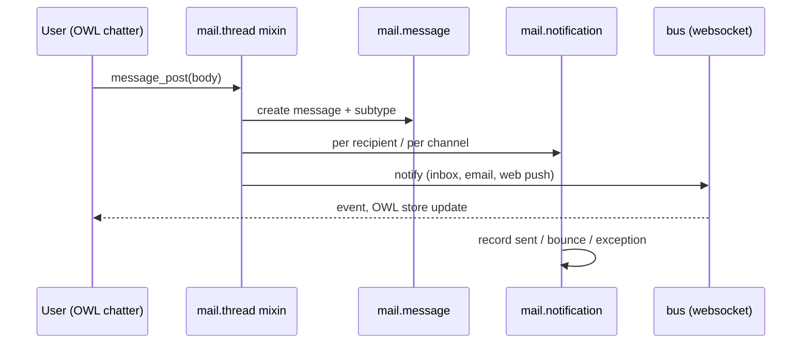

# Mail and messaging

Active contributors: Thibault Delavallée, Alexandre Kühn, Sébastien Theys (upstream, by commit count on `addons/mail/`)

## Purpose

`addons/mail` (display name "Discuss") is the messaging backbone: the `mail.thread` mixins that put a chatter on every business document, the `mail.activity` scheduling system, discuss channels, the email gateway, and templates. Most business apps depend on it; `crm.lead` is one of its heaviest consumers. Realtime delivery rides on `addons/bus`, the websocket event bus, and two neighbours complete the layer: `addons/portal` (the customer-facing side of the same thread, reached through a token instead of a login) and `addons/digest` (the periodic KPI email built on mail templates).

## Directory layout

```text
addons/mail/
├── models/         # mail_thread.py (the mixin, 5,446 lines), the thread-variant mixins,
│                   # mail_activity*.py, messages, followers, notifications, templates,
│                   # aliases, fetchmail.py, discuss/, and _inherit files for base models
├── controllers/    # mail.py, thread.py, store.py, attachment.py, discuss/,
│                   # websocket.py for mail-side socket events, webmanifest.py
├── wizard/         # compose message, schedule activity, followers edit
├── static/src/     # OWL chatter, discuss app, store, model layer
└── tools/          # discuss.py Store, alias errors, push, parser
```

## Key abstractions

| Name | File | What it does |
| --- | --- | --- |
| `mail.thread` | `addons/mail/models/mail_thread.py` | AbstractModel mixin: message posting, followers, tracking, inbound routing; tuned by class options (`_mail_post_access`, `_primary_email`). |
| `mail.thread.subject.suggested`, `mail.thread.blacklist`, `mail.thread.main.attachment` | `addons/mail/models/mail_thread_subject_suggested.py`, `addons/mail/models/mail_thread_blacklist.py`, `addons/mail/models/mail_thread_main_attachment.py` | Thin `mail.thread` variants: suggested composer subjects, mass-mailing opt-out from `mail.blacklist` (`addons/mail/models/mail_blacklist.py`), main-attachment picking. |
| `mail.activity` + `mail.activity.mixin` | `addons/mail/models/mail_activity.py`, `addons/mail/models/mail_activity_mixin.py` | Scheduled to-dos (`activity_ids`, `activity_state`, `my_activity_date_deadline`) with types and deadlines. The offline Schedule panel queues `mail.activity.create` calls, which is why CRM overrides `create` on this model. |
| `mail.activity.plan` | `addons/mail/models/mail_activity_plan.py` | Reusable activity sequences per model. |
| `mail.message` | `addons/mail/models/mail_message.py` | Every chatter, log, and notification row. |
| `mail.followers` | `addons/mail/models/mail_followers.py` | Subscriptions with per-subtype filtering. |
| `mail.notification` | `addons/mail/models/mail_notification.py` | Per-recipient delivery state: inbox or email, sent/bounce/exception, failure reason. |
| `discuss.channel` | `addons/mail/models/discuss/discuss_channel.py` | Group channels, chats, livechat, alias-created channels; inherits `mail.thread` and `bus.sync.mixin`; WebRTC calls. |
| `mail.template` + `mail.render.mixin` | `addons/mail/models/mail_template.py`, `addons/mail/models/mail_render_mixin.py` | Templates rendering placeholders against a record. |
| `mail.alias` | `addons/mail/models/mail_alias.py` | Inbound addresses that spawn records on a target model. |
| `bus` | `addons/bus/models/bus.py`, `addons/bus/controllers/websocket.py` | Publish/subscribe event bus over `/websocket`; `auto_install`, depends on `base` and `web`. |

## How it works

A chatter post travels through the mixin, then fans out per recipient:



- **Chatter.** A model inheriting `mail.thread` gets `message_ids`, `message_follower_ids`, and the `message_*` computed fields. Form views render the panel with the `<chatter/>` tag, e.g. `addons/crm/views/crm_lead_views.xml:302`; the OWL implementation is `addons/mail/static/src/chatter/`.
- **Activities.** `mail.activity` rows point at `(res_model, res_id)` with a type, user, and deadline; plans bundle sequences; `action_create_calendar_event` schedules a meeting.
- **Followers and notifications.** Subscriptions filter on `mail.message.subtype`; `_notify_thread` in `addons/mail/models/mail_thread.py` splits delivery into inbox, email, and web-push paths, writing one `mail.notification` per recipient.
- **Gateway.** Aliases route inbound mail to a model via `message_route` in `addons/mail/models/mail_thread.py`; `addons/mail/models/fetchmail.py` polls POP/IMAP.
- **Discuss.** Channels add members, guests, polls, reactions, scheduled messages, and RTC sessions; the client keeps state in sync through the Store (`addons/mail/tools/discuss.py`) over the bus websocket.

History note: no file outside `addons/crm/` differs from `origin/20.0` on this branch, so the fork leaves mail untouched and `git log -- addons/mail` answers attribution questions normally. The `origin/20.0` tip is `ee8c13eaa57` ("[FIX] mail: duplicate notifications", 2026-08-13).

## The bus, the portal, the digest

Three addons complete the layer. None of them is a business app; all three are thin, and `bus` is `auto_install`.

| Addon | Depends on | What it adds |
| --- | --- | --- |
| `addons/bus` | `base`, `web` (`auto_install`) | The transport. `/websocket` is served by `addons/bus/controllers/websocket.py`; `addons/bus/websocket.py` and `addons/bus/websocket_protocol.py` implement the protocol, and `addons/bus/bus_dispatcher.py` runs a thread that blocks on a Postgres `LISTEN imbus` and forwards matching rows to subscribed sockets. 20.0 ships an in-process websocket worker, not the long-polling `/longpolling/poll` layer older documentation describes. Every chatter notification, activity counter and asset-reload watchdog reaches the browser through it. |
| `addons/portal` | `auth_signup`, `base_address_extended`, `html_editor`, `http_routing`, `mail`, `web` | The customer side. `portal.mixin` (`addons/portal/models/portal_mixin.py`) gives any model `access_url` and `access_token`; `portal.entry` (`addons/portal/models/portal_entry.py`) builds the `/my` page menu; the controllers in `addons/portal/controllers/` (`portal.py`, `thread.py`, `mail.py`) let a token holder read a thread and post on it with no user account. The `_inherit = 'mail.thread'` in `addons/portal/models/mail_thread.py` adds the portal recipient group to notification targets and validates thread access by hash or token. `addons/portal_discuss` and `addons/portal_rating` extend it. |
| `addons/digest` | `mail`, `portal`, `resource` | The KPI email. `digest.digest` (`addons/digest/models/digest.py`) holds one record per user and period, with a `kpi_*` boolean and a `_value` field per metric; `digest.tip` supplies the tips; the templates ship with the addon. Apps add KPIs by `_inherit` — `addons/crm/models/digest.py` is the CRM example, and `addons/account`, `addons/stock` and others do the same. |

The division is worth remembering when hunting for a model: thread semantics live in `mail`, transport in `bus`, unauthenticated access in `portal`, KPI reporting in `digest`.

## Integration points

- Depends on `base`, `base_setup`, `bus`, `web_tour`, `html_editor` (`addons/mail/__manifest__.py`).
- Extends base models from outside: `addons/mail/models/ir_access.py` (chatter tracking on `ir.access`), `addons/mail/models/ir_cron.py` (chatter and `_notify_admin`), `addons/mail/models/res_partner.py` (blacklist and activity mixins on `res.partner`).
- Business apps consume the mixins. `crm.lead` declares (`addons/crm/models/crm_lead.py:89`):

```python
_inherit = [
    'mail.thread.subject.suggested',
    'mail.thread.blacklist',
    'mail.thread.phone',             # defined in addons/phone_validation/models/mail_thread_phone.py
    'mail.activity.mixin',
    'utm.mixin',
    'format.address.mixin',
    'mail.tracking.duration.mixin',
]
```

- CRM is the fork's only Python extension of mail, and it lives in one file, `addons/crm/models/mail_activity.py`, which overrides two methods:
  - `create()` maps a literal `res_model='crm.lead'` to `res_model_id` when (and only when) a `res_id` is also supplied. The offline Schedule panel resolves the model to a string client-side, but `res_model` is a `related` field computed from `res_model_id`, so leaving the id unset makes the two disagree. Queued `mail.activity.create` calls replay their kwargs verbatim, which is why the mapping has to happen server-side. See [Offline CRM](crm/offline-crm.md) and [the sync queue](../features/offline-and-pwa/sync-queue.md).
  - `action_create_calendar_event()` adds the lead's context when an activity linked to an opportunity becomes a meeting, so the customer is pre-filled as attendee.

## Entry points for modification

Fork rules apply: change only `addons/crm/`, and extend mail from there. To alter chatter or activity behavior for leads, override the mixin method with `_inherit` and keep a `super()` fallback, following `addons/crm/models/mail_activity.py`.

## Key source files

| File | Purpose |
| --- | --- |
| `addons/mail/models/mail_thread.py` | The thread mixin: posting, routing, notifications, tracking. |
| `addons/mail/models/mail_activity.py` | The activity model and its scheduling API. |
| `addons/mail/models/mail_message.py` | Message records. |
| `addons/mail/models/mail_followers.py` | Follower subscriptions and subtypes. |
| `addons/mail/models/mail_notification.py` | Delivery states and failure types. |
| `addons/mail/models/discuss/discuss_channel.py` | Discuss channels and their thread behavior. |
| `addons/mail/models/fetchmail.py` | Inbound POP/IMAP polling. |
| `addons/mail/tools/discuss.py` | The Store payload builder the client consumes. |
| `addons/bus/controllers/websocket.py` | The `/websocket` endpoint every client subscribes to. |
| `addons/bus/bus_dispatcher.py` | The dispatcher thread: `LISTEN imbus`, channel topics, per-socket forwarding. |
| `addons/portal/models/portal_mixin.py` | `access_url` / `access_token`, the token that replaces a login. |
| `addons/digest/models/digest.py` | `digest.digest`, the `kpi_*` field pairs and the send loop. |
| `addons/crm/models/crm_lead.py` | The mixin `_inherit` list of `crm.lead`. |
| `addons/crm/models/mail_activity.py` | Reference `_inherit` extension from inside `addons/crm/`. |
| `addons/crm/models/digest.py` | CRM's KPI contribution to the digest email. |

## Related pages

- [CRM](crm/index.md) for how the pipeline consumes threads and activities.
- [Offline CRM](crm/offline-crm.md) and [Mobile CRM](crm/mobile-crm.md) for what the fork does with activities and the chatter.
- [The sync queue](../features/offline-and-pwa/sync-queue.md) for the verbatim replay the `mail.activity.create` override exists to satisfy.
- [Base and core system addons](base.md) for the groups, partners, and `ir.*` models mail extends.
- [Web client](web/index.md) for the OWL side of chatter and discuss.
- [Apps](index.md) for the addon inventory and composition rules.
- [Onboarding tours](../features/onboarding-tours.md), mail ships a tour in its data (`data/web_tour_tour.xml`).
- [Users, groups and access](../primitives/users-groups-and-access.md)
- [Patterns and conventions](../how-to-contribute/patterns-and-conventions.md)
