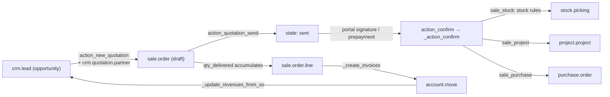

# Sales suite

Active contributors: Christophe, Fabien, Victor (upstream)

## Purpose

`addons/sale` turns a quotation into a confirmed order, tracks how much of each line was delivered, and turns the delivered quantity into invoices. `addons/sales_team` sits underneath it with the `crm.team` and `crm.team.member` models that the CRM app shares. The rest of the family is thin bridge modules — 29 directories named `sale*` plus `sales_team` — and seven further addons that feed leads into CRM or gamify the pipeline. All of it is upstream 20.0 code; this fork changes none of it and meets it at the `crm.team` and `crm.lead` seams described in [CRM](crm/index.md).

## Family contents

Verified with `ls -d addons/sale* addons/sales_team` plus the CRM-facing bridges:

```text
addons/sale/                     # the order engine (manifest summary: "Sales internal machinery")
addons/sales_team/               # crm.team, crm.team.member, crm.tag — teams shared with CRM
addons/sale_management/          # the Sales app: menus, quotation templates, digest KPIs
addons/sale_crm/                 # auto_install bridge: quotation actions on opportunities
addons/sale_stock/               # delivery orders on confirmation; stock-driven qty_delivered
addons/sale_project/             # projects and tasks from confirmed orders
addons/sale_timesheet/           # timesheet-driven delivered quantities
addons/sale_service/             # sale <-> project/planning glue; sale_project builds on it
addons/sale_purchase/            # purchase orders for outsourced lines
addons/sale_mrp/                 # manufacturing orders tied to order lines
addons/sale_margin/              # margin and purchase_price on order lines
addons/sale_loyalty/  addons/sale_loyalty_delivery/    # coupons, promotions, gift cards
addons/sale_pdf_quote_builder/   # quotation.document: extra PDF pages with fillable fields
addons/sale_product_matrix/      # grid entry for variant products
addons/sale_expense/             # re-invoicing employee expenses
addons/sale_edi_ubl/             # UBL e-invoicing for orders
addons/sale_sms/                # SMS on quotations
addons/sale_gelato/  addons/sale_gelato_stock/         # Gelato print-on-demand integration
addons/sale_purchase_stock/  addons/sale_purchase_project/
addons/sale_project_stock/  addons/sale_project_stock_account/
addons/sale_stock_margin/  addons/sale_stock_product_expiry/
addons/sale_mrp_margin/  addons/sale_timesheet_margin/
addons/sale_project_margin/  addons/sale_expense_margin/   # pairwise bridges
addons/crm_sale_project/         # projects generated from won opportunities
addons/crm_iap_enrich/           # enrich leads from the email domain (IAP)
addons/crm_iap_mine/             # crm.iap.lead.mining.request: leads by country/industry/size
addons/crm_livechat/             # leads from livechat conversations and chatbot scripts
addons/crm_mail_plugin/          # leads from the Gmail/Outlook mail plugin
addons/crm_sms/                  # SMS composer on leads (views only)
addons/gamification_sale_crm/    # CRM/sales goal definitions and challenges
```

There is no subscription module in this tree — no `sale_subscription` or `subscription` directory exists, and `addons/mysubscription` is an unrelated backend-menu module depending on `base` and `web`. Recurring revenue in this branch is CRM's `crm.recurring.plan` and the MRR fields on `crm.lead` ([CRM](crm/index.md)).

## Key models

| Model | File | What it covers |
| --- | --- | --- |
| `sale.order` | `addons/sale/models/sale_order.py` | Quotation and order in one record. `SALE_ORDER_STATE` (line 26) fixes `state` to `draft`, `sent`, `sale`, `cancel`; `INVOICE_STATUS` (line 19) fixes `invoice_status` to `upselling`, `invoiced`, `to invoice`, `no`. |
| `sale.order.line` | `addons/sale/models/sale_order_line.py` | Order line. `display_type` (line 74) marks section and note lines; `qty_delivered` (285), `qty_invoiced` (306) and `qty_to_invoice` (317) drive invoicing. |
| `sale.order.template` | `addons/sale_management/models/sale_order_template.py` | Reusable quotation template with its own lines and optional products. |
| `crm.team` | `addons/sales_team/models/crm_team.py` | Sales team: leader `user_id` (line 95), `member_ids` (100), `crm_team_member_ids` (109), dashboard favorites (122). |
| `crm.team.member` | `addons/sales_team/models/crm_team_member.py` | One membership record per team and user; CRM adds lead-assignment quotas on it. |
| `crm.tag` | `addons/sales_team/models/crm_tag.py` | Team-scoped tags used by both CRM and sales. |
| `crm.quotation.partner` | `addons/sale_crm/wizard/crm_opportunity_to_quotation.py` | Transient wizard resolving the customer (create, link, or none) before quoting from a lead. |
| `quotation.document` | `addons/sale_pdf_quote_builder/models/quotation_document.py` | PDF document merged into the printed quotation; `addons/sale_pdf_quote_builder/models/sale_pdf_form_field.py` holds the fillable fields. |
| `crm.iap.lead.mining.request` | `addons/crm_iap_mine/models/crm_iap_lead_mining_request.py` | A lead-mining request: country, industries, company size, roles, seniority. |

## How it works

A quotation starts in `draft`. `action_quotation_send` (`addons/sale/models/sale_order.py:1525`) emails it and moves it to `sent`; `action_confirm` (1619) confirms it and delegates the side effects to `_action_confirm` (1674), the hook every bridge overrides. `addons/sale_stock/models/sale_order.py:198` launches the stock rules for each line before calling `super()`; `sale_project` creates the delivery project; `sale_purchase` turns outsourced lines into purchase orders. Two gates configured per company (`addons/sale/models/res_company.py:36-37`) can stand before confirmation on the portal: an online signature (`require_signature`, `signature`, `signed_by`, `signed_on` at `addons/sale/models/sale_order.py:138-167`, accepted by `portal_quote_accept` in `addons/sale/controllers/portal.py:336`) and a prepayment (`prepayment_percent` checked against `amount_total`).

Invoicing follows quantity, not order state: `invoice_status` rolls up from the lines' `qty_delivered`, `qty_invoiced` and `qty_to_invoice`, and `_create_invoices` (2031) builds the `account.move` records from `_prepare_invoice` (1836) and the lines' `_prepare_invoice_line` (`addons/sale/models/sale_order_line.py:2027`). An online payment lands in `addons/sale/models/payment_transaction.py`: `_check_amount_and_confirm_order` (119) confirms the order, `_invoice_sale_orders` (208) invoices it, and `_cron_send_invoice` mails the invoice afterwards.

The CRM handoff runs through `sale_crm`, `auto_install` for `[sale, crm]`. It adds `opportunity_id` to `sale.order` (`addons/sale_crm/models/sale_order.py:10`) and `order_ids`/`sale_order_count` to `crm.lead` (`addons/sale_crm/models/crm_lead.py:12-13`), three actions on the lead (`action_new_quotation` line 35, `action_view_sale_quotation` 41, `action_view_sale_order` 53), and `_update_revenues_from_so` (104), which raises the opportunity's `expected_revenue` to the order's `amount_untaxed` when the order is larger and the currency matches. Quoting from a lead opens the `crm.quotation.partner` wizard first.



The inbound addons feed the pipeline before a quotation exists: `crm_iap_enrich` (`auto_install` for `[iap_crm, iap_mail]`) enriches new leads with company data looked up from the email domain; `crm_iap_mine` generates leads from mining requests, with models for industries, divisions, roles and seniority; `crm_livechat` hooks lead creation into livechat conversations and adds `lead_count` to `chatbot.script` (`addons/crm_livechat/models/chatbot_script.py`); `crm_mail_plugin` adds the CRM panel to the Gmail/Outlook plugin (`addons/crm_mail_plugin/controllers/mail_plugin.py`); `crm_sms` adds the SMS composer to lead views; `gamification_sale_crm` ships the goal definitions (invoiced totals, new leads, open and close delays, new opportunities) that the gamification app turns into challenges.

## Integration points

- `addons/sale` depends on `sales_team`, `account_payment` and `utm`. `account_payment` depends on `account` and `payment`, so invoices and online payments reach the accounting stack ([accounting](accounting.md)). `addons/sale_management`, the installable Sales app, adds only `sale` and `digest`.
- `crm.team` is the shared axis. `sales_team` defines it; `addons/sale/models/crm_team.py` adds `sale_order_count`, renames the dashboard button to "Sales Analysis" inside the Sales app, and blocks deleting a team with five or more active orders; `addons/sale_crm/models/crm_team.py` gives opportunity-carrying teams the same Sales Analysis button; CRM builds lead assignment and per-member quotas on top ([CRM](crm/index.md)). Team scoping across companies follows [multi-company](../primitives/companies-and-multi-company.md).
- Margin accounting is split into small bridges installed only when both sides are present: `sale_margin`, `sale_stock_margin`, `sale_timesheet_margin`, `sale_expense_margin`, `sale_project_margin`, `sale_mrp_margin`.
- `sale_stock` is the demand source for the warehouse stack ([inventory and manufacturing](inventory-and-manufacturing.md)); `sale_project` and `sale_timesheet` hand off to [project and services](project-and-services.md); `crm_livechat` and `crm_mail_plugin` sit on the messaging stack ([mail](mail.md)).

## Entry points for modification

Behaviour at confirmation belongs in `_action_confirm`: add a bridge module that overrides it, the way `addons/sale_stock/models/sale_order.py:198` does. Invoice content belongs in `_prepare_invoice_line` on `sale.order.line`. For the CRM side, copy the `sale_crm` pattern: a thin `auto_install` addon that adds actions, a wizard and a few fields, without touching `addons/sale`. In this fork, changes to another addon's behaviour must be made from `addons/crm/` with `_inherit`, controller subclassing, JS `patch()` or XML inheritance, per the rules in [patterns and conventions](../how-to-contribute/patterns-and-conventions.md).

## Key source files

| File | Purpose |
| --- | --- |
| `addons/sale/__manifest__.py` | Manifest: depends `sales_team`, `account_payment`, `utm`. |
| `addons/sale/models/sale_order.py` | State machine, signature and prepayment gates, `_create_invoices`. |
| `addons/sale/models/sale_order_line.py` | Line pricing, taxes, delivered/invoiced quantities, `_prepare_invoice_line`. |
| `addons/sale/models/payment_transaction.py` | Payment to confirmation to invoicing callbacks. |
| `addons/sale/models/res_company.py` | `portal_confirmation_sign`, `portal_confirmation_pay`. |
| `addons/sale/models/crm_team.py` | Team sales figures and dashboard button inside the Sales app. |
| `addons/sale/controllers/portal.py` | Customer portal: quotations, orders, signature, pay. |
| `addons/sale/controllers/product_configurator.py` | Variant and optional-product configuration. |
| `addons/sale/wizard/sale_make_invoice_advance.py` | Down payments and advance invoices. |
| `addons/sales_team/models/crm_team.py` | `crm.team`: leader, members, dashboard. |
| `addons/sales_team/models/crm_team_member.py` | `crm.team.member` memberships. |
| `addons/sale_management/models/sale_order_template.py` | Quotation templates and their lines. |
| `addons/sale_crm/models/crm_lead.py` | Quotation actions, `order_ids`, revenue sync. |
| `addons/sale_crm/wizard/crm_opportunity_to_quotation.py` | Customer-resolution wizard. |
| `addons/sale_stock/models/sale_order.py` | `_action_confirm` launches stock rules. |
| `addons/sale_margin/models/sale_order_line.py` | `margin`, `purchase_price`. |
| `addons/sale_pdf_quote_builder/models/quotation_document.py` | `quotation.document`. |
| `addons/crm_iap_mine/models/crm_iap_lead_mining_request.py` | Lead mining requests. |
| `addons/crm_livechat/models/crm_lead.py` | Lead creation hooks from livechat. |
| `addons/gamification_sale_crm/data/gamification_sale_crm_data.xml` | Goal definitions for CRM and sales challenges. |

## Related pages

- [Apps](index.md)
- [CRM](crm/index.md)
- [Accounting](accounting.md)
- [Inventory and manufacturing](inventory-and-manufacturing.md)
- [Project and services](project-and-services.md)
- [Mail](mail.md)
- [Multi-company](../primitives/companies-and-multi-company.md)
- [Data models](../reference/data-models.md)
