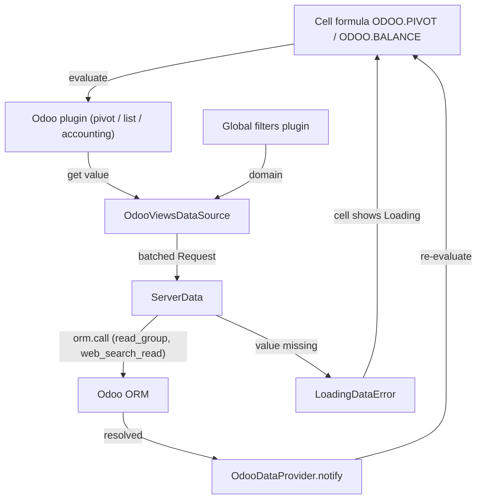

# Spreadsheet and dashboards

Active contributors: Pierre, Lucas, Adrien

## Purpose

The spreadsheet family embeds a full client-side spreadsheet in the web client and connects its formulas back to the ORM, so a cell can hold a live pivot value, a list column, or an accounting balance. On top of that engine, `addons/spreadsheet_dashboard` stores read-only dashboards as spreadsheet files, twelve per-app data modules ship the dashboards for each business app, and `addons/board` builds the per-user My Dashboard of embedded view tiles. Sixteen modules in total: `spreadsheet`, `spreadsheet_account`, `spreadsheet_dashboard`, the twelve `spreadsheet_dashboard_*` data packs, and `board`.

## Directory layout

```text
addons/spreadsheet/
├── models/spreadsheet_mixin.py        # spreadsheet.mixin abstract model
├── utils/                             # formatting, helpers, json, validate_data
├── controllers/main.py
└── static/src/
    ├── o_spreadsheet/o_spreadsheet.js # vendored engine bundle (90,650 lines)
    ├── o_spreadsheet/o_spreadsheet.xml
    ├── data_sources/                  # ORM bridge
    ├── pivot/ list/ chart/            # Odoo-backed formulas and plugins
    ├── global_filters/                # cross-sheet filter plugins + widgets
    └── actions/spreadsheet_component.js
addons/spreadsheet_dashboard/
├── models/                            # spreadsheet.dashboard, .group, .share, favorite filters
└── static/src/bundle/dashboard_action/
addons/spreadsheet_dashboard_<app>/data/dashboards.xml
addons/board/                          # My Dashboard: per-user tiles of embedded views
├── models/board.py                    # board.board, per-user arch via ir.ui.view.custom
├── controllers/main.py                # /board/add_to_dashboard
└── static/src/                        # board view, controller, tiles, AddToBoard cog item
addons/test_spreadsheet/                # dummy mixin implementation for tests
```

## The vendored engine

`addons/spreadsheet/static/src/o_spreadsheet/o_spreadsheet.js` is a build artifact of the separate o-spreadsheet project, checked in as a single 90,650-line file. It is the largest JavaScript file in the repository and is not code to edit: fixes belong upstream, and the bundle is replaced wholesale on each sync. Alongside it sit `o_spreadsheet.xml` (QWeb templates, loaded first so addons can inherit them), `o_spreadsheet.css`, `migration.js` (643 lines of data-format migrations), `translation.js`, and `odoo_module.js`, which registers the bundle under the module name `@odoo/o-spreadsheet` that the rest of the code imports.

`addons/spreadsheet/__manifest__.py` wires this into three custom bundles instead of the usual backend one: `spreadsheet.o_spreadsheet_core` (engine plus all of `spreadsheet/static/src/**`), `spreadsheet.o_spreadsheet` (backend), and `spreadsheet.public_spreadsheet` (frontend, for shared read-only links). Other modules extend the engine by inserting files `('after', '.../o_spreadsheet.js', ...)`.

## Key abstractions

| Name | File | Description |
| --- | --- | --- |
| `spreadsheet.mixin` | `addons/spreadsheet/models/spreadsheet_mixin.py` | Abstract model (`_auto = False`) giving any record a `spreadsheet_binary_data` blob, a computed `spreadsheet_data` text view, and a thumbnail; validates the JSON on write |
| `OdooDataProvider` | `addons/spreadsheet/static/src/data_sources/odoo_data_provider.js` | Holds the `orm` and `field` services, owns a `ServerData`, and notifies the spreadsheet when pending loads resolve |
| `ServerData` | `addons/spreadsheet/static/src/data_sources/server_data.js` | Batches `Request(resModel, method, args)` objects, deduplicates them, and raises `LoadingDataError` while a cell's data is still in flight |
| `OdooViewsDataSource` | `addons/spreadsheet/static/src/data_sources/odoo_views_data_source.js` | A data source backed by an Odoo view definition (model, domain, context) |
| Odoo function registry | `addons/spreadsheet/static/src/pivot/pivot_functions.js`, `.../list/list_functions.js` | Registers `ODOO.PIVOT`, `ODOO.LIST`, `ODOO.FILTER.VALUE` and their variants into the engine's `functionRegistry` |
| `spreadsheet.dashboard` | `addons/spreadsheet_dashboard/models/spreadsheet_dashboard.py` | A published dashboard: `dashboard_group_id` section, `group_ids` access groups, `company_ids`, favorites per user |
| `board.board` | `addons/board/models/board.py` | AbstractModel (`_auto = False`) standing in for a form model: `get_view` swaps in the user's `ir.ui.view.custom` arch and stamps `js_class="board"` on it |

## How it works

A formula never blocks. The engine evaluates a cell, the Odoo function asks its data source for a value, and if the value is not loaded yet the function throws `LoadingDataError`; the provider fires an RPC, and on resolution notifies the model, which re-evaluates.



Persistence goes the other way: the OWL component in `addons/spreadsheet/static/src/actions/spreadsheet_component.js` writes the workbook JSON back through `spreadsheet.mixin`, whose `_check_spreadsheet_data` constraint rejects anything that is not valid JSON, and `addons/spreadsheet/utils/validate_data.py` walks the saved document to collect the fields and menu XML ids it references.

Dashboards reuse all of that in read-only mode. `spreadsheet.dashboard` inherits the mixin and adds grouping (`spreadsheet.dashboard.group`), publication, per-company and per-group visibility, and favorites. Its client action renders figures with its own search bar and filter list, with `mobile_figure_container/` and `mobile_search_panel/` variants for small screens, and `addons/spreadsheet_dashboard/controllers/dashboards_controllers.py` serves the public share link through the `spreadsheet.public_spreadsheet` bundle.

`addons/board` is the personal dashboard on top of the same app: the My Dashboard menu mounted inside the Dashboards app (`addons/board/views/board_views.xml` puts it under `spreadsheet_dashboard`'s root menu). It holds no workbook; it is a form view whose arch is a `<board style="2-1">` grid of `<action>` tiles, one per embedded window action. `board.board` is a dummy form model: `get_view` substitutes the current user's `ir.ui.view.custom` record for the shared arch, and `_arch_preprocessing` stamps `js_class="board"` on it, so the web client instantiates the view that `addons/board/static/src/board_view.js` registers over the form type. `BoardArchParser` reads the layout and the tiles, and `BoardController` renders one `BoardAction` per tile, an embedded `View` for any window action, dragged between columns with `useSortable` and collapsed to a single column on small screens. Tiles are added from the cog menu of any `ir.actions.act_window` view that is not a form: `addons/board/static/src/add_to_board/add_to_board.js` registers `AddToBoard` in the `cogMenu` registry, and its button posts to `/board/add_to_dashboard` (`addons/board/controllers/main.py`), which appends the `<action>` node to the user's board arch. That favorite-menu flow and the per-user `ir.ui.view.custom` storage are what older releases called the board dashboard; in 20.0 the same mechanism renders through the standard view framework under the Dashboards app.

## Integration points

- `addons/spreadsheet` depends on `bus`, `web` and `portal`, and pulls `web/static/src/views/graph/graph_model.js` and `.../pivot/pivot_model.js` into its own bundle so spreadsheet pivots reuse the web client's pivot logic.
- `addons/spreadsheet_account` registers accounting formulas (`accounting_functions.js`, `plugins/accounting_plugin.js`) and a fiscal-year global filter; it is `auto_install` with `account`, see [accounting](accounting.md).
- The twelve `spreadsheet_dashboard_*` modules are pure data: each is `auto_install` with its app and ships only `data/dashboards.xml`, no Python. They cover account, event_sale, hr_expense, hr_timesheet, im_livechat, pos_hr, pos_restaurant, sale, sale_timesheet, stock_account, website_sale and website_sale_slides.
- `addons/board` depends only on `spreadsheet_dashboard`: its My Dashboard menu sits inside the Dashboards app, and its cog-menu entry appends any `ir.actions.act_window` view to a user's board. On small screens the controller collapses the grid to one column.
- `addons/test_spreadsheet` provides a dummy implementation of the mixin, so mixin behavior is tested once instead of once per app that implements it.

## Entry points for modification

Adding an Odoo-aware formula means registering it in the engine's `functionRegistry` from a file under `addons/spreadsheet/static/src/`, and backing it with a data source in `data_sources/`; `addons/spreadsheet_account/static/src/accounting_functions.js` is the smallest complete example to copy. Adding a dashboard for an app needs no code at all: create a module depending on `spreadsheet_dashboard` and the app, `auto_install` with the app, and ship one `data/dashboards.xml`, following the pattern in [module system](../systems/module-system.md). Never patch `o_spreadsheet.js`.

## Key source files

| File | Purpose |
| --- | --- |
| `addons/spreadsheet/__manifest__.py` | The three custom asset bundles and their include/remove rules |
| `addons/spreadsheet/static/src/o_spreadsheet/o_spreadsheet.js` | Vendored engine bundle, 90,650 lines |
| `addons/spreadsheet/static/src/o_spreadsheet/migration.js` | Workbook data-format migrations |
| `addons/spreadsheet/models/spreadsheet_mixin.py` | `spreadsheet.mixin`: storage, JSON validation, export |
| `addons/spreadsheet/utils/validate_data.py` | Extracts referenced fields and menu XML ids from a document |
| `addons/spreadsheet/static/src/data_sources/odoo_data_provider.js` | ORM/field service entry point for all data sources |
| `addons/spreadsheet/static/src/data_sources/server_data.js` | Request batching and `LoadingDataError` signalling |
| `addons/spreadsheet/static/src/pivot/odoo_pivot.js` | Pivot data source bound to an Odoo model |
| `addons/spreadsheet/static/src/pivot/pivot_functions.js` | `ODOO.PIVOT`, `ODOO.PIVOT.HEADER`, `ODOO.FILTER.VALUE` and friends |
| `addons/spreadsheet/static/src/list/list_functions.js` | `ODOO.LIST`, `ODOO.LIST.HEADER`, `ODOO.LIST.VALUE` |
| `addons/spreadsheet/static/src/actions/spreadsheet_component.js` | The OWL component hosting the engine |
| `addons/spreadsheet_account/static/src/plugins/accounting_plugin.js` | Accounting balance lookups |
| `addons/spreadsheet_dashboard/models/spreadsheet_dashboard.py` | `spreadsheet.dashboard` model |
| `addons/spreadsheet_dashboard/static/src/bundle/dashboard_action/dashboard_action.js` | Dashboard client action |
| `addons/spreadsheet_dashboard/controllers/dashboards_controllers.py` | Public dashboard route |
| `addons/board/models/board.py` | `board.board`: per-user board arch, `js_class` stamping |
| `addons/board/static/src/board_view.js` | The `board` view over the form type and its arch parser |
| `addons/board/static/src/board_controller.js` | Tile layout, drag and drop, small-screen collapse |
| `addons/board/controllers/main.py` | `/board/add_to_dashboard` route |
| `addons/test_spreadsheet/models/spreadsheet_mixin_test.py` | Dummy mixin implementation for tests |

## Related pages

- [Accounting](accounting.md): the `account` models behind `spreadsheet_account`.
- [Module system](../systems/module-system.md): manifests, `auto_install`, asset bundle declarations.
- [Patterns and conventions](../how-to-contribute/patterns-and-conventions.md): mixin and extension style.
- [Web client](web/index.md): the views registry and `js_class` dispatch the board view rides on.
- [CRM](crm/index.md): the fork's active app, which does not use spreadsheets.
