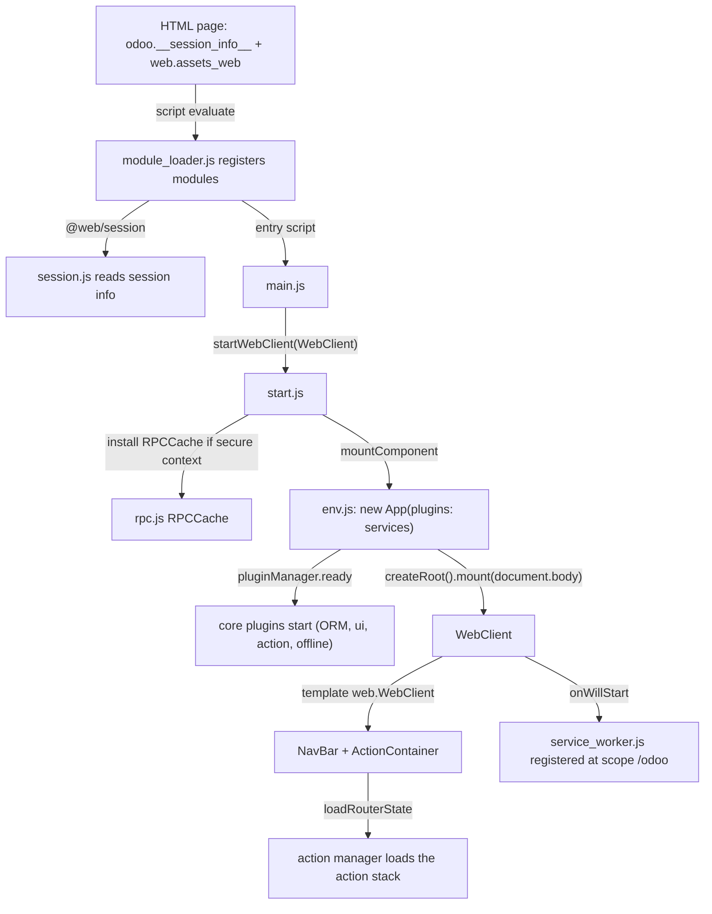

# Web

Active contributors: Aaron, Xavier, Christophe

## Purpose

`addons/web` is the web client: the OWL single-page application that runs every Odoo action in the browser, plus the framework it is built on. It provides the boot chain, the runtime module loader, the registry and plugin system, the RPC and ORM layers, the action manager, the webclient shell (navbar, user menu, breadcrumbs, systray), the view framework, and the fork's offline/PWA stack. Business addons such as `addons/crm` extend it and never replace it.

## Directory layout

```text
addons/web/static/src/
├── main.js                      boot entry; swappable by enterprise
├── start.js                     startWebClient: odoo.info, RPC cache, mount
├── env.js                       makeEnv, mountComponent, custom directives
├── session.js                   captures odoo.__session_info__
├── module_loader.js             runtime module system (no bundler)
├── service_worker.js            PWA service worker source (scope /odoo)
├── owl2/                        Owl 2 -> Owl 3 compatibility layer and utils
├── @types/                      registry and module type declarations
├── polyfills/  libs/  scss/     browser polyfills, vendored libs, global styles
├── core/
│   ├── services.js              the OWL `services` Resource plugins register into
│   ├── registry.js              global registries ("views", "systray", "fields", ...)
│   ├── orm_plugin.js            ORM plugin over /web/dataset/call_kw
│   ├── user.js  context.js  domain.js  field_service.js  name_service.js
│   ├── assets.js                loadBundle for lazy asset bundles
│   ├── debug_mode_plugin.js  main_components_container.js  templates.js
│   ├── legacy_service_starter.js  starts registry.category("services") factories
│   ├── crypto.js                AES-GCM helper shared with the offline store
│   ├── network/                 rpc.js, rpc_cache.js, http_service.js, download.js
│   ├── offline/                 offline_plugin.js, offline_error.js
│   ├── pwa/                     pwa_service.js, install_prompt.js
│   ├── ui/                      ui_plugin.js, ui_utils.js, block_ui.js
│   ├── errors/  dialog/  popover/  overlay/  bottom_sheet/  notifications/
│   └── hotkeys/  commands/  datetime/  browser/  l10n/  utils/
├── model/                       model.js, record.js, sample_server.js, relational_model/
├── search/                      search_model.js, layout.js, control_panel/, search_bar/
├── views/                       view.js, form/ list/ kanban/ calendar/ graph/ pivot/ fields/
├── webclient/
│   ├── webclient.js / .xml / .scss
│   ├── navbar/                  navbar.js: apps menu, app sections, systray host
│   ├── actions/                 action_plugin.js (action manager), client_actions.js
│   ├── user_menu/               user menu component and user_menuitems registry
│   ├── offline_systray/         queued-writes systray item
│   ├── menus/  burger_menu/  switch_company_menu/  settings_form_view/
│   └── share_target/  debug/  loading_indicator/
└── public/                      frontend-only code (login, website interactions, db manager)
```

Breadcrumbs sit in `addons/web/static/src/search/breadcrumbs/`, next to the search and control-panel code that renders them, not under `webclient/`.

## Key abstractions

| Name | File | Description |
| --- | --- | --- |
| Owl | `addons/web/static/lib/owl/owl.js` | Vendored Owl 3.0.0-alpha.49, exposed as the `@odoo/owl` module |
| Owl 2 compatibility layer | `addons/web/static/src/owl2/owl3_compatibility_layer.js` | Patches Owl 3 so Owl 2-era code (static `props`, `useEnv`, portals) keeps running |
| Owl 2 utils | `addons/web/static/src/owl2/utils.js` | Re-exports the compat hooks (`render`, `useLayoutEffect`, `useEnv`, `useSubEnv`) |
| Module loader | `addons/web/static/src/module_loader.js` | Executes `odoo.define` factories and resolves `@web/...` import paths at runtime |
| Registry | `addons/web/static/src/core/registry.js` | String-keyed registries with categories, sequences, and UPDATE events |
| Services resource | `addons/web/static/src/core/services.js` | The OWL `Resource` named `services`; OWL plugins register here |
| Legacy service starter | `addons/web/static/src/core/legacy_service_starter.js` | Starts `registry.category("services")` factories after the plugins |
| ORM plugin | `addons/web/static/src/core/orm_plugin.js` | `ORM` plugin: `webSearchRead`, `webReadGroup`, `webSave`, `webUnlink`, `webResequence`, `cache()` |
| RPC | `addons/web/static/src/core/network/rpc.js` | JSON-RPC 2.0 layer; `ConnectionLostError`, `RPCError`, `rpcBus` |
| Boot entry | `addons/web/static/src/main.js` | Calls `startWebClient(WebClient)`; exists so enterprise can swap the class |
| Webclient starter | `addons/web/static/src/start.js` | Sets `odoo.info`, installs the RPC cache, mounts the app |
| App environment | `addons/web/static/src/env.js` | `makeEnv`, `mountComponent`, the `t-custom-click` directive |
| Session | `addons/web/static/src/session.js` | `session` object built from `odoo.__session_info__` |
| WebClient | `addons/web/static/src/webclient/webclient.js` | Root component: navbar, action container, router state, service-worker registration |
| Action manager | `addons/web/static/src/webclient/actions/action_plugin.js` | `ActionPlugin` and `useActionManager`: action loading, controller stack, dialogs |
| NavBar | `addons/web/static/src/webclient/navbar/navbar.js` | Apps menu, app brand, app sections, systray items |
| User menu | `addons/web/static/src/webclient/user_menu/user_menu.js` | `web.user_menu` systray item built from the `user_menuitems` registry |
| Breadcrumbs | `addons/web/static/src/search/breadcrumbs/breadcrumbs.js` | Renders the action stack; portalled into the navbar on small screens |
| Systray | `addons/web/static/src/webclient/navbar/navbar.js` | Renders every entry of `registry.category("systray")` |
| OfflinePlugin | `addons/web/static/src/core/offline/offline_plugin.js` | Offline state, sync queue, visited UI, many2x cache |
| PWA service | `addons/web/static/src/core/pwa/pwa_service.js` | Install-prompt capture and install state |
| UIPlugin | `addons/web/static/src/core/ui/ui_plugin.js` | `isSmall` and `size` signals gating every mobile behavior |

## How it works

### Boot chain



`addons/web/static/src/main.js` holds one call, `startWebClient(WebClient)`, so enterprise can substitute a `WebClient` subclass. `addons/web/static/src/start.js` fills `odoo.info` from the session, installs the encrypted `RPCCache` when `window.isSecureContext` and `session.browser_cache_secret` are both set, waits for the document, and mounts the app. `addons/web/static/src/env.js` builds the Owl `App` with `plugins: services`, `getTemplate`, the translation function, and the `t-custom-click` directive; its `makeEnv()` proxy throws when code reads a key that moved (`env.debug`, `env.isSmall`) and names the replacement. `addons/web/static/src/session.js` captures `odoo.__session_info__`, which the server serializes into the page, and deletes the global.

### The webclient shell

`WebClient` renders `web.WebClient`: `NavBar` (hidden in fullscreen), `ActionContainer`, and `MainComponentsContainer`. The navbar (`addons/web/static/src/webclient/navbar/navbar.js`) holds the apps menu, the app brand, a `.o_navbar_breadcrumbs` placeholder, the current app's section menus, and the systray: it maps every entry of `registry.category("systray")` to a component, ordered by sequence and reversed. The user menu registers itself as `web.user_menu` at sequence 0 and builds its items from `registry.category("user_menuitems")`; the offline systray (`addons/web/static/src/webclient/offline_systray/offline_systray.js`) registers at sequence 1000. Breadcrumbs are rendered by the control panel and portalled into `.o_navbar_breadcrumbs` through `t-custom-portal` when the screen is small, so the same component serves both layouts.

`ActionContainer` renders whatever controller the action manager last published on the `ACTION_MANAGER:UPDATE` bus event. The manager itself is `useActionManager()` in `addons/web/static/src/webclient/actions/action_plugin.js`, exposed as the `ActionPlugin`: it resolves an action request (a string key of `registry.category("actions")`, an id or xmlid fetched through `/web/action/load`, or a plain object), pushes the controller on a stack, computes breadcrumbs and the view switcher, handles `target: "new"` as dialogs, and serializes the stack into the URL through the router (`loadState`/`pushState`). Client actions register in `registry.category("actions")` (`addons/web/static/src/webclient/actions/client_actions.js` ships `display_notification`, `reload`, `home`, `soft_reload`, ...); report actions dispatch to `registry.category("ir.actions.report handlers")`.

### Plugins and the services resource

Global state lives in Owl `Plugin` classes registered with `services.add(MyPlugin)` into the `services` Resource (`addons/web/static/src/core/services.js`, validated as `t.constructor(Plugin)`), and read with `usePlugin(MyPlugin)`. Registered plugins include `ORM`, `UIPlugin`, `ActionPlugin`, `DialogPlugin`, `PopoverPlugin`, `OverlayPlugin`, `NotificationPlugin`, `HotkeyPlugin`, `EffectPlugin`, `TitlePlugin`, `GlobalBusPlugin` (the shared bus, exposed on `env.bus` by `EnvBusBridgePlugin`), `DebugModePlugin`, `BottomSheetPlugin`, and the fork's `OfflinePlugin`. State is stored in Owl signals and read by calling them, for example `ui.isSmall()`.

An older service system still runs beside it: plain objects with a `start(env, deps)` factory in `registry.category("services")` (menu, action, view, orm, ui, dialog, notification, and more). `LegacyServiceStarterPlugin` (`addons/web/static/src/core/legacy_service_starter.js`) starts them in dependency order after every plugin is up, and components consume them with `useService`. Most are thin wrappers over a plugin and carry a temporary `@todo owl3 migration` marker. New code uses the plugin API.

### Assets and serving

`addons/web/__manifest__.py` defines the bundles. `web._assets_core` ships the module loader, the vendored libs (Owl, luxon), the `owl2/` compatibility layer, `env.js`, `session.js`, and all of `core/`. `web.assets_backend` includes `web._assets_core` and adds `model/**`, `search/**`, `views/**` (minus graph and pivot), and `webclient/**`, with the dark stylesheet removed for the light bundle. `web.assets_web` adds `main.js` and `start.js`, and is the bundle the backend layout renders. `web.assets_backend_lazy` holds `views/graph/**` and `views/pivot/**`, fetched on demand by `loadBundle` in `addons/web/static/src/core/assets.js` when the views registry does not yet contain the requested `js_class`. Generated bundles are `ir.attachment` records served from checksum-derived URLs; the compiler lives in `odoo/addons/base/models/ir_asset.py` and `assetsbundle.py`. See [Assets](../../systems/assets.md) for the compilation pipeline and `registry_hash` in the session, which the offline store uses to version itself.

### Session info

`addons/web/controllers/webclient.py` serves `/web/webclient/version_info` (the offline ping), `/web/webclient/bootstrap_translations`, and `/web/bundle/<name>`; the backend layout template in `addons/web/views/webclient_templates.xml` prints `odoo.__session_info__` into the page, and `addons/web/static/src/session.js` picks it up. The session carries `db`, `server_version`, `view_info` (used to validate view types), `registry_hash`, `browser_cache_secret`, `support_url`, and the user context.

### Role as framework host

The fork's offline/PWA framework lives entirely inside this addon and is consumed by `addons/crm`:

- `OfflinePlugin`, the sync queue, the encrypted store, the service worker, and the offline systray are described in [Offline and PWA](../../features/offline-and-pwa/index.md); the queue's replay rules are in [Sync queue](../../features/offline-and-pwa/sync-queue.md), the encrypted store in [Local store](../../features/offline-and-pwa/local-store.md), the install path in [Service worker and install](../../features/offline-and-pwa/service-worker-and-install.md).
- `UIPlugin`'s `isSmall` signal, the bottom-sheet plugin, and the mobile consumers are described in [Mobile web](../../features/mobile-web.md). This page does not repeat them.
- `WebClient` is the piece that registers the service worker (`addons/web/static/src/webclient/webclient.js`, `onWillStart`), and `addons/web/controllers/webmanifest.py` serves the manifest, the worker script, the offline page, and the scoped-app routes.

## Integration points

- The server half of every client call is the Python ORM: the `ORM` plugin posts to `/web/dataset/call_kw/<model>/<method>`, so `odoo/orm/` and `addons/web/static/src/core/orm_plugin.js` are two ends of one contract.
- Business addons register into the client through registries and the views registry: `js_class` view objects, `fields`, `systray`, `user_menuitems`, `main_components`, `command_provider`, `error_handlers`. `addons/crm` uses `registry.category("views")` (`crm_kanban`, `crm_form`, ...) and `patch()`; details in [CRM views](../crm/crm-views.md).
- The action manager is the single entry for every `ir.actions.*`; a client action is a function in `registry.category("actions")`.
- The legacy `services` registry and the OWL `services` Resource coexist; a new capability that must stay reachable through `useService` needs both.
- Session values come from `addons/web/models/ir_http.py` and `addons/web/models/ir_ui_view.py` (`get_view_info`) through the layout template and `webclient.py`.

## Entry points for modification

Project rules confine this fork's changes to `addons/crm/`, so in practice you extend the web client from CRM rather than editing `addons/web/`: subclass a view object, `patch()` a component or plugin, or inherit a template. When a change genuinely belongs here, a new global behavior is a `Plugin` class registered with `services.add(...)`; add a bridge in `registry.category("services")` only if components must reach it with `useService`. Any JS, CSS, SCSS, or XML edit is invisible until `./scripts/dev/rebuild-assets.sh` regenerates the bundles; see [Assets](../../systems/assets.md) and [Patterns and conventions](../../how-to-contribute/patterns-and-conventions.md).

## Key source files

| File | Purpose |
| --- | --- |
| `addons/web/static/src/main.js` | Boot entry: `startWebClient(WebClient)` |
| `addons/web/static/src/start.js` | `odoo.info`, RPC cache installation, `mountComponent` |
| `addons/web/static/src/env.js` | `makeEnv`, `mountComponent`, custom directives, removed env keys |
| `addons/web/static/src/session.js` | Captures `odoo.__session_info__` as `session` |
| `addons/web/static/src/module_loader.js` | `odoo.define` module system resolving `@web/...` at runtime |
| `addons/web/static/src/owl2/owl3_compatibility_layer.js` | Owl 2 to Owl 3 shims |
| `addons/web/static/src/core/services.js` | The `services` Resource for OWL plugins |
| `addons/web/static/src/core/registry.js` | Registries, categories, sequences, UPDATE events |
| `addons/web/static/src/core/legacy_service_starter.js` | Starts the legacy `services` factories |
| `addons/web/static/src/core/orm_plugin.js` | `ORM` plugin and the legacy `orm` service |
| `addons/web/static/src/core/network/rpc.js` | RPC layer, `ConnectionLostError`, `rpcBus` |
| `addons/web/static/src/core/network/rpc_cache.js` | RAM plus encrypted IndexedDB RPC cache |
| `addons/web/static/src/core/assets.js` | `loadBundle` for lazy bundles |
| `addons/web/static/src/core/main_components_container.js` | Renders the `main_components` registry |
| `addons/web/static/src/core/global_bus_plugin.js` | The shared `env.bus` |
| `addons/web/static/src/webclient/webclient.js` | Root component, router state, service-worker registration |
| `addons/web/static/src/webclient/webclient.xml` | `web.WebClient` template: navbar, action container, main components |
| `addons/web/static/src/webclient/navbar/navbar.js` | Apps menu, app sections, systray host |
| `addons/web/static/src/webclient/navbar/navbar.xml` | `web.NavBar` template |
| `addons/web/static/src/webclient/actions/action_plugin.js` | Action manager and `ActionPlugin` |
| `addons/web/static/src/webclient/actions/client_actions.js` | Built-in client actions |
| `addons/web/static/src/webclient/actions/action_container.js` | `ActionContainer` component |
| `addons/web/static/src/webclient/user_menu/user_menu.js` | User menu and the `web.user_menu` systray entry |
| `addons/web/static/src/webclient/user_menu/user_menu_items.js` | `user_menuitems` registry entries |
| `addons/web/static/src/search/breadcrumbs/breadcrumbs.js` | Breadcrumbs component |
| `addons/web/static/src/webclient/offline_systray/offline_systray.js` | Queued-writes systray item |
| `addons/web/static/src/webclient/menus/menu_service.js` | Menu service backing the navbar |
| `addons/web/static/src/service_worker.js` | Shared service worker source |
| `addons/web/__manifest__.py` | All bundle definitions |
| `addons/web/views/webclient_templates.xml` | Backend layout: bundles plus `odoo.__session_info__` |
| `addons/web/controllers/webclient.py` | `version_info`, translations, bundle routes |
| `addons/web/controllers/webmanifest.py` | Manifest, worker, offline page, scoped apps |

## Related pages

- [Views framework](views-framework.md): the view registry, arch parsing, `js_class`
- [Relational model](relational-model.md): the data layer under every standard view
- [Offline and PWA](../../features/offline-and-pwa/index.md), [Sync queue](../../features/offline-and-pwa/sync-queue.md), [Local store](../../features/offline-and-pwa/local-store.md), [Offline UI](../../features/offline-and-pwa/offline-ui.md), [Service worker and install](../../features/offline-and-pwa/service-worker-and-install.md)
- [Mobile web](../../features/mobile-web.md): the small-screen signal and bottom sheets
- [Assets](../../systems/assets.md): how bundles are built and served
- [Actions, views and menus](../../primitives/actions-views-menus.md)
- [CRM views](../crm/crm-views.md) and [Offline CRM](../crm/offline-crm.md): the addon that extends this client
- [Mail](../mail.md): the chatter that mounts inside these views
- [Architecture](../../overview/architecture.md): the big picture
