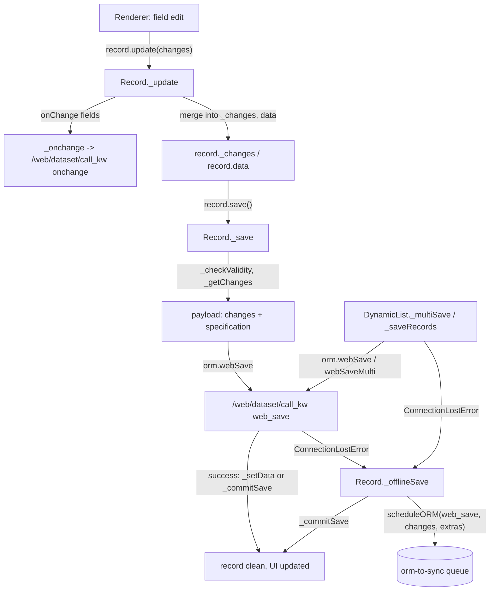

# Relational model

Active contributors: Aaron, Xavier, Christophe

## Purpose

The relational model is the JavaScript data layer under the standard views. It loads records from the server, holds the edited state in the browser, runs onchanges, validates, and saves. Form, list and kanban views all use it as their `Model` slot. It is also where this fork's offline write queue gets fed: every producer that queues an ORM call when the connection is lost lives in this directory. The queue engine itself is covered in [Sync queue](../../features/offline-and-pwa/sync-queue.md).

## Directory layout

```text
addons/web/static/src/model/
├── model.js                      Model base class, useModel, useModelWithSampleData
├── record.js                     standalone Record component (cards, share target, one-off reads)
├── sample_server.js              fake ORM serving sample data for empty views
└── relational_model/
    ├── relational_model.js       RelationalModel: config, root datapoint, loads, hooks
    ├── record.js                 Record datapoint (form record, save flow, offline save)
    ├── dynamic_list.js           DynamicList base: selection, edit mode, multi-save, resequence
    ├── dynamic_record_list.js    DynamicRecordList: ungrouped list/kanban root
    ├── dynamic_group_list.js     DynamicGroupList: grouped root, group create/move/delete
    ├── static_list.js            StaticList: the in-record value of an x2many field
    ├── group.js                  Group datapoint: aggregates, fold state, nested list
    ├── datapoint.js              DataPoint base class
    ├── operation.js              DateTimeOperation / ArithmeticOperation for "+1d" style edits
    ├── errors.js                 FetchRecordError
    └── utils.js                  field specs, value conversion, resequence, getScheduleORMExtras
```

## Key abstractions

| Name | File | Description |
| --- | --- | --- |
| Model | `addons/web/static/src/model/model.js` | Base class; `useModel` instantiates it and re-renders the component on every `update` bus event |
| useModelWithSampleData | `addons/web/static/src/model/model.js` | Same, but swaps in `buildSampleORM` when the first load returns nothing and the arch allows `sample="1"` |
| RelationalModel | `addons/web/static/src/model/relational_model/relational_model.js` | Orchestrator: config, root datapoint, cache params, load methods, hooks |
| DataPoint | `addons/web/static/src/model/relational_model/datapoint.js` | Common base holding `config`, `fields`, `activeFields`, `evalContext` |
| Record | `addons/web/static/src/model/relational_model/record.js` | One record: `_values`, `_changes`, `data`, save and offline save, archive, delete |
| DynamicList | `addons/web/static/src/model/relational_model/dynamic_list.js` | Abstract list: selection, edit mode, multi-save, delete, archive, drag resequence |
| DynamicRecordList | `addons/web/static/src/model/relational_model/dynamic_record_list.js` | Ungrouped list/kanban root; quick create, paging |
| DynamicGroupList | `addons/web/static/src/model/relational_model/dynamic_group_list.js` | Grouped root; holds `Group` datapoints and creates, moves and deletes them |
| StaticList | `addons/web/static/src/model/relational_model/static_list.js` | The value of an x2many field: loaded records plus pending commands |
| Group | `addons/web/static/src/model/relational_model/group.js` | A grouped row: aggregates, fold state, its own nested list config |
| Operation | `addons/web/static/src/model/relational_model/operation.js` | `DateTimeOperation` (`+1d`) and `ArithmeticOperation` (`+10`), resolved before saving |
| activeFields | `addons/web/static/src/model/relational_model/utils.js` | Per-view field metadata that drives the fetch specification |
| Hooks | `addons/web/static/src/model/relational_model/relational_model.js` | `onWillLoadRoot`, `onRootLoaded`, `onWillSaveRecord`, `onRecordSaved`, `onSavedMulti`, ... |
| getScheduleORMExtras | `addons/web/static/src/model/relational_model/utils.js` | Builds the `extras` the offline systray displays for a queued call |

## How it works

### Model, config and the root datapoint

A controller creates its model with `useModel` or `useModelWithSampleData` (`addons/web/static/src/model/model.js`). `RelationalModel` (`addons/web/static/src/model/relational_model/relational_model.js`) holds a `config` — `resModel`, `fields`, `activeFields`, `fieldsToAggregate`, `domain`, `groupBy`, `orderBy`, `context`, `limit`, `offset`, `resId` — and one `root` datapoint built by `_createRoot`:

- `config.isMonoRecord` (a form) makes the root a `Record`,
- a non-empty `config.groupBy` makes it a `DynamicGroupList`,
- anything else makes it a `DynamicRecordList`.

Defaults are 80 records per page, a 10,000 count limit, and 80 groups. A first load creates an empty root immediately so the control panel can render before data arrives; `keepLast` guards concurrent reloads and a `Mutex` serializes every mutating operation, so a save never races a reload. `hooks` are the customization points a subclass or a view passes in.

### Loading data and the disk cache

`getFieldsSpec` (`addons/web/static/src/model/relational_model/utils.js`) derives the fetch specification from `activeFields`, so a view only reads the fields it shows. `_loadData` dispatches to `_loadNewRecord` (onchange RPC), `_loadRecords` (`web_read` by ids), `_loadUngroupedList` (`web_search_read`) or `_loadGroupedList` (→ `_webReadGroup`). All of them go through `orm.cache(...)` with the params built by `_getCacheParams`: `{ type: "disk", update: "always", noCache, callback }`. The `disk` cache is `RPCCache` (`addons/web/static/src/core/network/rpc_cache.js`), the encrypted IndexedDB layer; while offline the cached response still resolves, and when a live response later arrives the `callback` pushes the fresh values into the root and marks it updated. While online, `noCache` makes every load after the first skip the cache, except a form switching to another record or creating one.

Each successful load also does two pieces of offline bookkeeping. `_setAvailableOffline` records the action and view (with the record id for a form, or `searchModel.getCurrentSearch()` for a list) through `OfflinePlugin.setAvailableOffline`, which is what `isAvailableOffline` answers from while rendering. `_cacheMany2X` feeds relational display names to `OfflinePlugin.cacheMany2XSearch` so many2x autocompletes can fall back to the local store. If a load fails with `ConnectionLostError`, `couldNotLoadRootOffline` is set so controllers can react.

### _webReadGroup and grouped loading

`_webReadGroup` (`addons/web/static/src/model/relational_model/relational_model.js`) assembles the `web_read_group` kwargs: read specification for the records inside a group, per-group-by-field specifications, aggregate specifications from `fieldsToAggregate`, the opening info for already-known groups, and `{ bin_size: true, read_group_expand: true }` in the context. The response is post-processed by `_postprocessReadGroup`, which creates or reuses one `Group` datapoint per group value, gives each a nested list config (same `resModel`, `domain` narrowed by the group value, `groupBy` minus the first level), and recurses when more than one group-by level is active. Group configs are stored in `config.groups` keyed by group value, so folding or reopening a group keeps its scroll position and loaded records.

### Editing, changes and validation

`record.update(changes)` is the single entry for a field edit. `_update` preprocesses the changes (many2one, reference, x2many, properties, html), then, unless the record is being saved urgently, calls the server's `onchange` for the fields whose `activeFields` entry has `onChange`. The result is folded into the pending edits: `record._changes` holds what the user changed, `record._values` holds what the server last returned, `record.data` is their merge and is the object components read, and `record.dirty` says whether `_changes` is non-empty. A change value may be an `Operation` (`+1d` on a datetime, `+10` on a number), resolved into a concrete value before the save.

`record._checkValidity` walks the active fields, collecting required fields that are unset, including a required x2many whose nested records are invalid; a record refuses to save while the set is non-empty, and the field components render the invalid state. `_getChanges` builds the payload: read-only fields are dropped unless the active field is marked `forceSave`, `id` is dropped, x2many values become `x2manyCommands` lists, and everything else is formatted to the server representation.

### Saving a record and the offline fallback



`Record._save` (`addons/web/static/src/model/relational_model/record.js`) is the whole flow: abandon untouched new records inside x2manys, `_checkValidity({ displayNotification: true })`, build `_getChanges`, and call `orm.webSave(resModel, resId ? [resId] : [], changes, { context, specification, next_id })`. On success it either reloads with `_setData` or, when the caller asked not to reload, commits locally with `_commitSave`, which folds `_changes` into `_values` and marks the record clean.

On `ConnectionLostError` it falls through to `_offlineSave`: the pending changes are merged into `_offlineChanges`, a timestamp is taken, and the call goes to `OfflinePlugin.scheduleORM(resModel, "web_save", [resIds, changes], { context, specification: {} }, { id, extras })`. The `id` is `this._offlineId`, so repeated saves of the same record overwrite one queue entry rather than piling up; the `extras` come from `getScheduleORMExtras` plus `changes` and `originalValues` so the systray can show what changed. `_commitSave` then runs, so the UI behaves as if the write succeeded. New records queue their create the same way; the server sees one `web_save` either way. What happens to those entries on reconnection is in [Sync queue](../../features/offline-and-pwa/sync-queue.md).

`urgentSave` is the separate page-close path: it posts to `/web/dataset/call_kw/<model>/web_save` with `navigator.sendBeacon` when `useSendBeaconToSaveUrgently` is set, and while offline it explains that changes cannot be saved automatically instead.

### The other offline queue producers

- `Record.delete` catches `ConnectionLostError` on `orm.webUnlink` and queues `"web_unlink"` with `getScheduleORMExtras`.
- `Record._toggleArchive` queues `"action_archive"` or `"action_unarchive"` the same way.
- `DynamicList._deleteRecords` and `DynamicList._toggleArchive` (`addons/web/static/src/model/relational_model/dynamic_list.js`) do this for list and kanban roots, including the whole selection and domain-wide selection; they queue the batch as one call.
- `DynamicList._saveRecords` — the programmatic multi-record write used by group moves — falls back to calling `_offlineSave` on each record when `web_save` or `web_save_multi` loses the connection.
- `Record.setOfflineChanges` re-applies a queued entry's `extras.changes` when a parked save is reopened from the systray.

One read path uses the local store too: when a paginated x2many needs records it has not fetched and the connection is lost, `StaticList` reads them through `OfflinePlugin.readMany2XRecords` (`addons/web/static/src/model/relational_model/static_list.js`).

### Lists, x2many values and multi-save

`DynamicList` is the abstract base for the two root list types. It owns selection and domain selection, `enterEditMode`/`leaveEditMode` (leaving edit mode saves the edited record), `sortBy`, drag-and-drop resequence, delete and archive. `DynamicRecordList` implements the ungrouped case (quick create, paging, `addExistingRecord`); `DynamicGroupList` implements the grouped case on top of `Group` datapoints.

Multi-edit (the "select several rows, edit one field" flow) runs through `_multiSave`: it applies the changes to every selected record, splits them into valid and invalid ones, discards the invalid ones, asks the view for confirmation through `hooks.onAskMultiSaveConfirmation`, and then issues either one `web_save` over all the ids (when the values are identical) or a `web_save_multi` with one value list per record (when a change was an `Operation`, so each record resolves differently). This path has no offline producer of its own: a lost connection during `_multiSave` throws and the records are discarded, so multi-edit is an online-only affordance.

`StaticList` is different from both: it is not a root but the value of a x2many field on a `Record`. It tracks server ids plus unapplied `x2ManyCommands`, a cache of already-loaded records, and commands referring to records it has never fetched (kept so onchange results can be replayed at save time).

### Group creation, moves and resequence cannot be queued offline

Group mutations deliberately have no offline fallback, and the reason is structural rather than an omission:

- `DynamicGroupList._createGroup` first calls `name_create` on the group-by field's related model and needs the returned id to build the new group's `default_<field>` context, its domain and its config. The queue replays `model`, `method`, `args` and `kwargs` verbatim with no id remapping between entries, so no producer can be written for a call whose argument is produced by an earlier call.
- The same method then resequences the new group after the last one, through `DynamicList._resequence` → `resequence()` in `addons/web/static/src/model/relational_model/utils.js`, which writes new `sequence` values computed from the list as loaded. That write is `orm.webResequence` (`web_resequence`), and nothing catches `ConnectionLostError` around it: offline, the call rejects with the connection error and the caller sees it.
- Dragging a record to another group (`_moveRecords`) writes the group-by value through `_saveRecords`, which does have an offline fallback, but it pairs that write with the same `web_resequence` call for the target group, so the drop cannot complete offline either.
- Group deletion goes through `_unlinkGroups` → `orm.unlink`, also without a producer.

The practical rule that follows: form saves, deletes, archive and unarchive, and single list edits queue while offline; structural changes to a grouped view do not, and a UI that offers them should be disabled offline rather than left half-applied. The queue's replay rules are in [Sync queue](../../features/offline-and-pwa/sync-queue.md).

## Integration points

- Views select it as the `Model` slot: form, list and kanban in `addons/web/static/src/views/`; graph and pivot use `GraphModel`/`PivotModel` instead. See [Views framework](views-framework.md).
- Active fields come from the arch parsers: `extractFieldsFromArchInfo` (`addons/web/static/src/model/relational_model/utils.js`) turns the parsed field nodes into `activeFields`, which decides what a load fetches.
- All server I/O goes through the ORM plugin (`addons/web/static/src/core/orm_plugin.js`, `web_save`, `web_save_multi`, `web_unlink`, `web_read_group`, `web_resequence`, ...) and the RPC disk cache; the cache and the offline store share the same encrypted storage, described in [Local store](../../features/offline-and-pwa/local-store.md).
- `getScheduleORMExtras` feeds the offline systray, and `OfflinePlugin` owns the queue; see [Offline and PWA](../../features/offline-and-pwa/index.md).
- CRM subclasses it: `CrmFormModel` (`addons/crm/static/src/views/crm_form/crm_form.js`) and `CrmKanbanModel` (`addons/crm/static/src/views/crm_kanban/crm_kanban_model.js`) replace `Model` slots on top of `RelationalModel`; see [CRM views](../crm/crm-views.md).

## Entry points for modification

To change data behavior for one view, subclass `RelationalModel` (or `Record`, `DynamicList`) and set it as the view object's `Model` slot. When the behavior is event-shaped, use the `hooks` params (`onWillSaveRecord`, `onRecordSaved`, `onWillSaveMulti`, `onSavedMulti`, `onWillLoadRoot`, ...) instead of patching internals. To add a new offline write, catch `ConnectionLostError` at the ORM call site and call `scheduleORM` with `extras` from `getScheduleORMExtras` — and only for a payload the queue can replay verbatim, with no server-generated id inside it. Never add a second sync queue or conflict handling; both are project rules, and the rationale is on [Why last-write-wins](../../background/design-decisions.md).

## Key source files

| File | Purpose |
| --- | --- |
| `addons/web/static/src/model/model.js` | `Model` base, `useModel`, `useModelWithSampleData` |
| `addons/web/static/src/model/relational_model/relational_model.js` | Config, root, load methods, `_webReadGroup`, cache params, offline marking |
| `addons/web/static/src/model/relational_model/record.js` | Record datapoint, `_update`, `_save`, `_offlineSave`, archive, delete |
| `addons/web/static/src/model/relational_model/dynamic_list.js` | List base: selection, edit mode, `_multiSave`, `_saveRecords`, resequence, offline producers |
| `addons/web/static/src/model/relational_model/dynamic_record_list.js` | Ungrouped list/kanban root |
| `addons/web/static/src/model/relational_model/dynamic_group_list.js` | Grouped root: group create, move, delete, fold |
| `addons/web/static/src/model/relational_model/static_list.js` | x2many value: commands, record cache, offline many2x read |
| `addons/web/static/src/model/relational_model/group.js` | Group datapoint with aggregates and folding |
| `addons/web/static/src/model/relational_model/datapoint.js` | `DataPoint` base class |
| `addons/web/static/src/model/relational_model/operation.js` | `DateTimeOperation`, `ArithmeticOperation` |
| `addons/web/static/src/model/relational_model/utils.js` | Field specs, value conversion, `resequence`, `getScheduleORMExtras` |
| `addons/web/static/src/model/relational_model/errors.js` | `FetchRecordError` |
| `addons/web/static/src/model/sample_server.js` | Sample ORM for empty views |
| `addons/web/static/src/model/record.js` | Standalone `Record` component for cards and one-off displays |
| `addons/web/static/src/core/orm_plugin.js` | The ORM plugin and `x2ManyCommands` |
| `addons/web/static/src/core/network/rpc_cache.js` | The `disk` cache behind `orm.cache` |
| `addons/web/static/src/core/offline/offline_plugin.js` | `scheduleORM` and the queue producers call |

## Related pages

- [Sync queue](../../features/offline-and-pwa/sync-queue.md): what happens to the calls queued here
- [Offline and PWA](../../features/offline-and-pwa/index.md)
- [Local store](../../features/offline-and-pwa/local-store.md): the encrypted IndexedDB layer under the RPC cache
- [Views framework](views-framework.md): who creates these models and with which activeFields
- [Web](index.md): the ORM plugin and RPC layer below this directory
- [CRM views](../crm/crm-views.md): `Model` slot swaps built on this layer
- [Offline CRM](../crm/offline-crm.md) and [Mobile CRM](../crm/mobile-crm.md)
- [Why last-write-wins](../../background/design-decisions.md)
- [Test framework](../../systems/test-framework.md)
