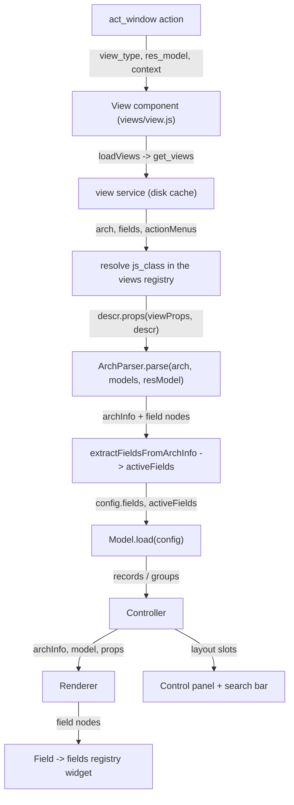

# Views framework

Active contributors: Aaron, Xavier, Christophe

## Purpose

The views framework turns an action plus an XML arch into a live screen. It owns the `views` registry, the generic `View` component, arch parsing, the field components, the control panel, the search model, and the view dialogs. Every standard view type (form, list, kanban, calendar, graph, pivot), every field widget, and every addon customization built with `js_class` runs through the files on this page.

## Directory layout

```text
addons/web/static/src/
├── views/
│   ├── view.js                    generic View component, js_class resolution
│   ├── view.xml                   web.View: WithSearch wrapping the controller
│   ├── view_service.js            loadViews (get_views RPC, disk-cached)
│   ├── view_compiler.js           ViewCompiler primitives, useViewCompiler
│   ├── view_hook.js               useActionLinks, useExportRecords, useDeleteRecords
│   ├── view_button/               button execution (object, action, multi-record)
│   ├── view_dialogs/              form_view_dialog, select_create_dialog, export_data_dialog
│   ├── view_components/           column progress, group config menu, selection box, ...
│   ├── widgets/                   generic view widgets (ribbon, attach document, ...)
│   ├── fields/                    field.js, fields registry, ~75 field directories
│   ├── form/                      form_arch_parser, form_controller, form_renderer, form_compiler
│   ├── list/                      list_arch_parser, list_controller, list_renderer
│   ├── kanban/                    kanban_arch_parser, kanban_controller, kanban_renderer
│   ├── calendar/                  calendar_arch_parser, calendar_model, calendar_renderer
│   ├── graph/                     graph view (lazy bundle), own Model and SearchModel
│   ├── pivot/                     pivot view (lazy bundle), own Model and SearchModel
│   ├── card/                      CardArchParser, CardCompiler, CardRenderer (shared by kanban)
│   ├── action_helper.js           generic "no content" helpers
│   └── offline_action_helper.js   fallback for views never visited online
└── search/
    ├── search_model.js            SearchModel: filters, favorites, group-bys, periods
    ├── search_arch_parser.js      <search> arch parsing
    ├── layout.js / layout.xml     Layout + extractLayoutComponents
    ├── with_search/               WithSearch: instantiates the SearchModel
    ├── control_panel/             ControlPanel, embedded actions panel
    ├── breadcrumbs/               Breadcrumbs component
    ├── search_bar/  search_panel/  cog_menu/  action_menus/
    └── utils/                     order_by, group_by, datetime period helpers
```

## Key abstractions

| Name | File | Description |
| --- | --- | --- |
| Views registry | `addons/web/static/src/views/view.js` | `registry.category("views")` maps a `js_class` key to a view object; validated to require a `type` present in `session.view_info` and a `Controller` |
| View object | `addons/web/static/src/views/form/form_view.js` | Descriptor with `ArchParser`, `Model`, `Renderer`, `Controller`, optional `Compiler`, `SearchModel`, `buttonTemplate`, `props()` |
| Generic View | `addons/web/static/src/views/view.js` | Loads the arch and fields, resolves `js_class`, mounts the controller inside `WithSearch` |
| View service | `addons/web/static/src/views/view_service.js` | `loadViews`: one `get_views` call through the disk cache, returns arch, fields, related models, toolbar, filters |
| RelationalModel | `addons/web/static/src/model/relational_model/relational_model.js` | Default `Model` slot for form, list and kanban |
| ArchParser | `addons/web/static/src/views/kanban/kanban_arch_parser.js` | Turns the arch XML into a plain `archInfo` object |
| Compiler | `addons/web/static/src/views/view_compiler.js` | `ViewCompiler` primitives; `FormCompiler` and `CardCompiler` turn arch snippets into Owl templates |
| Field | `addons/web/static/src/views/fields/field.js` | The single component every `<field>` node renders; picks the widget from the `fields` registry |
| Field registry | `addons/web/static/src/views/fields/field.js` | `registry.category("fields")` with a schema (`component`, `supportedTypes`, `extractProps`, ...) and the `availableOffline` per-type map |
| Many2X autocomplete | `addons/web/static/src/views/fields/relational_utils.js` | `web_name_search` with the offline many2x cache fallback |
| WithSearch | `addons/web/static/src/search/with_search/with_search.js` | Instantiates the `SearchModel` and feeds `domain`/`context`/`groupBy`/`orderBy` to the controller |
| SearchModel | `addons/web/static/src/search/search_model.js` | Filters, favorites, group-bys, comparison, date periods, remembered searches |
| Control panel | `addons/web/static/src/search/control_panel/control_panel.js` | Breadcrumbs, buttons slot, pager, view switcher, search bar host |
| Layout | `addons/web/static/src/search/layout.js` | `extractLayoutComponents`: the switch point for a view's own `ControlPanel`/`SearchPanel` |
| FormViewDialog | `addons/web/static/src/views/view_dialogs/form_view_dialog.js` | A form view mounted in a dialog, used by x2many fields and by `target: "new"` actions |
| View button | `addons/web/static/src/views/view_button/view_button.js` | Executes `<button type="object|action">` and multi-record buttons |

## How it works

### From arch to renderer



### View objects and the registry

A view type is a plain object registered under a key in `registry.category("views")`. The registry carries a validation schema (`viewRegistry.addValidation` in `addons/web/static/src/views/view.js`): a view object needs a `type` that exists in `session.view_info` and a `Controller` component; everything else is optional. The slots are:

- `ArchParser`: parses the arch XML into `archInfo` (active actions, default group by, progressbar attributes, card templates).
- `Model`: the data class, `RelationalModel` by default; graph and pivot ship `GraphModel` and `PivotModel`.
- `Renderer`: the component that displays the data.
- `Controller`: the top component, wired to the action manager, owning the model, buttons and dialogs.
- `Compiler`: compiles arch snippets into Owl templates (`FormCompiler`, `CardCompiler`).
- `SearchModel` / `ControlPanel`: replacements for the default search model or control panel.
- `buttonTemplate`, `searchMenuTypes`, `canOrderByCount`, `display`: knobs the generic `View` reads.
- `props(genericProps, descr, config)`: builds the controller's props, usually by running the ArchParser.

Registered in base `addons/web`: `form`, `list`, `kanban`, `calendar`, `graph`, `pivot`, and `base_settings` (`addons/web/static/src/webclient/settings_form_view/settings_form_view.js`). Other addons add their own keys; `addons/crm` registers `crm_form`, `crm_list`, `crm_kanban`, `crm_calendar`, `crm_activity`, `crm_graph`, `crm_pivot` and the `forecast_*` variants.

### Action to controller

The action manager (`addons/web/static/src/webclient/actions/action_plugin.js`) resolves an `act_window` action and mounts the generic `View` component from `addons/web/static/src/views/view.js` with `resModel`, `views`, `context` and `display`. `View.loadView` completes the view description by calling `viewService.loadViews` (`addons/web/static/src/views/view_service.js`), which issues one `get_views` call on the model through `orm.cache({ type: "disk" })`, forwarding `options.mobile = true` when `ui.isSmall` is set. The response carries the arch, the field descriptions for the model and its related models, the toolbar (`actionMenus`) and the user's `ir.filters`; the disk cache is invalidated when `rpcBus` sees a write to `ir.ui.view` or `ir.filters`.

The arch is parsed with `parseXML`, context flags such as `create="0"` are folded into the root element, and the view object is looked up. The controller is then mounted by `web.View` inside `WithSearch`, which instantiates the `SearchModel` and passes `domain`, `context`, `groupBy` and `orderBy` down as props.

### Selecting the view object with js_class

The lookup key is the `js_class` attribute on the arch's root element; when absent, the `jsClass` prop or the plain view `type` is used. If the key is not in the registry yet, `View.loadView` loads the lazy bundle (`web.assets_backend_lazy`, or `..._lazy_dark` under the dark color scheme, through `loadBundle` in `addons/web/static/src/core/assets.js`) and resolves the key again. This is how the graph and pivot views, shipped only in the lazy bundle, become available on first use, and how an addon binds an arch to a custom view object with a single XML attribute, for example `js_class="crm_kanban"` in `addons/crm/views/crm_lead_views.xml`. CRM swaps the ArchParser, Model, Renderer, ControlPanel, SearchModel and button template of its kanban that way; the full example is in [CRM views](../crm/crm-views.md).

### Arch parsing and compilation

ArchParsers never touch the DOM: `KanbanArchParser` (`addons/web/static/src/views/kanban/kanban_arch_parser.js`) reads attributes and child nodes and returns a plain `archInfo` object built on `CardArchParser` (`addons/web/static/src/views/card/card_arch_parser.js`). The collected field nodes are converted into the model's `activeFields` by `extractFieldsFromArchInfo` (`addons/web/static/src/model/relational_model/utils.js`), which is what decides the fetch specification for a load. Arch snippets embedded in a view (kanban cards, form button boxes, settings blocks) are compiled into Owl templates by the `Compiler` slot using `useViewCompiler` from `addons/web/static/src/views/view_compiler.js`; `addons/web/static/src/views/form/form_compiler.js` additionally has its own `registry.category("form_compilers")` for form-specific nodes.

### Fields

`Field` (`addons/web/static/src/views/fields/field.js`) is the single component behind every `<field>` node. It reads the widget name from the node, looks it up in `registry.category("fields")`, and validates entries against a schema (`component`, `supportedTypes`, `extractProps`, `fieldDependencies`, `isEmpty`, ...). The same file holds the per-type `availableOffline` map that the offline UI consults to decide whether a widget stays enabled without a connection; the mechanism is described in [Offline UI](../../features/offline-and-pwa/offline-ui.md). Implementations live one directory per field under `addons/web/static/src/views/fields/` (about 75 of them); shared parsing and formatting helpers are `addons/web/static/src/views/fields/formatters.js` and `addons/web/static/src/views/fields/parsers.js`. Relational fields build on `addons/web/static/src/views/fields/relational_utils.js`, where `Many2XAutocomplete.search()` caches successful `web_name_search` results through `OfflinePlugin.cacheMany2XSearch()` and falls back to `searchMany2XRecords()` on `ConnectionLostError`.

### Control panel, search, and layout composition

`View` mounts the controller inside `WithSearch`, which instantiates the `SearchModel` (`addons/web/static/src/search/search_model.js`) from the search view arch parsed by `addons/web/static/src/search/search_arch_parser.js`. The search model owns filters, favorites, group-bys, comparison and date periods, exposes `domain`, `context`, `groupBy` and `orderBy` to the view, and remembers the last search per action/view type so a view can be reopened where it was left. The control panel (`addons/web/static/src/search/control_panel/control_panel.js`) renders the breadcrumbs (a `Breadcrumbs` component, portalled into the navbar on small screens), the button slot, the pager, the view switcher, and hosts the search bar and cog menu. Layout slots come from `extractLayoutComponents(descr)` in `addons/web/static/src/search/layout.js`, which reads the view object's `ControlPanel` and `SearchPanel` keys if present.

### View dialogs

`addons/web/static/src/views/view_dialogs/` holds the dialogs the framework itself opens: `FormViewDialog` (a form view in a dialog, used by x2many fields, quick-create flows, and actions whose `target` is `"new"`), `SelectCreateDialog` (search-or-create records to link), and `ExportDataDialog`. They mount the same `View` component with `display: { controlPanel: false }`, so a dialog runs the full arch-parsing and model pipeline rather than a special case.

### Offline behavior in views

Two pieces of offline behavior belong to this framework: controls opt in to staying usable offline with the `data-available-offline` attribute on the interactive element itself (computed dynamically, for example `isNewButtonAvailableOffline` in `addons/web/static/src/views/form/form_controller.js`), and a view that was never visited online renders `OfflineActionHelper` (`addons/web/static/src/views/offline_action_helper.js`) offering the previously used searches. Both are explained in [Offline UI](../../features/offline-and-pwa/offline-ui.md). The write queue that replays offline edits is fed from the model layer, not from here; see [Relational model](relational-model.md).

## Integration points

- The action manager is the only entry: every `act_window` action with `view_mode` entries ends in this framework, and the view switcher calls back into it via `actionService.switchView`.
- The model layer below is chosen by the `Model` slot; the default is `RelationalModel` ([Relational model](relational-model.md)), which every list, form and kanban view shares.
- The ORM plugin (`addons/web/static/src/core/orm_plugin.js`) supplies `get_views`, `web_search_read`, `web_read_group`, `web_save` and friends; all I/O passes through it.
- Addons extend by registering view objects and binding them with `js_class`. `addons/crm` is the worked example in this repo, and mail adds the `activity` view type and the chatter that mounts inside form views; see [CRM views](../crm/crm-views.md) and [Mail](../mail.md).
- Lazy loading of graph and pivot depends on the asset bundles; see [Assets](../../systems/assets.md).

## Entry points for modification

A customization is usually: write a view object (often by spreading an existing one and swapping slots), register it in `registry.category("views")`, and bind an arch to it with `js_class` in the addon's view XML. A new field widget is an entry in `registry.category("fields")`. Controller or renderer tweaks use `patch()` instead of a new class. Every new view must be reachable from a rendered parent, and every new `js_class` must be referenced by an arch, or it is dead code; the wiring rules are in [Patterns and conventions](../../how-to-contribute/patterns-and-conventions.md). JS changes need `./scripts/dev/rebuild-assets.sh` and both test presets; see [Test framework](../../systems/test-framework.md).

## Key source files

| File | Purpose |
| --- | --- |
| `addons/web/static/src/views/view.js` | Generic `View`, registry validation, `js_class` resolution, lazy bundle load |
| `addons/web/static/src/views/view.xml` | `web.View`: `WithSearch` wrapping the controller |
| `addons/web/static/src/views/view_service.js` | `loadViews` over `get_views`, disk-cached, cache invalidation |
| `addons/web/static/src/views/view_compiler.js` | `ViewCompiler` primitives and `useViewCompiler` |
| `addons/web/static/src/views/view_hook.js` | `useActionLinks`, `useExportRecords`, `useDeleteRecords`, `useBounceButton` |
| `addons/web/static/src/views/utils.js` | Shared view utilities (`processButton`, `computeViewClassName`) |
| `addons/web/static/src/views/form/form_view.js` | Form view object (reference with a `Compiler`) |
| `addons/web/static/src/views/form/form_arch_parser.js` | Form arch parsing |
| `addons/web/static/src/views/form/form_compiler.js` | Form compiler and the `form_compilers` registry |
| `addons/web/static/src/views/list/list_view.js` | List view object |
| `addons/web/static/src/views/list/list_arch_parser.js` | List arch parsing |
| `addons/web/static/src/views/kanban/kanban_view.js` | Kanban view object (spread by crm and mail) |
| `addons/web/static/src/views/kanban/kanban_arch_parser.js` | Kanban arch parsing, built on `CardArchParser` |
| `addons/web/static/src/views/calendar/calendar_view.js` | Calendar view object with its own `CalendarModel` |
| `addons/web/static/src/views/graph/graph_view.js` | Lazy-bundled view with own Model and SearchModel |
| `addons/web/static/src/views/pivot/pivot_view.js` | Lazy-bundled pivot view object |
| `addons/web/static/src/views/card/card_arch_parser.js` | Shared card arch parsing for kanban and card renderers |
| `addons/web/static/src/views/fields/field.js` | `Field`, the `fields` registry, `availableOffline` map |
| `addons/web/static/src/views/fields/relational_utils.js` | Many2X autocomplete with the offline cache fallback |
| `addons/web/static/src/views/fields/formatters.js` | Field value formatting |
| `addons/web/static/src/views/fields/parsers.js` | Field value parsing and the `parsers` registry |
| `addons/web/static/src/views/view_dialogs/form_view_dialog.js` | Form view in a dialog |
| `addons/web/static/src/views/view_dialogs/select_create_dialog.js` | Search-or-create dialog |
| `addons/web/static/src/views/view_button/view_button.js` | Button execution and the button hook |
| `addons/web/static/src/search/with_search/with_search.js` | `SearchModel` instantiation and search props |
| `addons/web/static/src/search/search_model.js` | Filters, favorites, group-bys, remembered searches |
| `addons/web/static/src/search/search_arch_parser.js` | `<search>` arch parsing |
| `addons/web/static/src/search/layout.js` | `extractLayoutComponents`, `Layout` |
| `addons/web/static/src/search/control_panel/control_panel.js` | Control panel component |
| `addons/web/static/src/search/breadcrumbs/breadcrumbs.js` | Breadcrumbs component |
| `addons/web/static/src/views/offline_action_helper.js` | Offline fallback for unvisited views |
| `addons/web/static/src/webclient/actions/action_plugin.js` | Action resolution and controller mounting |

## Related pages

- [Relational model](relational-model.md): the default `Model` slot and its offline producers
- [Web](index.md): the shell, registries, and boot chain around this framework
- [CRM views](../crm/crm-views.md): every `js_class` slot swap in practice
- [Offline and PWA](../../features/offline-and-pwa/index.md) and [Offline UI](../../features/offline-and-pwa/offline-ui.md)
- [Mobile web](../../features/mobile-web.md): the small-screen signal that switches layouts
- [Assets](../../systems/assets.md): the lazy bundles behind graph and pivot
- [Actions, views and menus](../../primitives/actions-views-menus.md)
- [Mail](../mail.md): the activity view and the chatter inside form views
- [Test framework](../../systems/test-framework.md)
