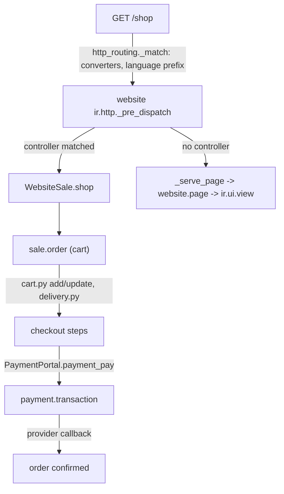

# Website suite

Active contributors: qsm-odoo, Christophe, Christophe (upstream)

## Purpose

`addons/website` is a CMS bolted onto the same ORM the back office uses: pages are `ir.ui.view` records, menus and SEO metadata are models, and public URLs are dispatched through a website-aware `ir.http`. Around it sit 52 addons whose directory name starts with `website`, the editing stack (`addons/html_editor`, `addons/html_builder`), the live chat app (`addons/im_livechat`), `addons/theme_default`, and the 24-module payment family (`addons/payment` plus 23 provider integrations). Public pages run a lightweight Interaction runtime, not the back-office web client. The fork changes nothing here; the website family matters to it only because `website_crm` feeds the pipeline documented in [CRM](crm/index.md).

## Family contents

Verified with `ls -d addons/website* addons/payment*`:

```text
addons/website/                     # the CMS: pages, menus, SEO, visitors, themes, routing
addons/html_editor/                 # auto_install: the Wysiwyg component and editor plugins
addons/html_builder/                # generic block builder ("HTML Builder")
addons/theme_default/                # the default theme module
addons/website_sale/                 # eCommerce: catalog, cart, checkout, wishlist, comparison
addons/website_sale_stock/  addons/website_sale_mrp/  addons/website_sale_collect/
addons/website_sale_gelato/  addons/website_sale_loyalty/  addons/website_sale_mass_mailing/
addons/website_sale_project/  addons/website_sale_slides/   # ecommerce bridges
addons/website_blog/                 # blog posts and tags
addons/website_forum/                # Q&A forums with karma
addons/website_slides/  addons/website_slides_forum/  addons/website_slides_survey/
addons/website_profile/              # user profiles and karma used by forum and slides
addons/website_mail/  addons/website_mail_group/  addons/website_mass_mailing/
addons/website_mass_mailing_event/  addons/website_mass_mailing_sms/  addons/website_sms/
addons/website_livechat/  addons/im_livechat/          # the chat bubble and the live chat app
addons/website_partner/  addons/website_customer/  addons/website_partnership/
addons/website_google_map/  addons/website_links/      # partner pages, references, maps, short links
addons/website_payment/              # auto_install: pay buttons on portal pages
addons/website_crm/  addons/website_crm_iap_reveal/  addons/website_crm_livechat/
addons/website_crm_partner_assign/  addons/website_crm_sms/  # lead capture ([CRM](crm/index.md))
addons/website_event*/               # 12 modules: public event pages ([marketing suite](marketing-suite.md))
addons/website_address_autocomplete/  addons/website_cf_turnstile/  # address autocomplete, Cloudflare Turnstile
addons/website_hr_recruitment/  addons/website_hr_recruitment_livechat/
addons/website_project/  addons/website_timesheet/     # portal additions
addons/payment/                      # provider-agnostic payment engine
addons/payment_aps/  addons/payment_adyen/  addons/payment_asiapay/  addons/payment_authorize/
addons/payment_buckaroo/  addons/payment_custom/  addons/payment_demo/  addons/payment_dpo/
addons/payment_ecpay/  addons/payment_flutterwave/  addons/payment_iyzico/
addons/payment_mercado_pago/  addons/payment_mollie/  addons/payment_nuvei/
addons/payment_paymob/  addons/payment_paypal/  addons/payment_payu/  addons/payment_razorpay/
addons/payment_redsys/  addons/payment_stripe/  addons/payment_toss_payments/
addons/payment_worldline/  addons/payment_xendit/  # 23 provider modules
```

Several modules known from older branches do not exist here (verified with `ls -d`): `website_form` (form handling lives inside `addons/website`), `website_twitter`, `website_membership`, `website_sale_digital`, `website_gengo`, `website_enterprise`. Wishlist and comparison are not separate modules either: `product.wishlist` (`addons/website_sale/models/product_wishlist.py`) and the comparison endpoints (`addons/website_sale/controllers/comparison.py`) live inside `website_sale`.

## Key models

| Model | File | What it covers |
| --- | --- | --- |
| `website` | `addons/website/models/website.py` | One site: `domain`, `default_lang_id` (line 133), `theme_id` (206); resolves the current website per request (line 113). |
| `website.page` | `addons/website/models/website_page.py` | A CMS page bound to an `ir.ui.view`, with URL, publication and visibility (line 29). |
| `website.controller.page` | `addons/website/models/website_controller_page.py` | Model-listing pages generated from controllers (line 8). |
| `website.menu` | `addons/website/models/website_menu.py` | Site navigation tree (line 16). |
| `website.seo.metadata`, `website.published.mixin`, `website.multi.mixin`, `website.searchable.mixin` | `addons/website/models/mixins.py` | SEO fields (21), publication (461, multi-site variant 797), website scoping (255), search indexing (850). |
| `website.visitor` / `website.track` | `addons/website/models/website_visitor.py` | Anonymous visitor identity (30) and page-visit tracking (18). |
| `website.rewrite` / `website.route` | `addons/website/models/website_rewrite.py` | URL redirects (53) and the catalogue of known routes (14). |
| `theme.ir.ui.view`, `theme.ir.asset` | `addons/website/models/theme_models.py` | Theme-owned records copied into the site on theme install (52, 14). |
| `blog.blog` / `blog.tag` | `addons/website_blog/models/website_blog.py` | Blog posts (14) and tags (145). |
| `forum.forum` / `forum.post` | `addons/website_forum/models/forum_forum.py`, `addons/website_forum/models/forum_post.py` | Q&A forums (16) and karma-scored posts (19). |
| `slide.channel` / `slide.slide` | `addons/website_slides/models/slide_channel.py`, `addons/website_slides/models/slide_slide.py` | eLearning courses (23) and their content (25). |
| `im_livechat.channel` | `addons/im_livechat/models/im_livechat_channel.py` | Live chat channels (line 24). |
| `sale.order` (cart) | `addons/website_sale/models/sale_order.py` | The cart is a sale order with `website_id` (29) and `cart_quantity` (58). |
| `product.wishlist` | `addons/website_sale/models/product_wishlist.py` | Saved products per user or visitor (line 10). |
| `product.public.category` | `addons/website_sale/models/product_public_category.py` | Shop-front category tree (line 12). |
| `payment.provider` | `addons/payment/models/payment_provider.py` | Acquirer configuration; the `code` selection (32) names the provider module. |
| `payment.transaction` | `addons/payment/models/payment_transaction.py` | One payment attempt; states `draft`, `pending`, `authorized`, `done`, `cancel`, `error` (line 80). |
| `payment.token` | `addons/payment/models/payment_token.py` | Stored payment details for later charges (line 8). |

## How it works

A public request never reaches the back-office client. `addons/http_routing/models/ir_http.py:325` (`_match`) handles URL converters and the language prefix; `addons/website/models/ir_http.py` resolves the current website (`_match` 184), runs `_pre_dispatch` (216), and when no controller matched, `_serve_page` (287) serves a `website.page`, then `_serve_fallback` (331). The page renders as QWeb server side, and `web.assets_frontend` boots `Interaction` subclasses (`addons/web/static/src/public/interaction.js`) for every element matching their static selector.

Editing runs in the back office, not on the public site. The `website_preview` client action (`addons/website/static/src/client_actions/website_preview/`) loads the live site into an iframe. Edit-mode code is deliberately excluded from the public bundle: `addons/website/__manifest__.py` removes `website/static/src/interactions/**/*.edit.js` (line 292) and `website/static/src/snippets/**/*.edit.js` (300) from `web.assets_frontend` and ships them in `website.assets_inside_builder_iframe` (337). `addons/website/models/ir_ui_view.py` adds `website_id` to views and enforces the specific-view rule, so editing a generic view on one site writes a site-specific copy instead of mutating the shared one.

Public forms are a separate path. `addons/website/controllers/form.py` exposes `/website/form/<model>` and processes submissions through `extract_data` (156) and `insert_record` (255); `addons/website/models/website_form.py` decides what a visitor may write (`_get_form_writable_fields` 30, `get_authorized_fields` 53); each target model filters the payload by implementing `website_form_input_filter`. `addons/website_crm/models/crm_lead.py:47` is the reference implementation, stamping team, salesperson and medium on form-submitted leads.

eCommerce keeps its paths in one constant: `SHOP_PATH = "/shop"` (`addons/website_sale/const.py:407`). `WebsiteSale` extends `payment_portal.PaymentPortal` (`addons/website_sale/controllers/main.py:121`) and serves the catalog at `/shop` plus category and paging variants (main.py:301), the cart at `/shop/cart` with add, update and quick-add endpoints (`addons/website_sale/controllers/cart.py`), delivery selection at `/shop/delivery_methods` and `/shop/set_delivery_method` (`addons/website_sale/controllers/delivery.py`), transaction creation at `/shop/payment/transaction/<int:order_id>` (`addons/website_sale/controllers/payment.py:23`), and express checkout at `/shop/express_checkout`. Wishlist, comparison, reordering (`/my/orders/reorder`) and the Google Merchant feed (`/gmc.xml`, `addons/website_sale/controllers/product_feed.py:10`) are separate controllers. The cart is a `sale.order` scoped by `website_id`; confirming it reuses the quotation flow of the [sales suite](sales-suite.md).



The payment acquirer abstraction is provider-agnostic. `addons/payment` defines `payment.provider` (configuration; the `code` selection names the provider), `payment.transaction` (the state machine above), `payment.token` (stored credentials), and the `PaymentPortal` controller whose `payment_pay` (`addons/payment/controllers/portal.py:39`) renders the pay page. Each `payment_<provider>` module extends `payment.provider` and implements the provider's flows — `addons/payment_stripe/models/payment_provider.py`, for instance, registers its payment-method codes (line 129). `addons/website_payment` (`auto_install` for `[website, account_payment, portal]`) drops pay buttons on portal pages; the reconciliation side is covered in [accounting](accounting.md).

## Integration points

- `addons/website` depends on `digest`, `web`, `html_editor`, `http_routing`, `portal`, `social_media`, `auth_signup`, `mail`, `google_recaptcha`, `utm` and `html_builder`, and declares the external Python dependency `geoip2` (`addons/website/__manifest__.py:23-26`).
- It extends core models from inside the addon: `ir_http.py`, `ir_ui_view.py`, `ir_qweb.py`, `ir_asset.py`, `ir_attachment.py`, `ir_ui_menu.py`, `ir_access.py`, `res_users.py`, `res_lang.py`, `res_company.py`.
- `addons/website_sale` depends on `website`, `sale`, `website_payment`, `website_mail`, `portal_rating`, `digest`, `delivery` and `html_builder`; its stock and kit behaviour comes from `website_sale_stock` and `website_sale_mrp`.
- The `website_crm*` modules feed `crm.lead`: `website_crm` from contact forms, `website_crm_livechat` from chats, `website_crm_sms` from SMS, `website_crm_iap_reveal` from IAP company lookups, `website_crm_partner_assign` for lead assignment — the CRM side is documented in [CRM](crm/index.md), not here.
- `addons/im_livechat` is a standalone app (depends on `mail`, `digest`, `utm`, `phone_validation`); `website_livechat` is the `auto_install` glue that drops the chat bubble on public pages.
- The `website_event*` family (12 modules) publishes events, tracks and exhibitors; see [marketing suite](marketing-suite.md).
- The fork's offline and PWA stack lives in `addons/web` and is consumed only by `addons/crm`; website pages are server-rendered QWeb and do not participate ([web client](web/index.md)).

## Entry points for modification

For anything about which page a URL resolves to, start at `addons/website/models/ir_http.py` and the routes in `addons/website/controllers/main.py`. For a new drag-and-drop block, add a snippet template under `addons/website/views/snippets/` and, if it needs behaviour, an `Interaction` subclass under `addons/website/static/src/interactions/` with its editor counterpart in a `*.edit.js` sibling. For a new public form target, implement `website_form_input_filter` on the destination model and expose its fields through the `website_form` opt-in, using `addons/website_crm/models/crm_lead.py` as the reference. For a new payment provider, copy `addons/payment_demo` and register the provider's `code`. In this fork, changes must be made from `addons/crm/` only — `_inherit`, controller subclassing, JS `patch()` or XML inheritance — per [patterns and conventions](../how-to-contribute/patterns-and-conventions.md).

## Key source files

| File | Purpose |
| --- | --- |
| `addons/website/__manifest__.py` | Dependencies, `geoip2` external dependency, the full bundle map. |
| `addons/website/models/website.py` | The `website` record and current-site resolution. |
| `addons/website/models/ir_http.py` | Website-aware dispatch and page fallback. |
| `addons/website/models/ir_ui_view.py` | `website_id` on views; specific-view copy-on-write. |
| `addons/website/models/mixins.py` | SEO, published, multi-website and searchable mixins. |
| `addons/website/models/website_page.py` | `website.page`. |
| `addons/website/models/website_menu.py` | `website.menu`. |
| `addons/website/models/website_form.py` | Authorized-field computation for public forms. |
| `addons/website/models/website_visitor.py` | `website.visitor`, `website.track`. |
| `addons/website/models/theme_models.py` | Theme records and theme utils. |
| `addons/website/controllers/main.py` | Page serving, sitemap, editor endpoints. |
| `addons/website/controllers/form.py` | Form submission: `extract_data`, `insert_record`. |
| `addons/website/static/src/client_actions/website_preview/` | Backend editing client action. |
| `addons/web/static/src/public/interaction.js` | Frontend `Interaction` base class. |
| `addons/html_editor/__manifest__.py` | Editor bundles. |
| `addons/html_builder/__manifest__.py` | The block builder and builder-iframe bundles. |
| `addons/website_sale/const.py` | Route constants, `SHOP_PATH`. |
| `addons/website_sale/controllers/main.py` | `/shop` catalog and checkout. |
| `addons/website_sale/controllers/cart.py` | Cart add, update and quick-add. |
| `addons/website_sale/controllers/payment.py` | Transaction creation from the shop. |
| `addons/website_sale/models/sale_order.py` | Cart-as-order behaviour. |
| `addons/website_sale/models/product_template.py` | Published products, variants, ecommerce pricing. |
| `addons/website_crm/models/crm_lead.py` | `website_form_input_filter`: form submission to lead. |
| `addons/payment/models/payment_provider.py` | The acquirer abstraction. |
| `addons/payment/models/payment_transaction.py` | The transaction state machine. |
| `addons/payment/controllers/portal.py` | `PaymentPortal.payment_pay`. |
| `addons/payment_stripe/models/payment_provider.py` | Reference provider implementation. |

## Related pages

- [Apps](index.md)
- [CRM](crm/index.md)
- [Sales suite](sales-suite.md)
- [Accounting](accounting.md)
- [Marketing suite](marketing-suite.md)
- [Mail](mail.md)
- [Web client](web/index.md)
- [Multi-company](../primitives/companies-and-multi-company.md)
- [Data models](../reference/data-models.md)
