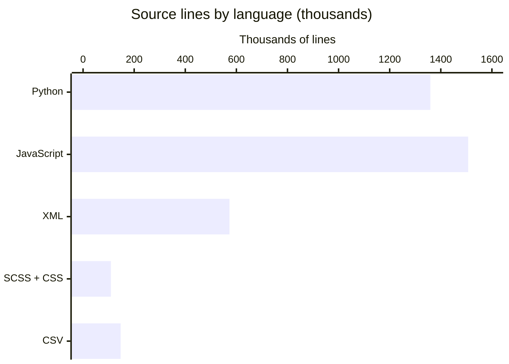

# By the numbers

Data collected on 2026-10-07 from the working tree at `/home/factory-user/repos/odoo`,
branch `eval/factory-crm-offline` at `30955b57688`.

Every figure below comes from a command run in that tree on that date. Counting is
newlines in tracked source files under `odoo/` and `addons/`; `.git`, `node_modules`
and `__pycache__` are excluded. Where a number is sampled, a lower bound, or a proxy
for something that cannot be measured directly, the text says so. This checkout
carries upstream's real history, not a squashed snapshot: `git rev-list --count
origin/20.0` returns 211,574 commits.

## Size

Source lines by language, first-party and vendored JavaScript counted together:

| Language | Lines | Files | Lines per file |
| --- | --- | --- | --- |
| Python | 1,359,025 | 9,400 | 145 |
| JavaScript | 1,506,961 | 6,775 | 222 |
| XML (views, data, templates) | 573,097 | 6,052 | 95 |
| SCSS | 80,572 | 1,244 | 65 |
| CSS | 28,868 | 40 | 722 |
| CSV (data import files) | 147,010 | 908 | 162 |
| **Total** | **3,695,533** | **24,419** | 151 |

Translations are excluded and dwarf the code: 20,257 `.po` files plus 603 `.pot`
templates, 23,004,434 lines together, all generated rather than written.

File categories, with the overlaps spelled out:

| Category | Files |
| --- | --- |
| Source files (the six extensions above) | 24,419 |
| Test files, deduplicated union of three patterns | 6,057 |
| — under a `tests/` directory | 6,023 |
| — `*.test.js` (Hoot suites) | 1,345 |
| — `test_*.py` | 2,077 |
| XML under a `data/` directory | 1,008 |
| Module manifests (`__manifest__.py`) | 660 |
| CSV under a `data/` directory | 664 |
| All tracked files | 50,566 |

Tests are 6,057 of the 24,419 source files, 24.8%. The three test patterns overlap
(`addons/crm/tests/test_crm_offline.py` matches two of them), so the union is 6,057
rather than the 9,445 that adding them would give.

Modules: 642 directories under `addons/`, of which 641 carry a `__manifest__.py`
(`addons/mrp_subcontracting_repair/` has none). The core package ships 16 more under
`odoo/addons/` (`base` plus 15 `test_*` support modules); 19 manifest files live in
that tree because three extra test manifests are nested under
`odoo/addons/test_base/tests/test_modules/`. The `odoo/` package itself has 24
top-level entries (`orm/`, `fields/`, `http/`, `tools/`, `cli/`, and so on).

## Activity

Commits per month on `origin/20.0`, by committer date. The branch tip is dated
2026-09-24, so the last two weeks before collection are empty on upstream:

| Month | Commits | Month | Commits |
| --- | --- | --- | --- |
| 2025-10 | 1,370 | 2026-04 | 1,466 |
| 2025-11 | 1,254 | 2026-05 | 1,169 |
| 2025-12 | 1,324 | 2026-06 | 1,720 |
| 2026-01 | 1,216 | 2026-07 | 1,565 |
| 2026-02 | 1,454 | 2026-08 | 1,634 |
| 2026-03 | 1,488 | 2026-09 | 1,633 (all by the 24th) |

That is 17,293 commits in twelve months, between 1,169 and 1,720 per month without a
trend break. Upstream's first commit is `004a0b996ff` "New trunk" on 2006-12-07, against
211,574 commits reachable from `origin/20.0`. Nothing is committed after 2026-09-24,
which is where the fork starts.

The fork: 76 commits are reachable from `HEAD` and not from `origin/20.0`, spanning
2026-09-30 to 2026-10-05, all under one author identity. The shorter range
`git rev-list --count 96e36339..HEAD` reports 75 because `96e363398ef` *is* the first
fork commit, `[ADD] scripts/dev: reproducible local dev environment`, and is itself
absent from `origin/20.0`.

| Date | Commits |
| --- | --- |
| 2026-09-30 | 3 |
| 2026-10-01 | 21 |
| 2026-10-02 | 15 |
| 2026-10-03 | 13 |
| 2026-10-04 | 22 |
| 2026-10-05 | 2 |

The fork's total diff against `origin/20.0`:

| Area | Files | Added | Deleted |
| --- | --- | --- | --- |
| `addons/crm/` | 118 | 25,232 | 26 |
| `droid-wiki/`, `AGENTS.md`, `.factory/` | 77 | 9,252 | 0 |
| `scripts/dev/` | 10 | 845 | 0 |
| `.gitignore` | 1 | 12 | 0 |
| **Total** | **206** | **35,341** | **26** |

74 of the 76 commits touch nothing outside `addons/crm/`. The one exception is
`8916e416c84` (`[ADD] wiki: repository wiki, agent guidelines, and offline QA skill`),
which adds the wiki tree, the skill, and the agent guidelines.

Churn across all refs present, last 90 days (4,898 commits since 2026-07-01). File
names only, so a file touched 65 times in one large commit and a file touched once in
each of 65 commits look the same:

| File | Touches |
| --- | --- |
| `addons/account/models/account_move.py` | 65 |
| `addons/point_of_sale/static/src/app/services/pos_store.js` | 43 |
| `addons/web/static/tests/views/list/list_view.test.js` | 42 |
| `addons/website_sale/models/product_template.py` | 38 |
| `addons/hr_holidays/models/hr_leave.py` | 37 |
| `addons/mail/static/src/core/common/store_service.js` | 34 |
| `addons/mrp/models/mrp_production.py` | 32 |
| `addons/web/static/src/views/list/list_renderer.js` | 31 |
| `odoo/orm/models.py` | 30 |
| `addons/hr/models/hr_employee.py` | 30 |
| `addons/sale/models/sale_order_line.py` | 26 |
| `addons/mail/static/src/discuss/core/common/discuss_channel_model.js` | 26 |
| `addons/mail/static/src/core/common/message_model.js` | 26 |
| `addons/mail/models/mail_thread.py` | 26 |
| `addons/website/models/website.py` | 25 |

By directory over the same window: `addons/web` 3,765, `addons/mail` 3,560,
`addons/website` 1,861, `addons/point_of_sale` 1,820, `addons/html_editor` 1,337,
`addons/account` 1,313, `addons/website_sale` 1,114.

The fork's own hotspots, by lines added between `96e363398ef` and `HEAD`:

| File | Added |
| --- | --- |
| `addons/crm/static/src/mobile/offline_inventory.md` | 1,248 |
| `addons/crm/static/tests/crm_offline_team_switcher.test.js` | 906 |
| `addons/crm/static/tests/crm_offline_kanban_group_guards.test.js` | 900 |
| `addons/crm/static/tests/crm_offline_activity_panel.test.js` | 886 |
| `addons/crm/static/tests/crm_offline_config_list_guards.test.js` | 772 |
| `addons/crm/static/tests/crm_offline_chatter.test.js` | 718 |
| `addons/crm/static/tests/crm_offline_list_celledit_disable.test.js` | 656 |
| `addons/crm/static/tests/crm_offline_queue_semantics.test.js` | 631 |
| `addons/crm/static/src/views/crm_kanban/crm_kanban_renderer.js` | 588 |
| `addons/crm/static/tests/crm_offline_uncached_lead.test.js` | 558 |
| `addons/crm/tests/test_crm_offline.py` | 528 |
| `addons/crm/static/src/views/crm_form/crm_lead_activity_panel.js` | 365 |
| `addons/crm/static/src/views/crm_form/crm_form.js` | 309 |

The shape of that list is the story: 54 of the 118 changed `addons/crm` files are
tests, and they account for 19,291 of the 25,232 added lines, 76%. The largest
single non-test artifact is a 1,248-line Markdown inventory of the offline surface,
`addons/crm/static/src/mobile/offline_inventory.md`.

## Bot-attributed commits

Upstream, `origin/20.0`, 211,574 commits:

| Measure | Commits | Share |
| --- | --- | --- |
| Any `Co-authored-by:` trailer | 6,320 | 3.0% |
| `Co-authored-by:` trailer naming a bot | 0 | 0.0% |
| Author identity containing "bot" | 2,145 | 1.0% |

The zero in the middle row is real: `git log --format='%(trailers:key=Co-authored-by)'
origin/20.0 | grep -c '\[bot\]'` returns 0, and all 6,320 co-author trailers name
humans. The bottom row is automation that tags itself in the author field instead —
the merge bot, the forward-port bot, the translation bot, and the `Robot Odoo` test
account. Two of the 2,147 case-insensitive matches on "bot" are ordinary people whose
surname or handle contains it ("Lambotte", "Botakely"), which is why the row says
2,145.

The fork, 76 commits against `origin/20.0`: 75 carry
`Co-authored-by: factory-droid[bot] <138933559+factory-droid[bot]@users.noreply.github.com>`,
98.7%. The one exception is the oldest commit, `96e363398ef`. Across the whole
repository the figure is 75 of 211,650 commits, 0.035%.

Read all of this as a floor, not a measurement. A trailer records AI assistance only
when a human or tool wrote it into the message. Inline completion, agent sessions
that leave no trailer, and automation that commits under its own identity without a
co-author line are invisible to `git log`; the last of those is why the 2,145 figure
exists at all, and the first two are unmeasurable from here. The honest statement is
that upstream's bot *trailer* rate is zero and the fork's is 98.7%, and that neither
number bounds the amount of AI-assisted work in the tree.

## Complexity

Average source file size by directory. `addons/` as a whole is the flattest area
because it contains thousands of small XML view files and CSV data files:

| Area | Source files | Lines | Average |
| --- | --- | --- | --- |
| `odoo/` (core server) | 735 | 223,406 | 303 |
| `addons/` (all modules) | 23,684 | 3,472,127 | 146 |
| `addons/web` | 1,732 | 683,045 | 394 |
| `addons/crm` | 243 | 45,256 | 186 |
| `addons/mail` | 1,280 | 207,897 | 162 |
| `addons/account` | 458 | 129,965 | 283 |

The five largest addons by source lines: `addons/web` 683,045; `addons/mail` 207,897;
`addons/html_editor` 157,983; `addons/website` 156,020; `addons/spreadsheet` 145,409.
Together they are 1,350,354 lines, 39% of the `addons/` total, in 5 of the 642 addon
directories (0.8%) — a handful of framework and editor modules dominate the repository
by volume while the rest are individually small.

Largest source files in the tree, Python and JavaScript together:

| File | Lines |
| --- | --- |
| `addons/spreadsheet/static/src/o_spreadsheet/o_spreadsheet.js` | 90,650 |
| `addons/web/static/lib/pdfjs/build/pdf.worker.js` | 59,020 |
| `addons/web/static/lib/zxing-library/zxing-library.js` | 27,951 |
| `addons/web/static/lib/pdfjs/build/pdf.js` | 26,312 |
| `addons/web/static/tests/views/list/list_view.test.js` | 22,473 |
| `addons/web/static/lib/ace/ace.js` | 21,971 |
| `addons/web/static/src/core/emoji_picker/emoji_data.js` | 21,885 |
| `addons/web/static/lib/pdfjs/web/viewer.js` | 18,448 |
| `addons/mail/static/lib/lame/lame.js` | 15,524 |
| `addons/web/static/lib/Chart/Chart.js` | 15,099 |
| `addons/web/static/tests/views/form/form_view.test.js` | 13,937 |
| `addons/web/static/tests/views/fields/one2many_field.test.js` | 13,907 |

No Python file reaches this table: the largest is `addons/account/models/account_move.py`
at 8,339 lines, then `addons/stock/tests/test_move.py` at 7,043 and `odoo/orm/models.py`
at 6,617. Seven of the twelve entries are vendored libraries under `static/lib/`, two
are generated or built artifacts that sit in `static/src` anyway
(`o_spreadsheet.js`, `emoji_data.js`), and three are hand-written test suites.

Test counts, per area:

| Area | Count |
| --- | --- |
| `.test.js` files under `addons/crm/static/tests/` | 51, of which 46 are `crm_offline_*` |
| `.js` files under `addons/crm/static/` (source plus tests) | 123 |
| `test_*.py` files in `addons/crm/tests/` | 21, of which 3 are `test_crm_offline*` |
| `test_*.py` files repo-wide | 2,077 (1,862 under `addons/`) |
| `*.test.js` files repo-wide | 1,345 |

All of that density sits inside one addon of 45,256 source lines. In `addons/crm`, 46
of the 51 JavaScript suites are offline-specific and 3 of the 21 Python test modules
cover the same ground, so most of this fork's verification runs in the browser rather
than against the server.

Dependency depth, measured two ways because neither is the real answer:

- **Addon `depends` chains**, from the 653 manifests that declare `depends`. The
  longest chain of any module is 16 modules:
  `web -> bus -> html_editor -> mail -> auth_signup -> portal -> digest -> account ->
  account_payment -> sale -> sale_management -> event_sale -> event_booth_sale ->
  website_event_booth_sale -> website_event_booth_sale_exhibitor -> test_event_full`,
  read right to left as "depends on". Excluding test-only modules the longest is 15,
  ending at `sale_timesheet_margin`. `web` is the oldest link in the chain, reached by
  15 successive `depends` edges from a single test module.
- **Python module paths**: `grep -rhoE '^from odoo(\.[A-Za-z0-9_]+)+ import'` over
  `odoo/` and `addons/` gives 5,522 imports at one dot (`from odoo.models import ...`),
  1,958 at two (`from odoo.tools.translate import ...`), 402 at three (the
  `from odoo.addons.<module>.<file> import ...` idiom), 3,276 at four
  (`from odoo.addons.account.tests.common import ...`), and 32 at five, the maximum —
  for example `from odoo.addons.mail.models.discuss.discuss_channel import ...`. Import
  *path* depth is capped at five components; all the depth in this codebase lives in
  the addon dependency graph, not in import statements.

This is a proxy, and a weak one. A real import graph would need the `odoo.addons.*`
edges resolved through `depends`, and I did not attempt it: the count above measures
spelling, not coupling. Treat the 16-module chain as accurate for what it is
(manifest-level dependencies, from a static parse of `depends` literals) and the rest
as structure, not measurement.

## What these numbers are not

Three cautions that apply to the whole page:

- Line counts treat every file as text. Vendored bundles, generated emoji and
  spreadsheet data, and 23 million lines of translations sit in the same tree as
  hand-written code; the language table separates translations only.
- The churn figures merge two sources of change — upstream's monthly cadence and the
  fork's six-day sprint — and the 90-day window is dominated by the former.
- The bot counts are trailer archaeology. They say what people wrote into commit
  messages, nothing about who or what wrote the code.

## Related pages

- [Architecture](overview/architecture.md)
- [Cleanup opportunities](cleanup-opportunities/index.md)
- [Complexity hotspots](cleanup-opportunities/complexity-hotspots.md)
- [Lore](lore.md)
- [Dependencies](reference/dependencies.md)
