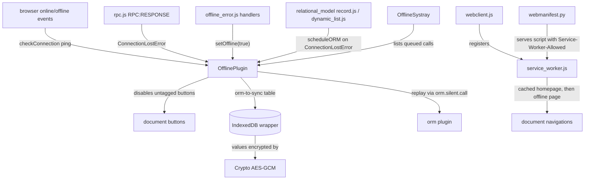

# Offline and PWA

Active contributors: Jorge, Aaron, Romain

## Purpose

The offline and PWA stack lets the OWL web client keep working without a network connection: previously visited views and records stay reachable, writes made while disconnected are queued and replayed when the connection returns, and the client installs as a PWA. The whole stack lives in `addons/web`; consumer addons only use it, they never fork it (see [Offline CRM](../../apps/crm/offline-crm.md) for how crm consumes it). Four pieces make it up: a sync queue for writes, an encrypted local store, a service worker for pages, and DOM-level gating of controls that cannot work offline.

## Directory layout

```text
addons/web/
├── controllers/webmanifest.py                  # manifest, worker, offline page, scoped apps
├── views/webclient_templates.xml              # web.webclient_offline, web.webclient_scoped_app
└── static/src/
    ├── service_worker.js                       # shared service worker (scope /odoo)
    ├── core/
    │   ├── offline/offline_plugin.js           # OfflinePlugin: state, queue, visited UI, gating
    │   ├── offline/offline_error.js            # error handlers that flip the client offline
    │   ├── errors/non_secure_context_error.js  # NonSecureContextError + notification handler
    │   ├── utils/indexed_db.js                 # IndexedDB wrapper (mutex, version wipe, quota)
    │   ├── crypto.js                           # AES-GCM helper
    │   ├── pwa/pwa_service.js                  # "pwa" service: install prompt, install state
    │   ├── pwa/install_prompt.js               # Safari install instructions dialog
    │   └── network/rpc.js                      # ConnectionLostError, rpcBus
    ├── model/relational_model/                 # queue producers (record.js, dynamic_list.js)
    ├── views/
    │   ├── offline_action_helper.js/.xml       # fallback for never-visited views
    │   └── fields/relational_utils.js          # many2x autocomplete + offline cache
    └── webclient/
        ├── webclient.js                        # service worker registration
        ├── offline_systray/                    # queued-changes systray item
        └── share_target/                       # page side of the PWA share target
```

## Key abstractions

| Name | File | Description |
| --- | --- | --- |
| `OfflinePlugin` | `addons/web/static/src/core/offline/offline_plugin.js` | OWL plugin: offline state, sync queue, visited-UI tracking, many2x cache, button gating |
| `IndexedDB` | `addons/web/static/src/core/utils/indexed_db.js` | IndexedDB wrapper: per-tab mutex, version wipe, quota handling |
| `Crypto` | `addons/web/static/src/core/crypto.js` | AES-GCM encryption keyed from `session.browser_cache_secret` |
| `ConnectionLostError` | `addons/web/static/src/core/network/rpc.js` | Error class for failed RPCs; the trigger for going offline and for queueing |
| Service worker | `addons/web/static/src/service_worker.js` | Caches `/odoo` and `/odoo/offline`, serves them when the network fails |
| `WebManifest` | `addons/web/controllers/webmanifest.py` | Controller serving the manifest, worker script, offline page and scoped apps |
| pwa service | `addons/web/static/src/core/pwa/pwa_service.js` | `beforeinstallprompt` capture, install state in localStorage |
| `OfflineSystray` | `addons/web/static/src/webclient/offline_systray/offline_systray.js` | Systray item listing queued writes (sequence 1000) |

## How it works

### The four pieces

- **Queue.** Every write that fails with `ConnectionLostError` is stored verbatim in the `orm-to-sync` table and replayed in timestamp order on reconnect, one call per second, serialized across tabs with a Web Lock. Failed replays are parked and surfaced, not retried blindly. Details on [Sync queue](sync-queue.md).
- **Encrypted store.** One `offline` IndexedDB database holds the queue, the visited-UI markers and the many2x name cache, every sensitive value AES-GCM encrypted with a per-session key. The database wipes itself when the asset registry or the encryption algorithm changes. Details on [Local store](local-store.md).
- **Worker.** A single service worker caches the homepage and an offline page, serves them for document navigations when the network fails, and masks the session info in the cached copy. The same machinery makes the client installable and gives it a share target. Details on [Service worker and install](service-worker-and-install.md).
- **UI gating.** While offline, every button that lacks the `data-available-offline` attribute gets `disabled` and the `o_disabled_offline` class, including buttons added later (a `MutationObserver` re-runs the pass). Views compute the attribute from what was visited online, and the offline systray shows what is queued. Details on [Offline UI](offline-ui.md).

### What a consumer addon gets

An addon that depends on `web` gets all of this without writing any offline code:

- The reactive offline state (`isOffline`, `syncingORM`) and detection, with no connectivity code of its own.
- Automatic queueing of form saves, deletes, archive and unarchive from list, kanban and form views, because the producers live in the shared relational model layer (`addons/web/static/src/model/relational_model/record.js` and `addons/web/static/src/model/relational_model/dynamic_list.js`), which every view uses.
- The offline cache of visited views and many2x names, and the button gating that follows from it.
- An installable PWA with install prompts, and a share target: register a component in the `share_target_items` registry and subclass `WebManifest` to flip `_has_share_target()` to `True`.

CRM consumes all of these; see [Offline CRM](../../apps/crm/offline-crm.md) and [Mobile CRM](../../apps/crm/mobile-crm.md). One consumer opts out instead: the point of sale patches `OfflinePlugin.prototype.setup` in `addons/point_of_sale/static/src/app/plugins/offline_plugin.js` to return early when a POS session is active and to drop the crypto, because POS ships its own offline strategy with different conflict semantics.

### The secure-context requirement

Offline storage works only in a secure context: HTTPS, or `localhost`. Outside one the degradation is total, never partial. `OfflinePlugin` swaps its store for the no-op `FakeIndexedDB` and creates no `Crypto` (`addons/web/static/src/core/offline/offline_plugin.js`), every many2x cache method returns early, and `scheduleORM()` throws `NonSecureContextError`, defined in `addons/web/static/src/core/errors/non_secure_context_error.js`. `NonSecureContextErrorHandler` in the same file surfaces it as a sticky danger notification. The Web Locks call in `_syncORM()` is also secure-context only. For local testing off-localhost, `scripts/dev/start.sh --https` serves TLS on port 8069.

### Offline detection

Three detectors feed `OfflinePlugin.setOffline()`:

1. Browser `offline` and `online` events call `checkConnection()`, which pings `/web/webclient/version_info`.
2. Every RPC response passes over `rpcBus` as `RPC:RESPONSE`; the plugin sets offline whenever the response error is a `ConnectionLostError` from `addons/web/static/src/core/network/rpc.js`. This catches what the browser events miss, such as a server that is down.
3. Uncaught error handlers force `setOffline(true)`: `offlineFailToFetchErrorHandler` (fetch `TypeError`s, sequence 96) and `lostConnectionHandler` (`ConnectionLostError` in an uncaught promise, sequence 98), both in `addons/web/static/src/core/offline/offline_error.js`.

While offline, the ping repeats with exponential backoff: the delay starts at 2000 ms and becomes `delay * 1.5 + 500 * Math.random()` on each round.

### The plugin API

`OfflinePlugin` is registered with `services.add(OfflinePlugin)` at the bottom of `addons/web/static/src/core/offline/offline_plugin.js` and started by the OWL framework. New code consumes it with `usePlugin(OfflinePlugin)` and reads the reactive signals by calling them: `offline.isOffline()`, `offline.syncingORM()`, and the queued-calls map `offline._ormToSync()`. State lives in `signal`/`signal.Object` from `@odoo/owl`, so components re-render when it changes. A legacy bridge in the same file wraps the plugin as the `"offline"` service (`.offline`, `.syncingORM`, `.scheduledORM`); it is marked `@todo owl3 migration` and temporary, so do not build on it.

### Component overview



## Integration points

- Registered as a global plugin via `services.add(OfflinePlugin)` (`addons/web/static/src/core/offline/offline_plugin.js`); the legacy `"offline"` service bridge sits next to it.
- Consumes the `session` object scraped from `odoo.__session_info__` (`addons/web/static/src/session.js`), notably `registry_hash` and `browser_cache_secret`; the `ORM` plugin through `orm.silent.call`; and `DebugModePlugin`, which switches the visited-UI table to its `-debug` variant.
- Queue producers live in the relational model layer, described on [Relational model](../../apps/web/relational-model.md); the model layer also marks views as available offline and feeds the many2x cache.
- The `IndexedDB` wrapper is shared infrastructure: the menus (`addons/web/static/src/webclient/menus/menu_service.js`), localization (`addons/web/static/src/core/l10n/localization_plugin.js`) and the RPC disk cache (`addons/web/static/src/core/network/rpc_cache.js`) all open their own databases on it.
- CRM extends the stack only through its designated hooks: the `_has_share_target()` controller subclass and the `share_target_items` registry entry (see [Offline CRM](../../apps/crm/offline-crm.md)).

## Entry points for modification

Start in `addons/web/static/src/core/offline/offline_plugin.js` for anything about queue keys, replay order, visited-UI storage or button disabling. To queue a new kind of write, catch `ConnectionLostError` at the ORM call site and call `scheduleORM()` with `extras` built by `getScheduleORMExtras` (`addons/web/static/src/model/relational_model/utils.js`). Never add a second offline engine or conflict handling; both are project rules in `AGENTS.md`, and the rationale for last-write-wins is on [Design decisions](../../background/design-decisions.md). To extend the manifest, subclass `WebManifest` from the consumer addon instead of editing `addons/web/controllers/webmanifest.py`.

## Key source files

| File | Purpose |
| --- | --- |
| `addons/web/static/src/core/offline/offline_plugin.js` | Offline state, sync queue, visited UI, many2x cache, button gating |
| `addons/web/static/src/core/offline/offline_error.js` | Error handlers that detect offline from failed fetches |
| `addons/web/static/src/core/errors/non_secure_context_error.js` | Error and handler for non-secure contexts |
| `addons/web/static/src/core/utils/indexed_db.js` | IndexedDB wrapper: mutex, version wipe, quota |
| `addons/web/static/src/core/crypto.js` | AES-GCM encryption helper |
| `addons/web/static/src/core/network/rpc.js` | `ConnectionLostError` and the rpc bus |
| `addons/web/static/src/model/relational_model/record.js` | Form-save, delete and archive queue producers |
| `addons/web/static/src/model/relational_model/dynamic_list.js` | List and kanban queue producers |
| `addons/web/static/src/views/fields/relational_utils.js` | Many2x autocomplete with offline fallback |
| `addons/web/static/src/service_worker.js` | Shared service worker |
| `addons/web/controllers/webmanifest.py` | Manifest, worker, offline page and scoped-app routes |
| `addons/web/static/src/core/pwa/pwa_service.js` | Install prompt capture and state |
| `addons/web/static/src/webclient/offline_systray/offline_systray.js` | Queued-changes systray item |

## Related pages

- [Sync queue](sync-queue.md)
- [Local store](local-store.md)
- [Service worker and install](service-worker-and-install.md)
- [Offline UI](offline-ui.md)
- [Mobile web](../mobile-web.md)
- [Relational model](../../apps/web/relational-model.md)
- [Web client platform](../../apps/web/index.md)
- [Offline CRM](../../apps/crm/offline-crm.md)
- [Mobile CRM](../../apps/crm/mobile-crm.md)
- [Architecture](../../overview/architecture.md)
- [Design decisions](../../background/design-decisions.md)
- [Debugging](../../how-to-contribute/debugging.md)
