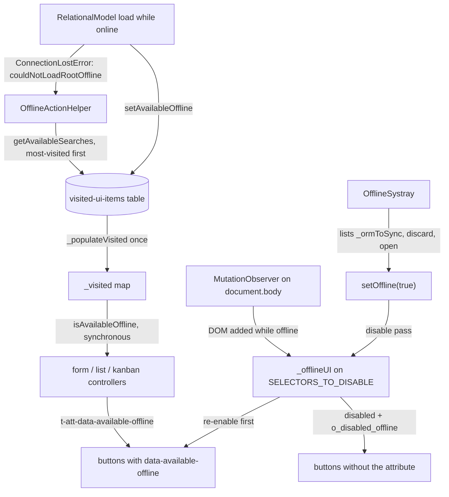

# Offline UI

Active contributors: Jorge, Aaron, Romain

## Purpose

When the connection drops, the client must keep the controls that work offline usable, make the rest visibly unavailable, and show what is queued for replay. This page covers the DOM-level mechanism (`data-available-offline` and the disable pass), the visited-UI bookkeeping that answers availability questions synchronously while rendering, the offline systray, and the fallback for views that were never visited online. The queue itself is described on [Sync queue](sync-queue.md); the tables backing the visited-UI data on [Local store](local-store.md).

## Key abstractions

| Name | File | Description |
| --- | --- | --- |
| `data-available-offline` | `addons/web/static/src/core/offline/offline_plugin.js` | Attribute that keeps an interactive element enabled while offline |
| `SELECTORS_TO_DISABLE` | `addons/web/static/src/core/offline/offline_plugin.js` | `button:not([data-available-offline]):not([disabled])`, the elements disabled offline |
| `isAvailableOffline()` | `addons/web/static/src/core/offline/offline_plugin.js` | Synchronous answer from the in-memory `_visited` map |
| `getAvailableSearches()` | `addons/web/static/src/core/offline/offline_plugin.js` | Remembered search states for an action/view type, most-visited first |
| `_setAvailableOffline` | `addons/web/static/src/model/relational_model/relational_model.js` | Marks each successfully loaded view as available offline |
| `OfflineSystray` | `addons/web/static/src/webclient/offline_systray/offline_systray.js` | Systray item (sequence 1000) listing queued calls |
| `OfflineActionHelper` | `addons/web/static/src/views/offline_action_helper.js` | Fallback offering remembered searches for never-visited views |
| `OfflineSearchBar` | `addons/web/static/src/search/search_bar/offline_search_bar.js` | Search bar variant listing remembered searches while offline |

## How it works

### The `data-available-offline` attribute

On going offline, `_offlineUI()` in `addons/web/static/src/core/offline/offline_plugin.js` first re-enables everything matching `.o_disabled_offline[data-available-offline]`, then finds every element matching `SELECTORS_TO_DISABLE` (`button:not([data-available-offline]):not([disabled])`) and sets `disabled` plus the `o_disabled_offline` class on it. `_onlineUI()` removes both from every `.o_disabled_offline` element on reconnection. The attribute must sit on the interactive element itself, the `<button>`, not on a wrapper: the selector matches the button node, so a control whose own node lacks it is disabled while offline. A `MutationObserver` on `document.body` (`childList`, `subtree`, `attributeFilter: ["data-available-offline"]`) re-runs `_offlineUI()` for DOM added or changed while offline, so dialogs and dropdowns opened offline get the same treatment.

Views compute the attribute dynamically with `t-att-data-available-offline`:

- Form: the New button checks `isAvailableOffline(actionId, "form", false)` (`addons/web/static/src/views/form/form_controller.js`, template in `addons/web/static/src/views/form/form_controller.xml`).
- Kanban: quick-create kanbans check `"kanban_quick_create"`, others fall back to `"form"` (`addons/web/static/src/views/kanban/kanban_controller.js`).
- List: editable, ungrouped lists check `"list_quick_create"`, others fall back to `"form"` (`addons/web/static/src/views/list/list_controller.js`).

Other permanently tagged elements are the ones that only need the local DOM to work: the form-dialog Ok and Close buttons (`addons/web/static/src/views/view_dialogs/form_view_dialog.xml`), the kanban quick-create Add and Cancel buttons (`addons/web/static/src/views/kanban/kanban_record_quick_create.xml`), the selection-box Unselect All (`addons/web/static/src/views/view_components/selection_box.xml`), and the systray's own button.

### Visited-UI marking and lookup

`_setAvailableOffline(config, result)` in `addons/web/static/src/model/relational_model/relational_model.js` runs from the RPC disk-cache callback after each load while online, and calls `setAvailableOffline` on the plugin. Mono-record loads (forms) store the record id, or mark the `<viewType>_quick_create` variant when a list or kanban quick-creates; multi-record loads store the current search state, keyed by search key with a use count, deleted and re-added on each visit so recency is tracked, and only when the result actually contained records. Keys are `JSON.stringify({action, viewType, resId})` in the `visited-ui-items` table (see [Local store](local-store.md)).

On going offline, `_populateVisited()` reads all keys once and builds the plain `_visited` object, because IndexedDB reads are async while rendering needs the answer now. `isAvailableOffline(actionId, [viewType], [resId])` then answers synchronously: whether the action was visited at all, whether a view type of it was, or for forms whether a specific record id was. `getAvailableSearches(actionId, viewType)` returns the remembered search states, most-visited first (last-visited first, then a stable sort by use count).

If a load fails anyway (`ConnectionLostError`), `RelationalModel.load` sets `couldNotLoadRootOffline`, and the list and kanban controllers render `OfflineActionHelper` instead of the view. It shows "There is no data to display offline for the given filters" and a "Reset Filters" button, tagged `data-available-offline`, that applies the first remembered search, the most-used one (`addons/web/static/src/views/offline_action_helper.js`, template `web.OfflineActionHelper` in `addons/web/static/src/views/offline_action_helper.xml`). The same search list feeds `OfflineSearchBar` in `addons/web/static/src/search/search_bar/offline_search_bar.js`: while offline, the list and kanban controllers swap the normal `SearchBar` for it (`addons/web/static/src/views/list/list_controller.xml`, `addons/web/static/src/views/kanban/kanban_controller.xml`).

The navbar gates app-menu entries the same way: `_isAvailable(menu)` in `addons/web/static/src/webclient/navbar/navbar.js` checks `isAvailableOffline(menu.actionID)`, and entries that fail get the `o_disabled_offline` class.

### The offline systray

The systray item (`addons/web/static/src/webclient/offline_systray/offline_systray.js`, registered in the `systray` registry as `"offline"` at sequence 1000) renders only while offline or while calls are queued, and its own button carries `data-available-offline`: clicking it triggers `checkConnection()` immediately.

Entries come from the plugin's `_ormToSync` signal (see [Sync queue](sync-queue.md)). `groupEntries` groups them by `extras.actionName` and sorts each group by `extras.timeStamp`; each row shows the record display name, a status badge, and a discard button. Status comes from the method: `web_save` with empty `args[0]` is Created, `web_save` with ids is Edited, `unlink`/`web_unlink` is Deleted, `action_archive` is Archived, `action_unarchive` is Unarchived (`STATUS` map, colors 10, 3, 1, 2, 4). Tooltips show the timestamp, the records, and for saves the old and new values from `extras.originalValues` and `extras.changes` (`addons/web/static/src/webclient/offline_systray/offline_systray.xml`).

The badge state: while `syncingORM` a spinner and "Syncing"; while offline a warning badge, `link_off` icon and "Working offline"; when any entry has `extras.error` a danger badge and "Sync issues". Text follows syncing, then offline, then error, while color follows error, then offline, so an offline state with parked failures shows "Working offline" in danger colors. On small screens the entry renders as an icon-only clickable div with the label as aria-label and tooltip, and `text-*` color classes instead of `text-bg-*` (`uiService.isSmall`, see [Mobile web](../mobile-web.md)).

Per-entry actions:

- **Discard** opens a `ConfirmationDialog` ("Discard offline change") and calls `removeScheduledORM(id)`, deleting the entry from memory and the `orm-to-sync` table.
- **Open** is enabled only for `web_save` entries from a form view whose record is available offline while offline (`isClickable`); it calls `doAction` with `props.offlineId`, and `FormController.onRootLoaded` in `addons/web/static/src/views/form/form_controller.js` re-applies the queued values through `Record.setOfflineChanges` in `addons/web/static/src/model/relational_model/record.js`. While online, opening also dequeues the entry; while offline the entry stays queued for the next sync.

## Integration points

- The disable pass and the observer are owned by `OfflinePlugin`; views only decide availability by computing the attribute in their templates.
- The producers and the visited-UI marking both live in the relational model layer, described on [Relational model](../../apps/web/relational-model.md).
- The systray consumes the same `_ormToSync` signal as the replay loop, so the display and the queue cannot drift apart.
- CRM audits every surface it adds against this gating; the inventory is on [Offline surface inventory](../../apps/crm/offline-surface-inventory.md).

## Entry points for modification

Availability rules change in two places: what gets marked (the `viewType` keys and search storage in `setAvailableOffline` in `addons/web/static/src/core/offline/offline_plugin.js`, fed by `_setAvailableOffline` in `addons/web/static/src/model/relational_model/relational_model.js`) and what gets disabled (`SELECTORS_TO_DISABLE` and `_offlineUI`). A control stays usable offline only if its own interactive element carries the attribute; when adding one, render it with `t-att-data-available-offline` computed from `isAvailableOffline`. Systray presentation changes go in `addons/web/static/src/webclient/offline_systray/offline_systray.js` and its `.xml` template. Never widen the selector to elements the offline framework cannot honor; the gating must not promise behavior the queue cannot deliver.

## Key source files

| File | Purpose |
| --- | --- |
| `addons/web/static/src/core/offline/offline_plugin.js` | `setOffline`, `_offlineUI`/`_onlineUI`, `_visited`, `isAvailableOffline`, `getAvailableSearches` |
| `addons/web/static/src/webclient/offline_systray/offline_systray.js` | Systray item: grouping, badges, discard, open |
| `addons/web/static/src/webclient/offline_systray/offline_systray.xml` | Systray templates, small-screen variant, tooltip |
| `addons/web/static/src/views/offline_action_helper.js` | Never-visited view fallback, "Reset Filters" |
| `addons/web/static/src/views/offline_action_helper.xml` | `web.OfflineActionHelper` template |
| `addons/web/static/src/model/relational_model/relational_model.js` | `_setAvailableOffline`, `couldNotLoadRootOffline` |
| `addons/web/static/src/model/relational_model/record.js` | `setOfflineChanges` for reopening a queued save |
| `addons/web/static/src/views/form/form_controller.js` | New-button availability, `onRootLoaded` offlineId handling |
| `addons/web/static/src/views/list/list_controller.js` | `OfflineActionHelper` and `OfflineSearchBar` wiring |
| `addons/web/static/src/views/kanban/kanban_controller.js` | Same wiring for kanban |
| `addons/web/static/src/webclient/navbar/navbar.js` | `_isAvailable` gating of app-menu entries |

## Related pages

- [Offline and PWA](index.md)
- [Sync queue](sync-queue.md)
- [Local store](local-store.md)
- [Mobile web](../mobile-web.md)
- [Offline surface inventory](../../apps/crm/offline-surface-inventory.md)
- [Offline CRM](../../apps/crm/offline-crm.md)
- [Relational model](../../apps/web/relational-model.md)
- [Debugging](../../how-to-contribute/debugging.md)
