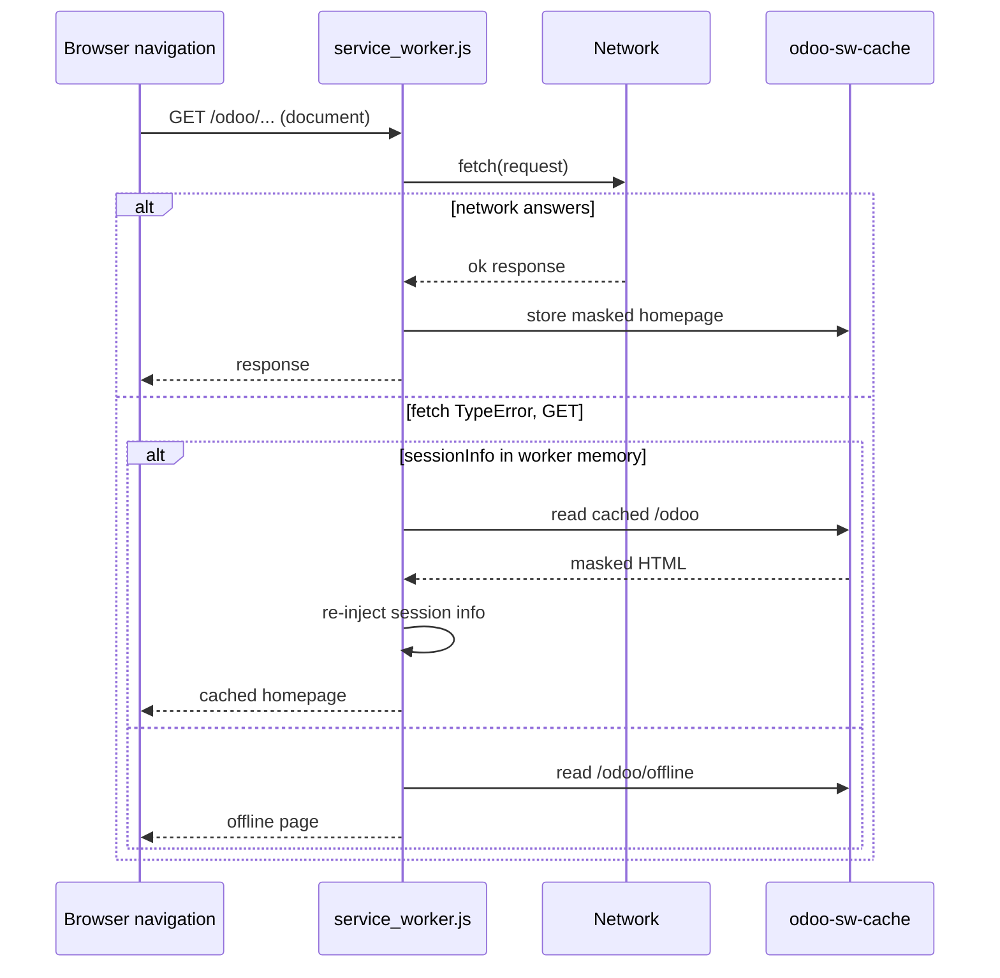
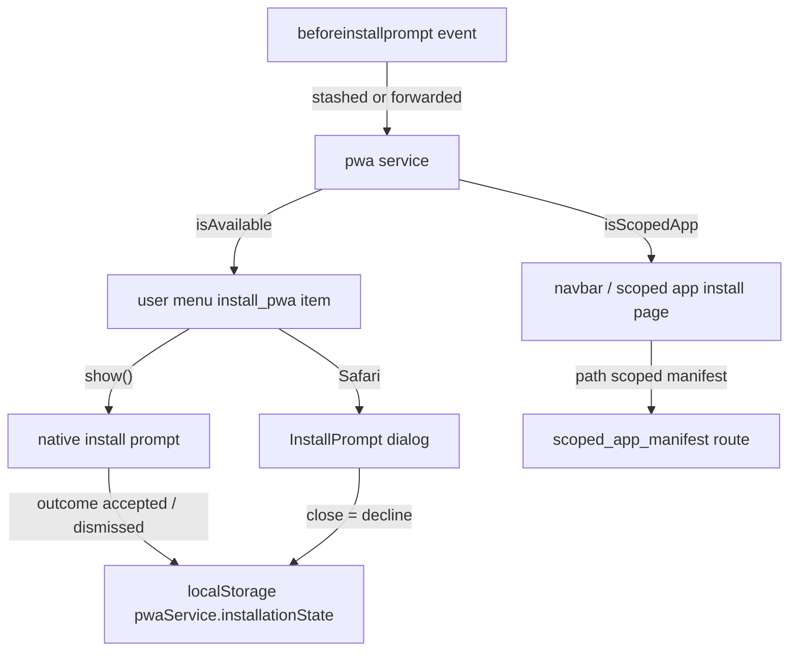

# Service worker and install

Active contributors: Jorge, Aaron, Romain

## Purpose

The service worker makes the web client load without a network: it caches the homepage and an offline page and serves them when a navigation fails. The same machinery makes the client installable: a web manifest, install-prompt handling and per-app scoped installs. One worker and one manifest cover everything under `/odoo`; there is no per-addon worker. This page covers the worker, the controller that serves it, and the PWA install flow; the local data caches are a separate system described on [Local store](local-store.md).

## Key abstractions

| Name | File | Description |
| --- | --- | --- |
| Service worker | `addons/web/static/src/service_worker.js` | Network-first document navigation, cached homepage and offline page fallback |
| Session-info masking | `addons/web/static/src/service_worker.js` | `odoo.__session_info__` scraped, masked with `@@@session_info_secret@@@`, re-injected on serve |
| `WebManifest` | `addons/web/controllers/webmanifest.py` | `/web/manifest.webmanifest`, `/web/service-worker.js`, `/odoo/offline`, `/scoped_app*` routes |
| `_has_share_target()` | `addons/web/controllers/webmanifest.py` | Manifest extension point, `False` in web; addons flip it to `True` |
| pwa service | `addons/web/static/src/core/pwa/pwa_service.js` | `beforeinstallprompt` capture, install state in localStorage |
| `InstallPrompt` | `addons/web/static/src/core/pwa/install_prompt.js` | Dialog with Safari pin-to-home / add-to-dock instructions |
| Scoped app | `addons/web/controllers/webmanifest.py` | Per-app manifest with its own scope so installs do not overlap |
| share_target service | `addons/web/static/src/webclient/share_target/share_target_service.js` | Page side of the share-target relay, driven by the `share_target_items` registry |

## How it works

### Registration

`registerServiceWorker()` in `addons/web/static/src/webclient/webclient.js` (run from `onWillStart`) calls `navigator.serviceWorker.register("/web/service-worker.js", { scope: "/odoo" })`. The controller route in `addons/web/controllers/webmanifest.py` serves that script with the `Service-Worker-Allowed: /odoo` header, which is what lets a script served from `/web` control `/odoo`. The webclient resolves a `serviceWorkerIsActivated` promise when the worker reaches the `activated` state, and on `navigator.serviceWorker.ready` with no controller (a hard refresh produced an uncontrolled page) it triggers `rpcBus.trigger("CLEAR-CACHES")`, which also invalidates the offline tables (see [Local store](local-store.md)).

### Caching and session-info masking

At install the worker (`addons/web/static/src/service_worker.js`) fetches `/odoo` and stores it (the worker registers only after the page's own fetch, so it must fetch the homepage itself), and `cache.add`s `/odoo/offline`, both into the `odoo-sw-cache` cache. `storeDataOnCache()` reads the response text, scrapes `odoo.__session_info__ = {...};` with a regular expression, keeps the fresh JSON in a worker-memory variable (`sessionInfo`), and puts a copy of the page into the cache with the session info replaced by the literal `@@@session_info_secret@@@`. The masked copy is what sits in cache storage; the live values only exist in the worker's RAM. `readDataOnCache()` reverses this when serving: it replaces every `@@@session_info_secret@@@` back with the in-memory `sessionInfo`, and falls back to the cached `/odoo` when a deeper URL such as `/odoo/project` is not in the cache.

### Navigation and offline fallback

The `fetch` handler classifies requests:

- POSTs whose URL carries a `share_target` search param go to the share-target relay.
- Document navigations (request mode `navigate` plus destination `document`, or an `accept` header containing `text/html`) go to `navigateOrDisplayOfflinePage()`: try the network; on success store a fresh masked copy (skipped when `debug=assets`, so debug-asset reloads do not poison the cache); on a GET fetch `TypeError` matching the browser-specific messages ("Failed to fetch" in Chromium, "Load failed" in WebKit, "NetworkError when attempting to fetch resource." in Firefox), serve the cached homepage if a `sessionInfo` exists, otherwise the cached `/odoo/offline`; if neither exists, rethrow.
- Everything else (RPCs, assets) passes through untouched.

The offline page is the `web.webclient_offline` template in `addons/web/views/webclient_templates.xml`, rendered by the `/odoo/offline` route: it checks the `color_scheme=dark` cookie for a dark background (`#25262b` with white text), reloads itself when the browser fires the `online` event, and offers a "Check again" button that reloads.

### Share-target relay

When the manifest declares a share target, an OS share targeted at the PWA POSTs to `/odoo?share_target=trigger`. `serveShareTarget()` responds with a redirect to a plain GET of `/odoo?share_target=trigger` (so a refresh does not resend the data), then waits for the page to announce itself with the `"odoo_share_target"` message (`waitingMessage()`), reads the posted form data, and `postMessage`s the files back to the client as `{shared_files, action: "odoo_share_target_ack"}`. The page side is the `share_target` service in `addons/web/static/src/webclient/share_target/share_target_service.js`: on `WEB_CLIENT_READY`, when at least one component is registered in the `share_target_items` registry, it posts the ready message, resolves on the ack and opens the `ShareTargetDialog`. Addons register their item in that registry; crm's `CrmShareTargetItem` extends web's `ShareTargetItem` base (`addons/web/static/src/webclient/share_target/share_target_item.js`), see [Offline CRM](../../apps/crm/offline-crm.md).

### `user_logout`

The logout item in `addons/web/static/src/webclient/user_menu/user_menu_items.js` posts the string `"user_logout"` to the service worker controller before posting the logout route. The worker's `message` listener sets `sessionInfo = null`, so the cached homepage can no longer be re-injected with that session's data. The same listener resolves pending `waitingMessage` calls.

### The controller routes

`WebManifest` in `addons/web/controllers/webmanifest.py` serves:

- `/web/manifest.webmanifest`: name from the `web.web_app_name` config parameter (default `Odoo`), `scope` and `start_url` `/odoo`, `display: standalone`, theme and background `#714B67`, 192 and 512 px icons, and app shortcuts for the installed modules among `mail`, `crm`, `project`, `project_todo`.
- `/web/service-worker.js`: the worker script with the `Service-Worker-Allowed: /odoo` header.
- `/odoo/offline`: the `web.webclient_offline` template.
- `/scoped_app`, `/scoped_app_icon_png`, `/web/manifest.scoped_app_manifest`: the per-app install page (`web.webclient_scoped_app`), a Safari-ready 180x180 PNG icon, and a manifest whose `scope` and `start_url` are the app's own path, so two installed apps never overlap scopes.

`_has_share_target()` returns `False` in web; when it returns `True` the manifest gains the `share_target` entry (action `/odoo?share_target=trigger`, POST, `multipart/form-data`, files under the `externalMedia` name accepting images, videos and applications). Five addons subclass `WebManifest` and flip exactly that method to `True`: `crm`, `project`, `hr_holidays`, `hr_expense` and `account`.

### Install prompts

The `"pwa"` service in `addons/web/static/src/core/pwa/pwa_service.js` captures `beforeinstallprompt` at module load, before the webclient starts, because browsers can fire it too early: the listener stashes the event in `BEFOREINSTALLPROMPT_EVENT`, or forwards it to the service through `REGISTER_BEFOREINSTALLPROMPT_EVENT` when the service has already started. The event only fires when a native prompt is possible, so it excludes incognito tabs and already-installed apps.

The service exposes a state proxy: `canPromptToInstall`, `isAvailable`, `isScopedApp`, `isSupportedOnBrowser`, `startUrl`, plus `show()`, `decline()`, `getManifest()` and `hasScopeBeenInstalled()`. `isSupportedOnBrowser` requires `BeforeInstallPromptEvent` or Safari (iOS at any version, macOS Safari 17+) while not already running standalone. Install state is persisted in localStorage under `pwaService.installationState`, keyed by start URL, with `"accepted"` and `"dismissed"` values; `decline()` writes `"dismissed"` so the prompt is not offered again. `show()` calls the native prompt and records its outcome, or on Safari opens the `InstallPrompt` dialog (`addons/web/static/src/core/pwa/install_prompt.js`, template `web.InstallPrompt`) with the steps to follow: share icon then "Add to home screen" on iOS, File menu then "Add to dock" on macOS.

Surface points: the user menu's `install_pwa` item (`addons/web/static/src/webclient/user_menu/user_menu_items.js`, sequence 65; hidden when unavailable or already running standalone, and swapped for a scoped-app install for the `barcode`, `field-service` and `shop-floor` apps), and the navbar's `isScopedApp` check in `addons/web/static/src/webclient/navbar/navbar.js`. How CRM uses the installed app on phones is covered on [Mobile CRM](../../apps/crm/mobile-crm.md) and [Mobile web](../mobile-web.md).

## Integration points

- Registered from `addons/web/static/src/webclient/webclient.js`; served by `addons/web/controllers/webmanifest.py`.
- The worker is a standalone script (`// @odoo-module ignore`), shares no modules with the client, and talks to the page only through `postMessage`.
- The manifest is extended only through the `_has_share_target()` hook and the `share_target_items` registry; crm does both from `addons/crm/controllers/webmanifest.py` and `addons/crm/static/src/webclient/share_target/`.
- The worker's `odoo-sw-cache` holds pages only; the offline data caches (queue, visited UI, many2x) are separate (see [Local store](local-store.md)).

## Entry points for modification

The worker is a single file, `addons/web/static/src/service_worker.js`; change caching or fallback policy there, and keep the masked session info out of cache storage as-is. Manifest changes go in `_get_webmanifest` in `addons/web/controllers/webmanifest.py`; addon-specific manifest features go through subclassing the controller, never by editing web. Install UX changes go in `addons/web/static/src/core/pwa/pwa_service.js`.

## Key source files

| File | Purpose |
| --- | --- |
| `addons/web/static/src/service_worker.js` | The shared worker: caching, masking, fallback, share relay, logout |
| `addons/web/controllers/webmanifest.py` | Manifest, worker, offline page and scoped-app routes |
| `addons/web/views/webclient_templates.xml` | `web.webclient_offline` and `web.webclient_scoped_app` templates |
| `addons/web/static/src/webclient/webclient.js` | Worker registration and activation handling |
| `addons/web/static/src/core/pwa/pwa_service.js` | `"pwa"` service: prompt capture, install state |
| `addons/web/static/src/core/pwa/install_prompt.js` | Safari install instructions dialog |
| `addons/web/static/src/webclient/user_menu/user_menu_items.js` | `install_pwa` item, `user_logout` message |
| `addons/web/static/src/webclient/share_target/share_target_service.js` | Page side of the share-target relay |

## Related pages

- [Offline and PWA](index.md)
- [Local store](local-store.md)
- [Offline UI](offline-ui.md)
- [Mobile web](../mobile-web.md)
- [Offline CRM](../../apps/crm/offline-crm.md)
- [Mobile CRM](../../apps/crm/mobile-crm.md)
- [Web client platform](../../apps/web/index.md)
- [Debugging](../../how-to-contribute/debugging.md)
