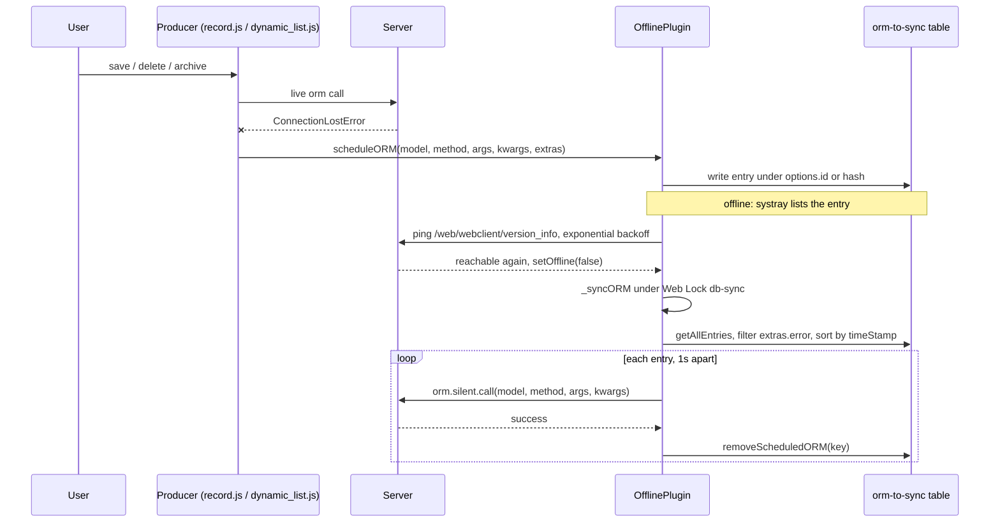

# Sync queue

Active contributors: Jorge, Aaron, Romain

## Purpose

The sync queue records ORM writes that fail because the connection is lost and replays them in order once the connection is back. It is the part of the offline stack that makes offline edits durable: entries are persisted in the `orm-to-sync` IndexedDB table, so they survive reloads and browser restarts, and replay is serialized across tabs with a Web Lock so two tabs never send the same write twice. The queue lives in `OfflinePlugin` (`addons/web/static/src/core/offline/offline_plugin.js`); the code that fills it lives in the relational model layer.

## Key abstractions

| Name | File | Description |
| --- | --- | --- |
| `scheduleORM()` | `addons/web/static/src/core/offline/offline_plugin.js` | Persists one ORM call verbatim in the `orm-to-sync` table |
| Entry | `addons/web/static/src/core/offline/offline_plugin.js` | `{model, method, args, kwargs, extras}`, stored JSON-stringified |
| Entry key | `addons/web/static/src/core/offline/offline_plugin.js` | Caller's `options.id`, else `hashCode(JSON.stringify(value))` |
| `extras` | `addons/web/static/src/model/relational_model/utils.js` | Systray metadata: `actionId`, `actionName`, `viewType`, `timeStamp`, `displayName(s)`, plus `changes`/`originalValues` for saves |
| `_syncORM()` | `addons/web/static/src/core/offline/offline_plugin.js` | Timestamp-ordered replay under the `db-sync` Web Lock |
| Parked entry | `addons/web/static/src/core/offline/offline_plugin.js` | Entry with `extras.error`, excluded from replay until the user acts |
| `db-sync` lock | `addons/web/static/src/core/offline/offline_plugin.js` | `navigator.locks.request("db-sync", ...)`, one replaying tab at a time |

## How it works

### Scheduling an entry

`scheduleORM(model, method, args, kwargs, options)` in `addons/web/static/src/core/offline/offline_plugin.js` builds `{model, method, args, kwargs, extras: options.extras}` and writes it, JSON-stringified, into the `orm-to-sync` table. The key is `options.id ?? hashCode(JSON.stringify(value))` (`hashCode` is in `addons/web/static/src/core/utils/strings.js`). Passing the same `options.id` again overwrites the previous entry, so repeated saves of one record collapse into one queued call. Outside a secure context the method throws `NonSecureContextError` (`addons/web/static/src/core/errors/non_secure_context_error.js`); nothing is queued.

### Producers

All producers catch `ConnectionLostError` (from `addons/web/static/src/core/network/rpc.js`) around the live ORM call and queue the same operation instead:

| Producer | File | Queued method |
| --- | --- | --- |
| Form save | `addons/web/static/src/model/relational_model/record.js` (`_save` catch calls `_offlineSave`) | `web_save` with `[resIds, changes]` |
| Form delete | `addons/web/static/src/model/relational_model/record.js` (`delete`) | `web_unlink` with `[[resId]]` |
| Form archive/unarchive | `addons/web/static/src/model/relational_model/record.js` (`_toggleArchive`) | `action_archive` / `action_unarchive` |
| List or kanban delete | `addons/web/static/src/model/relational_model/dynamic_list.js` (`_deleteRecords`) | `web_unlink` with the selected resIds |
| List or kanban archive | `addons/web/static/src/model/relational_model/dynamic_list.js` (`_toggleArchive`) | `action_archive` / `action_unarchive` |
| Programmatic multi-save | `addons/web/static/src/model/relational_model/dynamic_list.js` (`_saveRecords`) | `web_save` per record via `record._offlineSave()` |

`_offlineSave()` in `addons/web/static/src/model/relational_model/record.js` keeps one `options.id` (`this._offlineId`) and one timestamp (`this._offlineTimeStamp`, `Date.now()` on the first offline save) for the record, so later offline saves merge into a single entry that keeps its original place in replay order. It also stores `changes` and `originalValues`, formatted by `_formatOfflineValues`, so the systray can show what changed.

The base `extras` come from `getScheduleORMExtras` in `addons/web/static/src/model/relational_model/utils.js`: `actionId`, `actionName`, `viewType`, `timeStamp`, and `displayName` (or `displayNames` plus a "%s Records" label for a selection). `getOfflineDisplayName` in the same file picks the best display field (`complete_name`, `name`, `display_name`, `x_name`, `x_studio_name`).

### Replay

`_syncORM()` in `addons/web/static/src/core/offline/offline_plugin.js` runs when the connection returns (`setOffline(false)`) and once about 3 seconds after startup, so entries queued in a previous session are still sent. The flow:

1. Return early outside a secure context, then take the Web Lock: `navigator.locks.request("db-sync", ...)`, so only one tab replays at a time.
2. `_updateScheduledORMList()` reloads every `orm-to-sync` entry into the reactive `_ormToSync` object, which the systray renders.
3. Filter out entries with `extras.error` (parked entries stay queued until discarded or reopened), sort the rest by `extras.timeStamp` ascending.
4. Replay each entry verbatim with `orm.silent.call(value.model, value.method, value.args, value.kwargs)` (`orm.silent` is defined in `addons/web/static/src/core/orm_plugin.js`), pausing 1 second between calls.
5. On success, `removeScheduledORM(key)` deletes the entry from memory and IndexedDB. On `ConnectionLostError`, break out of the loop: the connection dropped again and the remaining entries stay queued. On any other error, re-queue the same entry under the same key with `extras.error` set to `e.message`, or `e.data.name + " - " + e.data.message` when the server sent structured data.

The `syncingORM` signal is true during the whole pass, which is what shows the spinner in the systray (see [Offline UI](offline-ui.md)).

### Re-applying a queued save

`Record.setOfflineChanges(offlineId)` in `addons/web/static/src/model/relational_model/record.js` finds the queued `web_save` entry for the record (by id, or by matching `extras.actionId`, `extras.viewType === "form"` and `args[0][0] === resId`) and re-applies `extras.changes` through the normal `update()` path. The systray's Open action uses this: it opens the form with `props.offlineId`, and `FormController.onRootLoaded` in `addons/web/static/src/views/form/form_controller.js` calls `setOfflineChanges` so the user sees, and can keep editing, the queued values.

### Conflict semantics

By design there is none. Replay is ordered by timestamp only, the last write wins, and there is no `write_date` comparison, no field-level merge and no conflict dialog. An entry whose replay fails is parked with `extras.error` and surfaced by the systray as a "Sync issues" badge; it is excluded from later replays until the user discards or reopens it. The rationale is documented on [Design decisions](../../background/design-decisions.md).

### What the verbatim rule forbids

Replay sends exactly the stored `model`, `method`, `args` and `kwargs`, with no id remapping between calls. Anything that needs a server response at save time therefore cannot be queued: onchange-dependent flows, transient-model wizards, and calls whose arguments embed an id another queued call has to produce first. The producers above only queue plain write-shaped methods for this reason; the restriction is also a project rule in `AGENTS.md`.

## Integration points

- Produced from the relational model layer, described on [Relational model](../../apps/web/relational-model.md).
- Stored through the `IndexedDB` wrapper, described on [Local store](local-store.md): the `orm-to-sync` table, the `db-sync` Web Lock, the version wipe.
- Rendered by the systray in `addons/web/static/src/webclient/offline_systray/offline_systray.js` (see [Offline UI](offline-ui.md)).
- The temporary `"offline"` service bridge at the bottom of `addons/web/static/src/core/offline/offline_plugin.js` exposes the queue as `.scheduledORM`; new code reads `_ormToSync` through `usePlugin(OfflinePlugin)`.
- CRM builds its offline flows on top of these producers without adding new ones; see [Offline CRM](../../apps/crm/offline-crm.md).

## Entry points for modification

To queue a new operation, add the `ConnectionLostError` catch at the call site and call `scheduleORM` with `extras` from `getScheduleORMExtras`, giving the entry a stable `options.id` when repeated saves should overwrite. To change replay behavior (ordering, pause, parking), the whole loop is `_syncORM()` in `addons/web/static/src/core/offline/offline_plugin.js`. Do not add conflict detection or id remapping; both break the design contract in `AGENTS.md`.

## Key source files

| File | Purpose |
| --- | --- |
| `addons/web/static/src/core/offline/offline_plugin.js` | `scheduleORM`, `_syncORM`, `removeScheduledORM`, `_ormToSync` signal |
| `addons/web/static/src/model/relational_model/record.js` | Form save/delete/archive producers, `_offlineSave`, `setOfflineChanges` |
| `addons/web/static/src/model/relational_model/dynamic_list.js` | List/kanban delete, archive and multi-save producers |
| `addons/web/static/src/model/relational_model/utils.js` | `getScheduleORMExtras`, `getOfflineDisplayName` |
| `addons/web/static/src/core/orm_plugin.js` | `orm.silent.call` used for replay |
| `addons/web/static/src/core/utils/strings.js` | `hashCode` fallback key |
| `addons/web/static/src/core/errors/non_secure_context_error.js` | Thrown when queueing outside a secure context |
| `addons/web/static/src/core/network/rpc.js` | `ConnectionLostError` |
| `addons/web/static/src/core/utils/indexed_db.js` | `orm-to-sync` table storage |
| `addons/web/static/src/views/form/form_controller.js` | `onRootLoaded` applies `offlineId` changes |

## Related pages

- [Offline and PWA](index.md)
- [Local store](local-store.md)
- [Offline UI](offline-ui.md)
- [Relational model](../../apps/web/relational-model.md)
- [Offline CRM](../../apps/crm/offline-crm.md)
- [Design decisions](../../background/design-decisions.md)
- [Debugging](../../how-to-contribute/debugging.md)
