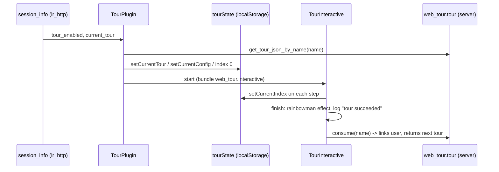

# Onboarding tours

Active contributors: Pierre, qsm-odoo, Christophe

## Purpose

A tour is a scripted sequence of steps, each anchored to a CSS trigger, that either guides a real user with a pointer bubble (interactive mode) or drives the browser itself (automatic mode). The framework is `addons/web_tour`, and business addons contribute the definitions. The same machinery powers first-run onboarding and the browser-level integration tests of `addons/crm`, including this fork's offline end-to-end tour.

## Key components

| Name | File | Description |
| --- | --- | --- |
| `TourPlugin` | `addons/web_tour/static/src/tour_plugin.js` | Boots tours, validates steps, loads the runner bundles, exposes `odoo.startTour` / `odoo.isTourReady`. |
| `web_tour.tours` registry | `addons/web_tour/static/src/tour_plugin.js` | Client-side registry of tour definitions (`{ steps: () => [...], url? }`), validated on add. |
| `web_tour.tour` / `web_tour.tour.step` | `addons/web_tour/models/tour.py` | The database record: name (unique), starting URL, rainbowman message, sequence, `user_consumed_ids`; steps are optional rows. |
| `TourInteractive` / `TourAutomatic` | `addons/web_tour/static/src/tour_interactive/tour_interactive.js`, `addons/web_tour/static/src/tour_automatic/tour_automatic.js` | The two runners, lazily loaded from the `web_tour.interactive` / `web_tour.automatic` bundles. |
| `tourState` | `addons/web_tour/static/src/tour_state.js` | localStorage wrapper holding the running tour, its config, step index, and error flag. |
| `crm_tour` | `addons/crm/static/src/js/tours/crm.js`, `addons/crm/data/crm_tour.xml` | The CRM onboarding tour: steps in the registry, enablement and rainbowman message in data. |

## How it works

A tour definition is registered client-side: `registry.category("web_tour.tours").add(name, { steps: () => [...] })`. `TourPlugin` validates each step against a per-mode schema: `trigger` is required, `run` is a string or a non-empty function, `tooltipPosition` is one of top/bottom/left/right, and in automatic mode a step `timeout` must be between 0 and 60000 ms. A step's `isActive` array decides whether it runs at all (`TourStep.active` in `addons/web_tour/static/src/tour_step.js`): the recognized keywords are `auto`/`manual` (run mode), `community`/`enterprise` (edition, from the last part of `session.server_version_info`), and `mobile`/`desktop`, the last pair evaluated with `utils.isSmall()` from the [small-screen signal](mobile-web.md). Any other entry is treated as a selector that must be present. An inactive step is skipped, not failed.

On startup `TourPlugin.bootstrap()` returns immediately inside an iframe (`window.frameElement`), then checks three sources in order: a `?tour=<name>` URL parameter starts that tour in manual mode; a tour left in `tourState` is resumed if its config says `auto`/`robot` or tours are enabled for the user; otherwise `session.current_tour` starts the next onboarding tour. `session_info` gets `tour_enabled` and `current_tour` from `addons/web_tour/models/ir_http.py`, which calls `web_tour.tour.get_current_tour()`: the first non-custom tour the user has not consumed, ordered by `sequence, name, id`.

In manual mode the steps come from the database (`get_tour_json_by_name`); if the record has no `web_tour.tour.step` rows but a tour of the same name is in the registry, the plugin falls back to the registry steps. That is how CRM works: `addons/crm/data/crm_tour.xml` (in the manifest's data list) creates a stepless `web_tour.tour` record named `crm_tour` with `sequence` 10 and a custom `rainbow_man_message`, while the steps live in `addons/crm/static/src/js/tours/crm.js` — open the CRM app from the apps menu, quick-create the first opportunity, schedule an activity, and drag the record to a later column, starting from `stepUtils.showAppsMenuItem()` in `addons/web_tour/static/src/tour_utils.js`. In automatic mode the definition comes straight from the registry, with `waitUntilTourRegistered` polling for up to 5 seconds because a lazily loaded bundle may not be registered yet after a reload.

Persistence and completion are split between the browser and the server. `tourState` keeps `current_tour`, `current_tour.config`, `current_tour.index`, and `current_tour.on_error` in localStorage, so a page reload mid-tour resumes at the same step. Completion is recorded server-side: `TourInteractive.finish()` clears that state, shows the rainbowman effect with the message sanitized by DOMPurify, logs `tour succeeded`, and calls `web_tour.tour.consume()`, which links the user into `user_consumed_ids` and returns the next tour to chain. Whether a user sees tours at all is the `tour_enabled` field on `res.users` (`addons/web_tour/models/res_users.py`), computed true only for an admin on a database with no demo modules installed and outside tests, writable, and toggled by the debug-menu item in `addons/web_tour/static/src/widgets/onboarding_item.js`.

### Test tours

Test tours reuse the same runner in automatic mode. `HttpCase.start_tour` (`odoo/tests/common.py`) calls `browser_js` with `odoo.startTour(name, {stepDelay, debug})`, waits for `odoo.isTourReady(name)`, uses a 60 second default timeout, succeeds on the `tour succeeded` signal, and patches `res.users.tour_enabled` to `False` so an onboarding tour cannot hijack the run.

CRM's five test tours live in `addons/crm/static/tests/tours/` and reach the browser through the `web.assets_tests` glob `crm/static/tests/tours/**/*` in `addons/crm/__manifest__.py`:

| Tour | Driven from |
| --- | --- |
| `create_crm_team_tour` | `addons/crm/tests/test_sales_team_ui.py` (sales manager login) |
| `crm_email_and_phone_propagation_edit_save` | `addons/crm/tests/test_crm_ui.py` |
| `crm_forecast` | `addons/crm/tests/test_crm_ui.py` |
| `crm_rainbowman` | `addons/crm/tests/test_crm_ui.py` (fresh `temp_crm_user`) |
| `crm_offline_e2e_tour` | `addons/crm/tests/test_crm_offline_tour.py` |

`test_crm_ui.py` (`HttpCase` plus `TestCrmCommon`, tagged `post_install, -at_install`) also runs the onboarding `crm_tour` itself as a test. `crm_offline_e2e_tour` is this fork's addition: `TestCrmOffline` drives it at the mobile viewport (`browser_size = '375x667'`, `touch_enabled = True`, `timeout=120`), it walks the whole offline flow in one pass — pipeline online, open a lead, go offline in-page, edit the lead, quick-create another, schedule an activity, mark the lead won, reconnect — and the Python test then asserts on the server that every queued write landed. What that tour exercises is described in [Offline CRM](../apps/crm/offline-crm.md) and [Mobile CRM](../apps/crm/mobile-crm.md); the commands to run it are in [Testing](../how-to-contribute/testing.md).

The separate `addons/onboarding` module ("Onboarding Toolbox", depends on `web` only) is a different mechanism: progress panels built from `onboarding.onboarding` / `.step` and `onboarding.progress` / `.step` records rather than pointer tips. `addons/crm` depends on `web_tour`, not on `onboarding`.

## Integration points

- `addons/web_tour/static/src/tour_recorder/` records live interactions into a step list; `addons/web_tour/static/src/views/tour_list.js` with `addons/web_tour/views/tour_views.xml` give `web_tour.tour` its back-end views, and `export_js_file()` in `addons/web_tour/models/tour.py` dumps a database-defined tour back out as a registry-snippet attachment.
- `TourPlugin` depends on the ORM, effect, overlay, and recorder plugins, and keeps a temporary `tour_service` bridge (marked `@todo owl3 migration`) that installs `odoo.startTour` and `odoo.isTourReady` — the hooks the Python test helper calls.
- On the crm side: `'web_tour'` in the `depends` list and `'data/crm_tour.xml'` in the data list of `addons/crm/__manifest__.py`, and the test tours shipped through `web.assets_tests`.

## Entry points for modification

To add a guided tour to an addon, register the steps under `web_tour.tours` in `static/src/js/tours/` and add a `web_tour.tour` data record to the manifest's data list so the server offers it. To add a browser test, put the tour in `static/tests/tours/` (already covered by the `web.assets_tests` glob) and call `self.start_tour(...)` from a test module imported in `tests/__init__.py` — an unimported module is silently never collected. Debug an interactive tour by appending `?tour=<name>` to the URL, which starts it in manual mode without touching the consumed flags.

## Key source files

| File | Purpose |
| --- | --- |
| `addons/web_tour/static/src/tour_plugin.js` | Tour registry and validation, bootstrap/resume/start, runner bundle loading, debug-menu item. |
| `addons/web_tour/static/src/tour_state.js` | localStorage persistence of the running tour, config, index, and error flag. |
| `addons/web_tour/static/src/tour_step.js` | `TourStep`, including the `active` getter that applies the `isActive` filters. |
| `addons/web_tour/static/src/tour_utils.js` | `stepUtils` helpers used by addon tours (apps menu, save form, discard). |
| `addons/web_tour/static/src/tour_interactive/tour_interactive.js` | Guided runner: pointer updates, consume events, rainbowman finish, `consume()` call. |
| `addons/web_tour/static/src/tour_automatic/tour_automatic.js` | Automated runner used by tests; logs `tour succeeded`. |
| `addons/web_tour/static/src/tour_pointer/tour_pointer.js` | The pointer bubble component (with `.xml` and `.scss`). |
| `addons/web_tour/static/src/tour_helpers/tour_helpers_hoot.js` | The `run` actions (`click`, `edit`, `drag_and_drop`, …), patched onto `TourHelpers.prototype`. |
| `addons/web_tour/static/src/widgets/onboarding_item.js` | Debug-menu toggle calling `res.users.switch_tour_enabled`. |
| `addons/web_tour/models/tour.py` | `web_tour.tour` and `web_tour.tour.step`, `consume`, `get_current_tour`, `export_js_file`. |
| `addons/web_tour/models/res_users.py` | `tour_enabled` computation and `switch_tour_enabled`. |
| `addons/web_tour/models/ir_http.py` | Adds `tour_enabled` and `current_tour` to `session_info`. |
| `addons/crm/static/src/js/tours/crm.js` | The `crm_tour` onboarding steps. |
| `addons/crm/data/crm_tour.xml` | The `web_tour.tour` record that enables `crm_tour` and sets its rainbowman message. |
| `addons/crm/static/tests/tours/crm_offline_e2e_tour.js` | The fork's offline end-to-end test tour (mobile viewport, in-page offline simulation). |
| `addons/crm/tests/test_crm_ui.py` | `HttpCase` tests driving `crm_tour` and four of the test tours with `start_tour`. |
| `addons/crm/tests/test_crm_offline_tour.py` | `TestCrmOffline`: drives `crm_offline_e2e_tour` at 375x667 and asserts the synced state server-side. |
| `odoo/tests/common.py` | `HttpCase.start_tour`: `odoo.startTour`, readiness check, success signal, `tour_enabled` patch. |

## Related pages

- [Test framework](../systems/test-framework.md): `HttpCase`, `browser_js`, and how tour tests are collected.
- [Testing](../how-to-contribute/testing.md): running the Python and browser suites in this fork.
- [Offline CRM](../apps/crm/offline-crm.md) and [Mobile CRM](../apps/crm/mobile-crm.md): the CRM behavior the offline end-to-end tour exercises.
- [Mobile web](mobile-web.md): the `mobile`/`desktop` `isActive` keywords and the viewport they are evaluated against.
- [Glossary](../overview/glossary.md): rainbowman, presets, `js_class`.
