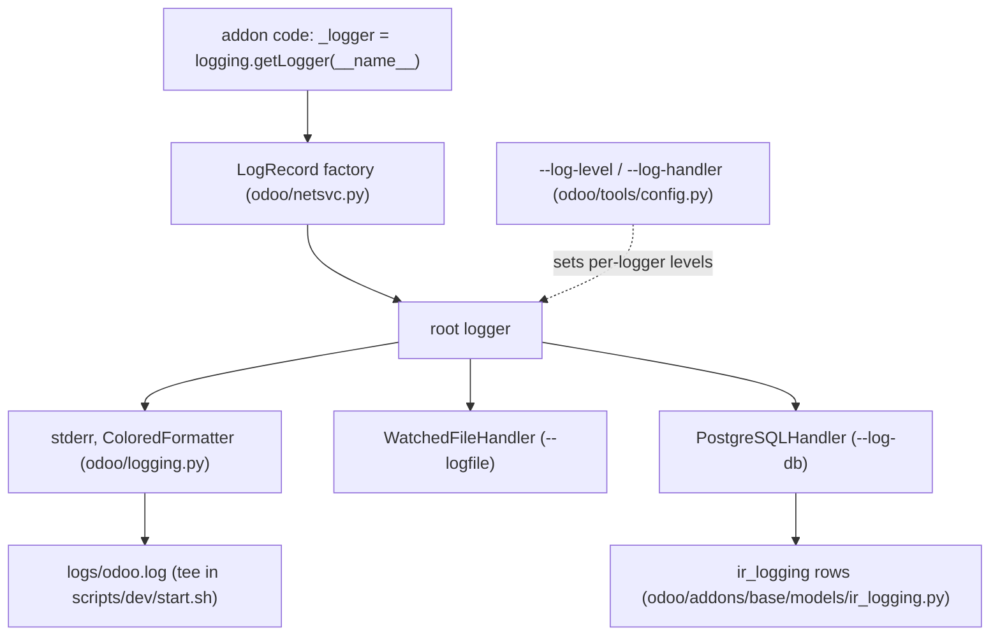

# Logging
Active contributors: Xavier, Raphael, Xavier-Do

## Purpose

Everything Odoo logs — ORM internals, access lines, SQL queries, your own `_logger` calls — flows through Python's `logging` module with Odoo-specific levels, formatters, and an optional database handler. This page covers how the pipeline is assembled, which options select verbosity, where logs land in this fork's dev environment, and how to add log statements of your own.

## Key tools and options

| Option / tool | Where | Effect |
| --- | --- | --- |
| `--log-level` | `odoo/tools/config.py` | Preset verbosity. Choices: `info` (default), `debug`, `debug_sql`, `debug_rpc`, `debug_rpc_answer`, `runbot`, `warn`, `error`, `critical`, `test`, `notset`. |
| `--log-handler MODULE:LEVEL` | `odoo/tools/config.py` | Repeatable per-logger level, e.g. `odoo.orm:DEBUG`. Default `:INFO`. |
| `--log-web` | `odoo/tools/config.py` | Shortcut for `--log-handler=odoo.http:DEBUG`. |
| `--log-sql` | `odoo/tools/config.py` | Shortcut for `--log-handler=odoo.sql_db:DEBUG`. |
| `--logfile` | `odoo/tools/config.py` | Write to a file instead of stderr (via `WatchedFileHandler`). |
| `--log-config` | `odoo/tools/config.py` | JSON or TOML `dictConfig` file that replaces the default pipeline. |
| `--syslog` | `odoo/tools/config.py` | Deprecated in Odoo 20; use `--log-config` with a syslog handler. |
| `--log-db` / `--log-db-level` | `odoo/tools/config.py` | Write records into the `ir.logging` table of that database, at that level (default `warning`). |
| `--log-level=test` | `scripts/dev/test-*.sh` | What the dev test scripts pass; see the note on legacy names below. |

## How it works

### Assembly: `init_logger()`

`odoo/netsvc.py:init_logger()` builds the pipeline once at startup:

- It installs a custom `LogRecord` factory (class `LogRecord` in `odoo/netsvc.py`) that attaches `thread_native`, `dbname`, and, during tests, metadata about the current test.
- It routes Python warnings into the log (`logging.captureWarnings(True)` plus a large filter list) and turns some deprecation noise off.
- A `--log-config` file, if given, is loaded with `logging.config.dictConfig` and replaces the rest unless it sets `keep_odoo_default`. The file sets `disable_existing_loggers = False` so loggers created at import time keep working.
- Otherwise it installs exactly one root handler: a stderr `StreamHandler` with `ColoredFormatter` (the default), a `SysLogHandler` when `--syslog` is set, or a `WatchedFileHandler` when `--logfile` is set.
- When `--log-db` is set it adds a `PostgreSQLHandler` on the root logger, at the level from `--log-db-level`.



### Levels, including the Odoo-specific ones

`--log-level` is translated into per-logger settings by `PSEUDOCONFIG_MAPPER` in `odoo/netsvc.py`:

| `--log-level` | Loggers set |
| --- | --- |
| `debug` | `odoo:DEBUG`, `odoo.sql_db:INFO` |
| `debug_sql` | `odoo.sql_db:DEBUG` |
| `info` | (nothing extra) |
| `runbot` | `odoo:RUNBOT` |
| `warn` / `error` / `critical` | `odoo:WARNING` / `ERROR` / `CRITICAL` |

`test`, `debug_rpc`, and `debug_rpc_answer` are still accepted by `--log-level` but no longer map to any configuration: they behave like `info`. `--log-level=test` is exactly what `scripts/dev/test-py.sh` and `scripts/dev/test-js.sh` pass.

There is one Odoo-specific numeric level: `RUNBOT = 25`, registered by `odoo/_monkeypatches/logging.py`, which also adds `logging.RUNBOT`, a `_logger.runbot()` method, and displays it as **INFO** in the level-name table. It marks verbose output useful only on the test platform (Chrome test helpers, migration timing). `odoo/loglevels.py` is smaller than its name suggests: it holds only the `LOG_*` string constants (`LOG_INFO`, `LOG_DEBUG`, ...) and `exception_to_unicode()`. There is no `TEST` level registered anywhere in this tree.

### `ir.logging`

`--log-db=DBNAME` adds `odoo/logging.py:PostgreSQLHandler`, which writes raw `INSERT`s into the `ir_logging` table of that database (or the current one when `--log-db=%d`). Writes bypass the ORM on purpose: an ORM insert touching `res_users` could deadlock a module upgrade on the `res_users` lock, as `odoo/addons/base/models/ir_logging.py` documents in its header. The model has fields `name`, `type`, `dbname`, `level`, `message`, `path`, `line`, `func`; `type` is `client` or `server`, and the handler writes `server` rows. The list, form, and search views live in `odoo/addons/base/views/ir_logging_views.xml`, reachable from the Settings menu `ir_logging_all_menu` in `odoo/addons/base/views/base_menus.xml`.

### Request and SQL logging

`odoo/http/server_log.py` writes one access line per request on the `odoo.http.server` logger: remote address, session id, request line (annotated with `model.method` when an RPC is running), status, body size, query count, query time, remaining time, and cursor mode. Query count and query time are color-graded — yellow above 100 queries / 0.1 s, red above 1000 / 3 s — and cursor mode is `ro`, `rw`, or a red `ro->rw` when a read-only attempt was retried as read/write. Request headers go to the child logger `odoo.http.server.headers`, which sits at WARNING unless explicitly lowered.

At the database layer, `Cursor.execute()` in `odoo/sql_db.py` logs every query at DEBUG on `odoo.sql_db`, prefixed with its delay and the formatted statement, and maintains the per-cursor `sql_log_count` plus per-thread `query_count`/`query_time` that feed the access line. With DEBUG on, closing a cursor also prints per-table read/write statistics (`print_log()` from `_close()`).

### Where dev logs land

`scripts/dev/start.sh` redirects everything the server prints into `logs/odoo.log` *and* the terminal (`exec > >(tee -a "$ODOO_LOG_FILE") 2>&1`; `ODOO_LOG_FILE` is defined in `scripts/dev/_common.sh`). First-run database initialization goes to `logs/db-init.log` and is appended into `logs/odoo.log` too. Every test or maintenance script writes its own `logs/<name>.log` — `logs/test-py-all.log`, `logs/db-init.log`, `logs/rebuild-assets.log` — and the profiling measurements go to `logs/measure-<name>.txt` ([Profiling](profiling.md)).

## Integration points

- The access line and SQL counters are the cheapest profiling signal; see [Profiling](profiling.md).
- `--logfile` and the service unit that sets it are described in [Deployment](../deployment.md).
- The access line describes the request cycle documented in [HTTP server](../systems/http-server.md); the workers that emit it are in [Server runtime](../systems/server-runtime.md).
- Reading these logs against a real symptom is covered in [Debugging](../how-to-contribute/debugging.md).

## Entry points for modification

To add a log statement, follow the universal pattern:

```python
import logging

_logger = logging.getLogger(__name__)

_logger.info("Assigned %s leads to team %s", len(leads), team.name)
```

`addons/crm/models/crm_lead.py:23` does exactly this (`_logger = logging.getLogger(__name__)`), and its Predictive Lead Scoring cron logs progress and failures with `_logger.info`/`_logger.warning` around lines 2418–2499. Prefer lazy `%s` arguments over pre-formatting the string, as `odoo/tools/profiler.py` does with `_logger.info('ir_profile %s (%s) created', self.profile_id, self.profile_session)`.

In tests, silence expected noise with the `mute_logger` context manager (class `mute_logger` in `odoo/tools/misc.py`) — for example `@mute_logger('odoo.models.unlink', 'odoo.addons.crm.models.crm_team')` in `addons/crm/tests/test_performances.py` — and use `_logger.runbot(...)` for output that only matters on the test platform.

## Key source files

| File | Purpose |
| --- | --- |
| `odoo/netsvc.py` | `init_logger()`, handlers, `PSEUDOCONFIG_MAPPER`, `LogRecord` factory. |
| `odoo/logging.py` | `ColoredFormatter`, `JSONFormatter`, `PostgreSQLHandler`, color constants. |
| `odoo/loglevels.py` | `LOG_*` constants and `exception_to_unicode()`. |
| `odoo/_monkeypatches/logging.py` | Registers `RUNBOT = 25`, `logging.Logger.runbot`, patches `WatchedFileHandler`. |
| `odoo/tools/config.py` | `--log-level`, `--log-handler`, `--log-web`, `--log-sql`, `--logfile`, `--log-db`, `--log-config`. |
| `odoo/http/server_log.py` | Per-request access line with SQL counters and color thresholds. |
| `odoo/sql_db.py` | Per-query DEBUG logging, `sql_log_count`, per-table statistics. |
| `odoo/addons/base/models/ir_logging.py` | `ir.logging` model, destination of `--log-db`. |
| `odoo/addons/base/views/ir_logging_views.xml` | `ir.logging` list/form/search views. |
| `odoo/addons/base/views/base_menus.xml` | `ir_logging_all_menu` under Settings. |
| `odoo/tools/misc.py` | `mute_logger` context manager. |
| `addons/crm/models/crm_lead.py` | Example `_logger` usage in this fork's addon. |
| `scripts/dev/start.sh`, `scripts/dev/_common.sh` | Tee server output to `logs/odoo.log`. |

## Related pages

- [Profiling](profiling.md) — the other half of [Monitoring](index.md).
- [Deployment](../deployment.md) — `--logfile`, the systemd unit, and log rotation.
- [Debugging](../how-to-contribute/debugging.md) — turning a symptom into a log query.
- [HTTP server](../systems/http-server.md) and [Server runtime](../systems/server-runtime.md).
