# Profiling
Active contributors: Xavier-Do, Krzysztof, Gorash

## Purpose

Odoo has a built-in request profiler: it records executed SQL queries with their call stacks and samples the Python stack periodically during a request or a test, stores the result in the `ir.profile` table, and renders it in the browser with speedscope. This page covers how to turn it on, what it records, and the cheaper SQL counters and dev-script measurements that usually answer the question first.

## Key tools

| Tool | Where | What it gives you |
| --- | --- | --- |
| `Profiler` context manager | `odoo/tools/profiler.py` | SQL entries with stacks, periodic stack samples, QWeb directive timing. |
| Debug-menu profiling | `addons/web/static/src/webclient/debug/profiling/` | Per-user toggle, collector selection, systray indicator. |
| `/web/set_profiling` | `addons/web/controllers/profiling.py` | HTTP entry that enables or disables profiling for the session. |
| `/web/speedscope/<ids>` | `addons/web/controllers/profiling.py` | Flamegraph viewer (plus JSON/HTML download and a memory view). |
| `/web/profile_config/<id>` | `addons/web/controllers/profiling.py` | Display options: combined, SQL-only, frames, aggregate SQL, constant time. |
| `assertQueryCount` | `odoo/tests/common.py` | In-test guard on the exact number of SQL queries. |
| `profile()` test helper | `odoo/tests/common.py` | Runs a test (warm and cold) under the profiler. |
| `run_measured` | `scripts/dev/_common.sh` | Wall time and peak RSS per dev-script run, via GNU `time -v`. |

## How it works

### The profiler and its collectors

The core is the `Profiler` context manager in `odoo/tools/profiler.py`. It takes named collectors and defaults to `['sql', 'traces_async']` when none are given:

- `sql` (`SQLCollector`) records every executed query — statement, delay, and the call stack that issued it, via per-thread `query_hooks` installed in `odoo/sql_db.py`.
- `traces_async` (`PeriodicCollector`) runs a background thread that samples the current stack, default every 0.001 s (`_default_interval`, clamped to 0.0001–5 s and overridable with the `traces_async_interval` param).
- `qweb` (`QwebCollector`) records QWeb directive execution.

Constructor parameters tune the run: `disable_gc`, `entry_count_limit`, `time_limit`, and `memory_profile` (RSS samples taken through `psutil`, pinned as `psutil==5.9.8` in `requirements.txt`). On exit the profiler INSERTs a row into `ir_profile` and logs `ir_profile <id> (<session>) created`; pass `db=None` and call `.json()` to dump the collected entries to a file instead. The `Nested` helper nests another context manager inside a profiler, so an inner block is profiled without re-entering `Profiler` directly.

There is **no `--profiling` command-line option** — nothing in `odoo/tools/config.py` registers one. Profiling is per user and switched on from the web client debug menu.

```mermaid
graph LR
    menu["debug menu (profiling_service.js)"] -->|"POST /web/set_profiling"| ctrl["Profiling controller (addons/web/controllers/profiling.py)"]
    ctrl -->|"session: profile_session"| sess["ir.profile.set_profiling() (ir_profile.py)"]
    sess --> req["request dispatch (odoo/http/router.py)"]
    req --> prof["Profiler + collectors (odoo/tools/profiler.py)"]
    prof --> row["ir_profile row"]
    row --> sp["/web/speedscope/&lt;ids&gt;"]
```



### Turning it on

`addons/web/static/src/webclient/debug/profiling/profiling_service.js` registers the `"profiling"` service, but only when the debug mode plugin is active. The debug menu shows a `ProfilingItem`; its systray item reflects the state. The service posts to `/web/set_profiling`, handled by `Profiling.profile`, which calls `ir.profile.set_profiling()` (`odoo/addons/base/models/ir_profile.py`) with the collectors and params and stores `profile_session`, `profile_collectors`, and `profile_params` in the session.

Enabling is gated by the `base.profiling_enabled_until` configuration parameter. An administrator sets it through the `base.enable.profiling.wizard` transient (5 minutes, 1 hour, 1 day, or 1 month); a non-admin who tries to enable profiling while it is off gets a `UserError`, while an admin is shown the wizard. On each dispatch, `odoo/http/router.py:_get_profiler_context_manager()` wraps the request in a `Profiler` only when the session has a live `profile_session`; it skips the `/web/set_profiling` route itself, `/websocket`, and evented (gevent) servers, and it disables profiling again once the session's `profile_expiration` has passed.

### Viewing results

- `/web/speedscope/<ids>` renders `addons/web/views/speedscope_template.xml` (`web.view_speedscope_index`) with the profile converted by `odoo/tools/speedscope.py` (class `Speedscope`); SQL entries become synthetic `sql(...)` frames. The same route can download the raw JSON (`action=speedscope_download_json`) or a standalone HTML file.
- When the profile has RSS memory samples, the same route renders the memory visualization (`web.view_memory` in `addons/web/views/memory_template.xml`).
- The speedscope library itself is loaded from a CDN (`SPEEDSCOPE_CDN` in `addons/web/controllers/profiling.py`, overridable with the `speedscope_cdn` config parameter), so the viewer needs network access to the CDN.
- `/web/profile_config/<id>` renders `web.config_speedscope_index` (`addons/web/views/speedscope_config_wizard.xml`) with the toggles for combined profiling, SQL-only, frames, aggregate SQL, and constant time.
- `ir.profile` stores `session`, `name`, `duration`, `cpu_duration`, `sql`, `sql_count`, `traces_async`, `qweb`, `entry_count`, and more. `action_open_sql_queries()` materializes per-query rows into `ir.profile.query` (`odoo/addons/base/models/ir_profile_query.py`). The `_gc_profile` autovacuum removes profiles older than 30 days.

### SQL counters before the profiler

Two cheaper signals usually answer "what is slow" first:

- Every request's access line already reports `query_count` and `query_time`, color-graded ([Logging](logging.md)). For raw SQL cost, `--log-sql` (or `--log-level=debug_sql`) enables the `odoo.sql_db` DEBUG logging in `odoo/sql_db.py`, including per-table statistics at cursor close.
- In tests, `assertQueryCount` (`odoo/tests/common.py`) asserts the exact number of queries a block issues, and the `profile()` helper on `TransactionCase`/`HttpCase` runs a test under the profiler with warm and cold variants. `addons/crm/tests/test_performances.py` (`TestLeadAssignPerf`, tagged `crm_performance`) is the in-repo example: it seeds `random` for determinism and asserts query counts like `with self.assertQueryCount(user_sales_manager=753):` around a batch lead-assignment run.

### Dev-script measurements

`run_measured` in `scripts/dev/_common.sh` executes a command under `/usr/bin/time -v` and writes `logs/measure-<name>.txt`, alongside `logs/<name>.log`. The file records `Elapsed (wall clock) time` and `Maximum resident set size` (plus CPU time and page faults), so comparing two `measure-*.txt` files is the standard way to check whether a change regressed wall time or peak memory. For example `logs/measure-test-py-all.txt` holds the timing of the full CRM Python suite. Every test and maintenance script (`test-py.sh`, `test-js.sh`, `test-guard.sh`, and the database init in `start.sh`) goes through this runner.

## Integration points

- The access line and SQL logging are documented in [Logging](logging.md); the profiler is the heavier tool behind them.
- The profiler wraps request dispatch in `odoo/http/router.py`, so its scope is one HTTP request; see [HTTP server](../systems/http-server.md).
- `odoo/http/router.py` disables profiling for the evented/gevent server, so profiling a websocket-heavy setup needs the threaded server.
- Profiling is per user and per database; it is not a deployment-wide switch, which is why there is no server option for it.
- Test-side profiling is part of the test framework; see [Test framework](../systems/test-framework.md).

## Entry points for modification

To profile arbitrary code, use the context manager directly:

```python
from odoo.tools.profiler import Profiler

with Profiler(db=env.cr.dbname, description="my operation"):
    do_the_work()
```

Omit `db` to let it resolve the current thread's database, or pass `db=None` and call `.json()` to get the entries without writing to `ir.profile`. To change what is collected, pass `collectors=` a list of names or `Collector` objects; to extend the set of collectors, add a `Collector` subclass with a `name` in `odoo/tools/profiler.py`. To change the debug-menu behaviour, edit `addons/web/static/src/webclient/debug/profiling/profiling_service.js` and the item components beside it.

## Key source files

| File | Purpose |
| --- | --- |
| `odoo/tools/profiler.py` | `Profiler`, `Collector` registry, `SQLCollector`, `PeriodicCollector`, `QwebCollector`, `Nested`. |
| `odoo/tools/speedscope.py` | `Speedscope` conversion of collected entries. |
| `odoo/addons/base/models/ir_profile.py` | `ir.profile` model, `set_profiling()`, speedscope generation, `_gc_profile`, enable wizard. |
| `odoo/addons/base/models/ir_profile_query.py` | Per-query rows behind `action_open_sql_queries()`. |
| `odoo/http/router.py` | `_get_profiler_context_manager()`, request-dispatch wrapping. |
| `addons/web/controllers/profiling.py` | `/web/set_profiling`, `/web/speedscope/<ids>`, `/web/profile_config/<id>`. |
| `addons/web/static/src/webclient/debug/profiling/profiling_service.js` | Debug-menu service and systray toggle. |
| `addons/web/static/src/webclient/debug/profiling/profiling_item.js` | Collector and parameter UI. |
| `addons/web/views/speedscope_template.xml` | Speedscope viewer page. |
| `addons/web/views/memory_template.xml` | Memory visualization page. |
| `addons/web/views/speedscope_config_wizard.xml` | Display options page. |
| `odoo/sql_db.py` | Query logging and the counters that feed `assertQueryCount`. |
| `odoo/tests/common.py` | `assertQueryCount`, `profile()` helpers. |
| `addons/crm/tests/test_performances.py` | In-repo query-count example (`TestLeadAssignPerf`). |
| `scripts/dev/_common.sh` | `run_measured`, writes `logs/measure-<name>.txt`. |

## Related pages

- [Logging](logging.md) — the access line and SQL log handlers.
- [Monitoring](index.md) — what observability exists and what does not.
- [Deployment](../deployment.md) — where these options fit in a running server.
- [Debugging](../how-to-contribute/debugging.md) — the workflow around a slow request.
- [Test framework](../systems/test-framework.md) — the `profile()` helper and query-count assertions.
