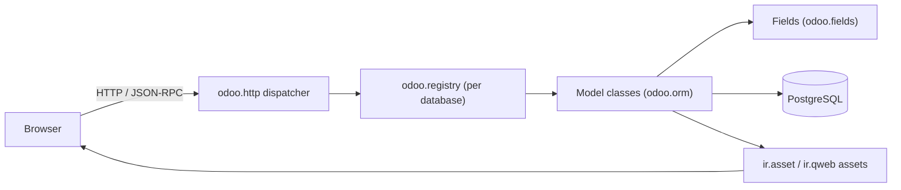
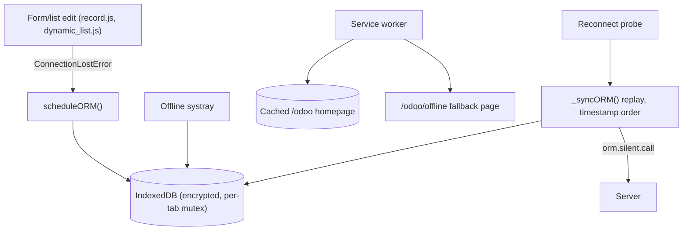

# Architecture

Odoo is a client-server application. A single Python process serves both HTTP requests and JSON-RPC calls, reads and writes PostgreSQL, and ships the compiled front-end as asset bundles. The browser runs an OWL application that talks to the server almost exclusively through `orm` calls and a few controllers.

By language, the codebase is roughly 1.51 million lines of JavaScript in 6,775 files, 1.36 million lines of Python in 9,400 files, 573,000 lines of XML in 6,052 files (data records and view archs), about 110,000 lines of SCSS/CSS, and 147,000 lines of CSV (mostly translations and demo data).

## The server

- `odoo-bin` (`odoo-bin`) is the entry point. It parses configuration, sets up the database registry, and starts the threaded HTTP server (`odoo/http/`).
- The registry loads installed addons from `addons/`. An addon is a directory with a `__manifest__.py`, Python `models/`, XML data (views, security rules, demo data), `controllers/` for HTTP routes, and `static/` for front-end assets. See [Module system](../systems/module-system.md).
- Models extend `odoo.models.Model` and are composed with `_inherit`/`_inherits`. Fields, constraints, computed methods, and the query builder live in `odoo/orm/` and `odoo/fields/`. See [ORM](../systems/orm.md).
- Views are XML archs (`<form>`, `<list>`, `<kanban>`, ...) stored as `ir.ui.view` records. The client receives parsed archs and renders them with registered view components.
- Assets are gathered per bundle (`web.assets_backend`, `web.assets_tests`, ...) and served to the browser. See [Assets](../systems/assets.md).

## The web client

The front-end in `addons/web/static/src/` is an OWL 2 application (`addons/web/static/src/owl2/`):

- `addons/web/static/src/main.js` boots the web client from the session info embedded in the page.
- `addons/web/static/src/webclient/` holds the shell: action manager, navbar, breadcrumbs, user menu, systray (including the offline systray).
- `addons/web/static/src/views/` holds the view framework: a `RelationalModel` that loads and edits records (`addons/web/static/src/model/relational_model/`), and one controller/renderer/parser per view type (form, list, kanban, calendar, ...).
- `addons/web/static/src/core/` holds services and plugins: RPC/ORM services, `UIPlugin` (the small-screen signal), `OfflinePlugin`, the PWA service, dialogs, popovers, and the bottom sheet.

## The offline stack

Offline support is entirely in `addons/web`; the CRM only consumes it. See [Offline and PWA](../features/offline-and-pwa/index.md) for the full story.

- `OfflinePlugin` (`addons/web/static/src/core/offline/offline_plugin.js`) detects connectivity (browser events plus `ConnectionLostError` on any RPC), queues writes into the encrypted `orm-to-sync` IndexedDB table, and replays them on reconnection in timestamp order, last write wins.
- The local store (`addons/web/static/src/core/utils/indexed_db.js`) encrypts values with AES-GCM (`addons/web/static/src/core/crypto.js`) and serializes access with a per-tab mutex plus Web Locks across tabs.
- The service worker (`addons/web/static/src/service_worker.js`) serves the cached homepage when the network fails, and `/odoo/offline` (`addons/web/views/webclient_templates.xml`) is the last-resort page.
- Buttons without the `data-available-offline` attribute are disabled while offline; the availability of actions, views, and records is tracked from what was visited while online.
- The many2x cache (`addons/web/static/src/views/fields/relational_utils.js`) stores `web_name_search` results so partner and tag lookups can still answer offline.

## The fork's CRM work

The 75 fork commits (Sep 30 - Oct 7, 2026) all live in `addons/crm`. The design rule: queue every offline write that is a bare, client-resolvable write on `crm.lead`, `crm.stage`, `crm.team`, or a lead's `mail.activity`; silently skip decorative server reads; disable everything else offline. Every crm entry point that needs a server is classified in `addons/crm/static/src/mobile/offline_inventory.md` (150 rows).

- Offline writes: lead form saves, lead creates (including a mobile quick create), kanban stage moves, mark won, archive/unarchive/delete, activity schedule/done, and "log a call" (`action_log_call` in `addons/crm/models/crm_lead.py`, built so one queued server call does all the work).
- Offline guards: patches in `addons/crm/static/src/views/view_components/` disable or block controls that cannot be queued (wizards, server reports, module installs, group edits, and navigation to uncached records).
- Mobile UI: a small-screen branch in the pipeline kanban renderer shows one stage at a time (`addons/crm/static/src/mobile/crm_mobile_pipeline/`), with a mobile card, a bottom-sheet quick create, and cards for queued lead creates. All of it is gated on `UIPlugin.isSmall()`.
- PWA: the manifest gains "My Pipeline" and "New Lead" shortcuts (`addons/crm/controllers/webmanifest.py`), and the share target creates leads from shared text.

## Reading paths

- Server internals: start in `odoo/orm/` (models, fields, query building) and `odoo/http/` (routing and dispatch).
- A specific business app: the [Apps index](../apps/index.md) groups the 642 addons into families.
- The offline framework in depth: [Offline and PWA](../features/offline-and-pwa/index.md).
- How the CRM consumes it: [Offline CRM](../apps/crm/offline-crm.md) and [Mobile CRM](../apps/crm/mobile-crm.md).
