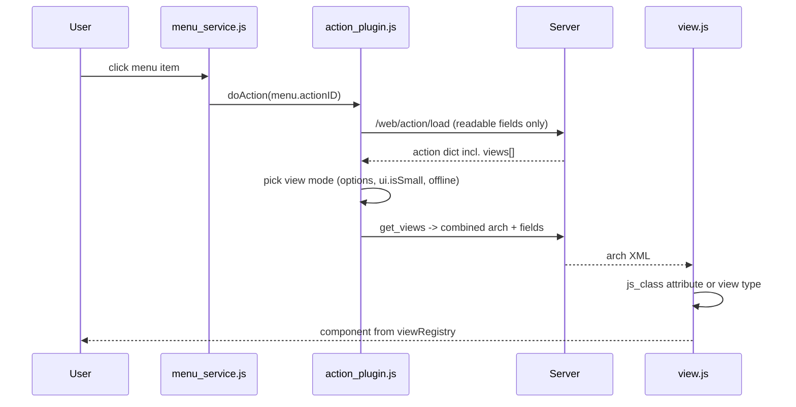

# Actions, views, and menus

Active contributors: Christophe, Krzysztof, Bruno

## Purpose

An action says what to open, a view says how to render it, and a menu says where the user finds it. All three are database records defined in the `base` module, shipped as XML data by addons, and interpreted by the web client at runtime. This page covers the server-side models and the handoff to the client, where `js_class` selects the JavaScript implementation of a view.

## Directory layout

```text
odoo/addons/base/
├── models/
│   ├── ir_actions.py          # ir.actions.actions and its subtypes
│   ├── ir_actions_report.py   # ir.actions.report (QWeb/PDF)
│   ├── ir_ui_view.py          # ir.ui.view: arch storage, inheritance, validation
│   ├── ir_ui_menu.py          # ir.ui.menu: tree, visibility, client payload
│   └── ir_embedded_actions.py # actions embedded in another action's view
addons/web/
├── controllers/action.py                       # /web/action/load, /web/action/run
├── controllers/home.py                         # /web/webclient/load_menus
└── static/src/
    ├── webclient/actions/action_plugin.js      # doAction dispatch per action type
    ├── webclient/menus/menu_service.js         # menu tree in the client
    └── views/view.js                           # arch -> js_class -> view registry
```

## Key abstractions

| Name | File | Description |
| --- | --- | --- |
| `ir.actions.actions` | `odoo/addons/base/models/ir_actions.py` | Abstract parent of every action type; holds `name`, `type`, `path`, `help`, and the sidebar binding fields. |
| `ir.actions.act_window` | `odoo/addons/base/models/ir_actions.py` | Opens a model in one or more view modes, with `domain`, `context`, `res_id`, `target`, `limit` (default 80). |
| `ir.actions.act_window.view` | `odoo/addons/base/models/ir_actions.py` | Ordered link between an act_window and a specific `ir.ui.view` per view mode. |
| `ir.actions.act_url` | `odoo/addons/base/models/ir_actions.py` | Redirects the browser; `target` is `new`, `self`, or `download`. |
| `ir.actions.server` | `odoo/addons/base/models/ir_actions.py` | Server-side action; `state` is one of `object_write`, `object_create`, `object_copy`, `code`, `webhook`, `multi`. |
| `ir.actions.report` | `odoo/addons/base/models/ir_actions_report.py` | QWeb-rendered report, typically to PDF or HTML. |
| `ir.actions.client` | `odoo/addons/base/models/ir_actions.py` | Names a client-side component by `tag`, with free-form `params`. |
| `ir.ui.view` | `odoo/addons/base/models/ir_ui_view.py` | The arch (XML) of a view, its type, its inheritance link, and its validation. |
| `ir.ui.menu` | `odoo/addons/base/models/ir_ui_menu.py` | Menu tree node pointing at an action through a `Reference` field. |

## How it works

### Action records and the wire format

The action subtypes all `_inherit` `ir.actions.actions` and use PostgreSQL table inheritance: `ir_act_window`, `ir_act_url`, `ir_act_server`, and `ir_act_client` inherit the `ir_actions` table. Because a unique index on an inherited table only covers that one table, the uniqueness of the URL `path` is re-checked manually in `_check_path` in `odoo/addons/base/models/ir_actions.py`.

Not every field reaches the browser. Each subtype extends `_get_readable_fields()` with the set it is willing to expose, and `/web/action/load` in `addons/web/controllers/action.py` returns only that whitelist. For `act_window` it includes `views`, a computed JSON field: `_compute_views` resolves the precedence between the comma-separated `view_mode` string, the `view_ids` one2many, and the `view_id` many2one into an ordered list of `(view_id, view_mode)` pairs.

### From menu click to rendered view



`_executeActWindowAction` in `addons/web/static/src/webclient/actions/action_plugin.js` chooses the view mode. It filters `action.views` against `session.view_info`, throws if a declared type is unknown, then prefers the explicitly requested `options.viewType`. On a small screen it retries with the action's `mobile_view_mode` (default `kanban`). When the offline plugin reports that the chosen view was never visited, it falls back to a view mode that is available offline, which is how the fork's offline stack rides on top of the standard action flow.

`view.js` then reads the `js_class` attribute from the root node of the combined arch, falling back to the plain view type. If that key is absent from the view registry it lazily loads `web.assets_backend_lazy` before looking it up again, which is how addons register variant view classes without shipping them in the main bundle. The resolved key is also published as `env.config.viewSubType`. See [views framework](../apps/web/views-framework.md) for the registry itself and [CRM views](../apps/crm/crm-views.md) for the `crm_kanban` / `crm_form` / `forecast_*` classes.

### View inheritance and validation

`ir.ui.view` stores the XML in `arch_db`, declared with `translate=xml_translate` so model terms are translated per language (see [translations](translations.md)). `arch` is the computed read/write accessor, and in `--dev=xml` mode it can be re-read from `arch_fs`, the source file the view came from.

Inheritance is driven by `inherit_id` plus `mode`:

- `extension` (the default): when the parent view is requested, the closest primary view is looked up, then every extension view with the same model is applied on top.
- `primary`: the closest primary view is fully resolved first, even across models, then this view's own `<xpath/>` specs are applied and the result is used as this view's arch.

`_get_inheriting_views` collects the applicable children, `locate_node` resolves each spec, `apply_inheritance_specs` applies it, and `_combine` assembles the hierarchy into the final arch, ordered by the model `_order = "priority,name,id"` (default `priority` is 16). Views carrying `group_ids` are only applied for users in those groups, and `active = False` disables an extension without deleting it.

Validation runs as a constraint. `_check_xml` parses and combines the arch, `_valid_inheritance` rejects malformed specs, `_check_groups` checks group references, and `_validate_view` dispatches to per-tag checks (`_validate_tag_field`, `_validate_tag_button`, `_validate_tag_filter`, `_validate_tag_graph`, and so on) that verify field names, attributes, and classes against the model. `_postprocess_access_rights` strips what the current user may not see before the arch is sent out.

### Menus

`ir.ui.menu` is a `parent_id` / `parent_path` tree with `sequence`, `group_ids`, a `web_icon` (decoded into `web_icon_data`), and an `action` `Reference` field that can point at a report, act_window, act_url, server action, or client action. Visibility is computed by `_visible_menu_ids`, cached with `@api.ormcache('frozenset(self.env.user._get_group_ids())', 'debug')`; a menu is hidden when the user lacks its groups or cannot reach its action's model. `load_menus_root` and `load_menus` build the client payload (also ormcached on uid, debug, and lang) and are served by `/web/webclient/load_menus` in `addons/web/controllers/home.py`, fetched once by `addons/web/static/src/webclient/menus/menu_service.js`.

Addons add to another addon's menu by XML inheritance rather than by editing it, for example `addons/crm/security/crm_security.xml` adding a group to `contacts.res_partner_menu_config`.

## Integration points

- Addons ship actions, views, and menus as XML data files listed in `__manifest__.py`; load order follows the module graph (see [module system](../systems/module-system.md)).
- `ir.actions.server` with `usage = 'ir_cron'` is the payload of a scheduled action (see [cron and scheduled actions](cron-and-scheduled-actions.md)).
- Menu and view visibility both go through `res.groups`; record-level filtering of what an action shows goes through `ir.access` (see [users, groups, and access](users-groups-and-access.md)).
- `ir.embedded.actions` (`odoo/addons/base/models/ir_embedded_actions.py`) attaches secondary actions to an act_window and is expanded in `_get_action_dict`.

## Entry points for modification

To add a view variant, register a JS class in the view registry and bind it with `js_class` on the arch root, rather than changing `view.js`. To change what an action sends to the browser, extend `_get_readable_fields()` on the relevant action model. To change how a view is assembled, work through xpath inheritance in XML; `apply_inheritance_specs` and `_combine` in `odoo/addons/base/models/ir_ui_view.py` are the code paths to read first when an inherited view does not come out as expected.

## Key source files

| File | Purpose |
| --- | --- |
| `odoo/addons/base/models/ir_actions.py` | All action models except reports; readable-field whitelists, `_compute_views`, path constraint. |
| `odoo/addons/base/models/ir_actions_report.py` | Report action model and rendering entry points. |
| `odoo/addons/base/models/ir_ui_view.py` | Arch storage, inheritance resolution, postprocessing, per-tag validation. |
| `odoo/addons/base/models/ir_ui_menu.py` | Menu tree, `_visible_menu_ids`, `load_menus` / `load_menus_root`. |
| `odoo/addons/base/models/ir_embedded_actions.py` | Embedded actions attached to an act_window. |
| `addons/web/controllers/action.py` | `/web/action/load`, `/web/action/run`, `/web/action/load_breadcrumbs`. |
| `addons/web/controllers/home.py` | `/web/webclient/load_menus`. |
| `addons/web/static/src/webclient/actions/action_plugin.js` | `doAction` dispatch, view-mode selection, small-screen and offline fallbacks. |
| `addons/web/static/src/webclient/menus/menu_service.js` | Client-side menu tree. |
| `addons/web/static/src/views/view.js` | `js_class` lookup, lazy bundle load, view registry dispatch. |
| `addons/web/static/src/views/utils.js` | Arch helpers including the `js_class` subtype read. |
| `addons/crm/views/crm_lead_views.xml` | Worked example: archs bound to CRM view classes through `js_class`. |

## Related pages

- [Views framework](../apps/web/views-framework.md)
- [CRM views](../apps/crm/crm-views.md)
- [Users, groups, and access](users-groups-and-access.md)
- [base addon](../apps/base.md)
- [Module system](../systems/module-system.md)
- [Data models](../reference/data-models.md)
- [Glossary](../overview/glossary.md)
