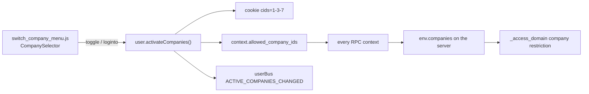

# Companies and multi-company

Active contributors: Krzysztof, William, Yannick

## Purpose

One Odoo database can hold several legal entities. `res.company` is the record for each of them, a user may be allowed into several, and the set they have currently switched on travels through the request in the `allowed_company_ids` context key. That context drives which records are visible, which configuration values apply, and which sequence a document draws its number from.

## Directory layout

```text
odoo/addons/base/models/
├── res_company.py      # res.company, company_default_for() helper
├── res_users.py        # company_id (default) and company_ids (allowed)
├── ir_default.py       # per-company and per-user field defaults
└── ir_sequence.py      # sequences scoped by company
odoo/orm/
├── environments.py     # env.company / env.companies from the context
├── models.py           # with_company(), _access_domain
└── fields.py           # company_dependent storage and fallback
addons/web/static/src/
├── core/user.js                                        # activeCompanies, cids cookie
├── webclient/switch_company_menu/                      # desktop company switcher
└── webclient/burger_menu/mobile_switch_company_menu/   # small-screen switcher
```

## Key abstractions

| Name | File | Description |
| --- | --- | --- |
| `res.company` | `odoo/addons/base/models/res_company.py` | A company: partner, currency, branding, and an optional `parent_id` forming a branch tree. |
| `res.users.company_ids` | `odoo/addons/base/models/res_users.py` | Companies the user is allowed into; `company_id` is their default one. |
| `allowed_company_ids` | context key | The companies switched on right now; first entry is the "current" company. |
| `Environment.company` / `.companies` | `odoo/orm/environments.py` | Server-side reading of that context key, with an access check. |
| `company_dependent` fields | `odoo/orm/fields.py` | Fields whose value differs per company, stored as a jsonb column. |
| `company_default_for()` | `odoo/addons/base/models/res_company.py` | Helper that exposes a company-dependent default as a plain field on `res.company`. |
| `ir.default` | `odoo/addons/base/models/ir_default.py` | Storage of per-company (and per-user) field defaults and fallbacks. |
| `ir.sequence` | `odoo/addons/base/models/ir_sequence.py` | Numbering series, optionally scoped to one company. |

## How it works

### The company record

`res.company` extends `models.CachedModel`, with `_cached_data_fields = ('name', 'active', 'sequence', 'currency_id', 'parent_id', 'partner_id')`, so those hot fields are served from a registry-level cache instead of a query. Ordering is `sequence, name`, and `sequence` is documented as the order in the company switcher. A company always has a `partner_id`; `name`, `email`, `phone`, `vat`, and the address fields are related to it. `parent_id` / `child_ids` / `parent_path` model branches, and `_compute_parent_ids` derives `parent_ids` and `root_id` from the materialized path.

### Allowed, active, and current

A user has one default company (`company_id`, required) and a set of allowed companies (`company_ids`, the many2many `res_company_users_rel`, mirrored by `res.company.user_ids`). The constraint `_check_user_company` rejects an active user whose default is not among their allowed companies.

At runtime the active set comes from the context. `Environment.companies` reads `allowed_company_ids`; if the request asks for a company the user is not allowed into it raises `AccessError("Access to unauthorized or invalid companies.")`. When the key is absent it falls back to all of the user's companies rather than just the default one, so out-of-context calls such as report printing or `/web/image` still work. `Environment.company` is the first entry, or the user's `company_id`. Both checks are skipped in superuser mode, which is how inter-company writes are done deliberately.

`with_company(company)` in `odoo/orm/models.py` returns a recordset whose context puts that company first in `allowed_company_ids` without dropping the others.

### Switching companies in the client



`addons/web/static/src/core/user.js` holds `allowedCompanies`, `allowedCompaniesWithAncestors`, and `activeCompanies`. `updateActiveCompanies` writes the dash-joined ids into the `cids` cookie, assigns `allowed_company_ids` into the user context, and fires `ACTIVE_COMPANIES_CHANGED` on `userBus`. It sorts every entry except the first, on the grounds that only the first has a distinct meaning and that a stable ordering keeps the stringified context stable, which matters because the context is part of the RPC cache key.

The UI is `addons/web/static/src/webclient/switch_company_menu/switch_company_menu.js`, whose `CompanySelector` supports a `toggle` mode (add or remove a company from the active set) and a `loginto` mode (make one company the only, or the leading, active one). The small-screen equivalent is `addons/web/static/src/webclient/burger_menu/mobile_switch_company_menu/mobile_switch_company_menu.js`.

When a form save fails because the record belongs to another company, `addons/web/static/src/views/form/form_controller.js` pushes the suggested company into `allowed_company_ids`; on the server side `_make_record_access_error` in `odoo/addons/base/models/ir_access.py` is what produced the "switching to the company" hint in the first place.

### Record isolation

Isolation is not a separate mechanism; it is an `ir.access` restriction, that is, a row with no group so that it applies to everyone and is AND-ed with whatever permission the user matched. The standard form appears verbatim across addons, for instance in `addons/crm/security/ir.access.csv`:

```text
crm_lead_company_rule,CRM Lead Multi-Company,crm.lead,,crud,"[('company_id', 'in', company_ids + [False])]"
crm_activity_report_rule_multi_company,CRM Lead Multi-Company,crm.activity.report,,crud,"[('company_id', 'in', company_ids + [False])]"
```

`company_ids` in that domain is supplied by `_eval_context()` as `self.env.companies.ids`, and `+ [False]` keeps records with no company visible to everyone. `addons/account`, `addons/delivery`, and `addons/event` carry the same row for their own models. Because `_access_domain` is ormcached on `self.env._access_context`, and `ir.access._get_access_context` yields the `allowed_company_ids` tuple, flipping the switcher produces a different cache entry rather than a stale one. See [users, groups, and access](users-groups-and-access.md) for how permissions and restrictions combine.

### Values that differ per company

A field declared `company_dependent=True` stores one value per company. `odoo/orm/fields.py` gives such a field a `jsonb` column (the same storage trick used for translated fields), keyed by company id, and puts it in the `company_dependent` prefetch group. The allowed types are listed in `COMPANY_DEPENDENT_FIELDS`: char, float, boolean, integer, text, many2one, date, datetime, selection, and html. Such a field cannot be `required` and cannot be `translate`; both raise a warning at setup. When no per-company value is set, `get_company_dependent_fallback()` reads the default from `ir.default` for `env.company`.

`company_default_for(fname, target_model, target_fname)` in `odoo/addons/base/models/res_company.py` wraps that: it returns the compute, inverse, and `compute_sql` triple that surfaces a company-dependent default of another model as an ordinary field on `res.company`, writing back through `ir.default.set(..., company_id=company.id)`. Its `write_sequence` is `-10` so the inverse runs before other fields on the same write.

`ir.default` itself stores `company_id` (nullable for "all companies") and `user_id`, and `_get` orders candidates by `user_id, company_id, id` so the most specific default wins.

There is no `ir.property` model and no `res.company.property` model in 20.0: both are gone. A value that varies per company is either a `company_dependent` field (stored inline as jsonb) or an `ir.default` row, so "make it a company property" means "mark the existing field `company_dependent`".

### Inter-company flows

Sharing one database between legal entities does not by itself let one company's documents touch another's. The cross-company pattern is `with_company()` plus deliberate `sudo()`, because `env.companies` and the access domain both narrow to the active set. `addons/account_payment_interco` ("Intercompany Payment - Account") is the in-tree example. It adds three account fields to `res.company` — `account_interco_clearing_journal_id` (declared `check_company=True`), `account_interco_payable_id`, and `account_interco_receivable_id` — and, in `AccountMove._post`, looks for payments posted by a *different* company and creates a balancing entry with `self.env['account.move'].with_company(payment.company_id)` in that company's clearing journal (`addons/account_payment_interco/models/account_move.py`). The pattern to copy is: read across companies, then write inside the target company's own environment.

### Sequences

`ir.sequence` carries a `company_id`. `next_by_code` searches `[('code', '=', sequence_code), ('company_id', 'in', [company_id, False])]` ordered by `company_id`, so a company-specific series takes precedence over a shared one, and `company_id` comes from `self.env.company`. The `standard` implementation uses a native PostgreSQL sequence (fast, gaps allowed); `no_gap` serializes through the row itself.

## Integration points

- Every RPC carries the context, so the client's active companies reach `env.companies` and therefore the access domain and every `company_dependent` read.
- The offline share target in `addons/web/static/src/webclient/share_target/share_target_item.js` pins `allowed_company_ids` to the current company when creating a record from a share.
- Cross-company writes run through `with_company()`, as `addons/account_payment_interco` does when it posts a clearing entry in the paying company.
- CRM models scope by `company_id` and rely on the standard restriction row; see [CRM](../apps/crm/index.md).

## Entry points for modification

To make a value company-specific, prefer `company_dependent=True` on the existing field over a new per-company model. To isolate a new model's records, add the standard no-group `ir.access` row with the `company_ids + [False]` domain. Note that this fork's rules forbid changing access rows or adding fields to `crm.lead`, `crm.stage`, or `crm.team`, so multi-company work here is limited to reading and to code that honours `env.company`.

## Key source files

| File | Purpose |
| --- | --- |
| `odoo/addons/base/models/res_company.py` | `res.company` model, branch tree, `company_default_for()` helper. |
| `odoo/addons/base/models/res_users.py` | `company_id`, `company_ids`, `_check_user_company`, `_get_company_ids`. |
| `odoo/orm/environments.py` | `env.company` and `env.companies`, including the unauthorized-company check. |
| `odoo/orm/models.py` | `with_company()` and `_access_domain`. |
| `odoo/orm/fields.py` | `company_dependent` storage, `COMPANY_DEPENDENT_FIELDS`, `get_company_dependent_fallback`. |
| `odoo/addons/base/models/ir_default.py` | Per-company and per-user defaults and their lookup order. |
| `odoo/addons/base/models/ir_sequence.py` | `next_by_code` company resolution, standard vs no-gap implementations. |
| `odoo/addons/base/models/ir_access.py` | `_eval_context` supplying `company_ids`, company hint in access errors. |
| `addons/web/static/src/core/user.js` | Active companies, `cids` cookie, context assignment. |
| `addons/web/static/src/webclient/switch_company_menu/switch_company_menu.js` | Desktop switcher and `CompanySelector`. |
| `addons/web/static/src/webclient/burger_menu/mobile_switch_company_menu/mobile_switch_company_menu.js` | Small-screen switcher. |
| `addons/crm/security/ir.access.csv` | Worked example of the company restriction rows. |
| `addons/account_payment_interco/models/res_company.py` | Per-company intercompany clearing accounts. |
| `addons/account_payment_interco/models/account_move.py` | `_post` creating a clearing entry in the paying company. |

## Related pages

- [Users, groups, and access](users-groups-and-access.md)
- [ORM](../systems/orm.md)
- [base addon](../apps/base.md)
- [CRM](../apps/crm/index.md)
- [Data models](../reference/data-models.md)
- [Glossary](../overview/glossary.md)
