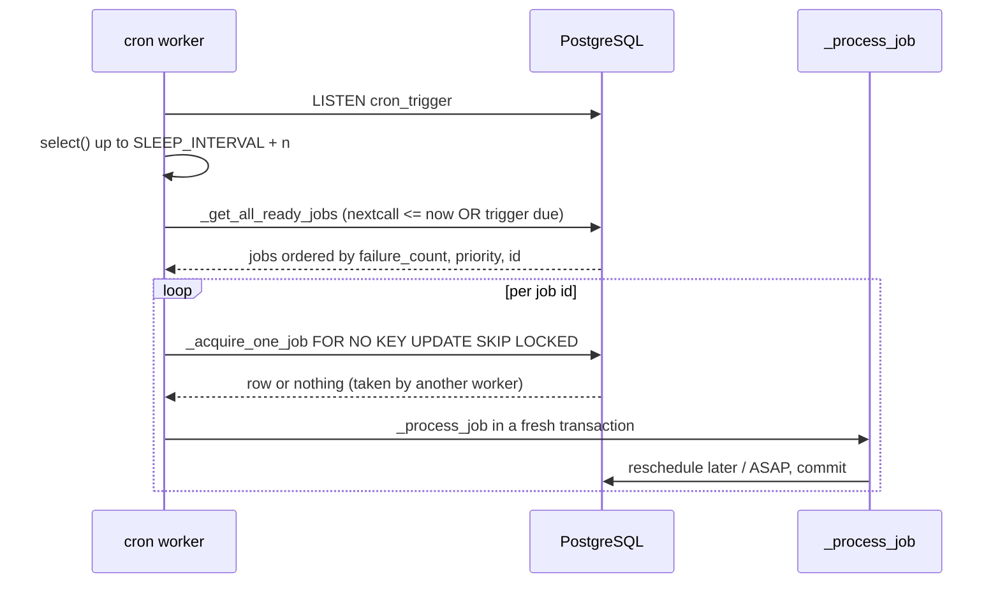

# Cron and scheduled actions

Active contributors: Krzysztof, Julien, Xavier

## Purpose

`ir.cron` is Odoo's in-database scheduler. A cron record is an `ir.actions.server` with a schedule attached: dedicated cron threads or processes poll every database, lock one ready job at a time, run its server action in its own transaction, and reschedule it. Code can also wake a job up immediately with `_trigger()`, which is how event-driven background work (queued mails, assignment runs) is started without a tight polling loop.

## Directory layout

```text
odoo/addons/base/
├── models/ir_cron.py                # ir.cron, ir.cron.trigger, ir.cron.progress
└── views/ir_cron_views.xml          # the "Run Manually" button
odoo/service/server.py               # cron threads (ThreadedServer) and cron workers (PreforkServer)
addons/crm/data/
├── ir_cron_data.xml                 # CRM: Lead Assignment
└── crm_lead_prediction_data.xml     # PLS: Recompute Automated Probabilities
```

## Key abstractions

| Name | File | Description |
| --- | --- | --- |
| `ir.cron` | `odoo/addons/base/models/ir_cron.py` | The scheduled action: `_inherits` `ir.actions.server` plus `interval_number`/`interval_type`, `nextcall`, `priority`, `user_id`. |
| `ir.cron.trigger` | `odoo/addons/base/models/ir_cron.py` | A one-off "run this cron at `call_at`" row, created by `_trigger()`. |
| `ir.cron.progress` | `odoo/addons/base/models/ir_cron.py` | Per-run progress (`done`, `remaining`, `timed_out_counter`) reported by long jobs. |
| `_process_jobs(db_name)` | `odoo/addons/base/models/ir_cron.py` | Entry point a cron worker calls for one database. |
| `_acquire_one_job` | `odoo/addons/base/models/ir_cron.py` | `FOR NO KEY UPDATE SKIP LOCKED` acquisition of a single job. |
| `_trigger` / `_notifydb` | `odoo/addons/base/models/ir_cron.py` | Schedule an early run and wake the workers through `pg_notify('cron_trigger', dbname)`. |
| `method_direct_trigger` | `odoo/addons/base/models/ir_cron.py` | The "Run Manually" button: runs the job inline in the HTTP thread. |

## How it works

### The record

`ir.cron` delegates to a server action: `_inherits = {'ir.actions.server': 'ir_actions_server_id'}` with `delegate=True`, and `create()` forces `usage = 'ir_cron'` on it. So a cron's payload is an ordinary server action, usually `state = 'code'` (`default_get` makes that the default), and everything on [actions](actions-views-menus.md) applies to it.

Scheduling fields are `interval_number` (constrained strictly positive) and `interval_type` (`minutes`, `hours`, `days`, `weeks`, `months`), plus `nextcall`, `lastcall`, `priority` (default 5, 0 is highest), and `active`. `user_id` is the user the action runs as. `failure_count` and `first_failure_date` track consecutive failures.

### Selection and locking



`_get_ready_sql_condition` defines "ready": the cron is active and either `nextcall <= now` or an `ir_cron_trigger` row for it has `call_at <= now`. `_get_all_ready_jobs` sorts by `failure_count, priority, id`, so repeatedly failing jobs sink to the back. `_acquire_one_job` re-checks readiness and takes a `FOR NO KEY UPDATE SKIP LOCKED` row lock; the comment in the source explains the choice of `NO KEY UPDATE` over `UPDATE`, which would conflict with the implicit `KEY SHARE` locks taken by foreign keys referencing the cron. Two workers therefore never run the same job, and a worker that finds the row locked simply moves on.

Before any of this, `_process_jobs` verifies that the `base` module's `latest_version` matches the running code (`BadVersion`) and that no module is mid-install or mid-upgrade (`BadModuleState`). If modules have been stuck in a transitional state for longer than `MAX_FAIL_TIME` (5 hours) it calls `reset_modules_state` and carries on.

### Running a job

`_process_job` clears the due triggers, then `_run_job` opens a **separate cursor** and runs the server action with a context carrying `lastcall`, `cron_id`, and `cron_end_time`. A job that uses the progress API (`_commit_progress`) can be run repeatedly inside that single acquisition: the loop continues while fewer than `MIN_RUNS_PER_JOB` (10) iterations have happened or `MIN_TIME_PER_JOB` (120 seconds) has not elapsed. The outcome is one of three `CompletionStatus` values:

- fully done: `_reschedule_later` advances `nextcall` by the interval, walking forward in the user's timezone so a daily job keeps its hour across DST;
- partially done: `_reschedule_asap` inserts an immediate `ir_cron_trigger` so another worker picks the job up after the other ready jobs;
- failed: `_update_failure_count` increments the counter, and the job is deactivated only once it has failed at least `MIN_FAILURE_COUNT_BEFORE_DEACTIVATION` (5) times **and** has been failing for more than `MIN_DELTA_BEFORE_DEACTIVATION` (7 days).

A run that times out is detected on the next pass: after `CONSECUTIVE_TIMEOUT_FOR_FAILURE` (3) consecutive timeouts with no progress recorded, the job is marked failed instead of being run again. `ir.cron.progress` rows are garbage-collected after a week by an `@api.autovacuum` method.

`write()` on an `ir.cron` takes `lock_for_update`, and raises a `UserError` telling the user the task is currently executing if the lock cannot be taken.

### Triggers and the PostgreSQL notification

`_trigger(at=None, coalesce=0)` creates `ir.cron.trigger` rows. With no argument it schedules "now"; with a datetime or a list it schedules precise moments; `coalesce` rounds each moment up to the end of an N-minute window so many triggers collapse into few wakeups. If the earliest moment is already due, `_notifydb` is added to the transaction's post-commit hook, and it issues `SELECT pg_notify('cron_trigger', <dbname>)` (the function name is overridable through the `ODOO_NOTIFY_FUNCTION` environment variable).

On the other end, each cron thread in `odoo/service/server.py` runs `LISTEN cron_trigger` on a connection to the `db_system` database, then blocks in `select()` for `SLEEP_INTERVAL + n` seconds, where `SLEEP_INTERVAL` is 60 and `n` is the worker number, staggering the wakeups. Notified database names are processed first; the full database list is only re-scanned once per interval. `LISTEN`/`NOTIFY` does not work on a replica, so the thread checks `pg_is_in_recovery()` and logs a warning instead. Worker count is `--max-cron-threads` (default 2) and a worker recycles its PostgreSQL connection after `limit_time_worker_cron`. See [server runtime](../systems/server-runtime.md) for how the threaded and prefork servers differ.

### Running one now

The "Run Manually" button in `odoo/addons/base/views/ir_cron_views.xml` calls `method_direct_trigger`, which requires write access, flushes and invalidates the environment, acquires the job with `include_not_ready=True`, and runs `_process_job` in the current HTTP thread on a fresh cursor. If the job is already locked by a worker it raises "Job '%s' already executing". Errors raised during the run are captured and returned as a `display_exception` client action rather than propagated.

### The CRM crons

CRM ships two scheduled actions, both inactive by default:

- `crm.ir_cron_crm_lead_assign` in `addons/crm/data/ir_cron_data.xml`: "CRM: Lead Assignment", `model_crm_team`, code `model._cron_assign_leads()`, every 1 day, running as `base.user_root`. The settings screen drives it: `_compute_crm_auto_assignment_data` in `addons/crm/models/res_config_settings.py` reads `active`, `interval_type`, `interval_number`, and `nextcall` off the cron record to populate the form, and `set_values()` writes them back, with a comment noting that writing to a cron takes a write lock on the table. `crm.team._compute_assignment_enabled` also reads the cron's `active` flag to decide whether automatic assignment is on.
- `crm.website_crm_score_cron` in `addons/crm/data/crm_lead_prediction_data.xml`: "Predictive Lead Scoring: Recompute Automated Probabilities", `model_crm_lead`, code `model._cron_update_automated_probabilities()`, every 1 day.

Both are plain `state = 'code'` server actions calling a model method, which is the normal shape for an addon cron. `_cron_assign_leads(force_quota=False, creation_delta_days=7)` in `addons/crm/models/crm_team.py` is written to be safe when the cron runs more than once a day, because it accounts for the leads already assigned that day rather than assuming one run per interval. The CRM test suite drives the crons directly (`addons/crm/tests/common.py` resolves `crm.ir_cron_crm_lead_assign`) instead of waiting for a worker.

### Automation rules reuse the same cron row

`addons/base_automation` builds record-triggered automation on top of this machinery. `base.automation` (`addons/base_automation/models/base_automation.py:130`) is another server-action holder — it delegates to an `ir.actions.server` the way `ir.cron` does — and its `trigger` is `on_create`, `on_write`, `on_create_or_write`, `on_unlink`, `on_change`, or one of the time-based triggers. Time-based rules carry `trg_date_id`, `trg_date_range`, and `trg_date_range_type`, and they are executed by a cron, not by the ORM directly: `_update_cron()` keeps `base_automation.ir_cron_data_base_automation_check` ("Automation Rules: check and execute", `addons/base_automation/data/base_automation_data.xml`) active with the shortest interval any time-based rule needs, and writes it back to inactive when none is left. So `base_automation` is just another producer of an `ir.cron` row, and the acquisition, trigger, and failure policy described above applies to it unchanged.

### Where administrators find them

Settings > Technical > Automation holds the Scheduled Actions list (`base.menu_ir_cron_act`, `odoo/addons/base/views/base_menus.xml`, sequence 2) and the Cron Triggers list (`base.ir_cron_trigger_menu`, backing `ir.cron.trigger`). The list action is `base.ir_cron_act`; the form's "Run Manually" button is what calls `method_direct_trigger`.

## Integration points

- A cron is an `ir.actions.server`, so its `code` field is protected by `groups='base.group_system'` and the whole record is `_allow_sudo_commands = False`.
- Cron rows are shipped as XML data inside `<data noupdate="1">` so that a module upgrade does not reset a schedule an administrator has changed.
- `_process_jobs` is invoked from `odoo/service/server.py` in both the threaded and prefork servers, and from `odoo/cli/` when the server is started in a cron-only configuration.
- `addons/base_automation` owns one more `ir.cron` row for its time-based automation rules and keeps its interval in sync with the rules that exist; see [base addon](../apps/base.md).

## Entry points for modification

To add background work, write a model method and declare a cron record in your addon's data files pointing at it with `state = 'code'`; ship it `active="False"` if it should be opt-in. To make it event-driven instead of periodic, call `self.env.ref('<module>.<cron_xmlid>')._trigger()` from the code that created the work, optionally with `coalesce` to batch wakeups. When a job appears stuck, start from `_acquire_one_job` and `ir.cron.progress`, which together explain whether it is locked, partially done, or timing out.

## Key source files

| File | Purpose |
| --- | --- |
| `odoo/addons/base/models/ir_cron.py` | `ir.cron`, `ir.cron.trigger`, `ir.cron.progress`, job acquisition, scheduling, failure policy. |
| `odoo/addons/base/views/ir_cron_views.xml` | Scheduled-action form with the "Run Manually" button. |
| `odoo/service/server.py` | Cron threads and workers, `LISTEN cron_trigger`, `SLEEP_INTERVAL`, connection recycling. |
| `odoo/addons/base/models/ir_actions.py` | The server action a cron delegates to. |
| `odoo/tools/config.py` | `--max-cron-threads` (default 2) and `limit_time_worker_cron`. |
| `addons/crm/data/ir_cron_data.xml` | CRM lead-assignment cron. |
| `addons/crm/data/crm_lead_prediction_data.xml` | PLS recomputation cron and the scoring configuration parameters. |
| `addons/crm/models/crm_team.py` | `_cron_assign_leads`, and reading the cron's `active` flag. |
| `addons/crm/models/res_config_settings.py` | Settings that read and write the assignment cron's schedule. |
| `addons/crm/models/crm_lead.py` | `_cron_update_automated_probabilities`. |
| `odoo/addons/base/tests/test_ir_cron.py` | Behavior tests, including trigger coalescing. |
| `addons/base_automation/models/base_automation.py` | `base.automation`, time-based triggers, `_update_cron`. |
| `addons/base_automation/data/base_automation_data.xml` | The "Automation Rules: check and execute" cron. |
| `odoo/addons/base/views/base_menus.xml` | Settings > Technical > Automation menu entries for crons and triggers. |

## Related pages

- [Server runtime](../systems/server-runtime.md)
- [Actions, views, and menus](actions-views-menus.md)
- [base addon](../apps/base.md)
- [CRM](../apps/crm/index.md)
- [Configuration](../reference/configuration.md)
- [Glossary](../overview/glossary.md)
