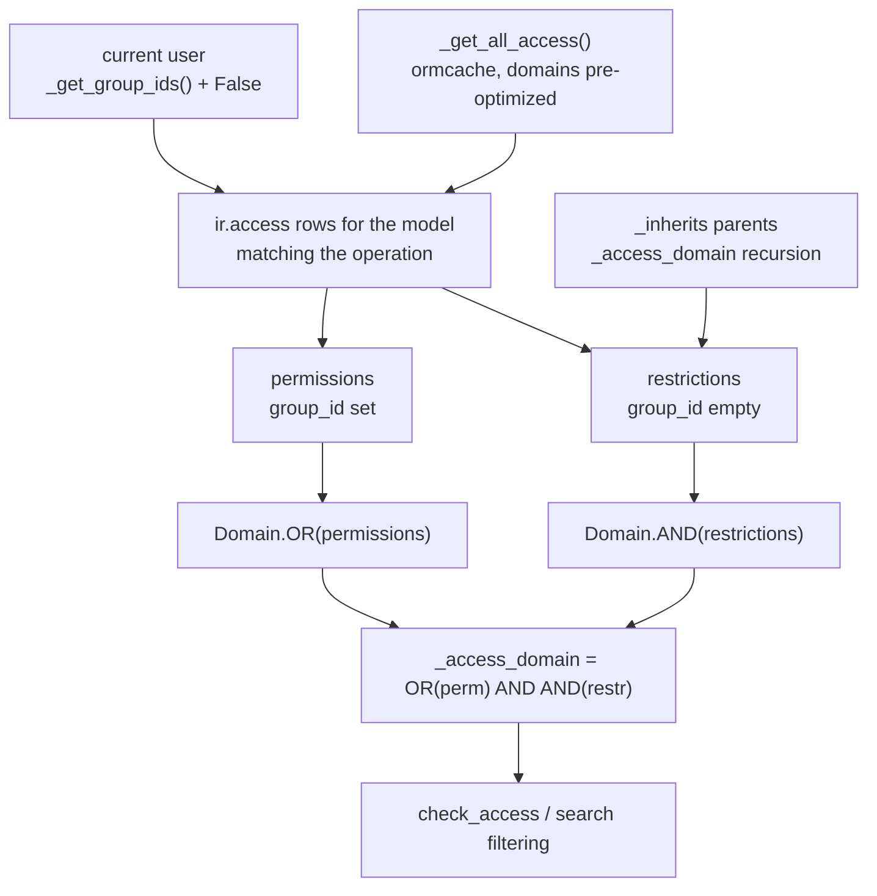

# Users, groups, and access

Active contributors: Christophe, Krzysztof, Raphael

## Purpose

Access control in Odoo 20.0 rests on three records: a `res.users` who is a member of `res.groups`, and `ir.access` rows that grant or restrict CRUD operations on a model, optionally narrowed by a domain. Version 20.0 merged the two older mechanisms, model-level `ir.model.access` and record-level `ir.rule`, into this single `ir.access` model. Everything the ORM enforces at read, write, create, and unlink time derives from it.

## Directory layout

```text
odoo/addons/base/
├── models/
│   ├── ir_access.py        # the ir.access model, caching, error messages
│   ├── res_users.py        # res.users: groups, companies, context
│   ├── res_groups.py       # res.groups: implied graph, privileges
│   └── res_groups_privilege.py
odoo/orm/
├── models.py               # _access_domain, check_access, sudo, with_user
└── fields.py               # the `groups` field attribute
odoo/upgrade_code/19.4-00-ir-access.py   # codemod: ir.model.access + ir.rule -> ir.access
addons/crm/security/
├── crm_security.xml        # group records
└── ir.access.csv           # access rows for crm models
```

## Key abstractions

| Name | File | Description |
| --- | --- | --- |
| `res.users` | `odoo/addons/base/models/res_users.py` | The authenticated actor; carries `group_ids`, the derived `all_group_ids`, `company_id`, and `company_ids`. |
| `res.groups` | `odoo/addons/base/models/res_groups.py` | A named set of users, linked to other groups by `implied_ids`. |
| `res.groups.privilege` | `odoo/addons/base/models/res_groups_privilege.py` | Scope that groups are displayed under; part of `full_name`. |
| `ir.access` | `odoo/addons/base/models/ir_access.py` | One permission or restriction: model, optional group, `operation` subset of `crud`, optional `domain`. |
| `AccessInfo` | `odoo/addons/base/models/ir_access.py` | Cached tuple `(id, group_id, operation, domain)` used by the access cache. |
| `BaseModel._access_domain` | `odoo/orm/models.py` | Combines all applicable accesses into the domain of records the user may touch for one operation. |
| `BaseModel.check_access` | `odoo/orm/models.py` | Raises `AccessError` when the current recordset falls outside that domain. |

## How it works

### Groups and implication

A user's explicit memberships are `group_ids`. Groups form a directed graph through `implied_ids` ("this group also grants those"), and `all_implied_ids` / `all_implied_by_ids` are the recursive closures. `res.users.all_group_ids` is computed as `group_ids.all_implied_ids`, so a manager group that implies a user group automatically carries the user group's access. `res.groups` sets `_clear_cache_name = 'groups'` and `_clear_cache_on_fields = {'implied_ids', 'implied_by_ids'}`, so editing the graph flushes the caches that depend on it.

Settings checkboxes are implemented as implied groups rather than as stored booleans. In `addons/crm/models/res_config_settings.py`, `group_use_lead = fields.Boolean(string="Leads", implied_group='crm.group_use_lead')` toggles membership of the `crm.group_use_lead` record declared in `addons/crm/security/crm_security.xml`; application code then branches on `self.env.user.has_group('crm.group_use_lead')`, as `addons/crm/models/crm_lead.py` does when defaulting a record to lead or opportunity.

### One ir.access record

Each `ir.access` row names a `model_id`, an optional `group_id`, an `operation` string, and an optional `domain`. `operation` is any non-empty subset of `crud` written in that order, so `CRUD_SELECTION` in `odoo/addons/base/models/ir_access.py` enumerates all 15 combinations from `crud` down to a single `r`. The computed `for_read`, `for_write`, `for_create`, and `for_unlink` booleans expose the same information one operation at a time and are searchable through `compute_sql`, so the UI can filter on them.

The presence of `group_id` decides the record's `kind`:

- with a group, it is a **permission**: it grants the operation to that group's members;
- without a group, it is a **restriction**: it applies to everyone.

### Combining accesses



`_access_domain` in `odoo/orm/models.py` is the whole rule in one line: `Domain.OR(permissions) & Domain.AND(restrictions)`. Permissions are alternatives, so any group that grants the operation is enough; restrictions are cumulative, so every one of them must hold. A model with no permission row for any of the user's groups yields `Domain.FALSE`, which is the "no access at all" case. Delegated parents from `_inherits` contribute their own access domain as an additional restriction.

The result is cached with `@api.ormcache('operation', 'self.env._access_context')`, and the raw records are cached by `_get_all_access()`, which pre-evaluates and optimizes literal domains once per registry. Domains that are not literal are evaluated per call against `_eval_context()`, which exposes exactly four names: `user` (the current user with an empty context, so the domain does not depend on the request context), `time`, `company_ids` (the activated companies), and `company_id`. Creating, writing, or unlinking an `ir.access` record flushes pending recomputations first and then calls `_clear_caches()`.

Error messages are built by two methods. `_make_model_access_error` is used when the user has no permission at all and lists the groups that would grant the operation. `_make_record_access_error` is used when specific records fall outside the domain; in debug mode, and only for internal users in `base.group_no_one`, it also names the failing records and the blamed access records computed by `_get_failed_accesses`.

### Field-level groups

Access can be narrowed below the record. Any field may carry `groups`, a comma-separated list of group XML ids (`odoo/orm/fields.py`); users outside those groups do not see the field in views and cannot read or write it. `ir.actions.server.code` is a concrete example: it is declared with `groups='base.group_system'` in `odoo/addons/base/models/ir_actions.py`, keeping arbitrary Python out of reach of non-administrators.

### Bypassing and switching identity

`sudo()` returns the same recordset in superuser mode: the user does not change, but access checks are skipped. Its docstring in `odoo/orm/models.py` warns that this crosses record-level boundaries, notably between companies. `with_user(user)` re-evaluates everything as another user in non-superuser mode. Models that must never be manipulated from a sudo-ed data command set `_allow_sudo_commands = False`; `ir.access`, `res.users`, `ir.ui.view`, `ir.cron`, and the action models all do.

### Client-side group and access probes

The web client re-asks the server instead of duplicating the rule. `addons/web/static/src/core/user.js` exposes two memoized probes on the user service:

- `user.hasGroup(group)` reads through `groupCache` and posts `res.users.has_group` to `/web/dataset/call_kw/res.users/has_group` (`odoo/addons/base/models/res_users.py`). The cache is pre-seeded from `session.groups` for the groups the session already carries (`base.group_user`, `base.group_user_regular`, `base.group_system`, `base.group_erp_manager`, `base.group_public`), so those never cost a round trip.
- `user.checkAccessRight(model, operation, ids)` reads through `accessRightCache` and posts to `/web/dataset/call_kw/<model>/has_access`, which resolves the same `_access_domain` the server enforces at read and write time.

Both memoize the *promise*, and the cache never evicts a rejected entry. A probe that rejects with `ConnectionLostError` during a brief online flip therefore stays rejected for the life of the page. `addons/crm/static/src/components/team_switcher/team_switcher.js` works around that: once it records `hasGroupCachePoisoned`, a later `sales_team.group_sale_manager` probe goes around the dead cache entry with a plain, uncached `orm.silent.call("res.users", "has_group", ...)` instead of `user.hasGroup`. The same fork probes `crm.group_use_recurring_revenues` (`addons/crm/static/src/views/crm_kanban/crm_column_progress.js`) and `checkAccessRight(model, "create")` (`addons/crm/static/src/components/lead_generation_dropdown/lead_generation_dropdown.js`); every one of them is skipped while offline. See [Offline CRM](../apps/crm/offline-crm.md).

### Portal and public users

`res.users.share` is a computed, stored boolean: a user in no internal group is a share user, and the field is what the UI calls a "portal" user. `_is_portal()` returns `has_group('base.group_portal')` and `_is_public()` returns `has_group('base.group_public')`, both run with `sudo()` (`odoo/addons/base/models/res_users.py:1282-1287`). A public user is the anonymous visitor the website serves; a portal user is a share user with a `res.partner` behind it. Neither is matched by any internal `ir.access` permission, so they see exactly what their own group's rows and restrictions allow and nothing else — which is also why the offline cache, fed only by records the user already read online, cannot widen their view. Passwords, credential checks (`_check_credentials`, `_login`, `authenticate`, and the Passlib context at `odoo/addons/base/models/res_users.py:1306`), and the rest of the authentication surface are covered in [security](../security.md).

### Where access is declared

Security rows are plain data files listed in the manifest. `addons/crm/__manifest__.py` loads `security/crm_security.xml` early (it creates groups other records reference) and `security/ir.access.csv` later. The CSV filename determines the target model: `convert_csv_import` in `odoo/tools/convert.py` derives it from the basename, so a file named `ir.access.csv` creates `ir.access` records. Columns are `id,name,model_id,group_id/id,operation,domain`.

Two rows from `addons/crm/security/ir.access.csv` show both kinds:

```text
crm_rule_personal_lead,Personal Leads,crm.lead,sales_team.group_sale_salesman,cru,"['|',('user_id','=',user.id),('user_id','=',False)]"
crm_lead_company_rule,CRM Lead Multi-Company,crm.lead,,crud,"[('company_id', 'in', company_ids + [False])]"
```

The first is a permission: a salesperson may create, read, and update leads that are theirs or unassigned. A sibling row grants `sales_team.group_sale_salesman_all_leads` the same operations with no domain, and `sales_team.group_sale_manager` gets full `crud`. The second row has no group, so it is a restriction that applies to every user and is AND-ed with whatever permission they matched, which is the standard multi-company pattern described in [companies and multi-company](companies-and-multi-company.md).

The migration from the old pair of models is scripted: `odoo/upgrade_code/19.4-00-ir-access.py` infers `ir.access` records from the former `ir.model.access` and `ir.rule` definitions. That file is the best in-tree reference when reading documentation or third-party code that still talks about record rules.

## Integration points

- The ORM calls `_access_domain` from `check_access` and from search/read paths in `odoo/orm/models.py`; see [ORM](../systems/orm.md).
- Views and menus filter on groups independently of `ir.access`: `ir.ui.view.group_ids` and `ir.ui.menu.group_ids` (see [actions, views, and menus](actions-views-menus.md)), plus `_postprocess_access_rights` on the arch.
- The offline stack caches only records the user already read online, so it cannot widen access; see [offline and PWA](../features/offline-and-pwa/index.md).
- The client's `hasGroup` / `checkAccessRight` probes are what gate group- and access-dependent UI, so a component that hides itself behind one of them is only as reliable as that cache; see [Offline CRM](../apps/crm/offline-crm.md).

## Entry points for modification

Add access by shipping rows in your addon's `security/ir.access.csv` and groups in `security/*.xml`; do not edit another addon's rows. When a query returns fewer records than expected, read `_access_domain` in `odoo/orm/models.py` and then the matching rows in `_get_all_access()` to see which permission failed or which restriction narrowed the domain. In this fork, security declarations are frozen: the project rules in `AGENTS.md` forbid adding or changing any access rule, record rule, or group.

## Key source files

| File | Purpose |
| --- | --- |
| `odoo/addons/base/models/ir_access.py` | `ir.access` model, `CRUD_SELECTION`, `_get_all_access`, `_eval_context`, access-error construction. |
| `odoo/orm/models.py` | `_access_domain`, `check_access`, `sudo`, `with_user`, `with_company`. |
| `odoo/orm/fields.py` | The `groups` field attribute and its descriptions. |
| `odoo/addons/base/models/res_users.py` | `group_ids`, `all_group_ids`, company fields, user context. |
| `odoo/addons/base/models/res_groups.py` | Implied-group closures, privileges, cache invalidation. |
| `odoo/addons/base/models/res_groups_privilege.py` | Group scopes shown in the UI. |
| `addons/web/static/src/core/user.js` | `hasGroup` / `checkAccessRight` probes and their promise caches. |
| `addons/crm/static/src/components/team_switcher/team_switcher.js` | Worked example of routing a group probe around a poisoned cache on reconnect. |
| `odoo/upgrade_code/19.4-00-ir-access.py` | Codemod that derived `ir.access` from `ir.model.access` and `ir.rule`. |
| `odoo/tools/convert.py` | Data-file loader; `convert_csv_import` maps a CSV filename to its model. |
| `addons/crm/security/crm_security.xml` | CRM group records (`group_use_lead`, `group_use_recurring_revenues`). |
| `addons/crm/security/ir.access.csv` | Worked example of permissions and a company restriction. |
| `addons/crm/models/res_config_settings.py` | `implied_group` settings pattern. |

## Related pages

- [ORM](../systems/orm.md)
- [Companies and multi-company](companies-and-multi-company.md)
- [Actions, views, and menus](actions-views-menus.md)
- [Security](../security.md)
- [Offline CRM](../apps/crm/offline-crm.md)
- [Mobile CRM](../apps/crm/mobile-crm.md)
- [base addon](../apps/base.md)
- [Data models](../reference/data-models.md)
- [Glossary](../overview/glossary.md)
