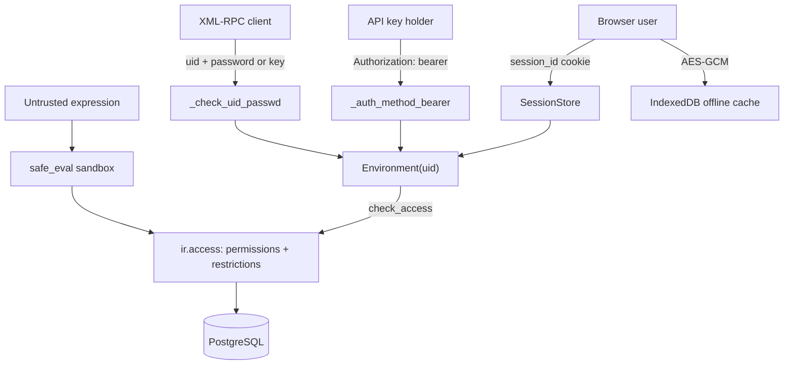

# Security
Active contributors: Christophe, Krzysztof, Raphael

## Purpose

Odoo's security model is a stack of trust boundaries: who the caller is (sessions, passwords, API keys, TOTP, OAuth, passkeys), what the ORM lets that identity touch (`res.groups` + `ir.access`), which records belong to the caller's companies (`allowed_company_ids`), what code may run on the server (`safe_eval`) and in the browser (QWeb escaping, the offline cache), and the request-level protections that stop a third-party site acting as the user (CSRF, bearer headers). This page describes each boundary and points at the files a change would touch. The fork adds two constraints on top: the offline cache must never widen what a user can see, and the access surface is frozen (no new access rules, record rules, or groups).

## Directory layout

```text
odoo/http/
├── session.py             # Session, SessionStore, check(), rotation, expiry
├── requestlib.py          # csrf_token(), validate_csrf()
└── dispatcher.py          # CSRF enforcement, error responses
odoo/addons/base/models/
├── res_users.py           # password hashing, _check_credentials, apikeys, cooldown
├── ir_access.py           # the ir.access model: permissions and restrictions in one place
├── ir_config_parameter.py # key/value secrets and feature flags
├── ir_qweb.py             # template rendering, markupsafe escaping
└── ir_http.py             # _authenticate, _auth_method_bearer, _must_check_identity
odoo/tools/safe_eval/       # sandboxed evaluation (evaluation.py, runtime.py)
odoo/tools/sql.py           # SQL() helper: code and parameters kept together
odoo/orm/
├── query.py                # parameterized query construction
└── fields_textual.py       # the Html field and its sanitize options
odoo/tools/mail.py          # html_sanitize(), the tag/attribute whitelist
addons/web/static/src/core/crypto.js       # AES-GCM for the offline cache
addons/web/static/src/core/utils/indexed_db.js  # storage wrapper, version wipe
addons/web/static/src/service_worker.js    # share-target relay, session-info masking
addons/crm/security/         # CRM access rows and groups (frozen surface)
SECURITY.md                 # upstream disclosure process
```

## Key abstractions

| Name | File | Description |
| --- | --- | --- |
| `Session` / `SessionStore` | `odoo/http/session.py` | File-backed session, rotation, and the session token check. |
| `_check_credentials()` | `odoo/addons/base/models/res_users.py` | Override point for password, API key, TOTP, passkey or external providers. |
| `_check_uid_passwd()` | `odoo/addons/base/models/res_users.py` | Validates the `(uid, password)` pair sent by XML-RPC `execute_kw`. |
| `res.users.apikeys` | `odoo/addons/base/models/res_users.py` | Hashed API keys with scope and expiration; backs bearer auth. |
| `ir.access` | `odoo/addons/base/models/ir_access.py` | One table for CRUD rights and their record domains. |
| `safe_eval()` | `odoo/tools/safe_eval/evaluation.py` | Evaluates untrusted expressions under an opcode and type whitelist. |
| `SQL()` | `odoo/tools/sql.py` | Parameterized SQL fragment; `SQL.identifier()` validates identifiers. |
| `Crypto` | `addons/web/static/src/core/crypto.js` | AES-GCM with a key imported from `session.browser_cache_secret`. |

## How it works



### Authentication

A browser session is a JSON file in `SessionStore` (`data_dir/sessions`, created with mode 0700 per `odoo/tools/config.py`) keyed by a `session_id` cookie generated from `secrets.token_urlsafe(64)` (84 to 86 characters). `session.check()` in `odoo/http/session.py` recomputes `res.users._compute_session_token(sid)` — an HMAC-SHA256 of the session id, keyed by the values of the user's security fields (`id`, `login`, `password`, `active`) together with `database.secret` — and compares it with `consteq()`; a mismatch or expiry logs the user out and raises `SessionExpiredException`, which `HttpDispatcher.handle_error` turns into a redirect to `/web/login` with a rotated session id. Sessions rotate every three hours except for the websocket paths in `SESSION_ROTATION_EXCLUDED_PATHS`, and expire after a week unless `sessions.max_inactivity_seconds` overrides it.

Browser login goes through `/web/login` in `addons/web/controllers/home.py`: it builds a credential dict `{login, password, type}`, optionally verifies a captcha (`_should_captcha_login` plus `_verify_request_recaptcha_token`, provided by `google_recaptcha`), and calls `authenticate()` from `odoo/http/session.py`, which delegates to `res.users._check_credentials()`. Passwords are hashed with `pbkdf2_sha512` at a minimum of 600,000 rounds (`MIN_ROUNDS` in `odoo/addons/base/models/res_users.py`, overridable via `password.hashing.rounds`), and repeated failures trigger a per-worker login cooldown from the `base.login_cooldown_after` and `base.login_cooldown_duration` parameters (defaults 10 failures and 60 seconds); it is held in worker memory, so it is not shared across prefork workers.

`_check_credentials()` is the documented extension point, and the auth addons are `_inherit` overrides of it:

- `auth_totp` adds a time-based second factor (`totp_secret` on `res.users`, `_mfa_type()`, a rate limit on code checks) and blocks password-based RPC for 2FA users through `_rpc_api_keys_only()`.
- `auth_oauth` accepts `{type: 'oauth_token', token: ...}` credentials from external identity providers.
- `auth_passkey` implements WebAuthn passkeys (`webauthn` credential type, login templates, identity-check views); `auth_passkey_key_ids` participates in the session token fields so removing a passkey invalidates sessions.
- `auth_password_policy` overrides `_set_password()` to run `_check_password_policy()` against the `auth_password_policy.minlength` parameter.
- `auth_ldap` and `auth_signup` add LDAP directories and public sign-up as further `_check_credentials()` overrides; `auth_timeout` instead inherits `ir.http` to expire sessions after a per-user inactivity delay.

API keys (`res.users.apikeys`) hash the raw key with a cheaper `pbkdf2_sha512` context, keep an 8-hex-character index for lookup, and carry a scope and an expiration date. They are what a bearer header (`_auth_method_bearer()` in `odoo/addons/base/models/ir_http.py`) and a non-interactive XML-RPC password both resolve to. On top of authentication, `_must_check_identity()` in `odoo/addons/base/models/ir_http.py` can force an identity confirmation (`CheckIdentityException`, answered at `/web/session/identity`) for internal users on unknown devices when `base.session_check_device` is on.

### Authorization

`ir.access` (`odoo/addons/base/models/ir_access.py`) is the single 20.0 access model that replaced the separate `ir.model.access` and `ir.rule` tables (the migration is codified in `odoo/upgrade_code/19.4-00-ir-access.py`). One record carries a `model_id`, an optional `group_id`, an `operation` that is any non-empty subset of `crud`, and an optional `domain`. A record with a group is a **permission** (it grants the operation to that group), one without is a **restriction** (it narrows everyone's access); the ORM combines them in `_access_domain()` and enforces them in `check_access()` (`odoo/orm/models.py`). The model sets `_allow_sudo_commands = False`, so sudoed calls cannot bypass the check. How groups imply each other and how the combination is computed is described in [Users, groups and access](primitives/users-groups-and-access.md); CRM's own rows live in `addons/crm/security/ir.access.csv` and `addons/crm/security/crm_security.xml`. Access is also enforced before a controller runs: `ir.http._pre_dispatch()` checks `check_access('read')` on every record-typed URL parameter, and mail token links browse the record `with_user(uid)`.

### Multi-company isolation

A user has one default company (`company_id`) and a set of allowed companies (`company_ids`); the companies switched on in the session travel in the `allowed_company_ids` context key, and asking for a company outside `company_ids` raises `AccessError("Access to unauthorized or invalid companies.")`. Record-level separation between companies is enforced by `ir.access` domains on company fields, not by a separate mechanism. The full model is described in [Companies and multi-company](primitives/companies-and-multi-company.md).

### The offline cache and PWA

The offline stack stores data in the browser, so its security posture is about what is stored, where the key lives, and when storage turns itself off:

- **Encryption.** `addons/web/static/src/core/crypto.js` encrypts every cached value with AES-GCM, a fresh random 12-byte IV per value, and a key imported from `session.browser_cache_secret` as non-extractable. That secret is an HMAC of the user's session-token field values under the `browser_cache_key` label, computed only in `web_client` in `addons/web/controllers/home.py`, so it changes when the password or a second factor changes; the bootstrap page carrying it is served with `Cache-Control: no-store` and `X-Frame-Options: DENY`.
- **Version wipe.** `addons/web/static/src/core/utils/indexed_db.js` opens the store with a version string (`session.registry_hash + CRYPTO_ALGO` in the offline plugin) and wipes the whole database when that version record changes, so stale data from an older asset registry or algorithm disappears.
- **Secure context only.** Outside a secure context (HTTPS or localhost) the framework substitutes a no-op `FakeIndexedDB` and no `Crypto`, and queueing a write raises `NonSecureContextError`; offline storage is disabled entirely, not partially.
- **No widening.** The cache holds only payloads the user already fetched or wrote online — visited views, searched `many2x` display names, queued writes — and the queue replays through the user's own session, so the server applies `ir.access` to every replayed call exactly as if the user had made it online.
- **Session-info masking.** `addons/web/static/src/service_worker.js` scrapes `odoo.__session_info__` from the web client page, keeps the fresh copy in worker memory, replaces it with `@@@session_info_secret@@@` before the HTML goes into the cache, and re-injects it only when serving that cached page back. The share target is the one path where a browser POST never reaches the server: the worker intercepts it, redirects to `GET /odoo?share_target=trigger`, and forwards the multipart body to the page with `postMessage`, so the authenticated page decides what to do with it.

The encryption key travels to the browser, so it protects data at rest in the browser profile rather than against the browser itself. Storage details are in [local store](features/offline-and-pwa/local-store.md).

### The fork's frozen surface

`AGENTS.md` fixes the security surface of this fork: no new or changed access rule, record rule, or group (`ir.access` replaced both, so the rule reads "don't add or change any access rule, record rule, or group"), the offline cache must never widen what a user can see, no new dependency may pull in code that handles credentials or data, and offline features must be gated on the secure context. The consequence for review: a diff under `addons/crm/` that touches `addons/crm/security/`, adds a group, or introduces a second storage path is out of scope by definition, not just bad style.

### Input validation and code evaluation

- **Fields.** ORM queries are parameterized: `odoo/orm/query.py` builds statements and passes values separately, and hand-written SQL uses the `SQL()` helper in `odoo/tools/sql.py`, which carries code and parameters in one object, with `SQL.identifier()` asserting that a name is a plain identifier before quoting it.
- **HTML.** `Html` fields (`odoo/orm/fields_textual.py`) sanitize by default: `sanitize_tags` and `sanitize_attributes` whitelist tags and attributes through `html_sanitize()` in `odoo/tools/mail.py`; only a field that opts in with `sanitize_overridable=True` can be bypassed, and then only by members of `base.group_sanitize_override`.
- **Templates.** QWeb rendering in `odoo/addons/base/models/ir_qweb.py` produces `markupsafe.Markup`: `t-out` (and the legacy `t-esc`) escape their values, attributes are escaped, and only a value already wrapped as `Markup` is inserted raw.
- **Expressions.** `safe_eval` in `odoo/tools/safe_eval/evaluation.py` compiles the expression, subtracts an opcode blacklist (`IMPORT_NAME`, `IMPORT_FROM`, `IMPORT_STAR`, `STORE_ATTR`, `DELETE_ATTR`, `STORE_GLOBAL`, `DELETE_GLOBAL`), rewrites the AST to wrap calls in `safe_call`, and checks every value against the whitelist in `runtime.py`; anything else raises `UnsafeError`, which inherits `BaseException` so ordinary `except Exception:` blocks cannot swallow it. Domains, view `context` and `domain` attributes, server actions and `ir.access` domains all go through it.
- **Requests.** CSRF is enforced by `HttpDispatcher` for unsafe methods on `type='http'` routes that do not pass `csrf=False`, using an HMAC-SHA1 token over the session id prefix and an expiry timestamp keyed on `database.secret`. Bearer routes without a key accept an existing session only with browser `Sec-Fetch-*` headers. `_sanitize_cookies()` in base is a no-op; web's override normalizes the `cids` cookie, and website's cookie-consent bar is governed by `_is_allowed_cookie()`. Uploads are capped by `web.max_file_upload_size` (default 128 MiB).

### Secrets

Three classes of secret exist, none of which should ever be printed or committed:

- **Per-database.** `database.secret` in `ir.config_parameter` (a uuid4 generated at database creation) keys CSRF tokens, mail action-link tokens, the session token computation and `browser_cache_secret`, so a database dump exposes all of them. The same table holds `database.uuid`, `web.base.url` and feature flags such as `web.json.enabled` and `base.enable_programmatic_api_keys`. Rows are granted `crud` only to `base.group_system` (`access_ir_config_parameter_system` in `odoo/addons/base/security/ir.access.csv`), and the typed accessors (`get_str`, `get_int`, ...) call `check_access('read')` before returning a value.
- **Server configuration.** The database manager password (`admin_passwd`, set with `--admin_passwd` or in `odoo.conf`) is stored hashed by `config.set_admin_password()` and verified by `verify_admin_password()`; an empty value forbids access. The PostgreSQL password (`db_password`, `-w/--db_password`, or the `PGPASSWORD` environment variable) lives in `odoo.conf` or the process environment, never in the database.
- **Session artifacts.** Session files under `data_dir/sessions` hold the `session_token` values, and the web client bootstrap page carries `browser_cache_secret`; both are the reason the sessions directory is mode 0700 and the bootstrap response is `no-store`.

## Integration points

- `_check_credentials()` is the documented extension point for authentication backends; every auth addon builds on it. Bearer authentication reuses the same key store as the web UI ([External RPC](api/external-rpc.md), [Web controllers](api/web-controllers.md)).
- Access control is central to the fork's scope rules ([Users, groups and access](primitives/users-groups-and-access.md)), and the offline cache's no-widening property depends on the queue replaying through the user's session ([sync queue](features/offline-and-pwa/sync-queue.md)).
- `database.secret` keys both CSRF and the CRM mail action links, so rotating it invalidates every outstanding link; see [CRM app](apps/crm/index.md).
- Nothing in the repository runs automated security scanning: `.github/` holds only issue and pull request templates, and there is no CI. Deployment-facing hardening options are in [Deployment](deployment.md) and [Configuration reference](reference/configuration.md).

## Entry points for modification

Security-sensitive changes belong in `odoo/` or in a `_inherit` override, never in a fork-local copy of a check. The practical starting points here are `addons/crm/security/` for CRM rules (which this fork freezes), `addons/web/static/src/core/crypto.js` and `.../core/utils/indexed_db.js` for the offline cache, and `AGENTS.md` at the repository root for the scope rules.

## Key source files

| File | Purpose |
| --- | --- |
| `odoo/http/session.py` | Session storage, token check, rotation, expiry. |
| `odoo/http/requestlib.py` | CSRF token generation and validation. |
| `odoo/http/dispatcher.py` | CSRF enforcement and error responses. |
| `odoo/addons/base/models/res_users.py` | Password hashing, `_check_credentials`, API keys, login cooldown. |
| `odoo/addons/base/models/ir_access.py` | The unified `ir.access` model. |
| `odoo/addons/base/models/ir_config_parameter.py` | Secret and feature-flag storage. |
| `odoo/addons/base/models/ir_http.py` | Auth methods, identity checks, route-param access checks. |
| `odoo/addons/base/models/ir_qweb.py` | QWeb rendering and markupsafe escaping. |
| `odoo/addons/base/security/ir.access.csv` | Base access rows, including `ir.config_parameter` for system only. |
| `odoo/tools/safe_eval/evaluation.py` | Sandboxed `safe_eval()`. |
| `odoo/tools/safe_eval/runtime.py` | Safe whitelist, checker, unsafe policy. |
| `odoo/tools/sql.py` | `SQL()` and `SQL.identifier()`. |
| `odoo/tools/mail.py` | `html_sanitize()`, the HTML whitelist. |
| `odoo/orm/query.py` | Parameterized query construction. |
| `odoo/orm/fields_textual.py` | The `Html` field and its sanitize options. |
| `addons/web/static/src/core/crypto.js` | AES-GCM for the offline cache. |
| `addons/web/static/src/core/utils/indexed_db.js` | Storage wrapper and version wipe. |
| `addons/web/static/src/service_worker.js` | Share-target relay, session-info masking. |
| `addons/web/controllers/home.py` | `browser_cache_secret`, bootstrap headers. |
| `addons/web/controllers/database.py` | Database manager routes behind `admin_passwd`. |
| `addons/crm/security/ir.access.csv` | CRM rights and record domains (frozen). |
| `addons/crm/security/crm_security.xml` | CRM groups (frozen). |
| `SECURITY.md` | Upstream disclosure policy and supported versions. |

## Responsible disclosure

`SECURITY.md` at the repository root is the upstream Odoo policy and applies unchanged. It lists supported versions (19.0 down to 16.0 in the checked-in file, which does not mention 20.0), asks for private reports through `https://www.odoo.com/security-report`, prefers text descriptions with a proof of concept over screenshots, and warns that reports without a realistic attack scenario are rejected. There is no fork-specific contact and no private vulnerability reporting configuration in the repository.

## Related pages

- [API](api/index.md)
- [Web controllers](api/web-controllers.md)
- [External RPC](api/external-rpc.md)
- [Deployment](deployment.md)
- [Users, groups and access](primitives/users-groups-and-access.md)
- [Companies and multi-company](primitives/companies-and-multi-company.md)
- [Local store](features/offline-and-pwa/local-store.md)
- [Sync queue](features/offline-and-pwa/sync-queue.md)
- [Service worker and install](features/offline-and-pwa/service-worker-and-install.md)
- [HTTP server](systems/http-server.md)
- [Configuration reference](reference/configuration.md)
- [Architecture](overview/architecture.md)
