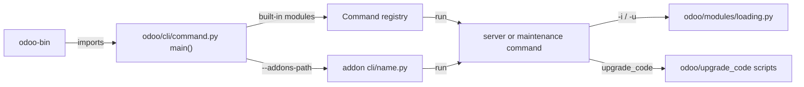

# CLI and maintenance
Active contributors: Krzysztof, Julien, Paolo

## Purpose

`odoo-bin` dispatches administrative and development commands from `odoo/cli/`. A `Command` subclass registers itself automatically when its module is imported, while the default command is `server`. The same entry point covers maintenance work: database lifecycle, module lifecycle, translations, source codemods in `odoo/upgrade_code/`, and the data-migration scripts the loader runs from `odoo/upgrade/` at upgrade time.

## Directory layout

```text
odoo-bin
odoo/cli/
├── command.py       # dispatch, built-in and addon command discovery
├── server.py        # default server command
├── db.py            # database lifecycle commands
├── module.py        # module lifecycle commands
├── shell.py         # interactive environment
├── scaffold.py      # addon skeleton generator
├── i18n.py          # translation import/export
├── neutralize.py    # production-effect scrubbing
├── obfuscate.py     # database content obfuscation
├── duplicate.py     # data duplication for demos
├── cloc.py          # line counting
├── deploy.py        # addon upload
├── start.py         # project-oriented dev server
└── upgrade_code.py  # source codemod runner
odoo/upgrade/        # namespace package (odoo.upgrade.__path__)
odoo/upgrade_code/   # the codemod scripts themselves
scripts/dev/         # fork wrappers (setup, start, test, reset, rebuild)
```

## Key abstractions

| Name | File | Description |
| --- | --- | --- |
| `Command` | `odoo/cli/command.py` | Base class that validates and auto-registers a command. |
| `main()` | `odoo/cli/command.py` | Selects the command, defaults to `server`, and invokes it. |
| `load_addons_commands()` | `odoo/cli/command.py` | Discovers `<module>/cli/<name>.py` files from the addons paths. |
| `Server` | `odoo/cli/server.py` | Parses server configuration and starts the runtime. |
| `Module` | `odoo/cli/module.py` | Installs, upgrades, uninstalls, lists, and force-loads demo data for modules. |
| `Db` | `odoo/cli/db.py` | Filestore-aware database init/load/dump/duplicate/rename/drop. |
| `UpgradeCode` | `odoo/cli/upgrade_code.py` | Runs the source rewrite scripts in `odoo/upgrade_code/`. |
| `MigrationManager` | `odoo/modules/migration.py` | Runs data-migration scripts at upgrade time. |

## How it works

The executable imports `odoo.cli.main`. `Command.__init_subclass__()` derives each command name from its module filename and registers it in a process-local mapping. The dispatcher accepts a leading `--addons-path=...` before the command so it can find extra addon commands, uses `server` when no command is named, and resolves built-ins before searching addon directories with `load_addons_commands()`.



| Command | Purpose |
| --- | --- |
| `server` | Start the Odoo server; this is the default command. |
| `shell` | Open an interactive Python environment, optionally with `env` for one database. |
| `scaffold` | Generate an addon skeleton from a built-in or supplied template. |
| `db` | `init`, `load`, `dump`, `duplicate`, `rename`, or `drop` a database with filestore handling. |
| `deploy` | Zip and upload an addon to an Odoo instance that supports module import. |
| `start` | Start a project-oriented development server, inferring module paths, database name, and database filter. |
| `module` | `install`, `upgrade`, `uninstall`, `force_demo`, or `list` modules. |
| `i18n` | `import`, `export`, or `loadlang` translation files. |
| `cloc` | Count relevant Python, JavaScript, and XML lines by path or database customizations. |
| `neutralize` | Disable production effects such as email in a database intended for testing. |
| `obfuscate` | Encrypt or decrypt selected textual database data; it warns that its output is not safe for third-party transfer. |
| `duplicate` | Populate selected models by duplicating existing data for testing or demos. |
| `help` | List built-in and discovered addon commands. |
| `upgrade_code` | Apply versioned source rewrite scripts under `odoo/upgrade_code`. |

### Migrations

Two distinct mechanisms share the word "upgrade":

- **Data migrations** run while the loader updates a module. `MigrationManager` (`odoo/modules/migration.py`) collects `pre-*`, `post-*` and `end-*` scripts in version directories from `<module>/migrations/`, `<module>/upgrades/`, and any directory on `odoo.upgrade.__path__` (`--upgrade-path`). Each script defines `migrate(cr, installed_version)` and runs only when `installed_version < script_version <= current_version`; see [module system](module-system.md) for the stage order. In this repository `odoo/upgrade/` is an empty namespace package (it holds only `.gitkeep`), so it contributes nothing until an upgrade path is supplied; installed addons' own `migrations/` directories are the usual source.
- **Source codemods** rewrite addon source files before deployment, not database data. `odoo/upgrade_code/` holds one script per version, named `{version}-{name}.py` and exposing `upgrade(file_manager)`; `odoo-bin upgrade_code` (`odoo/cli/upgrade_code.py`) discovers them, filters with `--script`, `--from`/`--to` and `--glob`, and rewrites through `FileManager`/`FileAccessor`, which track dirty files so unchanged ones are left alone. `--dry-run` lists changes without writing; the command exits non-zero when it rewrote files. The scripts are best-effort: the module docstring calls them a help for the heavy lifting, not silver bullets.

### Development wrappers

`scripts/dev/` wraps the commands above for this fork's CRM work; all of them run from the repository root and write to `logs/` and `var/`:

| Script | From an operator's point of view |
| --- | --- |
| `setup.sh` | Idempotent machine setup: PostgreSQL, `.venv`, headless Chrome, `websocket-client` and `phonenumbers`. |
| `start.sh` | Foreground server on `http://localhost:8069`; creates `crm_offline` on first run. |
| `start.sh --https` | Same, plus a TLS listener on 8069 with a self-signed certificate generated in `var/tls/`, proxying to Odoo on 8070; accepts connections from any interface. |
| `stop.sh` | Stops a server started by `start.sh`. |
| `test-py.sh` | Runs the crm Python suite with the `--test-tags /crm` command from [test framework](test-framework.md). |
| `test-js.sh desktop\|mobile` | Runs crm JS unit tests under one browser preset. |
| `test-guard.sh` | Fails if any `.test.js` contains `only(` or `debug(`. |
| `rebuild-assets.sh` | Deletes generated asset attachments and pregenerates the bundles. See [assets](assets.md). |
| `reset-db.sh` | Drops and recreates `crm_offline` with `-i crm,mail --with-demo --stop-after-init` and removes its filestore. |

`--https` exists because offline features need a secure context: `localhost` counts as one, any other hostname over plain HTTP does not. The certificate is untrusted, so the browser warns once.

## Integration points

Server options are owned by the configuration parser used from `odoo/cli/server.py`. Common operational flags are `--dev` for development mode, `--test-tags` for filtered test runs, `-i` and `-u` to install or upgrade modules, `--addons-path` to locate addon directories and commands, and `--db-filter` to restrict served databases. Exact option behavior belongs in [Configuration](../reference/configuration.md).

An addon can provide a command at `<module>/cli/<name>.py`. `load_addons_commands()` searches every addons path for that shape and loads it under `odoo.cli.<name>` without importing the addon package. The class still must satisfy the command-name rule: its declared or derived name matches `<name>.py`.

The `-i`/`-u` paths hand off to [module system](module-system.md) and [server runtime](server-runtime.md); the `--stop-after-init` runs use the same registry preload that a normal start does. Server operation and logs are covered by [Server runtime](server-runtime.md) and [Logging](../how-to-monitor/logging.md).

## Entry points for modification

Add a core command as a module in `odoo/cli/` containing one `Command` subclass, or add addon-specific maintenance behavior in that addon's `cli/` directory. Prefer an existing command's parser conventions, and keep database-destructive commands explicit about their target. For CRM development, do not replace the fork wrappers with ad hoc `odoo-bin` commands when a wrapper exists.

## Key source files

| File | Purpose |
| --- | --- |
| `odoo-bin` | Command-line executable that enters Odoo's CLI. |
| `odoo/cli/command.py` | Command registration, dispatch, and addon command discovery. |
| `odoo/cli/server.py` | Default server command and server startup preparation. |
| `odoo/cli/db.py` | Filestore-aware database operations. |
| `odoo/cli/module.py` | Module installation and upgrade operations. |
| `odoo/cli/shell.py` | Interactive ORM shell. |
| `odoo/cli/i18n.py` | Translation import, export, and language setup. |
| `odoo/cli/upgrade_code.py` | Upgrade-code script selection and execution. |
| `odoo/upgrade_code/owl3-migration.py` | Example codemod: OWL 2 to 3 source migration. |
| `odoo/modules/migration.py` | Data-migration script discovery and execution. |
| `scripts/dev/README.md` | Fork development wrapper usage and the exact commands. |
| `scripts/dev/reset-db.sh` | Clean `crm_offline` recreation. |
| `scripts/dev/start.sh` | Dev server, including the `--https` TLS mode. |

## Related pages

- [Module system](module-system.md)
- [Server runtime](server-runtime.md)
- [Assets](assets.md)
- [Test framework](test-framework.md)
- [Configuration](../reference/configuration.md)
- [Testing](../how-to-contribute/testing.md)
- [Logging](../how-to-monitor/logging.md)
