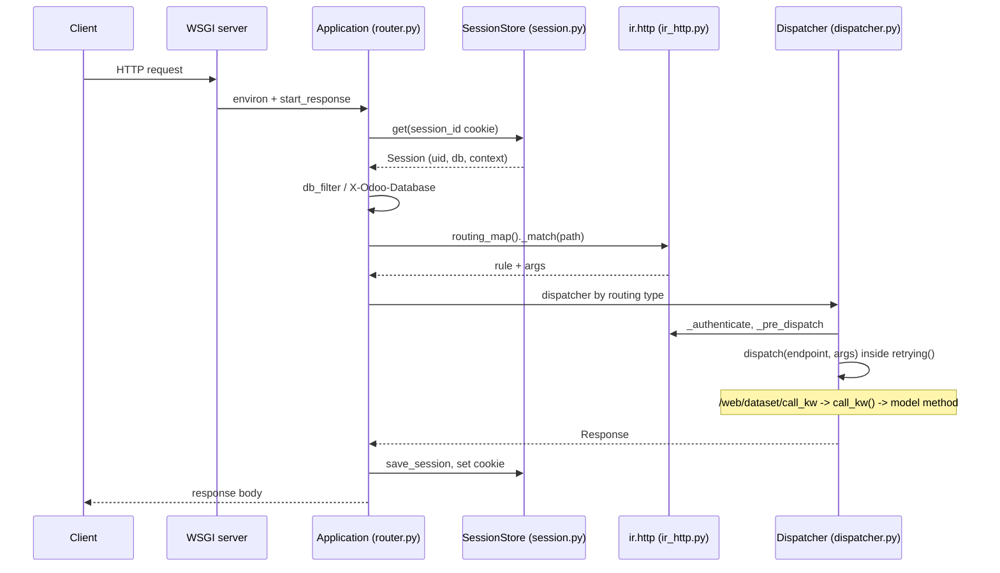

# HTTP server
Active contributors: Julien, Krzysztof, Thle

## Purpose

`odoo/http/` turns raw sockets into ORM calls. It is a plain WSGI application (`root` in `odoo/http/router.py`) that resolves a session and a database from the request, matches the path against a per-registry routing map, and hands the call to one of three dispatchers depending on the route type and content type. Everything a controller touches, `odoo.http.request`, `env`, `session`, `csrf_token()`, is produced here.

The web client's data layer does not call models directly: every ORM call goes through the JSON endpoint `/web/dataset/call_kw`, which is a thin wrapper over `call_kw()` in `odoo/service/model.py`. This page is about the HTTP machinery; controller-by-controller detail lives in [web controllers](../api/web-controllers.md).

## Directory layout

```text
odoo/http/
├── __init__.py        # the `request` proxy; imports all submodules
├── router.py          # WSGI Application, serve_db/serve_nodb, db resolution
├── session.py         # Session, SessionStore, rotation, expiry, devices
├── dispatcher.py      # HttpDispatcher, JsonRPCDispatcher, Json2Dispatcher
├── routing_map.py     # Controller, @route, rule generation
├── requestlib.py      # Request object: params, csrf, json helpers
├── response.py        # Response.load() for controller return values
├── retrying.py        # serialization-failure retry loop
├── server.py          # h11 socket layer, builds the WSGI environ
├── stream.py          # file streaming, cache headers
├── geoip.py           # GeoIP resolution for sessions
└── server_log.py      # http access logging
odoo/addons/base/models/ir_http.py    # routing map, auth methods, dispatch hooks
addons/web/controllers/dataset.py     # /web/dataset/call_kw, call_button
```

## Key abstractions

| Name | File | Description |
| --- | --- | --- |
| `Application` | `odoo/http/router.py` | The WSGI app, exported as `root`; entry point for every request. |
| `Request` | `odoo/http/requestlib.py` | Per-request state: params, env, session, httprequest, dispatcher. |
| `Session` / `SessionStore` | `odoo/http/session.py` | Cookie-backed mapping stored as JSON files under `data_dir/sessions`. |
| `Dispatcher` | `odoo/http/dispatcher.py` | Abstract base; subclasses register themselves by `routing_type`. |
| `Controller` / `route()` | `odoo/http/routing_map.py` | Controller mixin and decorator that binds paths to methods. |
| `ir.http` | `odoo/addons/base/models/ir_http.py` | Per-registry routing map, auth methods, `_dispatch` hooks. |
| `retrying()` | `odoo/http/retrying.py` | Retries a request on serialization failures and commits at the end. |
| `HTTPSocket` | `odoo/http/server.py` | h11 request parsing, WSGI environ construction, response writing. |
| `request` | `odoo/http/__init__.py` | Werkzeug `LocalProxy` over a `contextvars.ContextVar`. |

## How it works

`Application.__call__` in `odoo/http/router.py` is the WSGI entry point. It applies `ProxyFix` when `--proxy-mode` is on and an `X-Forwarded-Host` header is present, wraps the environ in an `HTTPRequest` plus a `Request`, and publishes it on the `request_var` context variable so `odoo.http.request` resolves for the rest of the call.

`_set_session_and_dbname()` then reads the `session_id` cookie and loads the session from `SessionStore` (`odoo/http/session.py`, files scattered over 4096 subdirectories of `config.session_dir`). Database resolution happens in this order: the session's `db` if `db_filter()` accepts it, else the `X-Odoo-Database` header (stateless, `session.can_save = False`) if it passes the same filter, else `db_list()` when exactly one database matches. Passing both a session database and a mismatching header raises `Forbidden`. `db_filter()` applies `--db-filter` with `%h` (host) and `%d` (first domain label) substitution, falls back to the `--database` list, and finally to no filtering.

Static paths (`/<module>/static/...`) short-circuit in `serve_static()` with a `safe_join` against the module's `static/` directory, served through `Stream.from_path(..., public=True)` with `STATIC_CACHE` max-age (`0` when the session is in asset debug mode). Otherwise `serve_db()` runs when a database was resolved and `serve_nodb()` otherwise. `serve_nodb` matches against `Application.nodb_routing_map`, built only from server-wide modules and routes with `auth='none'`.

`serve_db()` gets the `Registry` for the database (`odoo/orm/registry.py`) and opens a read-only cursor, then asks `request.registry['ir.http']._match(path)` for the rule. `ir.http.routing_map()` in `odoo/addons/base/models/ir_http.py` is `@api.ormcache('key', cache='routing')`; it calls `_generate_routing_rules()` from `odoo/http/routing_map.py`, which rebuilds the controller inheritance tree from the installed modules, picks the leaf classes per base controller, and merges every `@route` declaration along the MRO. `ir.http._serve_fallback()` serves `ir.attachment` records when nothing matched. If the matched endpoint is `readonly` (a route option, defaulting to true only for `auth='none'`; it may also be a callable), the request runs under the read-only cursor, and a `ReadOnlySqlTransaction` error triggers a retry with a read/write cursor (`cursor_mode` goes `'ro'` to `'ro->rw'`). Read/write routes close or roll back the read-only cursor and open a fresh one.

`_set_request_dispatcher()` picks the dispatcher class from `_dispatchers[routing['type']]` and rejects the request with `UnsupportedMediaType` when the content type cannot produce that route type. The three dispatchers in `odoo/http/dispatcher.py`:

- `HttpDispatcher` (`type='http'`) merges query string, form body, and path args into `request.params`, then validates CSRF for unsafe methods (`SAFE_HTTP_METHODS` is `('GET', 'HEAD', 'OPTIONS', 'TRACE')`) unless the route sets `csrf=False`. A missing or bad token raises `BadRequest` ("Session expired (invalid CSRF token)"); with no database it redirects to `/web/database/selector` instead.
- `JsonRPCDispatcher` (`type='jsonrpc'`) parses a JSON-RPC 2.0 envelope. It ignores the `method` member (the path routes the request) and requires `params` to be a JSON object; a `context` key replaces the session context. Errors come back as `{"jsonrpc": "2.0", "error": {...}}` built by `serialize_exception()`. The web client's ORM calls use this type.
- `Json2Dispatcher` (`type='json2'`) accepts `application/json` or an empty body, merges the path args over the parsed body, and returns the endpoint result as JSON unless the endpoint already returned a `Response`.

Inside dispatch, `ir.http._authenticate()` selects `_auth_method_user`, `_auth_method_public`, `_auth_method_none` or `_auth_method_bearer` (API keys via `res.users.apikeys`, stateless). `session.check()` in `odoo/http/session.py` compares the stored `session_token` against `res.users._compute_session_token(sid)`; a mismatch logs out and raises `SessionExpiredException`, which `HttpDispatcher.handle_error` turns into a redirect to `/web/login`. `post_dispatch` saves the session (`save_session`), rotating it after `SESSION_ROTATION_INTERVAL` (3 hours) except for the websocket paths in `SESSION_ROTATION_EXCLUDED_PATHS`, and sets the `session_id` cookie with `httponly=True`.

### The ORM JSON endpoint

The data layer of the web client posts JSON-RPC to `/web/dataset/call_kw` (and `/web/dataset/call_kw/<path:path>`, plus `/web/dataset/call_button` for button methods). Both routes are declared in `addons/web/controllers/dataset.py` with `type='jsonrpc'`, `auth="user"`, and a dynamic `readonly` callable that inspects the target method's `_readonly` flag so read calls can run on a replica. The controller body is one line:

```python
return call_kw(request.env[model], method, args, kwargs)
```

`call_kw()` in `odoo/service/model.py` looks up `method` on the model, applies the user's context, and returns the method's value, which `JsonRPCDispatcher` wraps as the JSON-RPC `result`. So the request path for a `web_save` is: HTTP POST `/web/dataset/call_kw/crm.lead/web_save` -> `DataSet.call_kw` -> `call_kw()` -> `BaseModel.web_save` (`addons/web/models/models.py:192`) -> `write`/`create`. The offline queue replays exactly this path with `orm.silent.call(model, method, args, kwargs)`; see [sync queue](../features/offline-and-pwa/sync-queue.md).

Error handling is one-directional. The server converts an exception into a JSON-RPC error (or, for `type='http'`, an HTTP error response) through the dispatcher's `handle_error`; a network-level failure produces no response at all. The distinction the client cares about — `ConnectionLostError` versus a server error such as `UserError` — is decided in the browser, not here. Session expiry is the one case the HTTP layer redirects rather than erroring.

Every database-backed call runs inside `retrying()` from `odoo/http/retrying.py`: on a concurrency error it rolls back, restores the session, rewinds uploaded files, and retries up to `MAX_TRIES_ON_CONCURRENCY_FAILURE` (5) times with a random backoff of `random.uniform(0.0, 2 ** tryno)` seconds. `psycopg2.IntegrityError` is not retried, it becomes a `ValidationError` with the model's `_sql_error_to_message` text. The loop commits at the end.

Longpolling and websockets do not go through a worker thread each. `GeventServer` (see [server runtime](server-runtime.md)) runs `HTTPSocket.process_request()` in a greenlet per connection; `odoo/http/server.py` implements the h11 protocol, builds the WSGI environ by hand, and detects a `101 Switching Protocols` response to hand the socket to the websocket layer. The `/websocket` route is declared with `websocket=True` in `addons/bus/controllers/websocket.py`, and the environ only carries the raw socket for threaded or gevent servers, so prefork HTTP workers cannot upgrade.



## Integration points

- `odoo/service/server.py:ThreadedServer.http_client_thread`, `WorkerHTTP.process_request` and `GeventServer.http_client_greenlet` all end in `HTTPSocket.process_request()` from `odoo/http/server.py`.
- `setup/odoo-wsgi.example.py` shows the app under gunicorn/uwsgi: `odoo.http:root` plus `application.initialize()`.
- Addons hook in by subclassing `odoo.http.Controller` and overriding `ir.http` methods (`_pre_dispatch`, `_post_dispatch`, `_serve_fallback`, `_get_converters`). The fork's PWA routes in `addons/web/controllers/webmanifest.py` are ordinary `@route` controllers. The external XML-RPC/JSON-RPC endpoints in `addons/rpc/controllers/` ride the same dispatchers; see [external RPC](../api/external-rpc.md).
- Sessions are plain files; `ir.http._gc_sessions()` vacuums them via `SessionStore.vacuum()` using the `sessions.max_inactivity_seconds` parameter or the 1-week `SESSION_LIFETIME` default.
- RPC from external clients reuses `retrying()` and `Registry` cursors without a dispatcher: `addons/rpc/controllers/xmlrpc.py` exposes `/xmlrpc/2/<service>` and `dispatch()` in `odoo/service/model.py` performs the actual `call_kw()` call.

## Entry points for modification

A new endpoint is a `Controller` subclass with `@route(...)`; pick `type`, `auth`, and whether `readonly` or `csrf=False` apply, and remember that any overriding method must be re-decorated with `@route`. Cross-cutting request behavior belongs in an `ir.http` override, not in the core. Read `odoo/http/router.py` first when tracing "which code handled this URL": the answer is always `serve_db` plus one dispatcher.

## Key source files

| File | Purpose |
| --- | --- |
| `odoo/http/router.py` | `Application`, db resolution, `serve_db`, `serve_nodb`, `serve_static`. |
| `odoo/http/dispatcher.py` | The three dispatchers, CSRF text, `serialize_exception`. |
| `odoo/http/session.py` | `Session`, `SessionStore`, `check`, `save_session`, rotation constants. |
| `odoo/http/routing_map.py` | `Controller`, `route()`, `_generate_routing_rules`, `ROUTING_KEYS`. |
| `odoo/http/requestlib.py` | `Request`: params, `csrf_token`, `validate_csrf`, json helpers. |
| `odoo/http/response.py` | `Response.load()` for the values controllers may return. |
| `odoo/http/retrying.py` | Retry loop, backoff, integrity-error conversion. |
| `odoo/http/server.py` | h11 socket handling, WSGI environ, websocket upgrade. |
| `odoo/http/__init__.py` | The `request` proxy and submodule imports. |
| `odoo/addons/base/models/ir_http.py` | Routing map, auth methods, dispatch and fallback hooks. |
| `addons/web/controllers/dataset.py` | `/web/dataset/call_kw` and `/web/dataset/call_button`, the client's ORM endpoint. |
| `odoo/service/model.py` | `dispatch()` and `call_kw()`, the ORM call behind the JSON endpoint. |
| `addons/rpc/controllers/xmlrpc.py` | The `/xmlrpc/2/<service>` endpoints over those services. |
| `addons/bus/controllers/websocket.py` | The `/websocket` route served by the gevent server. |

## Related pages

- [Server core](index.md)
- [Server runtime](server-runtime.md)
- [ORM](orm.md)
- [Web controllers](../api/web-controllers.md)
- [External RPC](../api/external-rpc.md)
- [Sync queue](../features/offline-and-pwa/sync-queue.md)
- [Configuration reference](../reference/configuration.md)
