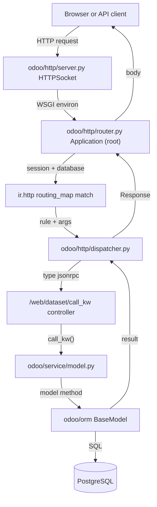

# Server core
Active contributors: Christophe, Krzysztof, Raphael

## Purpose

The `odoo/` package is the server itself: the ORM, the HTTP layer, the module system, the worker processes, and every `odoo-bin` subcommand. Business functionality is not here, it lives in addons; the core only loads them and serves them. `base`, the one module everything depends on, sits inside the core at `odoo/addons/base` rather than in the top-level `addons/` directory.

## Directory layout

```text
odoo/
├── init.py              # process bootstrap (imported as odoo.init)
├── release.py           # version constants (20.0, Python 3.12-3.14, PostgreSQL 16)
├── exceptions.py        # UserError, AccessError, ValidationError, ...
├── sql_db.py            # psycopg2 connection pools and Cursor
├── netsvc.py            # logging setup and helpers
├── _monkeypatches/      # patches to stdlib and third-party libraries
├── addons/              # namespace package; base lives at odoo/addons/base
├── orm/                 # the ORM implementation (models, fields, registry, ...)
├── models/  fields/  api/   # re-export shims over odoo/orm/
├── http/                # WSGI application, sessions, dispatchers, routing
├── modules/             # manifests, module graph, loading, migrations
├── service/             # server runtime (ThreadedServer, PreforkServer, GeventServer)
├── tools/               # config registry and utilities (safe_eval, sql, misc, ...)
├── cli/                 # odoo-bin subcommands
├── tests/               # Python test framework
├── upgrade/             # namespace package for data-migration scripts
└── upgrade_code/        # codemod scripts run by `odoo-bin upgrade_code`
```

## Key abstractions

| Name | File | Description |
| --- | --- | --- |
| `Registry` | `odoo/orm/registry.py` | One model registry per database; the ORM's entry object. |
| `Environment` | `odoo/orm/environments.py` | Cursor + uid + context + superuser flag, wrapping a `Transaction`. |
| `BaseModel` | `odoo/orm/models.py` | Root of every model; recordsets, CRUD, access checks. |
| `Application` / `root` | `odoo/http/router.py` | The WSGI app every server runtime calls. |
| `Request` / `Session` | `odoo/http/requestlib.py`, `odoo/http/session.py` | Per-request state and the cookie-backed session. |
| `Manifest` | `odoo/modules/module.py` | Parsed `__manifest__.py`; addons path discovery. |
| `ModuleGraph` | `odoo/modules/module_graph.py` | Load order for installed and updated modules. |
| `configmanager` | `odoo/tools/config.py` | Option registry read as `config['key']`. |
| `Command` | `odoo/cli/command.py` | Base of every `odoo-bin` subcommand, auto-registered. |
| `TransactionCase` / `HttpCase` | `odoo/tests/common.py` | The Python test fixtures. |

## How it works

### Request flow

A request enters as WSGI. The `Application` in `odoo/http/router.py` resolves a session and a database, matches the path against the per-registry routing map built by `ir.http`, and hands the call to a dispatcher. The web client's ORM calls land on `/web/dataset/call_kw`, whose controller calls `call_kw()` in `odoo/service/model.py`; that is the single bridge from HTTP onto a model method. The result travels back as a `Response` (or a JSON-RPC envelope) and the session is saved on the way out.



### Namespace bootstrap

There is no `odoo/__init__.py`. The package is a PEP 420 namespace package (built that way: `setup.py` calls `find_namespace_packages()`), and the bootstrap code lives in `odoo/init.py`. Nothing runs it automatically; every entry point imports it explicitly as `odoo.init` with the comment "import first for core setup", see `odoo/cli/command.py`, `odoo/http/__init__.py`, `odoo/modules/__init__.py` and `odoo/orm/__init__.py`.

`odoo/init.py` does five things:

1. Refuses to run with Python optimization enabled (`sys.flags.optimize`) and asserts `sys.version_info > MIN_PY_VERSION` from `odoo/release.py`.
2. Raises the gc threshold to `(12_000, 20, 25)` when it is still at a Python default, then calls `gc_set_timing(enable=True)` from `odoo/tools/gc.py`.
3. Imports `odoo._monkeypatches` and calls `patch_init()`: it forces the process timezone to UTC (`os.environ['TZ']`, then `time.tzset()`), installs a meta-path import hook, and patches the CPython specifics. The hook does the rest lazily: every submodule of `odoo/_monkeypatches/` is named after the library it patches (werkzeug, lxml, csv, locale, ...) and exposes `patch_module()`, which the hook runs as soon as that library is imported.
4. `odoo/_monkeypatches/site.py` sets `odoo.evented` to `True` when `sys.argv[1] == 'gevent'`, in which case it monkey-patches everything with `gevent.monkey.patch_all()` and installs a gevent wait callback for psycopg2.
5. Re-exports developer shortcuts at the `odoo` namespace level: `odoo.SUPERUSER_ID`, `odoo._`, `odoo._lt`, `odoo.Command`.

`odoo/addons/` and `odoo/upgrade/` are namespace packages too, and they stay empty until `initialize_sys_path()` in `odoo/modules/module.py` appends directories to `odoo.addons.__path__` (the data dir, each `--addons-path` entry, the repository's top-level `addons/`) and to `odoo.upgrade.__path__` (`--upgrade-path`, or the legacy `odoo/addons/base/maintenance/migrations`). It then freezes both paths against re-scanning and installs a meta-path `UpgradeHook` that maps the legacy `odoo.addons.base.maintenance.migrations` name to `odoo.upgrade`.

`odoo/addons/test_base/tests/test_core/test_core_init.py` guards this layout: it imports every top-level `odoo.*` module in a subprocess and verifies the ones in its `EXPECT_UTC` tuple force the process timezone to UTC.

### Shim structure

The ORM implementation lives in `odoo/orm/`. The historical import paths still work because `odoo/models/`, `odoo/fields/` and `odoo/api/` are packages whose `__init__.py` files re-export from `odoo/orm/`, each with the comment "This is a `__init__.py` file to avoid merge conflicts on `odoo/models.py`". So `from odoo import models` resolves to `odoo/models/__init__.py`, which pulls `BaseModel`, `Model`, `TransientModel` and friends from `odoo/orm/models.py` and `odoo/orm/model_classes.py`. `odoo/modules/registry/__init__.py` is the same trick for `Registry`, re-exported from `odoo/orm/registry.py`. The ORM itself is covered in [ORM](orm.md).

### What lives where

| `odoo/` path | Topic |
| --- | --- |
| `odoo/init.py` | Process bootstrap: version check, gc tuning, monkeypatches, namespace exports. |
| `odoo/_monkeypatches/` | Patches to stdlib and third-party libraries; the gevent mode flag. |
| `odoo/orm/` | ORM: models, fields, domains, environments, cache, per-database Registry. |
| `odoo/models/`, `odoo/fields/`, `odoo/api/` | Re-export shims over `odoo/orm/`. |
| `odoo/http/` | WSGI application, sessions, dispatchers, routing map, h11 socket layer. |
| `odoo/modules/` | Manifests, addons path, module graph, loading, migrations. |
| `odoo/service/` | Server runtimes, cron worker, RPC dispatch services. |
| `odoo/sql_db.py` | Connection pools, read-only pools, `Cursor`. |
| `odoo/tools/` | `config` option registry, `safe_eval`, `sql`, `misc`, `translate`, profiler. |
| `odoo/cli/` | `odoo-bin` subcommands, auto-registered per module. |
| `odoo/tests/` | `TransactionCase`, `HttpCase`, test loaders, tags. |
| `odoo/addons/` | Namespace package holding `base` and the `test_*` support modules. |
| `odoo/upgrade/` | Namespace package holding data-migration scripts per version. |
| `odoo/upgrade_code/` | Codemod scripts applied to addon source by `upgrade_code`. |
| `odoo/release.py` | Version and compatibility constants. |

## Systems pages

- [ORM](orm.md) covers `odoo/orm/`: `BaseModel` and the recordset API, the field family, domain trees, environments and transactions, `ir.access` enforcement, the per-database `Registry`, and the `web_*` methods the web client and the offline queue call.
- [HTTP server](http-server.md) covers `odoo/http/`: the WSGI `Application`, cookie sessions on the filesystem, db resolution through `--db-filter`, the routing map built from controller inheritance trees, the three dispatchers (http, jsonrpc, json2), CSRF checks, read-only cursors with automatic read/write retry, and the gevent/websocket path.
- [Module system](module-system.md) covers `odoo/modules/`: manifests, addons path resolution, `ModuleGraph` phase/depth ordering, the install and upgrade load sequence, versioned migration scripts, and the `upgrade_code` codemod framework in `odoo/cli/upgrade_code.py` and `odoo/upgrade_code/`.
- [Server runtime](server-runtime.md) covers `odoo/service/server.py`: `ThreadedServer` for development, `PreforkServer` with `WorkerHTTP`/`WorkerCron` for production, `GeventServer` for longpolling and websockets, the memory/CPU/request limits, connection pooling in `odoo/sql_db.py`, and `odoo/tools/config.py` as the option registry.
- [Assets](assets.md) covers how the JS/CSS bundles declared in manifests are compiled and served, and the registry hash that invalidates the browser's offline store.
- [Test framework](test-framework.md) covers `odoo/tests/` and the browser-based suites.
- [CLI and maintenance](cli-and-maintenance.md) covers the `odoo-bin` subcommands and the migration utilities.

## Integration points

- Addons reach the core through `from odoo import models, fields, api`; the HTTP layer enters the ORM through `call_kw()` in `odoo/service/model.py`.
- The server runtime calls `preload_registries()` in `odoo/service/server.py`, which calls `Registry.new()` and therefore `load_modules()`; see [module system](module-system.md) and [server runtime](server-runtime.md).
- The web client and the fork's offline queue both reach the ORM through `/web/dataset/call_kw`; see [HTTP server](http-server.md) and [sync queue](../features/offline-and-pwa/sync-queue.md).

## Entry points for modification

In this fork the core is upstream code; the project rules in `AGENTS.md` at the repository root restrict changes to `addons/crm/`. Read the core to understand behavior, then extend it from an addon: `_inherit` on a model, a `Controller` subclass for HTTP behavior, or an `ir.http` override. Use the files below as the reference whenever a claim about core behavior matters to a change.

## Key source files

| File | Purpose |
| --- | --- |
| `odoo/init.py` | Bootstrap imported before anything else runs. |
| `odoo/release.py` | Version, minimum Python and PostgreSQL versions. |
| `odoo/_monkeypatches/site.py` | Sets `odoo.evented` and patches psycopg2 for gevent. |
| `odoo/modules/module.py` | `Manifest`, `initialize_sys_path()`, `load_openerp_module()`. |
| `odoo/orm/registry.py` | Per-database `Registry` and cross-process signaling. |
| `odoo/orm/models.py` | `BaseModel` and the recordset implementation. |
| `odoo/orm/fields.py` | `Field` base class of the field family. |
| `odoo/orm/environments.py` | `Environment`, `Transaction`, signaling checks. |
| `odoo/http/router.py` | WSGI `Application` and the `serve_db`/`serve_nodb` flow. |
| `odoo/http/dispatcher.py` | The http, jsonrpc and json2 dispatchers. |
| `odoo/http/session.py` | `Session`, `SessionStore`, rotation and expiry. |
| `odoo/modules/loading.py` | `load_modules()` and `load_module_graph()`. |
| `odoo/modules/module_graph.py` | `ModuleGraph` load ordering. |
| `odoo/modules/migration.py` | `MigrationManager` for pre/post/end scripts. |
| `odoo/service/server.py` | `start()`, `ThreadedServer`, `PreforkServer`, `GeventServer`. |
| `odoo/sql_db.py` | `ConnectionPool`, `Cursor`, `db_connect()`. |
| `odoo/tools/config.py` | `configmanager`, every `odoo-bin` option. |
| `odoo/cli/command.py` | Command discovery and `main()`. |
| `odoo/addons/test_base/tests/test_core/test_core_init.py` | Guard test for standalone module imports. |

## Related pages

- [Architecture](../overview/architecture.md)
- [ORM](orm.md)
- [HTTP server](http-server.md)
- [Module system](module-system.md)
- [Server runtime](server-runtime.md)
- [Assets](assets.md)
- [Addons](../apps/index.md)
- [Configuration reference](../reference/configuration.md)
