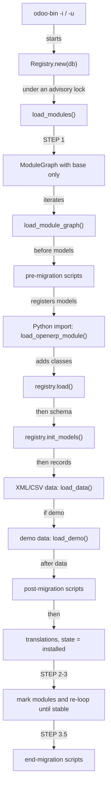

# Module system
Active contributors: Christophe, Raphael, Xavier

## Purpose

`odoo/modules/` discovers addon directories, parses their manifests, decides the order in which they load, and drives install and upgrade: Python import, model registration, XML/CSV data, demo data, and versioned migration scripts. It also owns the per-database `Registry` and the PostgreSQL tables other processes watch to notice that a registry or a cache changed.

## Directory layout

```text
odoo/modules/
├── module.py        # Manifest, addons path setup, load_openerp_module()
├── module_graph.py  # ModuleNode, ModuleGraph (phase/depth ordering)
├── loading.py       # load_modules(), load_module_graph()
├── migration.py     # MigrationManager, exec_script()
├── db.py            # database creation, initialization, duplicate/rename
├── neutralize.py    # neutralize a database (demo/production scrubbing)
└── registry/        # shim re-exporting odoo.orm.registry.Registry
odoo/orm/registry.py          # Registry, LRU, signaling
odoo/tools/convert.py         # convert_file(): XML and CSV record loading
odoo/cli/upgrade_code.py      # upgrade_code command (source codemods)
odoo/upgrade_code/            # the codemod scripts
```

## Key abstractions

| Name | File | Description |
| --- | --- | --- |
| `Manifest` | `odoo/modules/module.py` | Parsed and validated `__manifest__.py`; a `Mapping` with derived properties. |
| `initialize_sys_path` | `odoo/modules/module.py` | Extends `odoo.addons.__path__` and `odoo.upgrade.__path__`. |
| `ModuleNode` | `odoo/modules/module_graph.py` | One module: manifest, ir_module_module state, dependencies, phase/depth. |
| `ModuleGraph` | `odoo/modules/module_graph.py` | Iterable of nodes sorted by `(phase, depth, order_name)`. |
| `load_modules` | `odoo/modules/loading.py` | The whole install/upgrade sequence for a database. |
| `MigrationManager` | `odoo/modules/migration.py` | Finds and runs pre/post/end migration scripts. |
| `Registry` | `odoo/orm/registry.py` | Model registry per database, LRU-cached, with signaling. |
| `convert_file` | `odoo/tools/convert.py` | Loads one XML or CSV data file into records. |
| `UpgradeCode` | `odoo/cli/upgrade_code.py` | CLI command applying the scripts in `odoo/upgrade_code/` to source files. |

## How it works

### Manifests and the addons path

`Manifest.for_addon(name)` in `odoo/modules/module.py` searches every directory on `odoo.addons.__path__` for `<name>/__manifest__.py` (the only accepted filename, `MANIFEST_NAMES`), parses it with `ast.literal_eval`, and caches the result (`lru_cache(10_000)`). `initialize_sys_path()` builds that path list: the core's own `odoo/addons` (`config.addons_base_dir`), the data dir (`config.addons_data_dir` under `data_dir/addons/20.0`), each `--addons-path` entry, and the repository's top-level `addons/` (`config.addons_community_dir`). `Manifest.all_addon_manifests()` is the full scan used by module listing; the first path that contains a module wins.

`_load_manifest()` fills the `_DEFAULT_MANIFEST` template and validates the common keys: `name`, `version`, `depends`, `data`, `demo`, `assets`, `auto_install`, `installable`, `application`, `category`, `license`, `external_dependencies`, `post_load`, the `*_hook` callbacks and the website-theme keys. Missing `author` and `license` are defaulted with a warning, `depends` is forced to `['base']` for everything except `base` itself, `auto_install=True` becomes the set of dependencies that trigger it, and `version` is normalized by `adapt_version()`. `check_manifest_dependencies()` verifies `external_dependencies` (Python imports and binaries on PATH) and raises `MissingDependency`.

### Load ordering

`ModuleGraph` in `odoo/modules/module_graph.py` computes the order. `base` is always phase 0 because its models are needed to upgrade everything else. Every other node gets a `depth` (longest dependency distance to `base`) and a `phase`; in `load` mode all installed modules are phase 1, while in `update` mode a module and a dependency that disagree on being newly installed fall in different phases: odd phases hold modules that need no init, even phases the ones that do, which loads a newly required dependency before the module that now depends on it. Iteration yields nodes sorted by `(phase, depth, order_name)`. Modules named `test_*` inherit the depth of their last dependency and get it as an `order_name` prefix, which loads them immediately after what they test. Nodes with missing dependencies, cycles, or `installable=False` are removed along with their dependents.

### The load sequence

`load_modules()` in `odoo/modules/loading.py` runs inside `Registry.new()`:

1. STEP 1 loads `base` alone (`graph.extend(['base'])`), because nothing else can be resolved before it.
2. `load_module_graph()` walks the graph. Per module with an install/upgrade/reinit operation it: runs `pre` migration scripts, imports the Python package (`load_openerp_module()`, which also calls the manifest's `post_load` hook), runs `pre_init_hook`, registers models via `registry.load(package)`, runs `registry._setup_models__()` and `init_models()`, loads `data` files with `load_data()` (`kind='data'`, `noupdate=False`), loads `demo` files with `load_demo()` inside a savepoint, runs `post` migrations, reflects field groups, and updates translations.
3. STEP 2 marks modules: `ir.module.module.update_list()` discovers new addons, `button_install()`/`button_upgrade()` flip states, auto-install modules follow their triggers.
4. STEP 3 loops `load_module_graph()` until no module changes state to `to install`/`to upgrade` anymore.
5. STEP 3.5 runs `end` migration scripts; STEP 4 checks removed columns, cleans `ir.model.data`, and triggers the autovacuum cron; STEP 5 uninstalls modules `to remove`.



### Data files: XML records and noupdate

Each file in the manifest's `data` (and `demo`) list goes through `convert_file()` in `odoo/tools/convert.py`. XML files are parsed into record operations: `<record>` creates or updates a record through `model._load_records()`, `<menuitem>`, `<template>`, `<field>` and `<function>` map to the corresponding model calls, and the `id` of each element becomes an `ir.model.data` external identifier (`module.name`). CSV files are handled by `convert_csv_import()`, one row per record.

`noupdate` decides whether an existing record is overwritten on a later module update. It is set globally in the file's `<odoo noupdate="1">` or `<data noupdate="1">` wrapper, or per `<record noupdate="1">`, and defaults to false for `data` files; `load_data()` therefore passes `noupdate=False` for data and `noupdate=True` for demo (`load_data` calls `convert_file(..., noupdate=kind == 'demo')`). During an update, a `noupdate` record that already exists is left alone unless the element carries `forcecreate="1"`, so user edits to that record survive upgrades. Demo files are always loaded as `noupdate`, which is also why they only run when demo data is enabled.

`--with-demo`/`--without-demo` and the `demo` manifest list control demo loading; the per-database setting lives in `ir.module.module` state and the `base.demo` parameter. `scripts/dev/reset-db.sh` in this fork creates `crm_offline` with `-i crm,mail --with-demo`, so the development database always starts with demo data.

### Migrations

`MigrationManager` in `odoo/modules/migration.py` collects scripts for modules `to upgrade` from three places: `<module>/migrations/` and `<module>/upgrades/` inside installed addons, and any directory on `odoo.upgrade.__path__` (the `odoo/upgrade/` namespace package plus `--upgrade-path`). Scripts live in version directories matching `VERSION_RE`, are named `pre-*`, `post-*` or `end-*`, and must define `migrate(cr, installed_version)`. The special `0.0.0` directory runs on every version change, first in the `pre` stage and last in `post`/`end`. A script runs only when `installed_version < script_version <= current_version`, so upgrading a module from 19.0 to 20.0 executes exactly the scripts in between, and a script versioned above the manifest's version never runs.

### Registry and signaling

`Registry` in `odoo/orm/registry.py` is one object per database, mapping model names to classes. `Registry(db_name)` returns the cached one from `registries`, an LRU whose size is 42 by default but is resized during startup from `--limit-memory-soft` (about 15 MB per registry) or `ODOO_REGISTRY_LRU_SIZE`. `Registry.new()` guards loading with PostgreSQL advisory locks: a shared lock on `hashtext('registry_loading')` for plain loads, an exclusive one for updates, with a `lock_timeout` of 15 seconds by default.

Cross-process invalidation uses insert-only tables rather than sequences (sequences break under replication): `orm_signaling_registry` plus one `orm_signaling_<cache>` table per cache in `_REGISTRY_CACHES` (`default` 8192 entries, `assets` 512, `stable` 1024, `templates` 1024, `routing` 1024, `routing.rewrites` 8192, `templates.cached_values` 2048, `groups` 64). `_signal_changes()` inserts a row when a module is updated or a cache is invalidated; `Transaction._check_signaling()` in `odoo/orm/environments.py` compares `max(id)` of each table at commit time, reloads the registry when the registry table moved, and clears the matching caches otherwise. This is what makes an upgrade in one prefork worker visible in the others.

### Source codemods: upgrade_code

`odoo/upgrade_code/` holds scripts that rewrite addon source from one Odoo version to the next, for example `19.4-00-ir-access.py`, `18.5-00-domain-dynamic-dates.py`, `owl3-migration.py` and `17.5-01-tree-to-list.py`. `odoo/cli/upgrade_code.py` (command `odoo-bin upgrade_code`) names each script `{version}-{name}.py` and calls its `upgrade(file_manager)` function. `FileManager` collects every file under the addons paths with an extension in `AVAILABLE_EXT` (`.py`, `.js`, `.css`, `.scss`, `.xml`, `.csv`, `.po`, `.pot`), and `FileAccessor` exposes lazy `content` get/set with dirty tracking, so scripts read and rewrite text without touching unchanged files. Select scripts with `--script NAME`, or `--from`/`--to` version bounds (`--to` defaults to the current release version); `--glob` narrows the file set and `--dry-run` only lists what would change. The command exits non-zero when files were rewritten, and it also runs standalone without an Odoo install.

Migration scripts in `odoo/upgrade/` change database data at upgrade time. `upgrade_code` scripts change source files before that, and they are best-effort: the docstring says they do the heavy lifting and are not silver bullets.

## Integration points

- `Registry.new()` is called from `preload_registries()` in `odoo/service/server.py` for every `-d` database at startup.
- The HTTP layer gets its routing map from the registry, see [HTTP server](http-server.md).
- Asset bundle generation happens while modules load, see [assets](assets.md).
- `base` itself is a module at `odoo/addons/base`; its `ir.module.module` model stores the states the graph reads.
- The fork's `scripts/dev/` wrappers drive `-i`/`-u` through this machinery against the `crm_offline` database, and `scripts/dev/rebuild-assets.sh` regenerates the bundles an update would otherwise leave stale.

## Entry points for modification

Addons are where work goes; the loader itself changes rarely. The two practical extension points are the manifest hooks (`pre_init_hook`, `post_init_hook`, `uninstall_hook`, `post_load`) and migration scripts under a module's `migrations/` directory. When debugging load order, read `ModuleGraph.__iter__` first: the log line "Loading module X (n/m)" comes straight from that order.

## Key source files

| File | Purpose |
| --- | --- |
| `odoo/modules/module.py` | `Manifest`, `initialize_sys_path()`, `load_openerp_module()`, dependency checks. |
| `odoo/modules/module_graph.py` | Phase/depth ordering and the skip logic for broken modules. |
| `odoo/modules/loading.py` | The install and upgrade sequence, step by step. |
| `odoo/modules/migration.py` | Script discovery, version comparison, `exec_script()`. |
| `odoo/modules/db.py` | Database create/drop/initialize/duplicate helpers. |
| `odoo/tools/convert.py` | `convert_file()`, XML `<record>`/`<menuitem>`/`<template>` handling, `noupdate`. |
| `odoo/orm/registry.py` | `Registry`, LRU, advisory locks, signaling tables, cache sizes. |
| `odoo/orm/environments.py` | `_check_signaling()` that reacts to signaling rows. |
| `odoo/addons/base/models/ir_module.py` | `ir.module.module` states, `button_install()`, `button_upgrade()`. |
| `odoo/cli/upgrade_code.py` | Codemod command and `FileManager`. |
| `odoo/upgrade_code/owl3-migration.py` | Example codemod, the OWL 2 to 3 source migration. |
| `addons/crm/__manifest__.py` | A manifest to read alongside `_load_manifest()`. |
| `scripts/dev/reset-db.sh` | Recreates the dev database with demo data. |

## Related pages

- [Server core](index.md)
- [ORM](orm.md)
- [HTTP server](http-server.md)
- [Server runtime](server-runtime.md)
- [Assets](assets.md)
- [Test framework](test-framework.md)
- [CLI and maintenance](cli-and-maintenance.md)
- [Addons](../apps/index.md)
- [Configuration reference](../reference/configuration.md)
- [Architecture](../overview/architecture.md)
