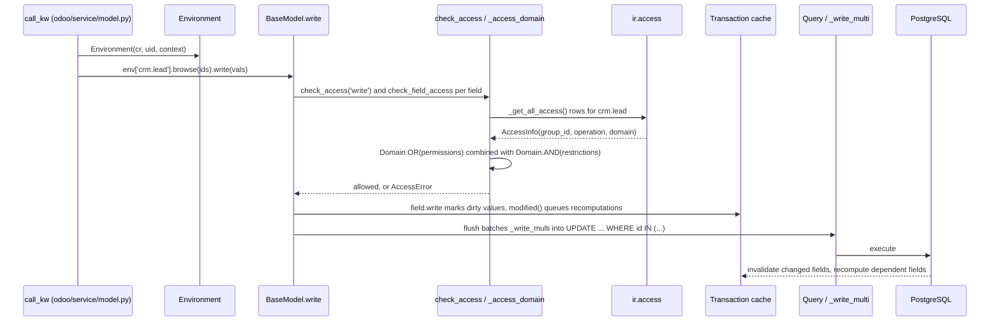

# ORM
Active contributors: Krzysztof, Chong, Raphael

## Purpose

`odoo/orm/` is the object-relational mapper every addon is written against: model classes become per-database recordsets backed by PostgreSQL tables, with field computation, two inheritance mechanisms, transactional caching, and access checks built in. The classic import roots `models`, `fields` and `api` are re-export shims over this package, so `from odoo import models, fields, api` in any addon resolves here. The shims are packages (`odoo/models/__init__.py`, `odoo/fields/__init__.py`, `odoo/api/__init__.py`) rather than single files; each states it exists "to avoid merge conflicts on `odoo/models.py`".

The same methods are what the web client calls over JSON-RPC, through the `web_save` / `web_read` / `web_read_group` / `web_name_search` family. In this fork the offline queue replays exactly those calls, so this page documents them alongside the recordset API; see [sync queue](../features/offline-and-pwa/sync-queue.md).

## Directory layout

```text
odoo/orm/
├── models.py            # BaseModel: recordsets, CRUD, access checks (~6,600 lines)
├── model_classes.py     # builds registry classes from model definitions at load
├── models_transient.py  # TransientModel: wizard records, autovacuumed
├── models_cached.py     # CachedModel mixin over the "stable" ormcache
├── fields.py            # Field[T] base class
├── fields_*.py          # field families: misc, numeric, textual, selection,
│                        #   temporal, relational, reference, properties, binary
├── commands.py          # Command: x2many write commands
├── domains.py           # Domain AST with optimization passes
├── environments.py      # Environment, Transaction, Cache, CacheLayer
├── cache.py             # @ormcache decorator and named caches
├── decorators.py        # depends, constrains, onchange, model_create_multi, ...
├── registry.py          # per-database Registry, signaling, field trigger trees
├── query.py             # Query: SQL composition (aliases, joins, where, order)
├── table_objects.py     # Constraint, Index, UniqueIndex class attributes
└── identifiers.py, utils.py, types.py
odoo/models/__init__.py            # re-export shim of odoo.orm.models
odoo/fields/__init__.py            # re-export shim of the field classes
odoo/api/__init__.py               # re-export shim of decorators + Environment
odoo/addons/base/models/ir_access.py  # ir.access: unified access rights + record rules
addons/web/models/models.py        # the web_* RPC methods, added to `base`
```

## Key abstractions

| Name | File | Description |
| --- | --- | --- |
| `MetaModel` | `odoo/orm/models.py` | Metaclass collecting fields per module and setting `_name`/`_module`/`_inherit`. |
| `BaseModel` | `odoo/orm/models.py` | Root of every model; recordset behavior, CRUD, access checks. |
| `Model` / `AbstractModel` | `odoo/orm/models.py` | Database-persisted model (`_auto = True`); `AbstractModel` is an alias of `BaseModel`. |
| `TransientModel` | `odoo/orm/models_transient.py` | Stored but vacuum-cleaned records for wizards. |
| `Field` | `odoo/orm/fields.py` | Base class of all field descriptors. |
| `Domain` | `odoo/orm/domains.py` | Domain as an AST node, not a plain list. |
| `Environment` | `odoo/orm/environments.py` | Cursor + uid + context + superuser flag; maps model names to models. |
| `Transaction` | `odoo/orm/environments.py` | Per-transaction state: cache, dirty fields, recomputations, ormcache layers. |
| `Registry` | `odoo/orm/registry.py` | One per database: the model classes, field triggers, and cross-process signaling. |
| `Query` | `odoo/orm/query.py` | Composable SQL query over aliases and joins, lazily executable. |
| `ir.access` | `odoo/addons/base/models/ir_access.py` | Access records with a domain, replacing the former `ir.rule` + ACL pair. |
| `Command` | `odoo/orm/commands.py` | The seven x2many write commands (create, update, delete, unlink, link, clear, set). |
| `web_save` / `web_read` | `addons/web/models/models.py` | The JSON-RPC read/write API the web client and the offline queue use. |

## How it works

### Recordsets and CRUD

A model instance is a recordset: `__slots__ = ['env', '_ids', '_prefetch_ids']`, so a "record" is just a one-element recordset. The public API on `BaseModel` in `odoo/orm/models.py`:

- `search(domain)` (`odoo/orm/models.py:1432`) is documented as high-level and not to be overridden; it delegates to `search_fetch`, and the real implementation is `_search` (`odoo/orm/models.py:4852`), which returns a `Query` object, not executed ids. A `Query` can be embedded as a value inside another domain to produce sub-queries. `read` (`odoo/orm/models.py:2798`) fetches fields through the cache and prefetching; `read_group`/`_read_group` (`odoo/orm/models.py:1932`, `:1996`) aggregate in SQL, with groupby granularities (`day`, `week`, `month`, `quarter`, `year`) and aggregate functions like `sum`, `count_distinct` and `recordset`.
- `write` (`odoo/orm/models.py:3805`), `create` (`odoo/orm/models.py:4088`) and `unlink` (`odoo/orm/models.py:3658`) are the mutating API. `create` takes a list of dicts (a bare dict is accepted for compatibility). Relational fields take `Command` lists.
- `browse` (`odoo/orm/models.py:5359`) wraps ids without a query; `sudo`/`with_user` (`odoo/orm/models.py:5431`, `:5458`) switch the user, `with_context`/`with_company` adjust the environment, and `filtered`/`filtered_domain`/`mapped` (`odoo/orm/models.py:5652`, `:5723`, `:5590`) filter and project in memory; `filtered_domain` runs a `Domain` as a Python predicate, the same code path SQL uses.

`write` does not emit SQL immediately: it checks access, sets dirty values in the transaction cache through `field.write()`, calls `modified()` to schedule recomputations, and the UPDATE runs when `flush_model`/`flush_recordset` (`odoo/orm/models.py:5825`) batch the dirty records into `_write_multi` (`odoo/orm/models.py:3997`, batches of 1000). `env.flush_all()` guarantees everything is written before a search or a commit.



### Client-facing RPC methods

The web client does not call `read`/`write` directly. The `web` addon extends `base` (class `Base` with `_inherit = 'base'` in `addons/web/models/models.py`) with the RPC-shaped methods, and its controllers expose them on `/web/dataset/call_kw` (see [HTTP server](http-server.md)). They matter here because this fork's offline queue stores and replays them verbatim:

| Method | Defined at | What it does |
| --- | --- | --- |
| `web_name_search` | `addons/web/models/models.py:47` | Display-name search returning rows shaped by a read specification. |
| `web_search_read` | `addons/web/models/models.py:130` | Search plus read in one call; returns `{'length': ..., 'records': [...]}`. |
| `web_save` | `addons/web/models/models.py:192` | Creates on an empty recordset, writes otherwise, then `web_read`s the result. |
| `web_save_multi` | `addons/web/models/models.py:234` | The same for a list of value dicts. |
| `web_unlink` | `addons/web/models/models.py:262` | Deletes, raising `UnlinkBlockedError` when a record cannot be removed. |
| `web_read` | `addons/web/models/models.py:315` | Reads fields described by a nested read specification. |
| `web_resequence` | `addons/web/models/models.py:540` | Reorders a recordset by setting a `sequence`-style field to consecutive values. |
| `web_read_group` | `addons/web/models/models.py:567` | Grouped read for list views; returns groups with aggregates and a count. |
| `action_archive` | `odoo/orm/models.py:5273` | Sets `active` to `False` on active records. |
| `action_unarchive` | `odoo/orm/models.py:5284` | Sets `active` to `True` on inactive records. |

Every one takes the same read/write specification format: a dict keyed by field name, whose values may carry nested `fields`, a `context`, a `limit` and an `order` for relational fields. `web_save` handles `next_id` and pending attachments (`ir.attachment` records linked through the `pending_attachment_ids` context key). Because the queue replays model, method, arguments and kwargs verbatim with no id remapping, only these self-contained calls are safe to schedule offline; see [sync queue](../features/offline-and-pwa/sync-queue.md) for the constraints that follow.

### Class construction and inheritance

`MetaModel.__new__`/`__init__` (`odoo/orm/models.py:228`) intercept every model class definition: they collect the `Field` and table-object definitions declared on the class, derive `_module` from `__module__` (which must start with `odoo.addons.`), and add the magic log-access columns `create_uid`, `create_date`, `write_uid`, `write_date` when `_log_access` is true. Actual class building happens in `odoo/orm/model_classes.py`: `add_to_registry()` distinguishes a *definition class* (no `pool`) from a *registry class* (a `pool` attribute makes it one, `odoo/orm/model_classes.py:165`). For a new `_name` it creates the registry class with the definition as base; for a definition whose `_name` is in its own `_inherit`, it extends the existing registry class instead (and may not redefine `_table`). Every model except `base` implicitly inherits `base`. `setup_model_classes(env)` then runs `_setup` and `_setup_fields` over the registry to resolve the final field set.

Two distinct mechanisms (docstrings at `odoo/orm/models.py:434` and `:444`):

- `_inherit` is Python-style extension: with `_name` set, the parent models are inherited and extended; with `_name` unset, the named model is extended in place. This is how `addons/crm/models/mail_activity.py` patches `mail.activity`.
- `_inherits` is delegation by composition: `{'parent.model': 'm2o_field'}` exposes the parent's fields while the values stay stored on the linked parent record. `_setup` duplicates those fields as `inherited` fields (`_add_inherited_fields`, `odoo/orm/model_classes.py:512`), and access checks fold the parent model's access domain in as an extra restriction.

### Fields

`odoo/orm/fields.py` holds the single base class `Field[T]` plus `determine()`/`resolve_mro()` helpers; every concrete type lives in its own module: `Id`, `Json`, `Boolean` (`odoo/orm/fields_misc.py`), `Integer`, `Float`, `Monetary` (`odoo/orm/fields_numeric.py`), `Char`, `Text`, `Html` (`odoo/orm/fields_textual.py`), `Selection` (`odoo/orm/fields_selection.py`), `Date`, `Datetime` (`odoo/orm/fields_temporal.py`), `Many2one`, `One2many`, `Many2many` (`odoo/orm/fields_relational.py`), `Many2oneReference`, `Reference` (`odoo/orm/fields_reference.py`), `Properties`, `PropertiesDefinition` (`odoo/orm/fields_properties.py`), and `Binary`, `Image` (`odoo/orm/fields_binary.py`). A field carries its own behavior: `compute`/`inverse`/`related`, `compute_sudo` (default true for stored fields), `precompute`, `recursive`, `compute_sql` for SQL-computed columns, `store`, `index`, and a `groups` attribute checked by `check_field_access` (`odoo/orm/models.py:2737`); the special group `NO_ACCESS = '.'` hides a field from everyone but superuser.

### Domains

Domains are an AST, defined in `odoo/orm/domains.py`: `DomainBool`, `DomainNot`, `DomainNary` (with `DomainAnd`/`DomainOr`), `DomainCustom` and `DomainCondition` are the node types, combined with `&`, `|`, `~` and `+`, or built from the legacy list syntax plus prefix operators. `Domain.TRUE`/`Domain.FALSE` collapse trivial cases, and the `any`/`not any` operators nest sub-domains. `optimize_full()` runs the tree through registered optimization passes, each tagged with an `OptimizationLevel` (`NONE`, `BASIC`, `DYNAMIC_VALUES`, `FULL`): merging conditions on the same field, rewriting `=` as `in`, folding `like` on text into SQL `LIKE`, calling a field's search method only when needed, and evaluating date/datetime constants. `_to_sql()` then compiles a node against a `Query` table, and `_as_predicate()` compiles the same node into a Python filter for `filtered_domain`, so in-memory filtering and SQL filtering agree.

### Environments and cache

`Environment` (`odoo/orm/environments.py:45`) is immutable and keyed by `(cr, uid, context, su)`; `__new__` attaches the cursor's `Transaction`, which owns one `Cache` for the transaction plus a chain of `CacheLayer`s for `@ormcache`. The `Cache` is partitioned field-first then record-first; dirty entries mark values that differ from the database until flushed. `Transaction` also tracks `tocompute` (pending recomputations), `protected` (fields shielded during a compute), savepoint state, and registry signaling so a commit tells other processes their caches are stale (`Transaction._check_signaling`, `odoo/orm/environments.py:752`). `odoo/orm/registry.py` holds one `Registry` per database with the model classes, `field_computed`/`field_inverses` maps, `TriggerTree`s that decide which computed fields to invalidate when a dependency changes, and table checks (`check_indexes`, `check_foreign_keys`).

### Decorators and access control

`odoo/orm/decorators.py` provides `depends` and `depends_context` for compute methods, `constrains` (validation raising `ValidationError`), `onchange` (form-view pseudo-records), `ondelete(at_uninstall=...)` (unlink guards that stay silent during module uninstall), `model`, `model_create_multi` (accepts one dict or a list), `private`, `readonly`, and `autovacuum` (cron-driven cleanup, used by `TransientModel._transient_vacuum`).

Access control is unified in the `ir.access` model (`odoo/addons/base/models/ir_access.py`): one record holds a model, an optional group, an `operation` (a CRUD subset like `crud` or `ru`), and a `domain`. `IN_SELECTION` maps each of the four operations to those subsets. Rows with a `group_id` are *permissions* (OR-ed), global rows are *restrictions* (AND-ed). `BaseModel._access_domain` (`odoo/orm/models.py:3603`) builds `Domain.OR(permissions) & Domain.AND(restrictions)` from the cached `AccessInfo` tuples, adding `_inherits` parent domains as restrictions; `check_access`/`has_access`/`_filtered_access` (`odoo/orm/models.py:3443`) raise or filter accordingly, and superuser mode short-circuits everything. `_search` weaves the read-access domain into the WHERE clause, so restricted rows never reach Python. Groups themselves are covered in [users, groups and access](../primitives/users-groups-and-access.md); the access data files are CSVs such as `odoo/addons/base/security/ir.access.csv` and `addons/crm/security/ir.access.csv`.

## Integration points

- The HTTP layer enters the ORM through `call_kw` (`odoo/service/model.py:31`), reached from `/web/dataset/call_kw` and from external RPC; see [HTTP server](http-server.md).
- The module system builds registries and imports model classes; see [module system](module-system.md).
- Every addon imports the shims: `from odoo import models, fields, api`. The web client reaches the same methods through the `web_*` API above, which is also what this fork's offline queue replays, see [sync queue](../features/offline-and-pwa/sync-queue.md).
- Model schemas of interest are listed in [data models](../reference/data-models.md); a worked example is [CRM](../apps/crm/index.md).

## Entry points for modification

To change business behavior, write a new class with `_inherit` (extension) under your addon's `models/`, import it in its package `__init__.py`, and let the registry rebuild; new fields and `@api.depends`/`@api.constrains` methods are the usual surface. Override `create`/`write` only with a `super()` call, and prefer `@api.ondelete` over unlink overrides. In this fork, model changes are restricted to `addons/crm/` to stay rebasable on upstream 20.0.

## Key source files

| File | Purpose |
| --- | --- |
| `odoo/orm/models.py` | `BaseModel`, `MetaModel`, CRUD, recordset operations, access checks, `action_archive`/`action_unarchive`. |
| `odoo/orm/model_classes.py` | Registry-class construction, `_inherit`/`_inherits` resolution, field setup. |
| `odoo/orm/models_transient.py` | `TransientModel` with age/count-based vacuuming. |
| `odoo/orm/models_cached.py` | `CachedModel` mixin serving fields from the "stable" ormcache. |
| `odoo/orm/fields.py` | `Field` base class, `determine`, `resolve_mro`. |
| `odoo/orm/fields_relational.py` | `Many2one`, `One2many`, `Many2many` and their inverses. |
| `odoo/orm/fields_numeric.py` | `Integer`, `Float`, `Monetary`. |
| `odoo/orm/fields_properties.py` | `Properties`, `PropertiesDefinition`. |
| `odoo/orm/fields_temporal.py` | `Date`, `Datetime`. |
| `odoo/orm/domains.py` | Domain AST, optimization passes, SQL and predicate compilation. |
| `odoo/orm/environments.py` | `Environment`, `Transaction`, `Cache`, `CacheLayer`. |
| `odoo/orm/registry.py` | Per-database `Registry`, signaling, `TriggerTree`, table checks. |
| `odoo/orm/decorators.py` | `depends`, `constrains`, `onchange`, `model_create_multi`, `autovacuum`, ... |
| `odoo/orm/cache.py` | `@ormcache` with named caches and invalidation hooks. |
| `odoo/orm/query.py` | `Query`/`TableSQL` SQL composition. |
| `odoo/orm/table_objects.py` | `Constraint`, `Index`, `UniqueIndex` as class attributes. |
| `odoo/orm/commands.py` | The seven `Command` values for x2many writes. |
| `odoo/models/__init__.py` | Re-export shim for `odoo.orm.models` and friends. |
| `odoo/fields/__init__.py` | Re-export shim for the field classes and `Domain`. |
| `odoo/api/__init__.py` | Re-export shim for decorators, `Environment`, `SUPERUSER_ID`. |
| `odoo/addons/base/models/ir_access.py` | The `ir.access` model and access-error reporting. |
| `addons/web/models/models.py` | `web_save`, `web_read`, `web_read_group`, `web_name_search`, `web_resequence`, `web_unlink`. |
| `odoo/service/model.py` | `call_kw`, the RPC bridge onto model methods. |

## Related pages

- [HTTP server](../systems/http-server.md): where requests enter and reach `call_kw`.
- [Module system](../systems/module-system.md): how manifests and loading build model classes per database.
- [Users, groups and access](../primitives/users-groups-and-access.md): `res.groups`, `ir.access` from the user's perspective.
- [Data models](../reference/data-models.md): the concrete `ir.*`/`res.*` and `crm.lead` schemas.
- [CRM](../apps/crm/index.md): a worked model example (`crm.lead`, stages, PLS).
- [Sync queue](../features/offline-and-pwa/sync-queue.md): the offline replay of ORM calls.
