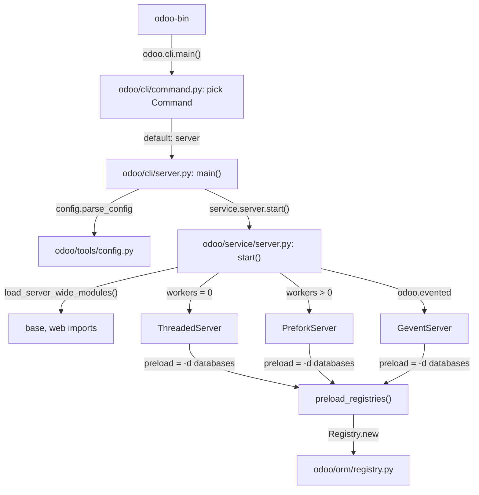
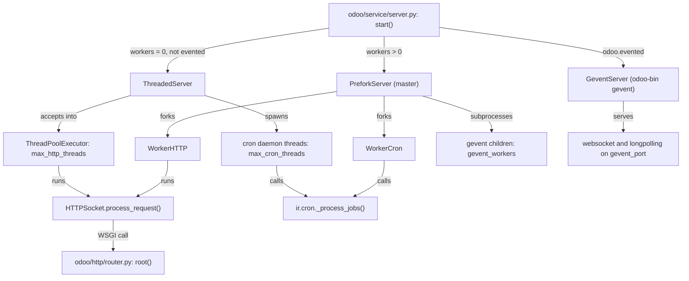

# Server runtime
Active contributors: Christophe, Xavier, Krzysztof

## Purpose

`odoo/service/server.py` implements the three ways Odoo runs: `ThreadedServer` for development, `PreforkServer` (forked HTTP and cron workers) for production, and `GeventServer` for longpolling and websockets. It also owns the cron trigger, the memory/CPU/request limits that recycle workers, and the startup path that preloads registries. Connection pooling sits in `odoo/sql_db.py`, and every option that drives it is declared in `odoo/tools/config.py`.

## Key abstractions

| Name | File | Description |
| --- | --- | --- |
| `start()` | `odoo/service/server.py` | Picks the server class from config, then runs it. |
| `CommonServer` | `odoo/service/server.py` | Shared socket config, pid, `on_stop` hooks. |
| `ThreadedServer` | `odoo/service/server.py` | Threads for HTTP plus daemon threads for cron; dev default. |
| `PreforkServer` | `odoo/service/server.py` | Master process forking `WorkerHTTP`/`WorkerCron` and gevent children. |
| `GeventServer` | `odoo/service/server.py` | One greenlet per connection on `--gevent-port`. |
| `Worker`, `WorkerHTTP`, `WorkerCron` | `odoo/service/server.py` | Forked workers with watchdogs and limit checks. |
| `ConnectionPool` | `odoo/sql_db.py` | Bounded pool of psycopg2 connections, RW or read-only. |
| `configmanager` | `odoo/tools/config.py` | Option registry read as `config['key']`. |
| `preload_registries` | `odoo/service/server.py` | Loads every `-d` database, runs post-install tests, returns the exit code. |

## How it works

### Boot sequence

`odoo-bin` imports `odoo.cli` and calls `main()` from `odoo/cli/command.py`, which picks a `Command` (default `server`) and runs it. The server command in `odoo/cli/server.py` then, in order: checks it is not running as root, parses configuration with logging (`config.parse_config`), checks it is not running as the `postgres` user, reports the effective configuration, creates any `-d` database that does not exist yet (setting `--init base` on it), writes the pid file, and calls `service.server.start(preload=config['db_name'], stop=config['stop_after_init'])`. `start()` loads the server-wide modules (`--load`, default `base,web`), builds the WSGI `root` from `odoo/http/router.py`, picks the server class, and runs it.

### ThreadedServer

`http_spawn()` starts the `odoo.service.httpd` thread, which opens a socket on `--http-interface` (default `127.0.0.1`) and `--http-port` (default 8069) with a backlog of `max(128, max_http_threads)`, or reuses fd 3 when systemd socket activation is detected. Each accepted connection is submitted to a `ThreadPoolExecutor` sized by `config.max_http_threads` (environment `ODOO_MAX_HTTP_THREADS`, default `2 * os.cpu_count() + 1`); the thread runs `HTTPSocket.process_request()` from `odoo/http/server.py` (see [HTTP server](http-server.md)). `cron_spawn()` starts `--max-cron-threads` daemon threads (default 2). Each `cron_thread` connects to the `--db-system` database, issues `LISTEN cron_trigger` (skipped when the cluster is in recovery), and waits on `select()` for `SLEEP_INTERVAL` (60 s) plus its index as jitter. Woken by a notify or the timeout, it calls `IrCron._process_jobs(db_name)` for notified databases first and then the rest. See [cron and scheduled actions](../primitives/cron-and-scheduled-actions.md) for the job processing itself.

The main loop calls `process_limit()` every cycle. A request or cron thread that ran longer than `--limit-time-real` (120 s, or `--limit-time-real-cron` for cron threads) is added to `limits_reached_threads`, and so is the main thread itself when process memory passes `--limit-memory-soft`. Once no healthy request thread is left, or after waiting another `SLEEP_INTERVAL`, the server dumps the offending thread stacks and reloads itself (`reload()` sends SIGHUP and sets `server_phoenix`). Websocket threads are exempt from the time check.

### PreforkServer

The master forks `WorkerHTTP` up to `--workers`, `WorkerCron` up to `--max-cron-threads`, and spawns `--gevent-workers` (default 1) subprocesses running `odoo-bin gevent`, which need `SO_REUSEPORT`. The master sleeps on a pipe with a `beat` of 4 seconds, feeding each worker a watchdog pipe; `process_timeout()` SIGKILLs any worker whose watchdog went quiet past its timeout. Signals to the master: `SIGTTIN`/`SIGTTOU` grow or shrink the worker population, `SIGHUP` sets `server_phoenix` so the process re-execs itself via `_reexec()` (`os.execve`, or a debugpy-compatible supervisor loop), `SIGQUIT` dumps all thread stacks, `SIGUSR1`/`SIGUSR2` log ormcache statistics.

Each worker's `_runloop` calls `check_limits()` per iteration: it exits after `--limit-request` requests (default 65536), after its parent changes, or when its memory exceeds `--limit-memory-soft` (2048 MiB), and `set_limit_memory_hard()` applies `--limit-memory-hard` (2560 MiB) as an `RLIMIT_AS` so a runaway worker fails its allocations instead of taking the machine down. CPU time is enforced per request by raising `RLIMIT_CPU` by `--limit-time-cpu` (60 s); `SIGXCPU` then kills the request. `WorkerHTTP` accepts on the shared socket with a 2-second client timeout (`ODOO_HTTP_SOCKET_TIMEOUT` overrides). `WorkerCron` runs `os.nice(10)`, keeps its own database queue, LISTENs on `cron_trigger`, processes one database per `_process_jobs` call, and recycles after `--limit-time-worker-cron` (default 0, disabled).

### GeventServer

`GeventServer` binds `--gevent-port` (default 8072) with `SO_REUSEPORT` and serves each connection in a greenlet from an unbounded `gevent.pool.Pool()`, again through `HTTPSocket.process_request()`. A `watchdog` greenlet runs every 4 seconds and SIGTERMs the process when the parent changed or memory passed `--limit-memory-soft-gevent` (falling back to `--limit-memory-soft`). This is the server for `/websocket` and longpolling; `stop()` ends websocket connections before waiting on greenlets, with `GEVENT_STOP_TIMEOUT` of 60 seconds.

### --stop-after-init

`config['stop_after_init']` is threaded from `odoo/cli/server.py` into `service.server.start(preload, stop=True)`. In `ThreadedServer.start()` the HTTP daemon is spawned only when `--test-enable` is on or when `stop` is false, so a plain `--stop-after-init` run never binds the port. Every server class then runs `preload_registries(preload)`, which loads (and, with `-i`/`-u`, updates) each `-d` database and, when `--test-enable` is set, collects the `post_install` suite for the updated modules, pregenerates the asset bundles if any `HttpCase` is present, runs it, and logs the assertion report. With `stop` true the runtime then calls `self.stop()` and returns the registry's return code instead of entering its serve loop; a failed registry load returns `-1`, failed tests increment the code. This is the mode every `scripts/dev/` test wrapper and `reset-db.sh` uses.

### Connection pooling

`odoo/sql_db.py` keeps two module-level pools, `_Pool` (read/write) and `_Pool_readonly`. `db_connect(db, readonly=...)` lazily creates each `ConnectionPool` with `maxconn` taken from `--db_maxconn` (default 64), or from `--db_maxconn-gevent` when running evented. Read-only connections resolve their DSN from the `db_replica_*` options and fall back to the `db_*` ones. `ConnectionPool.borrow()` reuses a free connection matching the DSN, garbage-collects idle connections (idle past `MAX_IDLE_TIMEOUT`, 600 s, configurable with `ODOO_DB_MAX_IDLE_TIMEOUT`), and when the pool is full closes the oldest free connection or raises `PoolError`. `Connection.cursor()` starts each session with `ISOLATION_LEVEL_REPEATABLE_READ`, `readonly=pool.readonly`, `autocommit=False`, and returns the `Cursor` wrapper that adds `flush()`, savepoints and query logging on top of psycopg2. `close_db()` and `close_all()` empty the pools, which is what `ThreadedServer.stop()` and the prefork master call on shutdown.

### The option registry

`odoo/tools/config.py` declares every option with optparse-style `parser.add_option(..., my_default=...)` calls inside `configmanager._build_cli()`. Values resolve through a `collections.ChainMap` of, in order, runtime options, command-line options, environment options, config-file options and defaults, so `config['key']` reflects that precedence. The same object computes derived paths: `addons_base_dir`, `addons_community_dir`, `addons_data_dir` (see [module system](module-system.md)) and `session_dir` (used by the session store). A saved rcfile round-trips through `config.save()`.

`preload_registries()` runs at startup for each `-d` database: it sizes the registry LRU (about 15 MB per registry from `--limit-memory-soft`, or `ODOO_REGISTRY_LRU_SIZE`; idle eviction via `ODOO_REGISTRY_MAX_IDLE_TIMEOUT`), calls `Registry.new(...)` with `update_module` set when `-i`/`-u`/`--reinit` were given, and runs the `post_install` test suite when `--test-enable` is on.

## Integration points

- All three servers call the same WSGI app, `root` from `odoo/http/router.py`, through `HTTPSocket` from `odoo/http/server.py`.
- Registry preloading and cron both use `Registry` from `odoo/orm/registry.py`; cron uses `IrCron._process_jobs` from `odoo/addons/base/models/ir_cron.py`.
- `scripts/dev/start.sh` in this fork runs the threaded server (and a TLS proxy for `--https`) against the `crm_offline` database; prefork and gevent start the same way with `--workers` or `odoo-bin gevent`, and `debian/odoo.service` shows the systemd invocation used in packages.
- `setup/odoo-wsgi.example.py` shows gunicorn pointing at `odoo.http:root` instead of a server class here.

## Entry points for modification

For behavior changes, extend from an addon rather than editing the runtime; the practical knobs are config options and environment variables, so start in `odoo/tools/config.py` to see what exists before writing code. When tracing a production issue, the limit descriptions above tell you which recycle path fired: a worker dying after a fixed number of requests is `--limit-request`, one dying between requests is memory soft, one dying mid-request is CPU or real time.

## Key source files

| File | Purpose |
| --- | --- |
| `odoo/service/server.py` | `start()`, the three server classes, `Worker*`, cron threads, `preload_registries()`, `_reexec()`. |
| `odoo/sql_db.py` | `ConnectionPool`, `Connection`, `Cursor`, `db_connect()`, `close_all()`. |
| `odoo/tools/config.py` | `configmanager`, option declaration, derived paths. |
| `odoo/http/server.py` | `HTTPSocket`, the h11 layer used by every runtime. |
| `odoo/_monkeypatches/site.py` | gevent monkey-patching and `odoo.evented`. |
| `odoo/addons/base/models/ir_cron.py` | `_process_jobs()`, the cron trigger consumers call. |
| `odoo/orm/registry.py` | Registry LRU sizing and signaling. |
| `odoo/cli/server.py` | The `odoo-bin` server command: checks, then `service.server.start()`. |
| `odoo/cli/command.py` | Command selection; `server` is the default. |
| `scripts/dev/start.sh` | Fork wrapper that starts the dev server (ports 8069/8070). |
| `setup/odoo-wsgi.example.py` | Running the WSGI app under gunicorn/uwsgi. |

## Related pages

- [Server core](index.md)
- [HTTP server](http-server.md)
- [Module system](module-system.md)
- [ORM](orm.md)
- [CLI and maintenance](cli-and-maintenance.md)
- [Cron and scheduled actions](../primitives/cron-and-scheduled-actions.md)
- [Configuration reference](../reference/configuration.md)
- [Architecture](../overview/architecture.md)
- [Addons](../apps/index.md)
