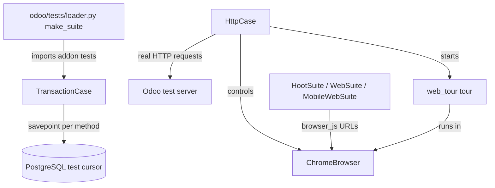

# Test framework
Active contributors: Xavier, Xavier-Do, Christophe

## Purpose

Odoo's Python test layer extends `unittest` with database transactions, registry isolation, HTTP helpers, tags, and browser control. The web client adds Hoot browser suites in `addons/web/tests/test_js.py`; this fork's wrappers close collection and browser-skip gaps described in [Testing](../how-to-contribute/testing.md) and `scripts/dev/README.md`.

## Directory layout

```text
odoo/tests/
├── case.py           # patched unittest TestCase behavior
├── common.py         # database, HTTP, browser, tags, time helpers
├── loader.py         # addon test discovery and suite construction
├── suite.py          # TestSuite / OdooSuite wrappers
├── result.py         # assertion reporting and failure logging
├── tag_selector.py   # --test-tags parser and matcher
└── form.py           # Form helper for onchange flows
addons/web/tests/test_js.py
addons/web_tour/
scripts/dev/test-py.sh  scripts/dev/test-js.sh  scripts/dev/test-guard.sh
```

## Key abstractions

| Name | File | Description |
| --- | --- | --- |
| `TestCase` | `odoo/tests/case.py` | Odoo's patched `unittest.TestCase` implementation. |
| `BaseCase` | `odoo/tests/common.py:580` | Adds `standard`/`post_install` default tags and the assertion report. |
| `TransactionCase` | `odoo/tests/common.py:1305` | Database test case isolated with savepoints. |
| `HttpCase` | `odoo/tests/common.py:2603` | Transactional case with HTTP, headless Chrome, and tour helpers. |
| `tagged` | `odoo/tests/common.py:3137` | Adds tags, and removes those prefixed with `-`. |
| `freeze_time` | `odoo/tests/common.py:3162` | freezegun wrapper usable as class decorator, method decorator or context manager. |
| `TagsSelector` | `odoo/tests/tag_selector.py` | Parses and matches `--test-tags` specifications. |
| `make_suite` | `odoo/tests/loader.py:91` | Builds the suite for a set of module names and a position. |
| `HootCommon` / `HootSuite` | `addons/web/tests/test_js.py:36,116` | Hoot bootstrap plus the forbidden-statement guard. |
| `WebSuite` / `MobileWebSuite` | `addons/web/tests/test_js.py:192,205` | Desktop and mobile Hoot presets. |

## How it works

`TransactionCase` opens a registry cursor for the class, creates a shared savepoint, and rolls that savepoint back after each method. Its cursor is closed without a commit, and direct `commit()`, `rollback()`, and `close()` calls are patched to fail. Common class setup belongs in `setUpClass`; tests that change registry models or fields must arrange registry cleanup.

`HttpCase` extends that transaction fixture with a real local HTTP port and `ChromeBrowser` (`odoo/tests/common.py:1581`), a headless Chrome controller. `browser_js()` authenticates a browser, navigates to a route, waits for readiness and a success console signal, and reports browser errors. `start_tour()` is a `browser_js()` wrapper that starts a registered browser tour; tour assets and runtime support come from `addons/web_tour/`, and a tour must be registered in the `web_tour.tours` registry to be startable.

`@tagged()` (`odoo/tests/common.py:3137`) adds tags and removes tags prefixed by `-`; Odoo test cases default to `standard` and `post_install`. `--test-tags` is a comma-separated selector language implemented by `TagsSelector` (`odoo/tests/tag_selector.py`). One spec matches `[-][tag][/module][:class][.method][[params]]`: an optional leading `-` excludes, and a plain include of the form `/module:Class.method` implicitly requires the `standard` tag. The selector requires an include match and rejects an exclusion match, so `--test-tags /crm:-slow` runs the standard crm tests that are not tagged `slow`.

`odoo/tests/loader.py` imports only `test_` modules exposed by an addon's `tests` package, then builds suites for module names supplied by the loading run. At `post_install`, the available module set is those modules; tests are therefore not collected merely because their files exist. This is the first false-green mode.

`odoo/tests/loader.py:run_suite()` drives `OdooSuite` (`odoo/tests/suite.py:198`), whose results land in the registry's assertion report that `preload_registries()` logs and turns into a process exit code.

### The three silent-success modes

Every one of these makes a run report success while testing nothing, and each has a wrapper in `scripts/dev/` that guards against it:

1. **Odoo only collects tests from modules it installed or updated during the run.** `-i crm` does nothing on a database where crm is already installed, so it runs 0 tests and still exits 0. `test-py.sh` therefore uses `-i crm` only when crm is missing from the database and `-u crm --test-tags /crm` otherwise; both run the whole crm suite.
2. **The JS suites live in `addons/web/tests/test_js.py`.** `-u crm` updates crm and the modules that depend on crm, never `web`, so with `-u crm` alone the suites are never collected (0 tests, exit 0). `test-js.sh` and `test-guard.sh` use `-u crm,web`. The module part of `--test-tags` then selects whose `*.test.js` files run: `/crm:WebSuite.test_unit_desktop` runs crm's own tests, `/web:...` runs the whole web suite (thousands of tests, much slower).
3. **Browser tests skip themselves when a dependency is missing** — for example `websocket-client` or Chrome — and a skipped test still exits 0. `setup.sh` installs `websocket-client` (and `phonenumbers`, without which 5 crm Python tests fail), and the test scripts fail when the log shows a skipped test or an empty selection.

### JavaScript suites and the guard

`HootSuite.test_check_suite()` (`addons/web/tests/test_js.py:117`) scans every `.test.js` in the `web.assets_unit_tests` bundle and fails on `only(` or `debug(`, statements that silently disable every other test. `WebSuite.test_unit_desktop()` opens `/web/tests?preset=desktop`; `MobileWebSuite.test_unit_mobile()` uses `preset=mobile`, a `375x667` browser, and touch input. Both route through `HttpCase.browser_js()`, select test modules from the asset bundle, and wait for Hoot's success signal `[HOOT] Test suite succeeded`.

### Exact commands

`scripts/dev/README.md` prints the command each wrapper runs. Verbatim, for the `crm_offline` database:

```bash
# all crm Python tests (crm already installed / not installed)
./odoo-bin -d crm_offline -u crm --test-enable --test-tags /crm --stop-after-init --log-level=test
./odoo-bin -d crm_offline -i crm --test-enable --test-tags /crm --stop-after-init --log-level=test

# one crm Python test class
./odoo-bin -d crm_offline -u crm --test-enable --test-tags /crm:TestCrmOffline --stop-after-init --log-level=test

# crm JS unit tests, desktop and mobile presets
./odoo-bin -d crm_offline -u crm,web --test-enable --test-tags /crm:WebSuite.test_unit_desktop --stop-after-init --log-level=test
./odoo-bin -d crm_offline -u crm,web --test-enable --test-tags /crm:MobileWebSuite.test_unit_mobile --stop-after-init --log-level=test

# forbidden-statement guard
./odoo-bin -d crm_offline -u crm,web --test-enable --test-tags /web:HootSuite.test_check_suite --stop-after-init --log-level=test
```

The wrappers (`test-py.sh`, `test-js.sh`, `test-guard.sh`) add the checks that the raw commands lack: `assert_tests_selected` fails when the log shows no tests were collected, and `assert_no_skips` fails when a test skipped itself. `--stop-after-init` is what makes each run load the registries, execute the suites and exit instead of serving; see [server runtime](server-runtime.md).



## Integration points

- Server flags, including `--test-tags`, are parsed through normal configuration. See [Configuration](../reference/configuration.md).
- Addon manifests select test tours and unit-test assets, as described in [Assets](assets.md); `web.assets_tests` gets tours, `web.assets_unit_tests` gets `.test.js` files.
- CRM Python tests must be imported from their `tests/__init__.py`; CRM JavaScript tests need both browser presets; see [Testing](../how-to-contribute/testing.md).
- `--stop-after-init` plus `--test-enable` is the same path `preload_registries()` uses in production startup; the exit code reflects test failures.

## Entry points for modification

Start a Python database test from `TransactionCase`, and use `HttpCase` plus `start_tour()` for rendered UI behavior. Put JS unit tests in the asset bundle and never leave `only()` or `debug()` in a `.test.js` file. In this fork, run the `scripts/dev/` wrappers rather than raw server invocations; they detect empty selections and skipped browser suites.

## Key source files

| File | Purpose |
| --- | --- |
| `odoo/tests/case.py` | Patched unittest execution and traceback behavior. |
| `odoo/tests/common.py` | `BaseCase`, `TransactionCase`, `HttpCase`, `ChromeBrowser`, `tagged`, `freeze_time`. |
| `odoo/tests/loader.py` | Imports addon test modules, `make_suite()`, `run_suite()`. |
| `odoo/tests/suite.py` | `TestSuite` / `OdooSuite` wrappers. |
| `odoo/tests/result.py` | Assertion reporting used by the registry. |
| `odoo/tests/tag_selector.py` | Parses and evaluates test-tag filters. |
| `odoo/tests/form.py` | `Form` helper driving onchange chains. |
| `addons/web/tests/test_js.py` | `HootSuite` guard, `WebSuite`, `MobileWebSuite`. |
| `addons/web_tour/__manifest__.py` | Tour addon assets and module definition. |
| `addons/crm/static/tests/` | CRM browser unit tests and tours. |
| `scripts/dev/test-py.sh` | Fork Python-test wrapper. |
| `scripts/dev/test-js.sh` | Fork desktop and mobile JS-test wrapper. |
| `scripts/dev/test-guard.sh` | Forbidden-statement guard wrapper. |
| `scripts/dev/README.md` | The exact commands and the silent-success notes. |

## Related pages

- [Assets](assets.md)
- [Server runtime](server-runtime.md)
- [Configuration](../reference/configuration.md)
- [Testing](../how-to-contribute/testing.md)
- [Development tooling](../how-to-contribute/tooling.md)
- [Logging](../how-to-monitor/logging.md)
